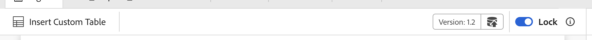

# Panoramica

Durante la migrazione dalla vecchia interfaccia utente alla nuova interfaccia utente di AEM Guides, gli aggiornamenti a **ui_config** devono essere convertiti in configurazioni dell&#39;interfaccia utente più flessibili e modulari. Questo framework consente di adottare le modifiche direttamente nella **editor_toolbar** e in [altre barre degli strumenti](/help/courses/course-3/conver-ui-config.md#editing-json-for-different-screens). Il processo supporta anche la modifica di altre viste e widget nell&#39;applicazione.


## Modifica di JSON per schermate diverse

I file JSON possono essere aggiunti alla sezione Configurazione dell’interfaccia utente dell’editor XML per diverse schermate e widget. Di seguito è riportato un elenco dei widget di largo utilizzo e dei relativi ID:

1. [editor_toolbar](assets/toolbars/editor_toolbar.json): barra degli strumenti di Webeditor costituita da azioni di file e contenuto.
1. [editor_tab_bar](assets/toolbars/editor_tab_bar.json): visualizzazione a schede dei file aperti in webeditor, include azioni eseguibili sui file aperti.
1. [file_mode_switcher](assets/toolbars/file_mode_switcher.json): consente di passare da una modalità disponibile all&#39;altra (autore, origine, anteprima) per i file aperti in webeditor.

   

1. [map_console_navigation_bar](assets/toolbars/map_console_navigation_bar.json): è la barra delle informazioni per la mappa aperta nella console delle mappe. Consente di modificare la mappa e di accedere alle impostazioni.
1. [map_console_action_bar](assets/toolbars/map_console_action_bar.json): questa è la barra delle azioni per gli elementi della console delle mappe come Predefinito di output, Baseline, Traduzione e Rapporti che fornisce informazioni rilevanti insieme ai rispettivi pulsanti di azione.

   

1. [home_navigation_bar](assets/toolbars/home_navigation_bar.json): barra di intestazione della home page delle guide in cui viene visualizzato il messaggio di benvenuto insieme al profilo della cartella selezionata.

   

<br>

## Struttura generale di ciascun JSON

Ogni JSON segue una struttura coerente:

1. **id**: specifica il widget in cui viene personalizzato il componente.
1. **targetEditor**: definisce quando visualizzare o nascondere un pulsante utilizzando le proprietà dell&#39;editor e della modalità:

   Attualmente nel sistema sono presenti **editor** e **modalità**.

   **editor**: ditamap, bookmap, subjectScheme, xml, css, translation, preset, pdf_preset

   **modalità**: autore, origine, anteprima, sommario, suddivisione

   Nota: la modalità sommario si applica alla vista layout.

1. **target**: specifica dove verrà aggiunto il nuovo componente. Questo utilizza coppie o indici chiave-valore per l’identificazione univoca. Gli stati di visualizzazione includono:

   * **aggiungi**: aggiungi alla fine.

   * **aggiungi**: aggiungi all&#39;inizio.

   * **replace**: Sostituisci un componente esistente.

Esempio di struttura JSON:

```json
{
  "id" : "editor_toolbar",
  "view": {
    "items": [
      {
        ...,
        "targetEditor": {
          "mode": [
            "preview"
          ],
          "editor": [
            "xml"
          ]
        },
        "target": {
          "key": "label",
          "value": "Table",
          "viewState": "prepend"
        },
        ...
      },
    ]
  }
}
```

<br>

## Esempi

Di seguito è riportato un esempio di come aggiungere, eliminare o sostituire un pulsante nella barra degli strumenti dell’editor.

### Aggiunta di un pulsante

Aggiunta di un nuovo pulsante **Inserisci tabella personalizzata** in **editor_toolbar** per aggiungere una tabella semplice visibile solo in modalità anteprima.

```json
{
  "id": "editor_toolbar",
  "view": {
    "items": [
      {
        "icon": "table",
        "title": "Insert Custom Table",
        "on-click": {
          "name": "$$AUTHOR_INSERT_ELEMENT",
          "args": [
            "simpletable",
            "table",
            "choicetable"
          ]
        },
        "key": "$$AUTHOR_INSERT_ELEMENT",
        "targetEditor": {
          "mode": [
            "preview"
          ],
        },
        "target": {
          "key": "label",
          "value": "Table",
          "viewState": "prepend"
        }
      }
    ]
  }
}
```



### Eliminazione di un pulsante

Eliminazione di un pulsante dalla barra degli strumenti. Rimuove il pulsante Aggiungi immagine dalla barra degli strumenti dell’editor.

```json
{
  "id": "editor_toolbar",
  "view": {
    "items": [
      {
        "hide": true,
        "target": {
          "key": "label",
          "value": "Image",
          "viewState": "replace"
        }
      }
    ]
  }
}
```

### Sostituzione di un pulsante

Sostituzione del pulsante **Multimedia** nella barra degli strumenti con il pulsante di inserimento del collegamento **YouTube** visibile solo in modalità di creazione.

```json
{
  "id": "editor_toolbar",
  "view": {
    "items": [
      {
        "icon": "s2youtube",
        "title": "Youtube",
        "on-click": {
          "name": "$$AUTHOR_INSERT_ELEMENT",
          "args": "<object data='http://youtube.com'></object>"
        },
        "targetEditor": {
          "mode": [
            "author"
          ]
        },
        "target": {
          "key": "elementId",
          "value": "toolbar-multimedia",
          "viewState": "replace"
        }
      }
    ]
  }
}
```


<br>

## Come caricare JSON personalizzati

1. Nella scheda **Configurazione editor XML** fare clic su **Modifica** nella barra superiore.
1. Ora nella sezione secondaria **Configurazione dell&#39;interfaccia utente dell&#39;editor XML** puoi visualizzare un pulsante **carica**.

   {width="400" height="150"}

1. Puoi fare clic su e caricare il codice JSON modificato. Il json da caricare deve avere lo stesso nome dell’ID del widget da personalizzare.
1. Una volta caricato, premi **Salva** nella barra superiore.

   Per ogni file caricato puoi anche **eliminare** il JSON per rimuoverne la personalizzazione dall&#39;interfaccia utente o **scaricare** per visualizzarlo o modificarlo nuovamente.

   {width="400" height="150"}

<br>


## Come caricare file CSS personalizzati

Puoi anche aggiungere CSS per personalizzare l’aspetto dei pulsanti aggiunti personalizzati o dei widget o pulsanti già esistenti nell’interfaccia utente.

Per un pulsante personalizzato appena aggiunto, aggiungi **extraclass** al pulsante o al componente personalizzato nel JSON.
Per una vecchia classe, puoi ispezionare l’elemento e modificare anche le classi esistenti.

```json
{
  "icon": "table",
  "title": "Insert Custom Table",
  "extraclass": "custom-css",
  "key": "$$AUTHOR_INSERT_ELEMENT",
  "targetEditor": {
    "mode": [
      "preview"
    ],
  },
  "target": {
    "key": "label",
    "value": "Table",
    "viewState": "prepend"
  }
}
```

1. Nella scheda **Configurazione editor XML** fare clic su **Modifica** nella barra superiore.
1. Ora nella sezione secondaria **Layout pagina editor XML** puoi visualizzare un pulsante **carica**.

   {width="400" height="150"}

1. Puoi fare clic su e caricare il file CSS modificato. (Sono supportati solo i file css)
1. Una volta caricato, premi **Salva** nella barra superiore.

   Per ogni file caricato puoi anche **eliminare** il file CSS per rimuoverne la personalizzazione dall&#39;interfaccia utente o **scaricare** per visualizzarlo o modificarlo nuovamente.

   {width="400" height="150"}


<br>

### Esempio di personalizzazione dei css dei pulsanti

In questo caso viene aggiunto un nuovo pulsante **Inserisci tabella personalizzata** in **editor_toolbar** per aggiungere una tabella semplice visibile solo in modalità anteprima e applicare un CSS personalizzato.
Questo CSS modifica lo sfondo del pulsante e la dimensione font del titolo.


```css
#editor_toolbar {
  .custom-css {
    background-color: burlywood;
    font-size: 2rem;  
  }
}
```

```json
{
  "id": "editor_toolbar",
  "view": {
    "items": [
      {
        "icon": "table",
        "title": "Insert Custom Table",
        "extraclass": "custom-css",
        ...
      }
    ]
  }
}
```

<br>

## Passaggi per convertire la configurazione UI in Json modulari

1. Dalla schermata Navigazione, fai clic sull&#39;icona [!UICONTROL **Strumenti**].

   

1. Seleziona **Guide** nel pannello a sinistra.

1. Fare clic sul riquadro [!UICONTROL **Profili cartella**].

   

1. Seleziona un profilo cartella.

1. Fare clic sulla scheda [!UICONTROL **Configurazione editor XML**].

1. Puoi fare clic sul pulsante **Converti configurazione interfaccia utente in JSON**. Verranno generati il json **editor_toolbar** e **map_console_action_bar** che contiene le modifiche apportate in **ui_config**.

   

1. Puoi estrarre i json generati di esempio per la [barra degli strumenti dell&#39;editor](assets/editor_toolbar.json) e la [barra delle azioni della console Mappa](assets/map_console_action_bar.json)


>[!NOTE]
>
>Le modifiche apportate alle sezioni **toolbar** e **topbar** sono state aggiunte nel file json **editor_toolbar** che è visibile nella pagina dell&#39;editor. Le modifiche apportate ai pulsanti relativi ai predefiniti o alla traduzione in **ui_config** vengono aggiunte al json **map_console_action_bar** che è possibile visualizzare nella pagina di Map Console.
