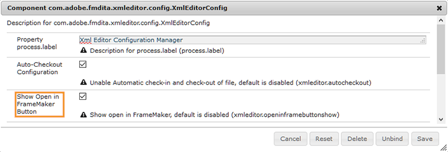

# Integrazione di editor XML basati su desktop {#id181GB01G0HS}

Sul mercato sono disponibili molti editor XML e potrebbe essere già in uso. Adobe FrameMaker è uno degli editor XML più potenti, fornito con il connettore AEM. Utilizzando il connettore AEM in FrameMaker, è possibile connettersi facilmente con l&#39;archivio AEM, estrarre e archiviare i file e modificarli direttamente in FrameMaker. È inoltre possibile configurare le guide AEM per avviare FrameMaker dall&#39;editor Web. Una volta aperto il file in FrameMaker, potete modificarlo e archiviarlo nuovamente nell&#39;archivio AEM.

## Abilitare la modifica di file in FrameMaker dall&#39;editor Web

È possibile utilizzare FrameMaker o qualsiasi altro editor DITA per creare e aggiornare il contenuto DITA. Tuttavia, se l&#39;organizzazione utilizza FrameMaker come editor DITA, è possibile offrire agli utenti un&#39;opzione per aprire i documenti DITA direttamente in FrameMaker dall&#39;AEM.

Per impostazione predefinita, gli utenti non visualizzano **Apri in FrameMaker** sulla barra degli strumenti AEM. Per aggiungere questo pulsante sulla barra degli strumenti AEM, effettua le seguenti operazioni:

1. Apri la pagina Configurazione della console web Adobe Experience Manager.

   L&#39;URL predefinito per accedere alla pagina di configurazione è:

   ```http
   http://<server name>:<port>/system/console/configMgr
   ```

1. Cerca e fai clic su **com.adobe.fmdita.xmleditor.config.XmlEditorConfig** pacchetto.

   {width="550" align="left"}

1. Seleziona la **Mostra pulsante Apri in FrameMaker** opzione.

1. Fai clic su **Salva**.


Quando si abilita **Mostra pulsante Apri in FrameMaker** , quindi **Apri in FrameMaker** viene visualizzato quando si seleziona un file DITA nell&#39;archivio AEM. Quando questa opzione è *non abilitato*, il **Apri in FrameMaker** viene visualizzato solo quando si seleziona un file fm o book nel repository.

