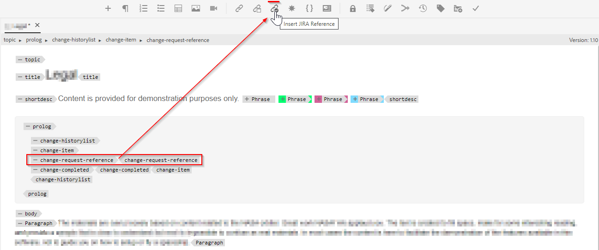

# Aggiungi un nuovo pulsante utilizzabile personalizzato nella barra degli strumenti dell’editor Web

In questo articolo impareremo come aggiungere un nuovo pulsante personalizzato nella barra degli strumenti dell’editor web e chiamare javascript per eseguire l’operazione personalizzata desiderata.

L’aggiunta di un pulsante utilizzabile all’editor web prevede i seguenti passaggi:
- Aggiunta del pulsante nel *ui_config.json* nella posizione in cui è necessaria
- Registrazione dell&#39;evento pulsante on-click nell&#39;editor web per consentire agli utenti di eseguire un&#39;azione quando fanno clic su di esso


## Implementazione tramite un esempio

Comprendiamo questo con un esempio in cui un autore desidera aggiungere un riferimento jira a una sezione di prolog argomento. La sezione prolog con jira reference-id incorporato può essere simile alla seguente:


L’elemento &quot;change-request-id&quot; che contiene l’ID JIRA deve essere recuperato dall’API (sulla base di una query JIRA specifica rappresentata dall’applicazione). Quando l’utente sta creando la sezione prolog, deve essere in grado di fare clic su un pulsante e inserire un ID di riferimento jira dalla barra degli strumenti web-editor, ad esempio:



E quando l’utente fa clic sul pulsante, dovrebbe visualizzare una finestra di dialogo che dovrebbe richiamare le opzioni possibili e consentire all’utente di selezionare l’ID JIRA desiderato, ad esempio:


che deve quindi aggiungere &quot;change-request-id&quot; al prolog:


## Implementazione


### Aggiungi il pulsante nell’editor web configurandolo in *ui_config.json*

Utilizza i profili di cartella per controllare il *ui_config.json* nella scheda &quot;Configurazione editor XML&quot; e aggiungi la configurazione del pulsante JSON alla sezione desiderata del gruppo &quot;barra degli strumenti&quot;

```
{
    "on-click":"insertJIRARef",
    "icon":"linkCheck",
    "variant":"quiet",
    "type":"button",
    "title":"Insert JIRA Reference"
}
```

[utilizza questo collegamento per ulteriori informazioni sul profilo cartella e sulla configurazione di ui_config.json](https://experienceleague.adobe.com/docs/experience-manager-guides-learn/videos/advanced-user-guide/editor-configuration.html?lang=en)


### Gestisci l’evento on-click per il nuovo pulsante

    NOTA: I passaggi indicati di seguito sono disponibili come pacchetto allegato in questo post


- Dopo aver salvato il profilo della cartella, crea una &quot;cq:ClientLibraryFolder&quot; sotto una directory di progetto (potrebbe essere in */apps*) e aggiungi proprietà come mostrato nella schermata seguente:
   

```
This example uses "coralui3" library to show a dialog as it is used in the Javascript sample we presented.
You may use different library of your choice.
```

- In questa cartella della libreria client crea due file come indicato di seguito:
   - *override.js*: che avrà il codice javascript per gestire l&#39;evento on-click per &quot;insertJIRARef&quot; (usa il pacchetto allegato per ottenere il contenuto di questo javascript)
   - *js.txt*: che includerà &quot;override.js&quot; per abilitare questo javascript

- Salva le modifiche e dovresti essere pronto per il test.


### Test

- Apri editor web
- Da preferenze utente scegli il profilo della cartella in cui hai aggiunto il *ui_config.json*. Se l’hai aggiunto al profilo globale, probabilmente lo stai già utilizzando.
- Apri un argomento, noterai la barra degli strumenti con un nuovo pulsante &quot;Inserisci riferimento a Jira&quot;
- Puoi quindi aggiungere la sezione prolog come indicato di seguito all&#39;argomento e provare a fare clic sul pulsante &quot;Inserisci riferimento Jira&quot; all&#39;interno dell&#39;elemento prolog &quot;change-request-reference&quot;

```
<prolog>
    <change-historylist>
        <change-item>
            <change-request-reference>
            </change-request-reference>
            <change-completed></change-completed>
            <change-summary></change-summary>
        </change-item>
    </change-historylist>
</prolog>
```

Fai riferimento alla schermata seguente per sapere come sarà:


### Allegati

- Pacchetto clientlibs di esempio che installerà la libreria client webeditor con codice javascript per l&#39;azione pulsante della barra degli strumenti: [scarica utilizzando questo collegamento](../../../assets/authoring/webeditor-addbuttonontoolbar-insertjira-clientlib.zip)
- Esempio *ui_config.json* che puoi caricare in un profilo cartella: [scarica esempio ui_config.json](../../../assets/authoring/sample_ui_config_Guides4.2-InsertJiraReference.json)

```
Please note this is compatible to AEM 6.5 and AEM Guides version 4.2.
If you are using a different version please add the toolbar button to the ui_config.json manually.
```
