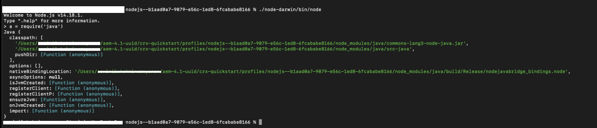

# Configurazione dell’ambiente AEM per la pubblicazione di Native PDF

AEM Guide include un motore di pubblicazione PDF nativo che consente agli utenti di progettare, sviluppare e pubblicare i contenuti in formato PDF.

Fornisce la possibilità di creare diversi layout di pagina, modelli CSS e progettare i modelli di PDF in combinazione con i layout di pagina e CSS.

I passaggi per la configurazione di questo PDF nativo in Guide AEM variano a seconda del sistema operativo. Utilizza i passaggi di configurazione indicati di seguito in base al sistema operativo in cui è installato AEM.

## Prerequisiti

Requisiti minimi per la configurazione di Native PDF:

- Piattaforma Java installata, Standard Edition 8 o 11 JDK (Java SE Development Kit) e JRE (Java SE Runtime Environment)
- AEM 6.5 SP13, SP12, SP11 o SP10
- Guide 4.1 e versioni successive (non UUID o UUID)

Il motore di pubblicazione PDF nativo richiede JDK di Oracle per generare i moduli di nodo nella cartella AEM crx-quickstart . Supporta i seguenti sistemi operativi per impostazione predefinita:

- Windows 10, server Windows 2019 e versioni successive.
- Linux - (RHEL 8 e versioni successive, CentOS 7 e successive, Ubuntu 18 e versioni successive)
- Sistema operativo Mac (basato su Intel)

## Passaggi di configurazione per Windows Server (JAVA 11/8)

1. Assicurati che AEM server sia inattivo.
2. Sulla barra delle applicazioni di Windows fare clic con il pulsante destro del mouse sull&#39;icona di Windows e selezionare Sistema.
3. Nella finestra Impostazioni, in Impostazioni correlate fare clic su Impostazioni di sistema avanzate.
4. Nella scheda Avanzate fare clic su Variabili di ambiente.
5. Nella sezione variabili di sistema, fai clic su &quot;_Nuovo_&quot; per creare una nuova variabile di ambiente.
6. Immettere il nome della variabile come JAVA_HOME.
7. Nel campo value (Valore), fornisci il percorso di installazione Java e fai clic su Ok.

   Esempio:

   JAVA 11:

   C:\Program Files\JAVA\jdk-11.0.15.1

   JAVA 8:

   C:\Program Files\JAVA\ jdk1.8.0_144

8. Aggiungi seleziona Percorso dalle variabili di sistema e fai clic su Modifica.

9. Ora, all&#39;interno delle variabili di percorso fornire il valore del percorso del server e fare clic su Ok.

   Esempio:

   JAVA 11:

   %JAVA_HOME%\bin\server\

   JAVA 8:

   %JAVA_HOME%\jre\bin\server\

10. Fai nuovamente clic su OK nella finestra di dialogo Variabili di ambiente .
11. Fare nuovamente clic su OK nella finestra di dialogo Proprietà sistema.
12. Ora avvia il server AEM.
13. Genera PDF nativo dai predefiniti nell’editor web.

## Passaggi di configurazione per il server Linux (RHEL7/centOS 7)

1. Assicurati che AEM server sia inattivo
2. Verifica la variabile JAVA_HOME facendo eco $JAVA_HOME
3. Se la variabile JAVA_HOME non è impostata, segui il passaggio 4. In caso contrario, passare direttamente al punto 5.
4. Imposta la variabile JAVA_HOME utilizzando i comandi seguenti in base alla versione java installata

   Esempio:

   JAVA 11:

   1. esporta JAVA\_HOME=/usr/lib/jvm/java-11.0.15.1
   2. export PATH=$PATH: $JAVA\_HOME/bin
   3. esporta LD\_LIBRARY\_PATH=/usr/lib/jvm/jdk-11.0.15.1/lib/server:/usr/java/jdk-11.0.15.1/lib/server

   JAVA 8:

   1. esporta JAVA\_HOME=/usr/lib/jvm/java-11.0.15.1
   2. export PATH=$PATH: $JAVA\_HOME/bin

5. Riavvia AEM server
6. Copia il &quot;_node_modules.zip_&quot; allegato in fondo a questo articolo alla directory crx-quickstart/profiles/nodejs—b1aad0a7-9079-e56c-1ed8-6fcababe8166/.
7. Terminale aperto in posizione crx-quickstart/profiles/nodejs—b1aad0a7-9079-e56c-1ed8-6fcababe8166/.
8. Elimina la directory node_modules utilizzando il seguente comando

   **rm -rf node_modules**

9. Decomprimi node_modules.zip utilizzando il comando sottostante

   **decomprimi node_modules.zip**

10. Se il comando dezip non è installato/riconosciuto, può essere installato utilizzando il seguente comando

   **yum installa unzip**

11. Installa il pacchetto fontconfig.
Comando: yum installa fontconfig
12. Genera PDF nativo dai predefiniti nell’editor web.

**NOTA** : il pacchetto node_modules.zip può essere scaricato [qui](https://acrobat.adobe.com/link/track?uri=urn:aaid:scds:US:295d8f03-41e1-429b-8465-2761ce3c2fb3).

L&#39;importazione manuale dei moduli di nodo scaricati per il sistema operativo Linux è una soluzione alternativa per gli utenti che si trovano in Guide 4.1 o versioni precedenti.

## Passaggi di configurazione per la macchina Mac (JAVA 11/8)

1. Installa Oracle JAVA 11 o Oracle JAVA 8.
2. Imposta la variabile di ambiente JAVA_HOME nella directory JAVA installata.
3. Apri una shell Unix.
(Bash viene utilizzato qui per configurare la configurazione)

   Comando: nano ~/.bashrc

4. Imposta la variabile JAVA_HOME utilizzando i comandi seguenti in base alla versione java installata

   Esempio:

   JAVA 11:

   esporta JAVA\_HOME= /Library/Java/JavaVirtualMachines/jdk-11.0.15.1.jdk/Contents/Home

5. Ricarica bashrc

   Comando: source ~/.bashrc.

6. Verifica che JAVA_HOME sia impostato utilizzando l&#39;eco del comando $JAVA_HOME

7. Esegui i tre comandi seguenti dal percorso di installazione AEM

   C:/{aem-installation-folder}/crx-quickstart/profiles/nodejs—b1aad0a7-9079-e56c-1ed8-6fcababe8166

   i) trova . -type d -exec chmod 0755 {} \; ii) trova . -type f -exec chmod 0755 {} \; iii) ./node-darwin/bin/node node-darwin/lib/node_modules/npm/bin/npm-cli.js —prefisso . install —unsafe-perm —scripts-prepend-node-path

8. Verifica se Java è installato utilizzando il comando seguente

   i) Esecuzione **./node-darwin/bin/node** comando dalla cartella /crx-quickstart/profiles/nodejs—b1aad0a7-9079-e56c-1ed8-6fcababe8166

   

   ii) a = required(&#39;java&#39;)

9. Installa il pacchetto fontconfig.
Comando: apt install fontconfig

10. Genera PDF nativo dai predefiniti nell’editor web.

## Risoluzione dei problemi

Di seguito sono riportati gli errori comuni che possono verificarsi durante la generazione di PDF quando le variabili di ambiente non sono impostate correttamente.

### Eccezione puntatore Null nel sistema operativo Windows/Mac

### Librerie mancanti nel sistema operativo Linux RHEL 7

In caso di problemi durante l&#39;esecuzione di uno dei passaggi precedenti, pubblica la tua domanda nella community AEM Guide [forum](https://experienceleaguecommunities.adobe.com/t5/experience-manager-guides/ct-p/aem-xml-documentation) per assistenza.
