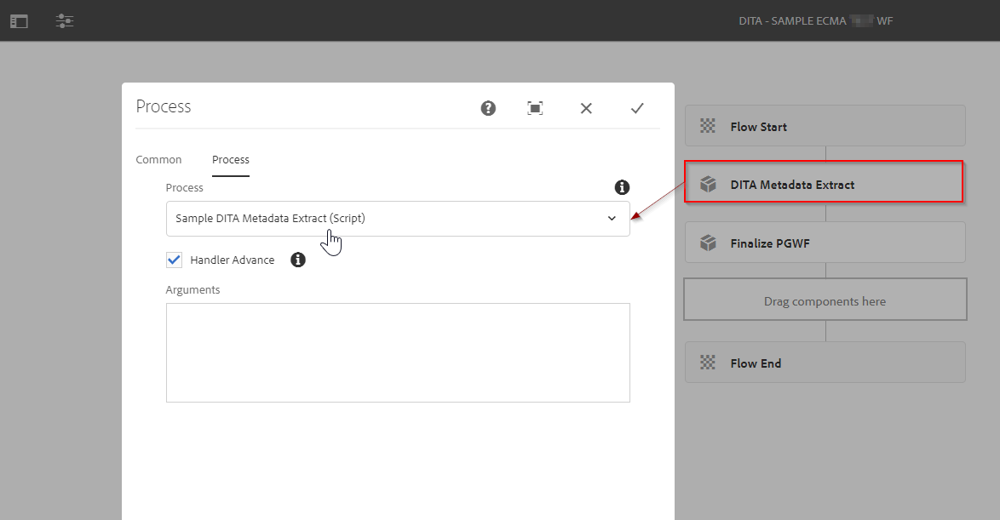
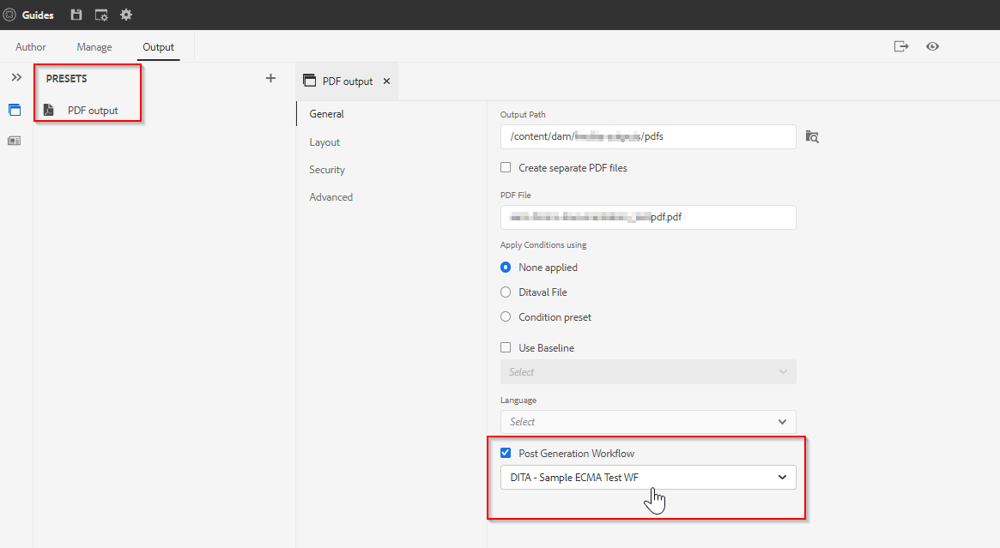

# Pubblicazione delle guide AEM - Flusso di lavoro post-generazione

AEM Guide offre la flessibilità di specificare un flusso di lavoro per la generazione dei post-output. È possibile eseguire alcune attività di post-elaborazione sull&#39;output che viene generato utilizzando AEM Guide.
Ad esempio, potrebbe essere utile impostare alcune proprietà nell’output di PDF o inviare un’e-mail a un set di utenti una volta generato l’output.

## Quali sono i passaggi necessari per utilizzare i flussi di lavoro di post-generazione?

### Creare un processo di flusso di lavoro

Crea un processo di flusso di lavoro basato su Java o ECMA che esegue l’operazione sull’output generato. Ad esempio, copiando alcuni metadati dall’origine al contenuto generato o manipolando i metadati dell’output generato.
- Prenderemo un esempio di creazione di tale processo utilizzando lo script ECMA (puoi fare riferimento al pacchetto allegato)
- Per il processo di flusso di lavoro basato su Java, consulta la sezione &quot;*Personalizzare il flusso di lavoro di generazione dei post-output*&quot; [Guida all’installazione e alla configurazione](https://helpx.adobe.com/content/dam/help/en/xml-documentation-solution/4-2/Adobe-Experience-Manager-Guides_UUID_Installation-Configuration-Guide_EN.pdf#page=119)

### Creare un modello di flusso di lavoro

Con il processo di flusso di lavoro personalizzato creato nel passaggio precedente, crea un modello di flusso di lavoro e aggiungi tale passaggio al flusso di lavoro.
- È inoltre necessario aggiungere un passaggio obbligatorio del processo &quot;*Finalizza post-generazione*&quot; come ultimo passaggio del flusso di lavoro.

Fai riferimento al modello di flusso di lavoro di esempio mostrato di seguito:

### Utilizza questo flusso di lavoro di post-generazione su una mappa

Il flusso di lavoro di post generazione è una proprietà che può essere configurata su qualsiasi predefinito di output all’interno AEM meccanismo di pubblicazione delle Guide . Esempio:

Supponendo che il modello selezionato sia già stato creato.

### Test

Ora puoi eseguire la pubblicazione utilizzando questo predefinito e convalidare l’output del passaggio del processo

## Esempi

Per il tuo riferimento, puoi utilizzare il seguente pacchetto e installarlo tramite il gestore di pacchetti per testare il flusso di lavoro di post-generazione del campione (*come indicato nelle schermate precedenti*)

[Un esempio di modello di flusso di lavoro basato su ECMA](../assets/workflows/sample-pgwf-ecma-test-wfmetadata.zip)
