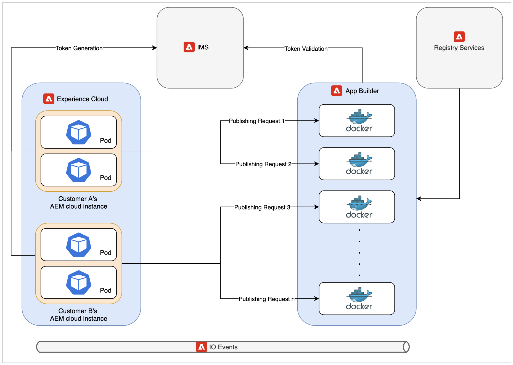

# Architettura e analisi delle prestazioni di Cloud Publishing Microservice

Questo articolo condivide le informazioni relative all’architettura e ai numeri di prestazioni del nuovo microservizio di pubblicazione cloud.

>[!NOTE]
>
> Attualmente la pubblicazione basata su microservizi in AEM Guide supporta solo l’output di PDF tramite la pubblicazione di PDF nativi o tramite DITA-OT. AEM Guide aggiungerà supporto per la pubblicazione basato su microservizi per più tipi di output nelle versioni future.

## Problemi con i flussi di lavoro di pubblicazione esistenti su cloud

La pubblicazione DITA è un processo ad alta intensità di risorse che dipende principalmente dalla memoria di sistema e dalla CPU disponibili. La necessità di queste risorse aumenta ulteriormente se gli editori pubblicano mappe di grandi dimensioni con molti argomenti o se vengono attivate più richieste di pubblicazione parallele.

Se non utilizzi il nuovo servizio, tutte le pubblicazioni vengono eseguite sullo stesso pod di Kubernetes(k8) che esegue anche il server cloud AEM. Un tipico pod k8 ha un limite alla quantità di memoria e CPU che può utilizzare. Se gli utenti di Guide AEM pubblicano carichi di lavoro grandi o paralleli, questo limite può causare una rapida violazione. K8 riavvia i pod che stanno cercando di utilizzare più risorse del limite configurato che può avere un grave impatto sull&#39;istanza cloud AEM stessa.

Questo vincolo di risorse era la motivazione principale per ottenere un servizio dedicato che può consentirci di eseguire più carichi di lavoro di pubblicazione simultanei e di grandi dimensioni sul cloud.

## Introduzione alla nuova architettura

Il servizio utilizza soluzioni cloud all&#39;avanguardia di Adobe come App Builder, IO Eventing, IMS per creare un&#39;offerta senza server. Questi servizi sono a loro volta basati su standard di settore ampiamente accettati come Kubernetes e docker.

Ogni richiesta al nuovo microservizio di pubblicazione viene eseguita in un contenitore docker isolato che esegue una sola richiesta di pubblicazione alla volta. Se vengono ricevute nuove richieste di pubblicazione, vengono creati automaticamente più nuovi contenitori. Questo contenitore singolo per configurazione di richiesta consente al microservizio di fornire le migliori prestazioni ai clienti senza introdurre rischi per la sicurezza. Questi contenitori vengono scartati una volta terminata la pubblicazione, liberando così tutte le risorse non utilizzate.

Tutte queste comunicazioni sono protette da Adobe IMS utilizzando l’autenticazione e l’autorizzazione basate su JWT e vengono eseguite tramite HTTPS.

>[!NOTE]
>
> Il processo di pubblicazione esegue alcune parti della richiesta dipendenti dal contenuto sul server AEM stesso, come la generazione dell’elenco delle dipendenze. Tuttavia, le parti più esaustive del processo di pubblicazione come l&#39;esecuzione di DITA-OT o del motore nativo sono state scaricate nel nuovo servizio.

## Analisi delle prestazioni

Questa sezione mostra i numeri delle prestazioni del microservizio. Confronta le prestazioni del microservizio con l&#39;offerta on-prem AEM Guide, dato che la vecchia architettura cloud ha avuto problemi nella pubblicazione simultanea o nella pubblicazione di mappe molto grandi.

Se pubblichi una mappa di grandi dimensioni on-premise, allora potresti dover modificare i parametri dell’heap Java altrimenti potresti riscontrare errori di memoria esaurita. Sul cloud, il microservizio è già profilato e ha un heap Java ottimale e altre configurazioni pronte all&#39;uso.

### Esecuzione di una pubblicazione su cloud vs on-prem

* Cloud

   Se esegui una singola pubblicazione su cloud utilizzando il nuovo servizio, la pubblicazione può richiedere un po&#39; più di tempo rispetto alla pubblicazione su app singola. Questo leggero aumento del tempo è dovuto alla natura distribuita della nuova architettura cloud.

   

* On-Prem

   I risultati della pubblicazione singola sono migliori sull’architettura cloud precedente o on-premise, in quanto la pubblicazione completa avviene sullo stesso pod/computer in cui è in esecuzione AEM.

   

### Esecuzione di più pubblicazioni su cloud e on-prem

* Cloud

   Il nuovo microservizio di pubblicazione brilla in questo scenario. Come puoi vedere dall’immagine seguente, con l’aumento dei diversi lavori di pubblicazione simultanei, cloud è in grado di pubblicarli senza un aumento significativo del tempo di pubblicazione.

   

* On-Prem

   L’esecuzione della pubblicazione simultanea su un server on-prem causa un grave deterioramento delle prestazioni. Questo calo delle prestazioni è più grave se gli editori pubblicano ancora più mappe simultaneamente.

   

## Vantaggi aggiuntivi

Una parte di ogni richiesta di pubblicazione deve essere eseguita sull’istanza AEM per recuperare il contenuto di pubblicazione corretto da inviare al microservizio. La nuova architettura cloud utilizza AEM processi al posto dei flussi di lavoro AEM, come nel caso della vecchia architettura. Questa modifica consente agli amministratori di AEM Guide di configurare singolarmente le impostazioni della coda di pubblicazione cloud senza influire su altri processi AEM o configurazioni del flusso di lavoro.

I dettagli su come configurare il nuovo microservizio di pubblicazione sono disponibili qui: [Configura Microsoft Service](configure-microservices.md)