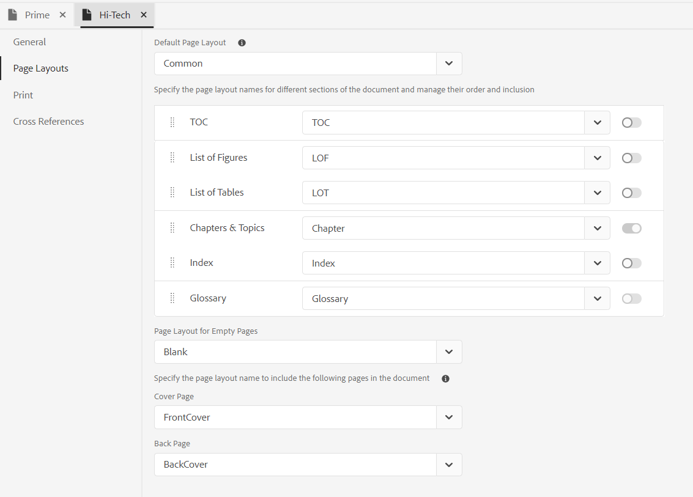

# Componenti di un modello di PDF {#components-pdf-template}

Un modello di PDF include quattro componenti: Layout di pagina, Fogli di stile, Risorse e Impostazioni. Potete creare un modello personalizzando questi singoli componenti e associando il modello a un predefinito di output durante la generazione di un output PDF. Le sezioni seguenti descrivono in dettaglio questi componenti e il loro processo di personalizzazione.

## Creare e personalizzare i layout di pagina {#create-customize-page-layout}

Le impostazioni del componente Layout di pagina consentono di progettare la struttura di una pagina definendo l’intestazione, il piè di pagina e l’area del contenuto di una pagina. Utilizzando l&#39;editor di layout di pagina WYSIWYG è possibile creare un layout di pagina per diverse sezioni di un PDF, ad esempio frontespizio e retro, capitolo, sommario (TOC), indice, pagina vuota, elenco di figure (LOF), elenco di tabelle (LOT), glossario o creare un layout per una pagina personalizzata. In Impostazioni modello PDF, puoi assegnare un layout di pagina con diverse sezioni all’interno di un PDF, che vengono quindi utilizzate per generare l’output del PDF.

### Crea un nuovo layout di pagina {#create-page-layout}

>[!NOTE]
>
>Sono disponibili layout di pagina di esempio preconfigurati. Puoi personalizzarli o creare nuovi layout di pagina.

1. Nell’editor web, vai al **Output** scheda.
1. Espandi la barra laterale a sinistra e fai clic su **Modelli**.
1. Aprire il modello che si desidera utilizzare.
   >[!NOTE]
   >
   >Per aprire un modello, fai doppio clic sul nome o fai clic sull’icona > accanto al nome.
1. Per creare un nuovo layout di pagina, effettuare una delle seguenti operazioni:
   * Passa il cursore sopra **Layout di pagina** e fai clic su (*Opzioni* ) **...** e scegli **Nuovo layout di pagina**.
   * In **Modelli** fare clic sul pulsante **+** icona accanto a **Modelli** e scegli **Layout di pagina** dal menu di scelta rapida.

      Viene visualizzata la finestra di dialogo Aggiungi layout.

      
1. Specificare un nome per il nuovo layout di pagina.
   >[!NOTE]
   >
   >Evita di usare caratteri speciali per la denominazione del layout di una pagina. Uno spazio nel nome è sostituito da un carattere di sottolineatura &quot;_&quot;.
1. Clic **Fine**.

   Il nuovo layout viene creato e aggiunto in Layout di pagina.

### Duplicare un layout di pagina {#duplicate-page-layout}

1. In **Modelli** del modello da duplicare, fare doppio clic su **Layout di pagina** oppure fai clic su **>** icona prima di **Layout di pagina**.

   Viene visualizzato l&#39;elenco dei layout di pagina all&#39;interno del modello.

1. Passa il puntatore del mouse sul layout di pagina da duplicare e fai clic sul pulsante (*Opzioni* ) **...** e seleziona **Duplica** dal menu di scelta rapida.

1. In _Layout duplicato_ , immetti un nome per il layout della pagina.

1. Clic **Fine**.
Una copia del layout di pagina selezionato viene creata e aggiunta in Layout di pagina.

### Personalizzare il layout di una pagina {#customize-page-layout}

1. In **Modelli** del modello che si desidera modificare, fare doppio clic su **Layout di pagina** oppure fai clic su **>** icona prima di **Layout di pagina**.

   Viene visualizzato l&#39;elenco dei layout di pagina all&#39;interno del modello.
1. Per personalizzare un layout di pagina, effettuare una delle seguenti operazioni:
   * Fare doppio clic su qualsiasi layout di pagina.
   * Passa il puntatore del mouse su un layout di pagina e fai clic su (*Opzioni* ) **...** e seleziona **Modifica** dal menu di scelta rapida.

   Verrà aperto l’editor layout pagina per la personalizzazione.
1. Dopo aver apportato le modifiche desiderate, fai clic su *Salva tutto* (o `Crl+S`).

   Per ulteriori informazioni sulla definizione dei singoli elementi di layout, ad esempio intestazione, piè di pagina, numero di pagina, titolo e altro ancora, vedere [Progettare un layout di pagina](design-page-layout.md).

## Utilizzare i fogli di stile per personalizzare PDF {#stylesheet-customization}

Le impostazioni nel componente Stylesheets consentono di applicare uno stile ai componenti di layout di pagina e al contenuto DITA utilizzando l’editor WYSIWYG o di lavorare direttamente con il file CSS. È possibile creare stili personalizzati o personalizzare le proprietà di stile predefinite. L&#39;editor WYSIWYG consente di accedere alla maggior parte delle proprietà necessarie per applicare lo stile al layout di pagina o al contenuto DITA. Per le personalizzazioni avanzate, puoi lavorare direttamente nella vista Origine.

### Crea un nuovo foglio di stile {#create-stylesheet}

Anche se i file CSS sono forniti per contenuto e layout, è possibile creare un nuovo foglio di stile per applicare più personalizzazioni a un tipo di stile specifico che possono quindi essere applicate a un componente di destinazione. Per impostazione predefinita, i file CSS di esempio sono raggruppati all’interno del prodotto. Questi file CSS hanno lo scopo di aiutare a organizzare le informazioni sullo stile tra il contenuto e i layout. Puoi scegliere di unire questi stili in un singolo file CSS o in più file.

Per impostazione predefinita, ogni volta che crei un nuovo layout di pagina, il `layout.css` è incluso nel nuovo layout di pagina. Se desideri che il layout di pagina contenga stili di un file CSS diverso, puoi semplicemente trascinare il file CSS desiderato nell’area di modifica del contenuto del nuovo layout di pagina. Per verificare se il file CSS è stato incorporato nel layout di pagina, passa alla vista Origine e troverai un collegamento al file CSS nel `<head>` elemento.

Per creare un foglio di stile, effettuare le seguenti operazioni:
1. In **Modelli** eseguire una delle operazioni seguenti:
   * Passa il puntatore del mouse sopra **Fogli di stile** e fai clic su (*Opzioni* ) **...** e scegli **Nuovo foglio di stile**.
   * Fai clic su **+** icona accanto a **Modelli** e scegli **Foglio di stile** dal menu di scelta rapida.

   Verrà visualizzata la finestra di dialogo Aggiungi foglio di stile.

   
1. Specificare un nome per il nuovo foglio di stile.
1. Clic **Fine**.

   Nella sezione Fogli di stile viene creato e aggiunto un nuovo foglio di stile.

### Crea un nuovo stile {#create-style}

Per impostazione predefinita, i file CSS contengono stili per intestazione, paragrafo, carattere, collegamento ipertestuale, immagine, tabella, div, pagina e altri stili. Potete sovrascrivere il formato di stile predefinito o creare un nuovo stile.

In genere, viene creato un nuovo stile quando si desidera associare uno stile personalizzato a qualsiasi elemento DITA. Affinché tali stili personalizzati funzionino, è necessario assicurarsi di associare il nome della classe dello stile all&#39;attributo outputclass dell&#39;elemento DITA.

Per creare un nuovo stile, effettuare le seguenti operazioni:
1. Fare clic con il pulsante destro del mouse su uno stile e scegliere Nuovo stile dal menu di scelta rapida.

   Viene visualizzata la finestra di dialogo Aggiungi stile.

   
1. In **Tag** , scegliere un tag per il quale si desidera creare un nuovo stile.
1. Specifica un **Classe** nome.

   Questo nome di classe deve essere associato all’attributo outputclass del tag nel contenuto sorgente.
1. Seleziona un **Pseudo classe** per migliorare lo stile dell’elemento.
1. Clic **Fine**.

   Un nuovo stile viene creato e aggiunto sotto lo stile di base.

### Personalizzare uno stile predefinito o nuovo {#customize-style}

Dopo aver creato un nuovo file CSS con stili predefiniti o desideri personalizzare gli stili in un file CSS esistente, puoi utilizzare l’editor stili.

Per personalizzare uno stile, effettuare le seguenti operazioni:
1. Doppio clic su **Fogli di stile** oppure fai clic su **>** icona prima di **Fogli di stile**.

   In questo modo vengono visualizzati i file CSS predefiniti (Contenuto e layout) e personalizzati.
1. Aprire un foglio di stile per la modifica.

   Per aprire il foglio di stile per la modifica, eseguire una delle operazioni seguenti:
   * Fare doppio clic sul nome del foglio di stile.
   * Passa il puntatore del mouse sul nome del foglio di stile, fai clic su (icona Opzioni) e scegli Modifica.

   Verrà aperto il foglio di stile per la modifica e verrà visualizzato l&#39;elenco degli stili nel pannello Stili.

   

1. Per personalizzare uno stile, fai doppio clic su di esso oppure fai clic sull’icona > prima di uno stile per visualizzarlo e personalizzarlo utilizzando l’editor di stili.

per informazioni dettagliate sull&#39;utilizzo degli stili più comuni, vedere [Utilizzare gli stili di contenuto comuni](stylesheet.md)

## Utilizzare le risorse {#work-with-resources}

Questo è un contenitore per tutte le risorse utilizzate per progettare un modello. Può essere considerata come una cartella, che contiene risorse quali immagini di sfondo, font personalizzati, loghi e altro ancora. Ogni volta che aggiungi una risorsa nel modello, questa viene caricata o archiviata nella cartella delle risorse. Puoi quindi utilizzare queste risorse per personalizzare o progettare i modelli di PDF.

Per aggiungere un file di risorse alla cartella Risorse, effettua le seguenti operazioni:
1. Passa il puntatore del mouse sulla scheda della cartella Risorse e fai clic su (icona Opzioni) ... e scegli Importa.

   Viene visualizzata la finestra di dialogo Carica risorse.

   

   Il percorso in cui verrà caricato il file di risorse è mostrato nella **Seleziona cartella risorse** campo.
   >[!NOTE]
   >
   >Non puoi modificare il percorso per caricare le risorse. Per impostazione predefinita, tutte le risorse sono memorizzate in `/content/dam/dita-templates/pdf/<PDF-template-name>` cartella.

1. Clic **Scegli file** per sfogliare il file di risorse dal computer locale

1. Clic **Carica**.
Il file selezionato viene importato ed elencato nella cartella Risorse.

## Impostazioni avanzate di PDF {#advanced-pdf-settings}

Utilizza la sezione Impostazioni per configurare le impostazioni avanzate per il layout di pagina del PDF, avviando PDF da una pagina pari o dispari, i formati per i riferimenti incrociati e abilitando i segni di stampa nel PDF finale generato utilizzando il modello.

Per configurare, fai clic su **Impostazioni** nel **Modelli** per visualizzare le seguenti opzioni:

**Generale**

Impostate le impostazioni di configurazione di base per l&#39;avvio di un capitolo da una pagina pari o dispari, la struttura del sommario e definite il formato della linea guida per le voci del sommario. Puoi definire la seguente impostazione:

* **Inizia sempre il capitolo da**: ti consente di definire come viene pubblicato ogni capitolo nel PDF finale. È possibile scegliere tra **Nuova pagina**, **Pagina dispari**, o **Pagina pari** opzioni. Se si sceglie di iniziare un nuovo capitolo da una pagina dispari, dopo un capitolo che termina in una pagina dispari viene inserita una pagina vuota. Ad esempio, se il capitolo termina alla pagina 15, il processo di pubblicazione inserirà un campo vuoto 16th in modo che il nuovo capitolo possa iniziare dal 17th pagina.

* **Iniziare ogni argomento da una nuova pagina**: se desideri che ogni argomento del capitolo inizi da una nuova pagina, seleziona **Iniziare ogni argomento da una nuova pagina** opzione. Se vuoi mantenere i tuoi argomenti in continuazione senza spazi tra le pagine, deseleziona questa opzione.

* **Struttura sommario**: consente di personalizzare la gerarchia del sommario. Vengono utilizzate le seguenti impostazioni aggiuntive:

   * **Usa intestazioni fino al livello**: consente di regolare il numero di livelli di intestazione da visualizzare nella struttura del sommario del PDF.
   * **Non mostrare il numero di pagina per il primo livello nel sommario**: seleziona questa opzione per nascondere i numeri di pagina corrispondenti per tutti i capitoli che contengono argomenti nidificati o secondari. Considera l’esempio seguente in cui viene creato un output senza selezionare questa opzione.

   

   Nell&#39;esempio precedente, Impostazioni PDF avanzate, Appendice e Legale sono i titoli degli argomenti o dei capitoli di primo livello. A tutti questi titoli viene assegnato un numero di pagina.

   Ora, se selezioni questa opzione e generi l’output, otterrai il seguente sommario:

   

   In questa sezione è possibile notare che al primo capitolo Impostazioni avanzate di PDF non viene assegnato alcun numero di pagina, in quanto contiene argomenti nidificati o secondari. mentre un numero di pagina viene assegnato ad Appendice e Legale perché si tratta di argomenti autonomi senza argomenti secondari.

* **Formato guida**: utilizza il menu a discesa per selezionare le linee guida Punteggiate, Solide o Spaziate per collegare i livelli di intestazione ai numeri di pagina corrispondenti.
Per applicare la struttura del sommario e i livelli di intestazione degli stili, consultate [Aggiungi un sommario capitolo](design-page-layout.md#add-chapter-toc).

   >[!NOTE]
   >
   >Se sei uno sviluppatore CSS, puoi definire il formato guida direttamente anche nel file CSS.
* **Usa marcatore di continuazione tabella**: seleziona questa opzione per definire marcatori per tabelle lunghe distribuite su più pagine. <!--For more information on using table continuation markers, see Use table continuation markers.-->

**Layout di pagina**

Le impostazioni Layout di pagina consentono di specificare il layout di pagina da utilizzare per una sezione specifica del documento. Ad esempio, per selezionare un layout per il sommario, fai clic sul menu a discesa sotto il campo TOC e seleziona il layout progettato per generare il sommario.

Le seguenti impostazioni sono disponibili nella sezione Layout di pagina:

**Layout di pagina predefinito**: seleziona un layout di pagina che funga da layout predefinito per tutte le pagine del PDF. Questo è il layout di pagina di base applicato alle sezioni o agli argomenti in cui non è stato creato un layout di pagina dedicato.

**Layout di pagina per diverse sezioni**: puoi scegliere di mappare un layout di pagina con le seguenti sezioni dell’output PDF:
* Sommario
* Elenco delle figure
* Elenco delle tabelle
* Capitoli e argomenti
* Indice
* Glossario

Se non desideri visualizzare una particolare sezione nell’output PDF, puoi disattivarla attivando l’interruttore di attivazione.

**Capitolo e argomenti** il layout è sempre abilitato e **Glossario** Il layout è sempre disattivato per impostazione predefinita. Non è possibile attivarle.

Puoi anche definire l’ordine in cui queste diverse sezioni vengono generate nel PDF. Per modificare l’ordine predefinito di queste pagine, passa il cursore del mouse a sinistra del layout di pagina e fai clic sull’icona delle barre punteggiate per trascinare e rilasciare il layout di pagina nella posizione desiderata.
Il tuo PDF conterrà i layout di pagina abilitati nell’ordine in cui li hai organizzati qui.

**Layout di pagina per pagine vuote**: puoi anche specificare il layout di pagina per le pagine vuote. Il layout selezionato verrà applicato a tutte le pagine vuote. Ad esempio, se hai progettato un layout di pagina vuoto per tutte le pagine vuote, seleziona **Vuoto** nell&#39;elenco a discesa e tutte le pagine vuote del documento avranno il layout Pagina vuota.

**Frontespizio e retro**: se hai progettato un layout di pagina di copertina, mappalo sul **Copertina** opzione. Allo stesso modo, se disponi di un layout di pagina posteriore, mappalo sul **Pagina posteriore** opzione. Se non è stato creato alcun layout di copertina o di pagina posteriore, viene applicato il layout di pagina predefinito.

>[!NOTE]
>
>Le impostazioni della mappa segnalibro hanno la precedenza sulle impostazioni del layout di pagina.

Per ulteriori informazioni sui layout di pagina, vedere [Progettare un layout di pagina](design-page-layout.md).

**Stampa**

Configurare le impostazioni di stampa per assegnare gli indicatori di stampa, selezionare i modelli di colore e specificare le proprietà relative alla stampa dell&#39;output PDF.

* **Indicatori della stampante**: quando si prepara un documento per la produzione di stampa, i segni di stampa vengono aggiunti ai bordi della pagina per facilitare l&#39;allineamento, il ritaglio e la selezione del colore durante la stampa. Selezionando un contrassegno della stampante, il limite della pagina viene esteso per contenere il contrassegno, che viene tagliato durante la stampa. È possibile scegliere di visualizzare i seguenti indicatori di stampa nell&#39;output di PDF:
   * **Indicatori di taglio**: selezionare l&#39;opzione per inserire un segno in ogni angolo dell&#39;area di ritaglio per indicare dove è necessario ritagliare la carta dopo la stampa.
   * **Indicatori al vivo**: selezionare questa opzione per posizionare un segno su ogni angolo del riquadro di pagina al vivo per indicare l&#39;area di ritaglio per l&#39;immagine estesa.
   * **Indicatori di registrazione**: selezionare questa opzione per posizionare un segno all&#39;esterno dell&#39;area di ritaglio per allineare le diverse selezioni in un documento a colori.
   * **Barre colore**: selezionare questa opzione per aggiungere una striscia di colori al di fuori dell&#39;area di ritaglio per mantenere la coerenza dei colori e regolare la densità dell&#39;inchiostro durante la stampa.

   Impostare le dimensioni per gli indicatori di stampa selezionati utilizzando **Larghezza linea**, **Colore linea**, e **Larghezza riquadro al vivo** opzioni.

* **Dimensioni Media Box**: dimensioni complessive della pagina, inclusa l&#39;area estesa occupata dagli indicatori di stampa. Utilizza l’opzione a discesa per selezionare le dimensioni della pagina per l’output PDF o per creare dimensioni personalizzate.

* **Spazio colore**: puoi scegliere tra gli spazi colore RGB o CMYK per stampare il documento PDF. Scegliete RGB per visualizzare le PDF generate in digitale e CMYK per la stampa fisica. I colori definiti nel documento vengono convertiti nello spazio colore scelto.
   >[!NOTE]
   >
   >Se si utilizza lo spazio colore CMYK, è necessario un profilo colore ICC per la creazione di PDF/A.

   <!--For more information on applying these print settings, see *Printing preferences*.-->

**Riferimenti incrociati**

Utilizzate la scheda Riferimento incrociato (Cross-reference) per definire la modalità di pubblicazione dei riferimenti incrociati nel PDF. È possibile formattare i riferimenti incrociati per il titolo dell&#39;argomento, tabelle, figure e altro ancora. <!--For more information, see *Format cross-references*.-->
