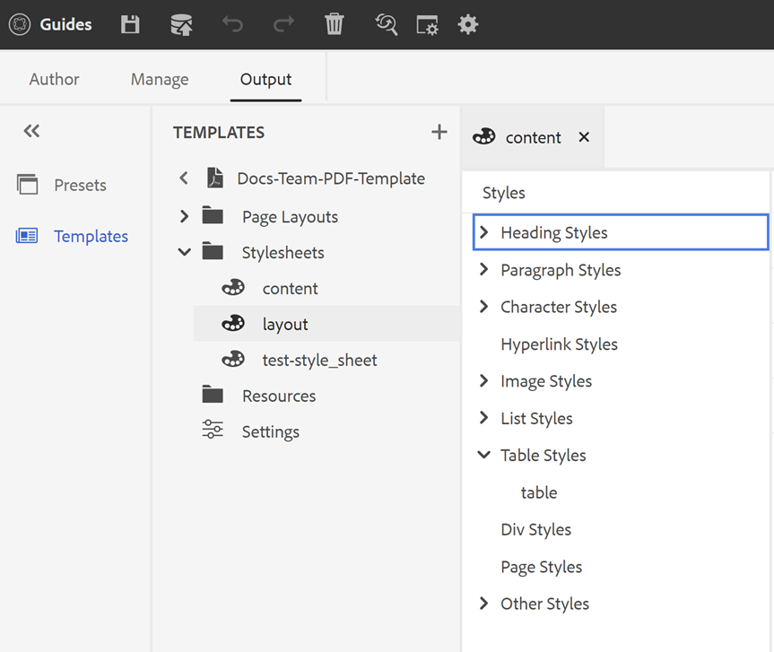

# Componenti di un modello PDF {#components-pdf-template}

Un modello PDF è costituito da quattro componenti: Layout di pagina, fogli di stile, risorse e impostazioni. Puoi creare un modello personalizzando questi singoli componenti e associando il modello a un predefinito di output durante la generazione di un output in PDF. Le sezioni seguenti descrivono in dettaglio questi componenti e il loro processo di personalizzazione.

## Creare e personalizzare i layout di pagina {#create-customize-page-layout}

Le impostazioni nel componente Layout di pagina consentono di progettare la struttura di una pagina definendo l’intestazione, il piè di pagina e l’area contenuto di una pagina. Utilizzando l’editor per layout di pagina WYSIWYG, è possibile creare un layout di pagina per diverse sezioni di un PDF, ad esempio pagine di copertina anteriori e posteriori, capitoli, sommario, indice, pagina vuota, Elenco di figure (LOF), Elenco di tabelle (LOT), glossario o creare un layout per una pagina personalizzata. In Impostazioni modello di PDF è possibile assegnare un layout di pagina con diverse sezioni all’interno di un PDF, che vengono quindi utilizzate per generare l’output di PDF.

### Creare un nuovo layout di pagina {#create-page-layout}

>[!NOTE]
>
>Sono disponibili layout di pagina di esempio che vengono forniti fuori dalla scatola. È possibile personalizzare questi layout o creare nuovi layout di pagina.

1. Nell’Editor web, passa alla pagina **Uscita** scheda .
1. Espandi la barra laterale sinistra e fai clic su **Modelli**.
1. Apri il modello con cui desideri lavorare.
   >[!NOTE]
   >
   >Per aprire un modello, fai doppio clic sul suo nome o fai clic sull’icona > accanto al suo nome.
1. Per creare un nuovo layout di pagina, effettuare una delle seguenti operazioni:
   * Passa il cursore **Layout di pagina** e fai clic su (*Opzioni* icona) **...** e scegli **Nuovo layout di pagina**.
   * In **Modelli** fai clic sul **+** accanto a **Modelli** e scegli **Layout pagina** dal menu di scelta rapida.

      Viene visualizzata la finestra di dialogo Aggiungi layout .

      
1. Specifica un nome per il nuovo layout di pagina.
   >[!NOTE]
   >
   >Evita di utilizzare caratteri speciali per la denominazione di un layout di pagina. Uno spazio nel nome viene sostituito da un trattino basso &quot;_&quot;.
1. Fai clic su **Fine**.

   Il nuovo layout viene creato e aggiunto in Layout di pagina.

### Duplicare un layout di pagina {#duplicate-page-layout}

1. In **Modelli** della sezione del modello da duplicare, fare doppio clic su **Layout di pagina** o fai clic su **>** icona prima **Layout di pagina**.

   Viene visualizzato l’elenco dei layout di pagina all’interno del modello.

1. Passa il puntatore del mouse sul layout di pagina da duplicare e fai clic su (*Opzioni* icona) **...** e seleziona **Duplica** dal menu di scelta rapida.

1. In _Layout duplicato_ immettere un nome per il layout di pagina.

1. Fai clic su **Fine**.
Una copia del layout di pagina selezionato viene creata e aggiunta in Layout di pagina.

### Personalizzare un layout di pagina {#customize-page-layout}

1. In **Modelli** della sezione del modello da modificare, fare doppio clic su **Layout di pagina** o fai clic su **>** icona prima **Layout di pagina**.

   Viene visualizzato l’elenco dei layout di pagina all’interno del modello.
1. Per personalizzare un layout di pagina, effettuare una delle seguenti operazioni:
   * Fare doppio clic su un layout di pagina.
   * Passa il puntatore del mouse sopra un layout di pagina e fai clic sul pulsante (*Opzioni* icona) **...** e seleziona **Modifica** dal menu di scelta rapida.

   Viene aperto l’editor del layout di pagina per la personalizzazione.
1. Dopo aver apportato le modifiche desiderate, fai clic su *Salva tutto* o `Crl+S`).

   Per ulteriori informazioni sulla definizione di singoli elementi di layout quali intestazione, piè di pagina, numero di pagina, titolo e altro ancora, consulta [Progettazione di un layout di pagina](design-page-layout.md).

## Utilizzare fogli di stile per personalizzare PDF {#stylesheet-customization}

Le impostazioni nel componente Stylesheets consentono di assegnare uno stile ai componenti di layout della pagina e al contenuto DITA utilizzando l’editor WYSIWYG o direttamente con il file CSS. È possibile creare stili personalizzati o personalizzare le proprietà di stile predefinite. L’editor WYSIWYG consente di accedere alla maggior parte delle proprietà necessarie per personalizzare lo stile del layout di pagina o del contenuto DITA. Per le personalizzazioni avanzate, puoi lavorare direttamente nella vista Origine.

### Crea un nuovo foglio di stile {#create-stylesheet}

Mentre vengono forniti file CSS per il contenuto e il layout, è possibile creare un nuovo foglio di stile per applicare più personalizzazioni a un tipo di stile specifico che possono quindi essere applicate a un componente di destinazione. Per impostazione predefinita, i file CSS di esempio sono raggruppati all’interno del prodotto . Questi file CSS hanno lo scopo di aiutarti a organizzare le informazioni sullo stile tra contenuti e layout. Puoi scegliere di unire questi stili in uno o più file CSS.

Per impostazione predefinita, ogni volta che si crea un nuovo layout di pagina, il `layout.css` è incluso nel nuovo layout di pagina. Se desideri che il layout di pagina contenga stili di un file CSS diverso, puoi semplicemente trascinare e rilasciare il file CSS desiderato nell’area di modifica del contenuto del nuovo layout di pagina. Per convalidare se il file CSS è stato incorporato nel layout di pagina, passa alla vista Origine e troverai un collegamento al file CSS nel `<head>` elemento.

Per creare un foglio di stile, attenersi alla procedura seguente:
1. In **Modelli** , effettua una delle seguenti operazioni:
   * Passa il puntatore del mouse **Fogli di stile** e fai clic su (*Opzioni* icona) **...** e scegli **Nuovo foglio di stile**.
   * Fai clic sul pulsante **+** accanto a **Modelli** e scegli **Foglio di stile** dal menu di scelta rapida.

   Viene visualizzata la finestra di dialogo Aggiungi foglio di stile.

   
1. Specificare un nome per il nuovo foglio di stile.
1. Fai clic su **Fine**.

   Viene creato e aggiunto un nuovo foglio di stile nella sezione Foglio di stile.

### Creare un nuovo stile {#create-style}

Per impostazione predefinita, i file CSS contengono stili per intestazione, paragrafo, carattere, collegamento ipertestuale, immagine, tabella, div, pagina e altri stili. È possibile ignorare il formato di stile predefinito o creare un nuovo stile.

In genere, si crea un nuovo stile quando si desidera associare uno stile personalizzato per qualsiasi elemento DITA. Affinché tali stili personalizzati funzionino, è necessario assicurarsi di associare il nome della classe dello stile all&#39;attributo outputclass dell&#39;elemento DITA.

Per creare un nuovo stile, effettua le seguenti operazioni:
1. Fare clic con il pulsante destro del mouse su uno stile e scegliere Nuovo stile dal menu di scelta rapida.

   Viene visualizzata la finestra di dialogo Aggiungi stile.

   
1. In **Tag** , scegli un tag per il quale vuoi creare un nuovo stile.
1. Specifica una **Classe** nome.

   Questo nome di classe deve essere associato all&#39;attributo outputclass del tag nel contenuto sorgente.
1. Seleziona una **Classe Pseudo** per migliorare lo stile dell’elemento.
1. Fai clic su **Fine**.

   Viene creato e aggiunto un nuovo stile sotto lo stile di base.

### Personalizzare uno stile predefinito o nuovo {#customize-style}

Dopo aver creato un nuovo file CSS con stili predefiniti o se desideri personalizzare gli stili in un file CSS esistente, puoi utilizzare l’editor di stili per farlo.

Per personalizzare uno stile, effettua le seguenti operazioni:
1. Fai doppio clic su **Fogli di stile** o fai clic su **>** icona prima **Fogli di stile**.

   Vengono visualizzati i file CSS predefiniti (Contenuto e Layout) e personalizzati.
1. Aprire un foglio di stile per la modifica.

   Per aprire un foglio di stile per la modifica, eseguire una delle operazioni seguenti:
   * Fare doppio clic sul nome del foglio di stile.
   * Passa il puntatore del mouse sul nome del foglio di stile e fai clic su (icona Opzioni) ... e scegli Modifica.

   Viene aperto il foglio di stile per la modifica e viene visualizzato l’elenco degli stili nel pannello Stili.

   

1. Per personalizzare uno stile, fai doppio clic su di esso oppure fai clic sull’icona > prima di uno stile per visualizzarlo e personalizzarlo utilizzando l’editor Stili.

per informazioni dettagliate sull’utilizzo degli stili più comuni, consulta [Utilizzare gli stili di contenuto comuni](stylesheet.md)

## Utilizzare le risorse {#work-with-resources}

Questo è un contenitore per tutte le risorse utilizzate per progettare un modello. La puoi considerare come una cartella contenente risorse quali immagini di sfondo, font personalizzati, loghi e altro ancora. Ogni volta che aggiungi una risorsa nel modello, questa viene caricata o archiviata nella cartella della risorsa. È quindi possibile utilizzare queste risorse per personalizzare o progettare i modelli di PDF.

Per aggiungere un file di risorse alla cartella Risorse, effettua le seguenti operazioni:
1. Passa il puntatore del mouse sulla scheda della cartella Risorse , fai clic su (icona Opzioni ) e scegli Importa.

   Viene visualizzata la finestra di dialogo Carica risorse .

   

   Il percorso in cui verrà caricato il file di risorsa viene mostrato nella **Seleziona cartella risorse** campo .
   >[!NOTE]
   >
   >Non puoi modificare il percorso per il caricamento delle risorse. Per impostazione predefinita, tutte le risorse sono memorizzate in `/content/dam/dita-templates/pdf/<PDF-template-name>` cartella.

1. Fai clic su **Scegli file** per sfogliare il file risorsa dal computer locale

1. Fai clic su **Carica**.
Il file selezionato viene importato ed elencato nella cartella Risorse.

## Impostazioni avanzate di PDF {#advanced-pdf-settings}

Utilizza la sezione Impostazioni per configurare le impostazioni avanzate per il layout di pagina PDF, iniziando da PDF da pagina pari o dispari, i formati per i riferimenti incrociati e l’abilitazione degli indicatori di stampa nel PDF finale generato utilizzando il modello.

Per configurare, fai clic su **Impostazioni** in **Modelli** per visualizzare le seguenti opzioni:

**Generale**

Impostare le impostazioni di configurazione di base per iniziare un capitolo dalla pagina dispari o pari, la struttura del sommario e definire il formato della linea guida per le voci del sommario. Puoi definire la seguente impostazione:

* **Inizia sempre capitolo da**: Consente di definire la modalità di pubblicazione di ogni capitolo in PDF finale. Puoi scegliere tra **Nuova pagina**, **Pagina dispari** oppure **Pagina pari** opzioni. Se si sceglie di iniziare un nuovo capitolo da una pagina dispari, viene inserita una pagina vuota dopo un capitolo che termina su una pagina dispari. Ad esempio, se il capitolo termina alla pagina numero 15, il processo di pubblicazione inserirà un campo vuoto 16th in modo che il nuovo capitolo possa iniziare dal 17th pagina.

* **Avvia ogni argomento da una nuova pagina**: Se si desidera che ogni argomento all&#39;interno del capitolo inizi da una nuova pagina, selezionare **Avvia ogni argomento da una nuova pagina** opzione . Se desideri mantenere gli argomenti in continuazione senza interruzioni di pagina, deseleziona questa opzione.

* **Struttura del sommario**: Consente di personalizzare la gerarchia del sommario. Utilizza le seguenti impostazioni aggiuntive:

   * **Usa intestazioni fino a livello**: Consente di regolare il numero di livelli di intestazione da visualizzare nella struttura del sommario di PDF.
   * **Non mostrare il numero di pagina per il primo livello nel sommario**: Selezionare questa opzione per nascondere i numeri di pagina corrispondenti per tutti i capitoli contenenti argomenti nidificati o secondari. Prendi in considerazione l’esempio seguente in cui viene creato un output senza selezionare questa opzione.

   

   Nell&#39;esempio precedente, Impostazioni avanzate di PDF, Appendice e Note legali sono titoli di argomento di primo livello o titoli di capitolo. A tutte queste intestazioni viene assegnato un numero di pagina.

   Ora, se selezioni questa opzione e generi l&#39;output, otterrai il seguente sommario:
   

   Qui si nota che al primo capitolo Impostazioni avanzate di PDF non viene assegnato alcun numero di pagina, in quanto contiene argomenti nidificati o secondari. Un numero di pagina se assegnato all&#39;Appendice e all&#39;Ufficio legale perché sono argomenti indipendenti senza alcun argomento figlio.

* **Formato leader**: Utilizzare il menu a discesa per selezionare linee guida punteggiate, solide o spaziali per collegare i livelli di intestazione ai numeri di pagina corrispondenti.
Per applicare la struttura del sommario e lo stile dei livelli di intestazione, consulta [Aggiungi un sommario capitolo](design-page-layout.md#add-chapter-toc).

   >[!NOTE]
   >
   >Se sei uno sviluppatore CSS, puoi definire il formato leader direttamente anche nel file CSS.
* **Usa indicatore di continuazione tabella**: Selezionare questa opzione per definire i marcatori per le tabelle lunghe distribuite su più pagine. <!--For more information on using table continuation markers, see Use table continuation markers.-->

**Layout di pagina**

Le impostazioni Layout di pagina consentono un controllo completo sulla specifica del layout di pagina da utilizzare per una sezione specifica del documento. Ad esempio, per selezionare un layout per il sommario, fai clic sul menu a discesa nel campo sommario e seleziona il layout progettato per generare il sommario.

Se non è stato creato un layout per una particolare sezione del documento, è sufficiente scegliere un layout che funga da layout predefinito per tali sezioni o argomenti. Il layout di pagina predefinito viene quindi applicato a tutte le sezioni che non dispongono di un layout di pagina dedicato.

Allo stesso modo, se desideri una pagina di copertina e posteriore, devi avere un layout di pagina creato e applicato nelle impostazioni. In caso contrario, il PDF non conterrà le pagine di copertina e posteriore.

Per ulteriori informazioni sui layout di pagina, consulta [Progettazione di un layout di pagina](design-page-layout.md).

**Stampa**

Configurare le impostazioni di produzione di stampa per assegnare i segni di stampa, selezionare i modelli di colore e specificare le proprietà relative alla stampa dell&#39;output di PDF.

* **Indicatori di stampa**: Quando si prepara un documento per la produzione di stampa, i segni di stampa vengono aggiunti ai bordi della pagina per facilitare l&#39;allineamento, il taglio e la selezione del colore durante la stampa. Selezionando un contrassegno della stampante, il limite della pagina viene esteso per contenere il contrassegno, che viene ritagliato durante la stampa. È possibile scegliere di visualizzare i seguenti segni di stampa nell&#39;output di PDF:
   * **Indicatori di taglio**: Selezionare l&#39;opzione per posizionare un segno in ogni angolo dell&#39;area di taglio per indicare dove deve essere tagliata la carta dopo la stampa.
   * **Indicatori di sanguinamento**: Selezionate per posizionare un segno in ogni angolo della casella di pagina al vivo per indicare l&#39;area di taglio per l&#39;immagine estesa.
   * **Marchi di registrazione**: Selezionare questa opzione per posizionare un contrassegno all&#39;esterno dell&#39;area di ritaglio per allineare le diverse separazioni in un documento a colori.
   * **Barre dei colori**: Selezionare questa opzione per aggiungere una striscia di colori all&#39;esterno dell&#39;area di taglio per mantenere la coerenza del colore e regolare la densità dell&#39;inchiostro durante la stampa.

   Impostare le dimensioni per i segni di stampa selezionati utilizzando **Larghezza linea**, **Colore linea** e **Larghezza casella al vivo** opzioni.

* **Dimensioni Media Box**: Questa è la dimensione complessiva della pagina, inclusa l&#39;area estesa occupata dai segni della stampante. Utilizza l’opzione a discesa per selezionare le dimensioni della pagina per l’output di PDF o creare dimensioni personalizzate.

* **Spazio colore**: È possibile scegliere tra spazi colore RGB o CMYK per stampare il documento PDF. Scegliere RGB per visualizzare digitalmente il PDF generato e CMYK per la stampa fisica. I colori definiti nel documento vengono convertiti nello spazio colore scelto.
   >[!NOTE]
   >
   >Un profilo colore ICC è necessario per la creazione di PDF/A se si utilizza lo spazio colore CMYK.

   <!--For more information on applying these print settings, see *Printing preferences*.-->

**Riferimenti incrociati**

Utilizza la scheda Riferimento incrociato per definire la modalità di pubblicazione dei riferimenti incrociati in PDF. È possibile formattare i riferimenti incrociati per titolo argomento, tabelle, figure e altro ancora. <!--For more information, see *Format cross-references*.-->
