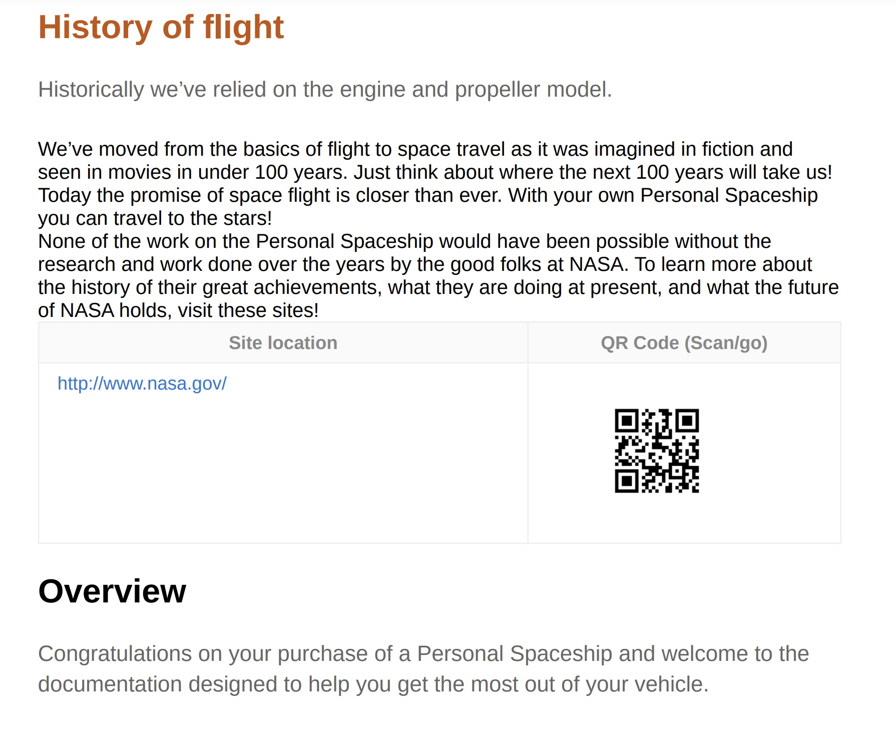

# Applica stile personalizzato alle voci del sommario e al contenuto dell’argomento

In alcuni casi, potrebbe essere utile applicare uno stile personalizzato alle voci del sommario o a un particolare argomento. Questo può essere ottenuto associando un `outputclass` con l&#39;attributo `<topicref>` nella mappa DITA. Inoltre, se desideri applicare un formato personalizzato a un intero argomento, questo può essere ottenuto anche estendendo la definizione dello stile dell’attributo nel CSS.

Prendiamo ad esempio un nuovo argomento che desideri inviare per la revisione. Per una facile identificazione dell’argomento aggiornato, devi aggiungere un `outputclass` attributo `<topicref>` nella mappa DITA e quindi definire uno stile personalizzato per lo stesso nel CSS.

Nell&#39;esempio seguente, la *Storia dei voli* è stato assegnato un argomento `outputclass` attributo con il valore di `new-topic`.


Definizione della classe `new-topic` in un CSS puoi definire lo stile per i seguenti elementi:
* La voce principale nel sommario o nel mini-sommario
* Titolo dell’argomento nel contenuto principale
* L’intero contenuto dell’argomento, incluso il titolo

Vediamo come ciascuno di questi scenari può essere definito nel CSS. Nella seguente definizione CSS del `new-topic` Classe , il colore del testo è stato modificato.

```css
…
.new-topic {
  color: #CC5309
}
…
```

Questa definizione controlla il colore del testo nel sommario e il titolo dell’argomento. Il seguente output PDF mostra i diversi colori applicati alla voce del sommario:


Anche il titolo dell’argomento è formattato con lo stesso colore.



Se desideri che la voce del sommario e il titolo dell’argomento abbiano stili diversi, puoi definirli separatamente come mostrato di seguito:

```css
...
/*for styling TOC entry */
.new-topic {
  color: #CC3509
}

/* for styling topic's title */
.new-topic.title {
  color: #092ACC
}
...
```

Infine, puoi anche applicare gli stili all’intero contenuto dell’argomento. A questo scopo, è necessario aggiungere un suffisso &quot;`-content`&quot; al nome della classe. Nell’esempio seguente, è stata aggiunta una barra di modifica all’intero contenuto dell’argomento:

```css
...
/* for styling the topic's content */
.new-topic-content {
  -ro-change-bar-color: #A609CC;
}
...
```

Utilizzando gli attributi di stile di cui sopra, viene aggiunta una barra di modifica a sinistra del *Storia del volo* come illustrato di seguito:


