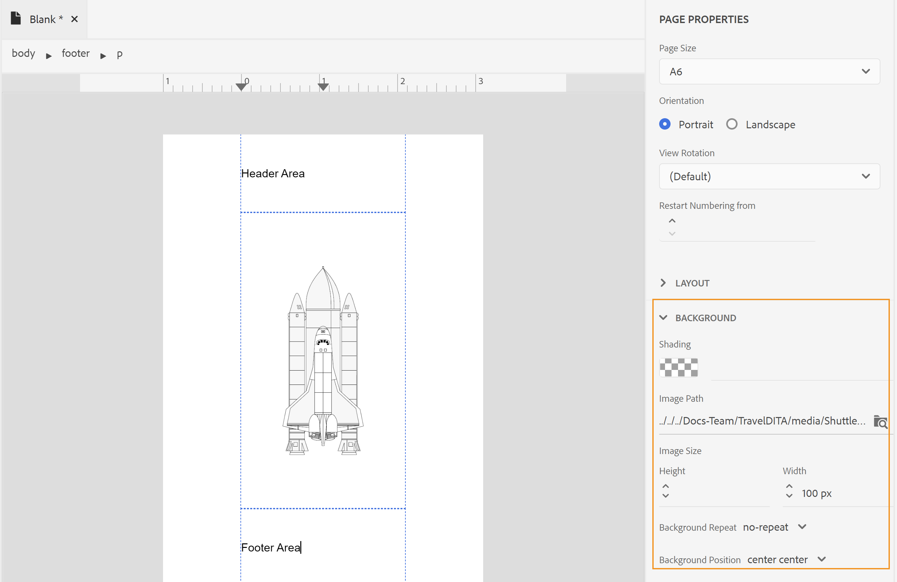

# Progettazione di un layout di pagina {#design-page-layout}

Quando si crea un documento PDF, sono disponibili sezioni diverse per presentare diversi tipi di informazioni. Ad esempio, un documento PDF parte da una pagina iniziale o di copertina, contenente il logo, il titolo del libro o le informazioni sulla versione della tua azienda. Ci sarebbero poi capitoli, appendici o pagine del glossario. Ogni sezione di un documento PDF ha un aspetto diverso e questo si ottiene creando e personalizzando il layout della pagina.

Quando si progetta un layout di pagina, è possibile definire i vari elementi che compongono una pagina. Ad esempio, è possibile definire le dimensioni della pagina, i margini, l’intestazione e il piè di pagina, l’orientamento e altre specifiche di pagina in una pagina. La funzione Pubblicazione nativa di PDF consente di progettare la pagina in base alla [Standard per file multimediali](https://www.w3.org/TR/css-page-3/). La maggior parte delle impostazioni coperte dagli standard Paged Media può essere facilmente personalizzata utilizzando l&#39;interfaccia utente della funzione Pubblicazione nativa di PDF. Per altre formattazioni avanzate, puoi utilizzare la vista Origine per scrivere il tuo codice CSS.

Una volta progettati i layout di pagina, è necessario associare questi layout alle rispettive sezioni nelle impostazioni di layout di pagina di PDF. Consulta la sezione [Creare e personalizzare i layout di pagina](components-pdf-template.md#create-customize-page-layout) per informazioni dettagliate su come creare e aprire un layout di pagina per la personalizzazione.

## Tipi di layout di pagina {#types-of-page-layout}

Un documento PDF contiene in genere le sezioni seguenti:

* Pagina copertina
* Sommario
* Incremento delle cifre
* Incremento delle tabelle
* Pagine dei capitoli o degli argomenti
* Glossario
* Indice
* Pagina posteriore

Per presentare le informazioni in un formato specifico, è necessario disporre di un layout di pagina corrispondente. Inoltre, è possibile disporre di una pagina vuota utilizzata come compilatore per iniziare un nuovo capitolo da una pagina dispari o pari. In tal caso, è possibile utilizzare il layout di pagina predefinito o creare un layout di pagina per una pagina vuota. Vedi [Creare un nuovo layout di pagina](components-pdf-template.md#create-page-layout) per ulteriori dettagli.

Le impostazioni Layout di pagina nella sezione **Modello>Impostazioni** consente di definire il layout di pagina da utilizzare per diverse sezioni di PDF. Ogni layout di pagina può inoltre presentare diverse varianti di pagina prima, destra o sinistra.

### Creare le varianti di layout di pagina prima, destra o sinistra {#page-layout-variants}

I diversi layout di pagina nel modello PDF possono essere ulteriormente personalizzati utilizzando diverse varianti di layout di pagina iniziale, destra o sinistra. È possibile progettare queste pagine in modo diverso utilizzando Progettazione layout pagina.

>[!NOTE]
>
>Se si desidera avere un layout di pagina singolo per una sezione del libro, non è necessario creare il layout di pagina Primo, Destra o Sinistra.

Quando crei i layout di pagina, considera quanto segue:

>[!NOTE]
>
>I punti seguenti hanno preso ad esempio il layout della pagina Capitolo . Tuttavia, questi punti sono validi anche per altri layout di pagina.

* Se si desidera utilizzare un layout di pagina singolo per tutte le pagine di un capitolo, è necessario creare un solo layout di pagina capitolo senza alcuna variante.

* Se vuoi avere un aspetto diverso per la prima pagina per i capitoli del libro, devi creare una variante di layout Prima pagina per i capitoli.

* Se vuoi avere un aspetto diverso per ogni pagina a sinistra e a destra del tuo libro, allora devi creare le varianti a sinistra e a destra per il layout della pagina dei capitoli.

* Se si desidera che i capitoli inizino da una pagina dispari o pari, è possibile scegliere di creare un layout di pagina per la pagina vuota. Questo layout di pagina viene utilizzato per colmare il gap tra due capitoli in modo che il capitolo inizi dalla pagina dispari o pari desiderata.

   >[!NOTE]
   >
   >Se non si crea un layout di pagina vuoto separato, viene utilizzato il layout di pagina predefinito. Per creare un layout di pagina, consulta [Creare un nuovo layout di pagina](components-pdf-template.md#create-page-layout).

L’esempio seguente illustra il processo di creazione delle varianti di un layout di pagina:

1. Creare un layout di pagina &quot;Capitolo&quot; utilizzando i passaggi descritti nella procedura &quot;Creare un nuovo layout di pagina&quot;.

   Viene creato e aggiunto un layout vuoto della pagina Capitolo in Layout di pagina.

   Per impostazione predefinita, quando si crea un layout di pagina, questo viene aperto anche per la modifica. La schermata seguente mostra un layout di pagina vuoto (predefinito):

   

   L’intestazione, il piè di pagina e l’area contenuto di un modello vengono creati per impostazione predefinita. Puoi personalizzare facilmente queste aree utilizzando le proprietà della pagina, le proprietà del contenuto e vari strumenti (come l’inserimento di immagini, campi e altro ancora) forniti nell’interfaccia utente.

   >[!NOTE]
   >
   >Per la configurazione avanzata, puoi utilizzare la vista Origine e aggiungere codice HTML e CSS personalizzati.

1. Passa il puntatore del mouse sopra **Capitolo** layout e fai clic su **Opzioni** per visualizzare il menu di scelta rapida.

1. Passa il puntatore del mouse sopra **Aggiungi variante layout** e scegli il layout di pagina desiderato (Primo, Sinistra o Destra) da creare.

Il layout di pagina selezionato viene creato utilizzando una copia del layout Capitolo di base. Ciò significa che se sono state apportate modifiche al layout predefinito della pagina Capitolo, le stesse modifiche vengono replicate nel layout della pagina variante al momento della creazione del layout di pagina.

## Operazioni con le Proprietà pagina di un layout di pagina {#page-props-page-layout}

Durante la progettazione di un layout di pagina, è essenziale avere il controllo su varie proprietà di pagina. La funzione Pubblicazione PDF nativa racchiude tutte le proprietà principali della pagina nel pannello Proprietà pagina. Il pannello Proprietà pagina consente di accedere a varie proprietà nelle sezioni seguenti:

>[!NOTE]
>
>Il pannello Proprietà pagina incapsula le proprietà e segue le regole definite in [Standard per file multimediali](https://www.w3.org/TR/css-page-3/).

* **Dimensioni pagina** : Specifica le dimensioni della pagina da utilizzare per il layout di pagina. L’elenco a discesa Dimensione pagina consente di scegliere tra più di 15 dimensioni di pagina. È inoltre possibile creare un layout di pagina utilizzando una dimensione di pagina personalizzata, vedere [Imposta le dimensioni della pagina](#set-page-size) per ulteriori dettagli.

* **Orientamento** : Specifica l’orientamento della pagina da utilizzare per il layout di pagina. È possibile scegliere tra l’orientamento della pagina Verticale o Orizzontale. È possibile scegliere di applicare orientamenti diversi a varianti di pagina diverse in un layout di pagina. Ad esempio, se il contenuto contiene una tabella ampia o un’immagine grande, è possibile creare un layout di pagina orizzontale e applicare tale layout alla tabella o all’immagine più ampia.

* **Rotazione vista** : Specificare il lato o la direzione in cui il lato superiore originale è rappresentato dopo la rotazione. È possibile scegliere tra 90 in senso orario, 90 in senso antiorario o 180 gradi in senso antiorario. Questo è molto utile in una situazione in cui si desidera utilizzare una combinazione di layout Verticale e Orizzontale nell&#39;output. Ad esempio, è possibile utilizzare il formato verticale come layout di pagina generico e impostare un layout di pagina orizzontale per il rendering di tabelle wide. In questa situazione, è possibile impostare la visualizzazione del contenuto della tabella in senso orario di 90 gradi. In questo modo la pagina verrà orientata in orizzontale e il contenuto verrà ruotato di 90 gradi per mantenere la continuità della visualizzazione. Vedremo come questo si ottiene come esempio più avanti in questa sezione.

* **Riavvia numerazione da** : Specificare il numero di pagina da cui partirà la numerazione per il layout di pagina. Ad esempio, è possibile impostare il numero di pagina da riavviare per ogni capitolo. In tal caso, è necessario impostare la proprietà Restart Numbering From su 1 nella variante di layout della prima pagina del layout della pagina del capitolo.

* **Layout** : Specifica i margini della pagina e la spaziatura per i lati superiore, inferiore, sinistro e destro. L’illustrazione seguente spiega come viene eseguito il rendering di margini, spaziatura e bordi intorno al contenuto. Il margine nella parte superiore e inferiore di una pagina contiene l’intestazione e il piè di pagina.

   

* **Sfondo** : Includi un’immagine o un colore come sfondo del layout di pagina. Per un’immagine, è possibile specificare l’altezza e la larghezza dell’immagine, insieme alle proprietà di ripetizione e posizione.

* **Nota** : Specifica le proprietà per visualizzare le note a piè di pagina nell’output. È possibile scegliere di specificare i margini e le proprietà di spaziatura insieme a uno stile di bordo.

### Imposta le dimensioni della pagina {#set-page-size}

La prima cosa da definire in un layout di pagina è la dimensione della pagina. Nelle Proprietà pagina sono disponibili oltre 15 dimensioni di pagina per un layout di pagina. Puoi anche creare una dimensione di pagina personalizzata eseguendo le seguenti operazioni:

1. Apri il layout di pagina necessario per la modifica.

   >[!NOTE]
   >
   >Vedi [Personalizzare un layout di pagina](components-pdf-template.md#customize-page-layout) per aprire un layout di pagina da personalizzare o modificare.

1. Nel pannello di destra, fai clic su **Proprietà pagina**.
1. In **Dimensioni pagina** elenco a discesa, seleziona **Personalizzato**.

   Vengono visualizzati i campi Larghezza pagina e Altezza pagina .

1. Immetti le dimensioni di pagina desiderate nella **Larghezza pagina** e **Altezza pagina** campi.

   >[!NOTE]
   >
   >Alcune delle unità più utilizzate sono px (pixel), pt (punti), rem, em, % (percentuale) e in (pollici).

### Utilizza l’orientamento della pagina e la rotazione della vista {#page-orientation-rotation}

Vediamo un esempio in cui viene utilizzata una combinazione di orientamento della pagina verticale e orizzontale e di proprietà di rotazione della vista. In questo esempio verrà creato un PDF con orientamento verticale predefinito, ma verrà eseguito il rendering di una tabella con orientamento orizzontale con contenuto nella visualizzazione a 90 gradi in senso orario. L&#39;output finale avrà un aspetto simile a:


Nell’output precedente, le informazioni dell’elenco contatti vengono presentate in modalità orizzontale con contenuto ruotato anche di 90 gradi. Il contenuto rimanente viene visualizzato nella modalità normale verticale.

Per ottenere questo tipo di output, è necessario eseguire le seguenti attività principali:

1. Crea un layout di pagina con orientamento Orizzontale.

1. Modificare la **Rotazione vista** proprietà per il rendering del contenuto a 90°.

1. Creare uno stile personalizzato per utilizzare il nuovo layout di pagina.

1. Aggiungere lo stile nella definizione della classe di output della tabella che si desidera eseguire nel layout della pagina con orientamento orizzontale.

Esegui i seguenti passaggi per eseguire le attività di cui sopra:

1. Crea un layout di pagina con orientamento Orizzontale.
   1. Creare un layout di pagina &quot;Orizzontale&quot; utilizzando i passaggi descritti nella procedura &quot;Creare un nuovo layout di pagina&quot;.

   1. Nel pannello di destra, fai clic su **Proprietà pagina**.

      
   1. Modificare la **Orientamento** a **Orizzontale**.

1. Modifica la proprietà Visualizza rotazione per eseguire il rendering del contenuto in senso orario a 90°.

   1. Seleziona **90° in senso orario** dall’elenco a discesa Rotazione vista .

   

   1. Fai clic su **Salva tutto** per salvare le proprietà di layout di pagina aggiornate.

1. Creare uno stile personalizzato per utilizzare il nuovo layout di pagina.
   1. Espandi la barra laterale sinistra e fai doppio clic sul modello in cui desideri creare lo stile.

   1. Espandi la sezione Foglio di stile.

   1. Passa il puntatore del mouse sul foglio di stile Layout e fai clic su (_Opzioni_ (icona) ... e scegli Modifica.

      Il foglio di stile Layout viene aperto per la modifica.

   1. Fai clic con il pulsante destro del mouse **Altri stili** e scegli **Nuovo stile**.
      

   1. Nella finestra a comparsa Aggiungi stile, immetti **stile paesaggistico** in **classname**.
      

   1. Fai clic su **Fine**.

      Nuovo stile denominato `.landscape-style` viene creato e aggiunto alla fine dell’elenco Altri stili.

   1. Fai doppio clic sul pulsante `.landscape-style` per aprirlo in modalità di modifica.

   1. Espandi la **Impaginazione** proprietà.

   1. Invio `Landscape` in **Layout pagina** proprietà.

      

   1. Fai clic su **Salva tutto** per salvare le proprietà dello stile aggiornate.

1. Aggiungi lo stile in `outputclass` definizione della tabella di cui si desidera eseguire il rendering nel layout della pagina con orientamento orizzontale.
   1. In un editor di file DITA, aprire il file in cui si desidera applicare il nuovo layout di pagina.

   1. Trova il `<table>` che deve essere riprodotto in modalità Orizzontale.

   1. Nella breadcrumb, fai clic sull’elemento tabella per selezionare la tabella.

      

   1. Nel pannello di destra, fai clic su e apri il pannello Proprietà contenuto .

   1. Nel pannello Proprietà contenuto , aggiungi un nuovo **outputclass** proprietà con **stile paesaggistico** come valore di proprietà.

      

1. Fai clic su **Salva tutto** per salvare il file aggiornato.
1. Genera l’output di PDF.

Il contenuto della tabella finale verrà riprodotto in modalità orizzontale, come illustrato all’inizio dell’esempio.

### Aggiungi un&#39;immagine di sfondo {#add-bg-image}

In base alle tue esigenze, puoi aggiungere un’immagine di sfondo che viene visualizzata su ogni prima pagina di un output di capitolo (PDF). Le proprietà Sfondo nelle Proprietà pagina consentono di aggiungere facilmente un’immagine di sfondo. È possibile scegliere di replicare l&#39;immagine su una pagina e posizionarla in un punto qualsiasi dell&#39;area superiore, inferiore o centrale della pagina.

Ad esempio, per inserire un’immagine di sfondo nella parte centrale dell’area contenuto, esegui le seguenti operazioni:

1. Apri il layout di pagina necessario per la modifica.

   >[!NOTE]
   >
   >Vedi [Personalizzare un layout di pagina](components-pdf-template.md#customize-page-layout) per aprire un layout di pagina da personalizzare o modificare.

1. Fare clic in un punto qualsiasi dell’area contenuto.

1. Nel pannello di destra, fai clic su **Proprietà pagina**.

1. Espandi la **Sfondo** sezione .

1. Fai clic sul pulsante Sfoglia in **Percorso immagine** campo posizione.

1. Individua e seleziona l&#39;immagine da utilizzare come immagine di sfondo.

   L’immagine viene inserita e replicata per coprire l’intera pagina.

1. Modificare le dimensioni dell’immagine regolando le proprietà relative a altezza e larghezza.

   >[!NOTE]
   >
   >Potete immettere una delle proprietà relative all&#39;altezza o alla larghezza, poiché l&#39;immagine viene ridimensionata automaticamente per mantenere le proporzioni.

1. Impostare le altre proprietà per regolare la modalità di visualizzazione dell&#39;immagine di sfondo.

   * **Ripetizione sfondo** : Specifica se lo sfondo deve essere ripetuto o meno.

   * **Posizione di sfondo** : Specifica una posizione per l&#39;immagine di sfondo sulla pagina.

La schermata seguente visualizza l&#39;immagine di sfondo con la proprietà Ripetizione sfondo impostata su _no-repeat_ e la proprietà Posizione sfondo è impostata su _centro centrale_.



## Operazioni con intestazione e piè di pagina {#work-header-footer}

Quando si includono informazioni in un layout di intestazione o piè di pagina, tali informazioni vengono ripetute in tutte le pagine che utilizzano tale layout. In genere, l’area di intestazione viene utilizzata per il titolo del capitolo o dell’argomento e l’area piè di pagina viene utilizzata per visualizzare i numeri di pagina.

Quando si crea un nuovo layout di pagina, per impostazione predefinita viene creata l’area di intestazione e piè di pagina. È possibile eseguire molte personalizzazioni nell’area di intestazione e piè di pagina di un layout di pagina. Ad esempio, puoi inserire un’immagine (come un logo), variabili (contenenti informazioni dinamiche) o contenuti statici.

### Modifica dei margini e delle righe di intestazione e piè di pagina {#header-footer-margins}

Per impostazione predefinita, i margini di intestazione e piè di pagina sono impostati su 1 pollice. Per modificare questo valore predefinito, modifica l’impostazione Margine nel pannello Proprietà pagina . Per modificare le dimensioni di intestazione e piè di pagina, effettua le seguenti operazioni:

1. Apri il layout di pagina necessario per la modifica.

   >[!NOTE]
   >
   >Vedi [Personalizzare un layout di pagina](components-pdf-template.md#customize-page-layout) per aprire un layout di pagina da personalizzare o modificare.

1. Nel pannello di destra, fai clic su **Proprietà pagina**.
1. Espandi la **Layout** sezione .
1. Fai clic sull’icona a forma di lucchetto accanto al **Margine** proprietà.
1. Per modificare la dimensione dell’intestazione, immettere il valore desiderato nel campo Margine superiore.

   >[!NOTE]
   >
   >Alcune delle unità più utilizzate sono px (pixel), pt (punti), rem, em, % (percentuale) e in (pollici).

1. Per modificare le dimensioni del piè di pagina, immettere il valore desiderato nel campo Margine inferiore.

È possibile progettare l’area di intestazione e piè di pagina in modo che contenga più righe. Per farlo, aggiungi un \&lt;p> utilizzando Inserisci elementi HTML () nell’area intestazione o piè di pagina.

| _Developer Corner_:  |
|---|

Se desideri lavorare direttamente con il codice CSS e HTML, puoi modificare i valori dei margini come mostrato nel seguente frammento di codice:

```css
…

<meta name="page-style" content="size:A4 portrait;margin-top:3cm;margin-right:30pt;margin-bottom:1in;margin-left:90px;" />

…
```

>[!NOTE]
>
>Nell&#39;esempio precedente, vengono utilizzate diverse unità per specificare i valori dei margini.

### Rimuovi intestazione e piè di pagina {#remove-header-footer}

Sovrapposizione intestazione e piè di pagina nei margini superiore e inferiore. Tecnicamente, se desideri che nel layout di pagina sia presente un’intestazione e un piè di pagina, devi riservare lo spazio richiesto ai margini superiore e inferiore.

Se non si desidera che un layout di pagina abbia intestazione e piè di pagina, esistono due modi per ottenere questo risultato:

* Se si desidera mantenere i margini superiore e inferiore, lasciare vuota l’area di intestazione e piè di pagina.
* Se non si desidera mantenere i margini superiore e inferiore (come la progettazione della copertina anteriore e posteriore di una rivista), è possibile rimuovere i margini impostando le proprietà dei margini superiore e inferiore su 0. Questo non lascia spazio all’intestazione e al piè di pagina.

### Aggiungi un’immagine o un logo nell’intestazione {#add-image-header}

In base alle tue esigenze, puoi aggiungere un’immagine che appare nell’area di intestazione (o in qualsiasi altra parte) del layout di pagina. Sono disponibili due modi per aggiungere un’immagine nel layout di pagina:

* Utilizza un&#39;immagine dal modello Resources.
* Utilizza il \&lt;add image=&quot;&quot;> nell’editor del layout di pagina.

>[!NOTE]
>
>Si consiglia di utilizzare la cartella Risorse per gestire tutte le risorse del modello, come immagini o font.

Per inserire un’immagine come il logo della tua azienda nell’area di intestazione, esegui le seguenti operazioni:

1. Apri il layout di pagina necessario per la modifica.

>[!NOTE]
>
>Vedi [Personalizzare un layout di pagina](components-pdf-template.md#customize-page-layout) per aprire un layout di pagina da personalizzare o modificare.

1. Fai clic su Modifica intestazione () per spostare il cursore nell’area di intestazione.

   Oppure fai clic all’interno dell’area di intestazione.

1. Per aggiungere un’immagine, scegli uno dei seguenti metodi:
1. Fai clic sul pulsante **Immagine inerte** () nella barra degli strumenti; in **Seleziona percorso** a comparsa, cerca la posizione dell&#39;immagine e fai clic su **Seleziona** per inserirlo nell&#39;area di intestazione.
1. Trascina un’immagine dalla cartella Risorse nell’area di intestazione.

La schermata seguente mostra un esempio di immagine aggiunta nell’area di intestazione.


Una volta inserita un’immagine, puoi modificarne gli attributi per ottenere l’aspetto desiderato. Il modo più semplice per modificare l’aspetto di un’immagine o di qualsiasi altro elemento nel layout di pagina, utilizza il pannello Proprietà contenuto . Vedi [Utilizzare il pannello Proprietà contenuto](#work-with-content-props) per le varie proprietà che sono disponibili tramite l’interfaccia utente per personalizzare.

### Aggiungere campi e metadati {#add-fields-metadata}

I campi sono molto utili quando si desidera inserire informazioni predefinite. Ad esempio, è possibile includere un campo Titolo capitolo nell’area di intestazione del capitolo che viene sostituito con il titolo del capitolo effettivo quando viene pubblicato.

Sono disponibili le seguenti categorie di campi che è possibile inserire nel layout di pagina:

* Data
* stimato
* Titolo argomento
* Titolo progetto
* Numero pagina
* Pagina totale
* Titolo capitolo
* Numero del capitolo
* Metadati

Ciascuna di queste categorie di campi contiene diverse varianti in cui è possibile inserire le informazioni sul campo. Ad esempio, un campo Data può presentare varianti diverse, ad esempio `YYYY-MM-DD`, `MM/DD/YY`, `MM/DD/YYYY` e così via. Analogamente, il numero di pagina può presentare varianti sotto forma di formati romano, decimale o anche specifici per le impostazioni internazionali, come _Arabo_, _Devanagari_, _Ebraico_ e altro ancora.

Oltre ai campi predefiniti, è anche possibile aggiungere informazioni sui metadati come variabili o campi nel layout di pagina. Questi metadati vengono memorizzati nel contenuto della mappa DITA di origine e possono essere facilmente inseriti nel layout di pagina. <!--For more information, see [Add fields and metadata](design-page-layout.md#add-fields-and-metadata).-->

Nell’esempio seguente, verranno inseriti un numero di pagina e un titolo di capitolo nell’area del piè di pagina di un layout di pagina.

1. Apri il layout di pagina necessario per la modifica.

   >[!NOTE]
   >
   >Vedi [Personalizzare un layout di pagina](components-pdf-template.md#customize-page-layout) per aprire un layout di pagina da personalizzare o modificare.

1. Fai clic sul pulsante **Modifica piè di pagina** () per spostare il cursore nell’area piè di pagina.

   In alternativa, fare clic all’interno dell’area piè di pagina.

1. Inserisci un elemento paragrafo facendo clic sul pulsante **Inserisci elementi HTML** () e selezionando Paragrafo dall’elenco degli elementi.

1. Fai clic sul pulsante **Inserisci campi** ().

   Viene visualizzata la finestra a comparsa Campi.

1. Seleziona la **Numero pagina** dall&#39;elenco Campo, la **default(1)** formato del numero di pagina dall&#39;elenco Formato e fare clic su **Inserisci**.

   

   >[!NOTE]
   >
   >È inoltre possibile modificare il formato di tutti i campi, ad eccezione del formato predefinito. A tale scopo, fare clic sull&#39;icona Modifica accanto al formato da modificare, apportare modifiche e fare clic su OK. Per ulteriori informazioni, consulta [Aggiungere campi e metadati](#add-fields-metadata).

   Il campo numero pagina predefinito viene inserito nell’area piè di pagina del layout di pagina.

   

   La breadcrumb superiore elenca gli elementi in cui vengono memorizzate le informazioni.

1. Immettere uno spazio vuoto dopo il campo del numero di pagina e fare clic sul pulsante **Inserisci campi** icona.

1. Seleziona la **Titolo capitolo** dall&#39;elenco Campo, la **Titolo capitolo** dall&#39;elenco Formato e fare clic su **Inserisci**.

   La _Titolo capitolo_ Nell’area piè di pagina viene inserito un campo con il titolo del capitolo al momento della pubblicazione. Al momento, i campi numero pagina e titolo capitolo sono separati da uno spazio.

   

1. Per allineare a destra il titolo del capitolo, effettuate le seguenti operazioni:

   1. Fai clic sull’elemento Campo nella breadcrumb per selezionare il campo Titolo capitolo .

   1. Nel pannello di destra, fai clic sul pulsante **Proprietà contenuto** () icon.

   1. Espandi la **Layout** e imposta la sezione delle proprietà **Mobile** valore della proprietà su **right**.
      

      Il campo Titolo capitolo è allineato verso il lato destro del piè di pagina della pagina.
      


| _Developer Corner_:  |
|---|

Se desideri lavorare direttamente con il codice CSS e HTML, puoi farlo anche passando alla vista Origine del layout di pagina e apportando modifiche al codice. Lo snippet di codice seguente mostra la stessa impostazione a piè di pagina eseguita attraverso il codice:

```css
…
<p>

<span data-field="page-number" data-format="default">1</span>

<span data-field="chapter-title" data-format="default" style="float: right">Chapter Title</span>

</p>
…
```

## Operazioni con l’area contenuto {#content-area}

L’area contenuto è l’area più grande in termini di spazio contenuto. L’area contenuto viene compilata con il contenuto dell’argomento. In alcuni casi speciali, è possibile aggiungere contenuto ricorrenti nell’area contenuto. Questo contenuto viene pubblicato nella posizione specificata nel layout della pagina. Ad esempio, l’intestazione del sommario, del glossario e dell’indice può essere aggiunta come contenuto standard, pubblicato &quot;così com’è&quot; nell’output finale. Un altro esempio è il sommario del capitolo, che viene generalmente aggiunto nella prima pagina di ogni capitolo.

Una delle personalizzazioni più comunemente utilizzate nell’area contenuto è il layout a più colonne. La potente finestra di progettazione del layout di pagina consente di personalizzare pagine specifiche da eseguire in più colonne, mantenendo il contenuto in altre pagine in una singola colonna.

Nelle sezioni seguenti verranno illustrati vari scenari per personalizzare l’area contenuto.

### Aggiungi un sommario capitolo {#add-chapter-toc}

Il sommario di un capitolo funge da riferimento rapido per consentire ai lettori di sapere cosa c&#39;è nel capitolo. In genere, un sommario di capitolo viene aggiunto all&#39;inizio di un capitolo. Quindi, se si desidera utilizzare un sommario capitolo, è possibile aggiungerlo nell&#39;area contenuto del layout della pagina capitolo principale o della variante del layout della prima pagina di un capitolo.

Nell’esempio seguente viene inserito un sommario di capitolo nel primo layout di pagina di un capitolo:

>[!NOTE]
>
>Per questa procedura, si presume che sia stata creata la variante Prima pagina per un layout di pagina capitolo. Per istruzioni su come creare una variante di pagina, consulta [Creare le varianti di layout di pagina prima, destra o sinistra](#page-layout-variants).

1. Apri il layout di pagina necessario per la modifica.

   >[!NOTE]
   >
   >Vedi [Personalizzare un layout di pagina](components-pdf-template.md#customize-a-page-layout) per aprire un layout di pagina da personalizzare o modificare.

1. Posizionare il cursore nell’area contenuto del layout di pagina.

1. Fai clic sul sommario capitolo ().

   Il capitolo TOC predefinito viene inserito nell’area contenuto.

   

   >[!NOTE]
   >
   >Il capitolo predefinito TOC contiene le intestazioni da 1 a 4. In questo caso, Titolo 1 è il Titolo del Capitolo stesso. Pertanto, potrebbe non essere necessario riavere il titolo del capitolo nel sommario o aumentare il livello dei titoli desiderati nel sommario. Puoi personalizzare il sommario modificando le proprietà.

1. Apri il pannello Proprietà contenuto per personalizzare i livelli di intestazione del sommario.

   Ad esempio, se si desidera iniziare da Titolo 2, modificare il primo elenco a discesa in modo che inizi da 2.

   

   Allo stesso modo, se si desidera impostare i titoli fino al livello 5, modificare il secondo elenco a discesa in 5. Il sommario aggiornato verrà visualizzato come mostrato di seguito:

   

   >[!NOTE]
   >
   >Nella versione finale di PDF verranno visualizzate solo le voci del sommario in base al contenuto dei capitoli. Se in un capitolo non sono presenti titoli di livello 5, questo non verrà visualizzato nell&#39;output finale.

L’aspetto del sommario predefinito può essere personalizzato utilizzando i fogli di stile. Lo stile che inizia con `chaptoc-level-#` (come `chaptoc-level-1`, `chaptoc-level-2`, e così via) vengono utilizzati per personalizzare gli stili per il sommario del capitolo. <!--For more details on the stylesheet elements used in the TOC and how to customize them, see _Customize default chapter TOC_-->.

>[!IMPORTANT]
>
>Attualmente, se si eseguono aggiornamenti di stile in un foglio di stile, potrebbe non essere visualizzato nell’anteprima del contenuto. Tuttavia, viene eseguito il rendering dell’output con gli stili aggiornati.

### Utilizzo del layout di pagina a più colonne {#multi-column-layout}

I layout di pagina a più colonne sono molto comuni nella pubblicazione di riviste o indici in un libro. La funzione Pubblicazione nativa di PDF consente di dividere facilmente il documento in più colonne. Utilizzando layout di pagina diversi, è possibile scegliere di mantenere solo una sezione specifica divisa in più colonne mantenendo le altre sezioni in un layout a colonna singola (o normale).

Per creare un layout di pagina con più colonne, effettua le seguenti operazioni:

1. Apri il layout di pagina necessario per la modifica.

   >[!NOTE]
   >
   >Vedi [Personalizzare un layout di pagina](components-pdf-template.md#customize-a-page-layout) per aprire un layout di pagina da personalizzare o modificare.

1. Poiché il layout a più colonne viene applicato al contenuto, escludendo l’area intestazione e piè di pagina, è necessario selezionare l’elemento contenuto nella breadcrumb.

   Una volta selezionata la breadcrumb del contenuto, il pannello Proprietà contenuto mostrerà le proprietà per Colonne multiple.

   

1. Utilizza le proprietà a più colonne per personalizzare il layout di pagina a più colonne:

   * **Conteggio colonne:** Specifica il numero di colonne da dividere la pagina. Utilizzare le icone freccia su e giù oppure immettere un numero per impostare il numero di colonne.

   * **Larghezza colonna:** Specifica la larghezza di una colonna in un layout a più colonne. Per impostazione predefinita, la dimensione è impostata in pixel (px), è inoltre possibile specificarla in pt, rem, em, % o in unità.

      >[!NOTE]
      >
      >Se non si specifica una dimensione, le colonne vengono divise in modo uniforme per adattarsi alla pagina specificata. Nella maggior parte dei casi, non è necessario specificare questo valore.

   * **Gap tra colonne** : Specifica lo spazio tra le singole colonne.

   * **Estensione colonna** : Se desideri che un elemento nel layout di pagina si estenda su più colonne, devi utilizzare questa proprietà. Questo si ottiene modificando lo stile dell’elemento desiderato utilizzando i fogli di stile. <!--for more information see _Section explaining style customization_-->.

   Nel layout di pagina, se si desidera che un determinato testo venga visualizzato nella prima pagina di tutti i layout di pagina dei capitoli, è possibile aggiungerlo alla variante Prima pagina del layout di pagina Capitolo.

   Come mostrato nell’esempio seguente, la proprietà Colonna a 360 gradi per il testo dell’intestazione è impostata su tutte. In questo modo, anche se il documento è a più colonne, l’intestazione si estende su più colonne.

   

   >[!IMPORTANT]
   >
   >È possibile applicare la proprietà Span Column a qualsiasi elemento DITA utilizzando l&#39;attributo outputclass.

   * **Riempimento a colonne** : Specifica come il contenuto riempie le colonne. Per impostazione predefinita, è impostato su Saldo che riempie ogni colonna con la stessa quantità di contenuto.

   * **Regola colonna** : Se si desidera inserire una riga tra le colonne, utilizzare questa proprietà per definire gli stili di linea o di regola. Specificare i valori per Stile, Colore e Larghezza regola per aggiungere una linea tra le colonne.


## Utilizzare il pannello Proprietà contenuto {#work-with-content-props}

Il pannello Proprietà contenuto consente di aggiornare facilmente l’aspetto degli elementi nel layout di pagina. Le proprietà nel pannello Proprietà contenuto sono suddivise nelle sezioni seguenti:

* **Font** : Contiene proprietà relative al testo. È possibile impostare Famiglia font, Peso, Dimensioni, Decorazione testo (come sottolineato, sovrapposto, linea-through), Stile testo (come grassetto, corsivo e altro ancora), Allineamento testo (come sinistra, destra, centro o giustificato), gestione spazi bianchi (come formato predefinito, no-wrapping, break-space e altro), Altezza linea, Spaziatura lettere e rientro testo.

* **Bordo** : Contiene le proprietà per aggiungere e formattare un bordo a un elemento nel layout di pagina. Per un bordo curvo è possibile impostare le opzioni Lato bordo (come tutto, in alto, in basso, a destra o a sinistra), Stile bordo (come linea piena, tratteggiata, linee punteggiate o più), Colore bordo, Larghezza e Raggio. Nell’esempio seguente, è stato aggiunto un bordo curvo nell’area di intestazione della pagina.

   

* **Layout** : Contiene le proprietà per configurare il layout di un elemento nel layout di pagina. È possibile impostare Altezza, Larghezza, Margini e Spaziatura (per superiore, inferiore, sinistra o destra), Allineamento orizzontale o verticale, Mobile (come sinistro, destro o nessuno), Cancella (come sinistro, destro, entrambi o nessuno), Posizione dell&#39;elemento (come assoluta, fissa, relativa o più), Visualizzazione (come blocco, contenuto, correzione o più), Indice Z, Trasparenza, Trasformazione (ruotando o ridimensionando) e Origine del modulo (per offset X e Y).

* **Sfondo** : Contiene le proprietà per includere un’immagine di sfondo o un’ombreggiatura colore. È possibile impostare le dimensioni dell&#39;immagine (impostando Altezza o Larghezza), Ripeti sfondo (come ripetizione, non ripetizione, arrotondata o più) e Posizione sfondo (come superiore sinistro, centro destro, centro centrale o più).
* **Colonne multiple** : Contiene le proprietà per configurare le proprietà a più colonne per la pagina o per qualsiasi elemento specifico, ad esempio sommario capitolo. Per ulteriori dettagli sulle proprietà e su come utilizzarle, consulta [Utilizzo del layout di pagina a più colonne](#multi-column-layout).
