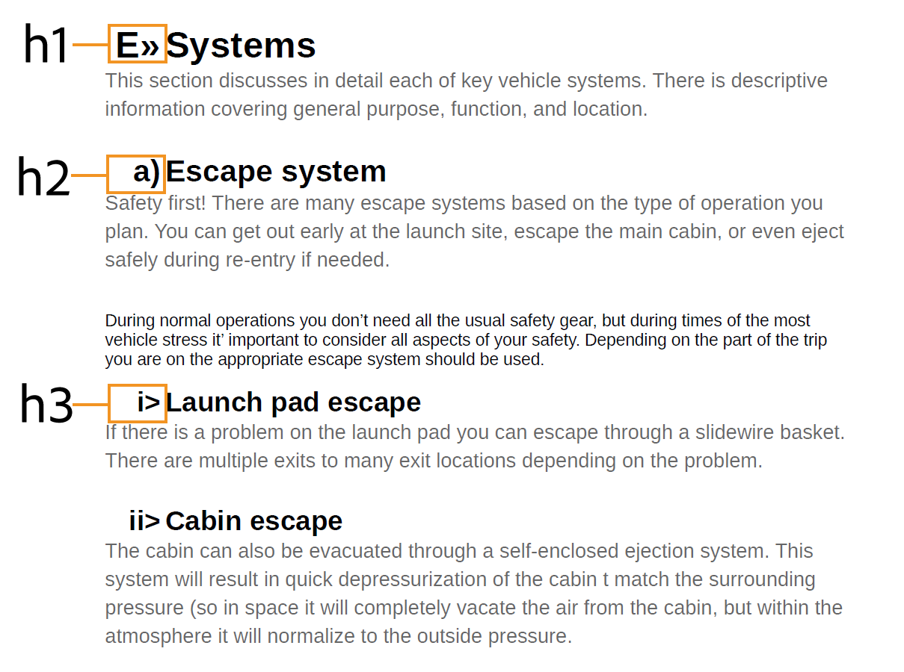

# Utilizzare gli stili di contenuto comuni {#work-with-common-styles}

Un foglio di stile contiene le definizioni degli stili per gli elementi utilizzati nell&#39;output di PDF. È possibile scegliere di lavorare con i fogli di stile di esempio o crearne di nuovi. Nella maggior parte dei casi, la creazione di una copia del foglio di stile di esempio OOTB ti aiuterà a iniziare rapidamente.

L’editor degli stili è un editor WYSIWYG che nasconde tutte le complessità di un codice CSS dietro l’interfaccia utente. Utilizzando l’editor di stili, puoi personalizzare facilmente e molto rapidamente gli stili per gli elementi scelti. Gli stili sono suddivisi nelle seguenti teste:

* Stili di intestazione
* Stili paragrafo
* Stili di carattere
* Stili collegamento ipertestuale
* Stili immagine
* Stili elenco
* Stili tabella
* Stili Div
* Stili pagina
* Altri stili

Quando si lavora con contenuto DITA strutturato, la mappatura dello stile per la maggior parte degli elementi DITA è presente nel foglio di stile predefinito. Se si lavora con elementi DITA standard, è possibile modificarne l’aspetto modificando direttamente la definizione dello stile. Queste definizioni di stile sono disponibili nella categoria Altro stile . Per ulteriori dettagli, consulta [Operazioni con altri stili](#other-styles) più avanti in questo argomento.

Nelle sezioni seguenti sono illustrate le impostazioni di stile più comunemente utilizzate sotto forma di esempi.

>[!NOTE]
>
>Negli esempi seguenti, si presume che si stia utilizzando il foglio di stile campione fornito con il prodotto.

## Operazioni con gli stili di intestazione {#heading-styles}

Gli stili di intestazione racchiudono tutti gli stili di base per le intestazioni utilizzate nel contenuto. OOTB otterrai 6 stili di intestazione di base e uno stile di intestazione per l&#39;argomento/capitolo e l&#39;intestazione del titolo dell&#39;appendice. In un documento strutturato, l&#39;H1 rappresenta il titolo dell&#39;argomento o del capitolo e l&#39;H2-H6 viene utilizzato per i sottoargomenti o le sezioni all&#39;interno di un argomento/capitolo. Questa gerarchia di intestazioni viene applicata automaticamente al contenuto ogni volta che viene trovata l’intestazione corrispondente.

>[!NOTE]
>
>È possibile creare stili di intestazione personalizzati che possono essere utilizzati nel contenuto utilizzando la classe outputclass. Per ulteriori dettagli, vedi il passaggio 4 in [Utilizza l’orientamento della pagina e la rotazione della vista](design-page-layout.md#page-orientation-rotation) esempio.

### Creare intestazioni personalizzate a livello di capitolo {#create-chapter-level-heading}

In un libro (o una mappa) si lavora con i Capitoli. Gli stili di intestazione di base sono progettati in modo che vengano applicati alle intestazioni a livello di capitolo senza alcuna personalizzazione. Tuttavia, se desideri creare intestazioni specializzate per il contenuto, dovrai creare tali intestazioni. Ad esempio, il valore predefinito `h1.chapter` l&#39;intestazione viene applicata al titolo del capitolo. Se si desidera che il titolo del capitolo venga visualizzato in uno stile diverso, è necessario personalizzare la `h1.chapter` stile. Allo stesso modo, è possibile creare stili personalizzati per le sottotitoli nel capitolo. Ad esempio, se desideri creare uno stile personalizzato per tutti i 2nd e 3rd livella le intestazioni nel capitolo, quindi devi creare un nuovo stile come `h2.chatper` e `h3.chatper`.

Poiché la funzione Pubblicazione PDF nativa contiene le definizioni degli stili di base per gli stili più comuni, anche se si elimina accidentalmente uno stile, lo stile predefinito viene applicato al contenuto. Ad esempio, se nel foglio di stile non è presente una definizione di stile per lo stile h2, la funzione Pubblicazione nativa di PDF applicherà uno stile di base al contenuto h2.

In questo esempio verrà creato uno stile di intestazione di capitolo di secondo livello:

1. Aprire il foglio di stile richiesto per la modifica.
   >[!NOTE]
   >
   >Vedi [Personalizzare uno stile predefinito o nuovo](components-pdf-template.md#customize-style) sezione per l&#39;apertura di un foglio di stile per la personalizzazione o la modifica.

1. In **Stili** elenco, espandere **Stili di intestazione**.
1. Fai clic con il pulsante destro del mouse su **Stili di intestazione** stile e scegli **Nuovo stile**.
1. In *Aggiungi stile* finestra di dialogo, mantenere **Tag** nome come `h2` e immetti `chapter` in **Classe** campo nome.
1. Fai clic su **Fine**.

Nuovo stile di intestazione denominato `h2.chapter` viene creato e aggiunto nell’elenco Stili titolo.

Dopo aver creato uno stile, è possibile personalizzare le proprietà richieste dello stile utilizzando l’editor di stili.

### Crea titoli con numero automatico {#auto-number-heading}

Uno degli stili di output più comunemente utilizzati è quello con titolo autonumerato. Queste intestazioni rappresentano il numero del capitolo, i numeri dell&#39;argomento e dei sottoargomenti. Le intestazioni di numero automatico sono diverse dagli stili di elenco in cui a un elenco di elementi all’interno di un argomento vengono assegnati numeri automatici.

In questo esempio personalizzeremo le intestazioni dal livello 1 al livello 3 per utilizzare i numeri automatici in formati diversi.

1. Aprire il foglio di stile richiesto per la modifica.

   >[!NOTE]
   >
   >Vedi [Personalizzare uno stile predefinito o nuovo](components-pdf-template.md#customize-style) sezione per l&#39;apertura di un foglio di stile per la personalizzazione o la modifica.

1. In **Stili** elenco, espandere **Stili di intestazione**.

1. Seleziona la **h1** stile dall&#39;elenco.
Le proprietà dello stile h1 vengono visualizzate nel pannello Proprietà insieme alla relativa anteprima.

   >[!NOTE]
   >
   >Il pannello Anteprima offre una visualizzazione in tempo reale degli aggiornamenti di stile applicati a qualsiasi elemento.

1. Seleziona la **Numero d&#39;auto** proprietà.

   Gli stili che è possibile applicare all&#39;elenco dei numeri automatici sono visualizzati sotto la proprietà Numero automatico .

1. Imposta le seguenti proprietà:
   * **Stile**: Selezionare uno stile di numerazione specifico per le impostazioni internazionali o generico. È possibile scegliere stili come arabo-indi, Devanagari, georgiano, Decimal, Lower-Alpha e altro ancora. Per l’esempio corrente, seleziona `upper-alpha`.

   * **Formato**: Il formato predefinito è impostato su `<x>`, in cui `x` viene sostituito con lo stile di numerazione selezionato nella proprietà Stile. Ad esempio, se hai selezionato `decimal` (1) stile, quindi valore di `x` incrementi automatici per ogni istanza del `h1` stile e va da 2, 3 e così via. È inoltre possibile aggiungere testo personalizzato nel campo per formattare lo stile del titolo. Ad esempio, se desideri che tutte le intestazioni h1 abbiano un prefisso `Chapter`, quindi devi impostare questo campo come `Chapter <x>`.

   * **Inserisci carattere**: Se si desidera aggiungere un carattere speciale nel formato, fare clic sul pulsante Inserisci carattere () icon. Selezionare il carattere desiderato da aggiungere nel formato di stile e fare clic su Inserisci. È possibile scegliere diversi tipi di caratteri speciali dall’elenco a discesa Seleziona categoria . Per il nostro esempio, seleziona il contrassegno di puntamento doppio angolo con il pulsante destro nella categoria Punteggiatura .

      

   * **Inizia numerazione da**: Se si desidera che la numerazione inizi da un numero specifico, specificare tale valore. Nel nostro esempio, mantieni il valore predefinito pari a 1.

   * **Rientro**: Se si desidera applicare un rientro all’intestazione, è necessario impostare il valore Rientro. Per il nostro esempio, impostalo su 0 px.

      >[!NOTE]
      >
      >È possibile immettere il valore in unità px (pixel), pt (punti), rem, em, % (percentuale) o in (pollici).

   * **Larghezza prefisso**: Area occupata dal formato del numero automatico. Viene automaticamente impostato su una dimensione che può facilmente adattarsi al formato di stile selezionato. Se desideri aumentare la dimensione, puoi sostituire il valore predefinito.

      Quando imposti manualmente questo valore, prova a modificare le altre proprietà che avranno un impatto sulla larghezza. Ad esempio, modifica la dimensione del font, il formato con prefisso (Capitolo) o suffisso (:), imposta il valore massimo nel campo *Inizia numerazione da* e le varie proprietà dei font per ottenere le dimensioni ottimali.

      Nel nostro esempio, mantieni il valore predefinito.

   * **Spaziatura**: Specifica la spaziatura orizzontale e verticale. Nel nostro esempio, mantieni i valori predefiniti.

      Con le personalizzazioni di cui sopra, lo stile viene personalizzato come mostrato di seguito:

      

   * **Applica formattazione a**: Le proprietà della categoria Numero automatico consentono di definire lo stile di numerazione. Per applicare ulteriori personalizzazioni allo stile di numerazione o al contenuto del formato di intestazione, in questo campo è possibile scegliere Numerazione o Paragrafo. Se si sceglie Numerazione, tutte le modifiche apportate a Font, Bordo, Layout e altre categorie verranno applicate solo allo stile di numerazione nell&#39;intestazione. Tuttavia, se si sceglie Paragrafo, le modifiche verranno applicate al contenuto del titolo e non allo stile di numerazione.

   Utilizza le seguenti impostazioni per generare un output mostrato nella schermata seguente:

   |**Stile intestazione**|**Proprietà**|**Valore**|**Commenti aggiuntivi**| |:- |:- |:- |:- | |h1|Stile|Decimale|Queste proprietà si trovano nella categoria Numero automatico | ||Formato|`Capter <x>:`| ||Larghezza prefisso|160 px|| ||Font > Allineamento testo|Left|Assicurati che l&#39;opzione Applica formattazione a sia impostata su Numerazione| |h2|Style|Decimal|Queste proprietà si trovano nella categoria Numero automatico | ||Formato|`Section <x>:`| ||Larghezza prefisso|125 px|| ||Font > Allineamento testo|Left|Assicurati che l&#39;opzione Applica formattazione a sia impostata su Numerazione| |h3|Style|Decimal|Queste proprietà si trovano nella categoria Numero automatico | ||Inserisci livello|2|| ||Formato|`Section <2>.<x>:`| ||Larghezza prefisso|125 px|| ||Font > Allineamento testo|Left|Assicurati che l&#39;opzione Applica formattazione a sia impostata su Numerazione| |

   

## Operazioni con gli stili di paragrafo {#paragraph-style}

È possibile creare uno stile di paragrafo per applicare una formattazione speciale a un intero paragrafo. Tuttavia, utilizzando la pseudo-classe, è possibile applicare uno stile solo a una parte specifica del testo. Nell’esempio seguente verrà creato uno stile di paragrafo per utilizzare lo stile del capolettera.

### Creare lo stile del tappo a discesa {#drop-cap-style}

Nelle riviste viene utilizzato uno stile di cappuccio a goccia (o maiuscoletto) e nei documenti letterari in cui al primo carattere di un paragrafo o di una sezione viene assegnato uno stile speciale. È possibile ottenere lo stesso effetto utilizzando la funzione Pubblicazione nativa di PDF.

Nell’esempio seguente, verrà creato uno stile di cap per le gocce:

1. Aprire il foglio di stile richiesto per la modifica.

   >[!NOTE]
   Vedi [Personalizzare uno stile predefinito o nuovo](components-pdf-template.md#customize-style) sezione per l&#39;apertura di un foglio di stile per la personalizzazione o la modifica.

1. In **Stili** elenco, espandere **Stili paragrafo**.

1. Fai clic con il pulsante destro del mouse sul pulsante **Stile paragrafo** e scegli **Nuovo stile**.

1. In *Aggiungi stile* finestra di dialogo, mantenere **Tag** nome come p e nel **Pseudo** **Classe** campo , seleziona `::first-letter`.

1. Fai clic su **Fine**.

   Nuovo stile di paragrafo denominato `::first-letter`  viene creato e aggiunto in **Stili paragrafo** elenco.

1. Seleziona `::first-letter` nello stile p e impostare le seguenti proprietà:

   * **Font**: Imposta il font desiderato per la prima lettera del paragrafo. Per il nostro esempio, impostare la Famiglia di font su corsivo, spessore del font su 500, dimensione del font su 30 pt e scegliere un colore del font.

   * **Layout**: Imposta l’allineamento verticale del testo intorno allo stile del cappuccio. Per il nostro esempio, imposteremo l&#39;allineamento verticale su Inferiore.

Come `p` è mappato con `
` in DITA, non è necessario aggiungere esplicitamente questo stile utilizzando l’attributo outputclass. In qualsiasi punto del contenuto `
` viene utilizzato, lo stile del tappo a discesa viene applicato automaticamente su di esso. Nella schermata seguente, il titolo del capitolo, la descrizione breve e gli elementi dell’elenco di definizioni non sono stati formattati con lo stile del tappo a discesa. Solo lo stile del paragrafo viene formattato con lo stile del capolettera:

## Utilizzo degli stili di carattere {#char-style}

Utilizzando gli stili di carattere, è possibile creare stili per la formattazione di caratteri o parole all’interno del contenuto. Ad esempio, è possibile creare uno stile di carattere per il codice in linea o il nome del file oppure uno stile che utilizza più formati di stile per il contenuto selezionato.

### Creare uno stile di carattere in linea {#inline-char-style}

La formattazione di caratteri o parole in linea in un paragrafo è uno stile molto comune. Il processo di creazione di uno stile in linea prevede due attività: prima, creare un nuovo stile nel foglio di stile e poi applicare lo stile nel contenuto utilizzando il `outputclass` attributo.

Nell’esempio seguente verrà creato uno stile di carattere in linea:

1. Aprire il foglio di stile richiesto per la modifica.

   >[!NOTE]
   Vedi [Personalizzare uno stile predefinito o nuovo](components-pdf-template.md#customize-style) sezione per l&#39;apertura di un foglio di stile per la personalizzazione o la modifica.

1. In **Stili** elenco, espandere **Stili carattere**.

1. Fai clic con il pulsante destro del mouse sul pulsante **Stile carattere** e scegli **Nuovo stile**.

1. Nella finestra di dialogo Aggiungi stile , mantieni la **Tag** nome come span e immetti `BoldItalic` in **Classe** campo nome.

   

1. Fai clic su **Fine**.

   Viene creato e aggiunto un nuovo stile di carattere denominato codice nell’elenco Stili di carattere .

1. Seleziona `span.BoldItalic` dal **Stile carattere** e impostare le seguenti proprietà:

   * **Font**: Tutte le proprietà relative ai font possono essere personalizzate da questa sezione. Per impostazione predefinita, sono presenti alcuni font abbinati al prodotto. È possibile scegliere il font desiderato per lo stile di carattere. Per il nostro esempio, imposta la Famiglia di font su *Serif* e seleziona *Grassetto* e *Corsivo* nella proprietà Stile font. È inoltre possibile personalizzare altre proprietà dei font, come Spessore font (come grassetto, più chiaro), Decorazione testo (come sottolineato, in linea), Dimensione font, Colore font, Allineamento testo e altro ancora.

      >[!NOTE]
      Puoi anche aggiungere font al modello, memorizzati nella sezione Risorse del modello. Per ulteriori dettagli sull&#39;aggiunta di font e sull&#39;utilizzo delle risorse, consulta [Utilizzare le risorse](components-pdf-template.md#work-with-resources).

   * **Layout**: È possibile impostare le proprietà relative al layout quali Altezza e Larghezza, Margine, Spaziatura, Allineamento e altro ancora.

   * **Sfondo**: Le proprietà Sfondo consentono di formattare il colore di sfondo di un particolare stile. È possibile definire il colore o l&#39;immagine di sfondo per qualsiasi stile.

Dopo aver creato lo stile di carattere in linea, è necessario applicarlo al contenuto. Per applicare lo stile del codice in linea, vai alla vista sorgente e aggiungi il `outputclass` nel contenuto desiderato:

`outputclass="BoldItalic"`

Nell&#39;esempio seguente viene illustrato il formato Grassetto corsivo applicato in posizioni diverse del testo in esecuzione:

## Personalizza stile elenco {#custom-list-style}

Gli stili elenco contengono le impostazioni di stile predefinite per gli elenchi ordinati e non ordinati. Puoi personalizzare facilmente questi stili dell’elenco in base ai tuoi requisiti di documentazione.

Nell’esempio seguente personalizzeremo lo stile dell’elenco numerato o ordinato:

1. Aprire il foglio di stile richiesto per la modifica.

   >[!NOTE]
   Vedi [Personalizzare uno stile predefinito o nuovo](components-pdf-template.md#customize-style) sezione per l&#39;apertura di un foglio di stile per la personalizzazione o la modifica.

1. In **Stili** elenco, espandere **Stili elenco**.

1. Seleziona la **ol** stile dall&#39;elenco.

   Le proprietà dello stile ol vengono visualizzate nel pannello Proprietà insieme alla relativa anteprima.

   

1. Seleziona la **Formattazione avanzata** opzione .

   Viene visualizzato un messaggio di conferma.

1. Fai clic su **Sì** sulla *Conferma* messaggio per aprire **Formattazione avanzata** proprietà.

   Per impostazione predefinita sono disponibili le seguenti proprietà:

   * **Livello**: Per impostazione predefinita, sono disponibili 6 livelli di elenchi numerati. Il livello selezionato in questo elenco a discesa controlla le modifiche di stile al livello selezionato e a tutti i livelli successivi. Ad esempio, se si seleziona il livello 4, tutte le modifiche di stile applicate vengono impostate sui livelli 4, 5 e 6.

   * **Tipo di stile elenco**: È possibile scegliere tra diversi stili di numerazione degli elenchi. L&#39;elenco contiene stili di numerazione specifici per le impostazioni internazionali e generici utilizzati per creare un elenco numerato. Alcuni tipi di stile elenco sono arabo, cambogiano, devanagari, etiopico, Hangul, ebraico, giapponese, coreano, cinese semplice, urdu e altro ancora.

   Inoltre, è possibile utilizzare le seguenti proprietà di Formattazione avanzata:

   * **Formato numero**: Il formato predefinito è impostato su `<x>`, in cui `x` viene sostituito con lo stile di numerazione selezionato nella proprietà Tipo di stile elenco . Ad esempio, se hai selezionato `decimal` (1) stile, quindi valore di `x` incrementi automatici per ogni istanza dell&#39;elemento elenco e vanno da 2, 3 e così via. È inoltre possibile aggiungere testo personalizzato nel campo per formattare lo stile dell’elenco. Ad esempio, se desideri che tutti gli stili di elenco di primo livello abbiano un suffisso &quot;`)`&quot;, quindi è necessario impostare questo campo per lo stile elenco di primo livello come &quot;`<x>)`&quot;.

   * **Inserisci carattere**: Se si desidera aggiungere un carattere speciale nel formato numerico, fare clic sul pulsante Inserisci carattere (). Selezionare il carattere desiderato da aggiungere nel formato di stile e fare clic su Inserisci. È possibile scegliere diversi tipi di caratteri speciali dall’elenco a discesa Seleziona categoria .

   * **Inserisci livello**: È possibile includere nel formato numerico il numero di uno qualsiasi dei livelli precedenti. Ad esempio, se si desidera includere il formato del numero a partire dal 5° livello nel formato del numero a 6° livello, scegliere 5 nell&#39;elenco a discesa Inserisci livello. Il menu a discesa Inserisci livello mostra i numeri dei soli livelli precedenti e non del livello seguente. Ad esempio, se ci si trova al livello 3, nell&#39;elenco Inserisci livello vengono visualizzati solo i livelli 1 e 2.

      

      È inoltre possibile modificare il formato numerico per presentare i valori dell&#39;elenco come richiesto. Ad esempio, quando si utilizza uno stile di numerazione nidificato per il livello 3, è possibile formattarlo come &quot;`<2>.<x>))`&quot;. Verrà visualizzato il numero 2, seguito da un punto, seguito dal numero 3 dell&#39;elenco e quindi da due parentesi, come `2.3))`.

   * **Rientro**: Se si desidera applicare un rientro all’elenco, è necessario impostare il valore Rientro. Qualsiasi modifica nel rientro può essere rivista nel pannello Anteprima e regolata.

      >[!NOTE]
      È possibile immettere il valore in unità px (pixel), pt (punti), rem, em, % (percentuale) o in (pollici).

   * **Larghezza prefisso**: Area occupata dal formato numerico. Viene automaticamente impostato su una dimensione che può adattarsi facilmente al formato selezionato. Se desideri aumentare la dimensione, puoi sostituire il valore predefinito.

      Quando imposti manualmente questo valore, prova a modificare le altre proprietà che avranno un impatto sulla larghezza. Ad esempio, modificare la dimensione del font, il formato con prefisso o suffisso e le varie proprietà del font in modo che abbiano la dimensione ottimale.

   * **Spaziatura**: Specifica la spaziatura orizzontale tra il formato del numero dell’elenco e il contenuto. La spaziatura verticale controlla lo spazio tra le due voci dell’elenco.

      La schermata seguente mostra l&#39;elenco ordinato personalizzato per ogni livello:

      

## Operazioni con lo stile di tabella {#table-styles}

Utilizzando i fogli di stile, puoi progettare *n* numero di stili di tabella. Utilizzando gli stili di tabella, è possibile progettare l’intera tabella, una particolare riga o colonna. Grazie al controllo dello stile a livello di cella, è possibile creare stili di tabella molto presentabili.

Nell’esempio seguente viene illustrato come creare uno stile di tabella e le varie opzioni di stile che è possibile personalizzare:

1. Aprire il foglio di stile richiesto per la modifica.

   >[!NOTE]
   Vedi [Personalizzare uno stile predefinito o nuovo](components-pdf-template.md#customize-style) sezione per l&#39;apertura di un foglio di stile per la personalizzazione o la modifica.

1. In **Stili** elenco, fai clic con il pulsante destro del mouse **Stile tabella** e scegli **Nuovo stile**.

1. In *Aggiungi stile* finestra di dialogo, mantenere **Tag** nome come `table` e immetti `double-border` in **Classe** campo nome.

1. Fai clic su **Fine**.

   Nuovo stile di tabella denominato `table.double-border` viene creato e aggiunto nell’elenco Stili tabella.

1. Seleziona `table.double-border` dal **Stili tabella** e impostare le seguenti proprietà:

   * **Applica formattazione a**: È possibile scegliere di applicare la formattazione dello stile all’intera tabella, righe o colonne dispari/pari o prima/ultima riga o colonna.

      >[!NOTE]
      Le seguenti impostazioni sono disponibili in **Generale** sezione quando **Applica formattazione a** è impostato su **Tabella intera**.

   * **Ritorno a capo nel testo**: Selezionare la modalità di ritorno a capo automatico del testo intorno alla tabella. Questa opzione è utile quando la tabella si trova all’interno di un altro elemento a livello di blocco e deve essere eseguito il rendering della tabella insieme ad altro contenuto nell’elemento blocco. Le opzioni di wrapping sono *sinistra* o *right* allineati, oppure *nessuno*.

   * **Compressione bordo**: Selezionare l’aspetto del bordo della tabella. Se si seleziona comprimi, tra le celle della tabella viene disegnata una sola riga di bordo. Tuttavia, per uno stile separato, il bordo è visibile intorno a ogni cella con spaziatura aggiuntiva.

      

   * **Spaziatura bordi**: Questa impostazione è disponibile solo quando l’opzione Comprimi bordo è impostata su Separa. Questa impostazione consente di specificare la spaziatura verticale e orizzontale tra i bordi delle celle.

      

      >[!NOTE]
      Le seguenti impostazioni sono disponibili in **Cella** sezione quando **Applica formattazione a** è impostato su **Tabella intera**.

   * **Spaziatura**: Specificare la spaziatura tra le celle della tabella. È possibile specificare valori di spaziatura diversi per i lati superiore, inferiore, sinistro e destro.

   * **Allineamento verticale**: Specifica l’allineamento verticale per il contenuto della cella. Le opzioni disponibili sono: In alto, In mezzo e In basso.

   * **Lato bordo, Stile, Colore, Larghezza, Raggio:** Specificare le proprietà relative al bordo. È possibile scegliere di disporre di bordi solo su lati specifici come Sinistra o Destra. Lo stile del bordo elenca gli stili disponibili per il bordo, ad esempio Solido, Tratteggiato, Linea doppia e molto altro. Specificare il colore del bordo utilizzando la palette di colori. È possibile specificare la larghezza del bordo in unità px, pt, rem, em, % e. Il raggio definisce la curva per creare angoli circolari.

   Le altre proprietà in Font, Border, Layout, Paginazione e Background sono illustrate in altri esempi in questo argomento. A seconda della selezione nella **Applica formattazione a** è possibile applicare questi valori all&#39;intera tabella o alle righe o colonne selezionate.

   Di seguito è illustrata un’anteprima di una tabella di esempio con righe diverse formattate in modo diverso:

   

## Operazioni con altri stili {#other-styles}

Se si lavora con contenuto strutturato (DITA), si noterà che quasi tutti gli elementi DITA hanno una mappatura dello stile nel foglio di stile predefinito. Ad esempio, un `<shortdesc>` lo stile dell’elemento è definito in **Altro stile** > **.shortdesc** definizione dello stile. È possibile personalizzare facilmente uno qualsiasi di questi stili e vengono applicati automaticamente nell’output di PDF generato dal contenuto strutturato. Ciò significa che, a differenza di altri stili personalizzati, non è necessario aggiungere un `outputclass` sul contenuto di questi stili.

Se si desidera creare una definizione di stile per qualsiasi elemento non disponibile per impostazione predefinita o se si dispone di un elemento personalizzato, è possibile crearlo facilmente nel foglio di stile. L’unico punto da considerare è quello di creare lo stile con lo stesso nome del nome dell’elemento strutturato.

Nell’esempio seguente, verrà creato il titolo di una nuova finestra (`wintitle`a):

1. Aprire il foglio di stile richiesto per la modifica.

   >[!NOTE]
   Vedi [Personalizzare uno stile predefinito o nuovo](components-pdf-template.md#customize-style) sezione per l&#39;apertura di un foglio di stile per la personalizzazione o la modifica.

1. In **Stili** elenco, espandi **Altri stili**.

1. Fai clic con il pulsante destro del mouse sul pulsante **Altro stile** e scegli **Nuovo stile**.

1. In *Aggiungi stile* finestra di dialogo, mantenere **Tag** nome come *vuoto* e immetti `wintitle` in **Classe** campo nome.

   Come `wintitle` è un nome di elemento DITA riconosciuto, la relativa definizione di stile viene mappata automaticamente `<wintitle>` nella sorgente.

1. Fai clic su **Fine**.

   Nuovo stile denominato `.wintitle` viene creato e aggiunto in **Altri stili** elenco.

1. Seleziona .winle dal menu **Altri stili** e imposta le proprietà come richiesto.

Nella schermata seguente viene visualizzato lo stile wtitolo applicato al testo &quot;Controllo primario&quot;.

