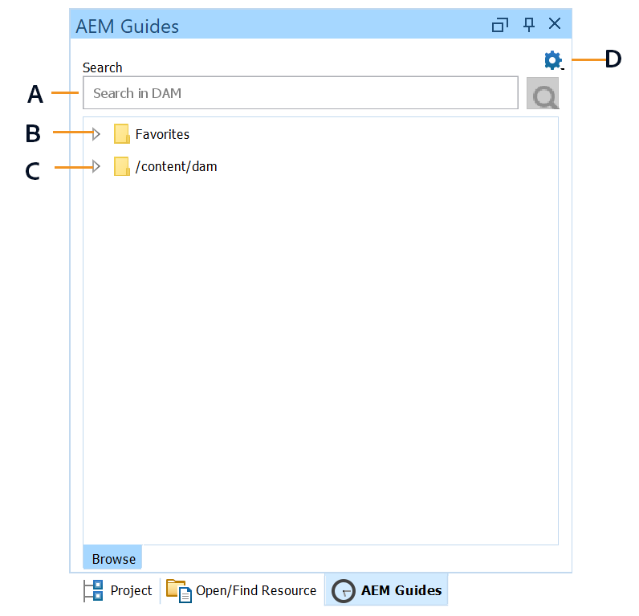
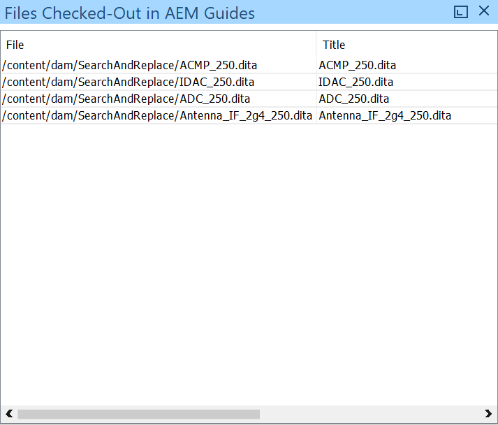
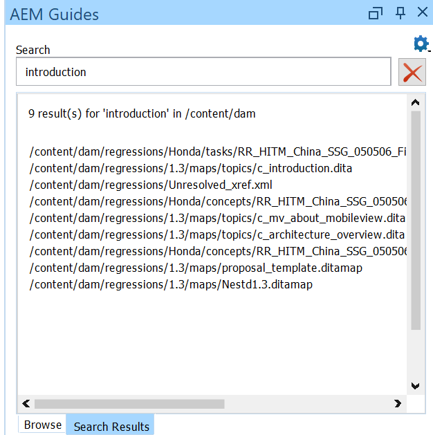
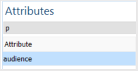

# Plug-in ossigeno per Adobe Experience Manager Guides {#id1645H6010Q5}

Il plug-in ossigeno per Adobe Experience Manager Guides \(in seguito denominato plug-in ossigeno per AEM Guides nella guida\) consente di collegare Oxygen XML Author all’archivio Adobe Experience Manager \(AEM\) per la creazione e la gestione dei contenuti. È possibile utilizzare il plug-in per sfogliare, cercare e aprire file, estrarre e archiviare file, caricare cartelle e file nel repository AEM. Il pannello Guide AEM nell’applicazione desktop consente di contrassegnare le cartelle desiderate \(dall’archivio AEM\) nell’elenco delle cartelle preferite per un accesso rapido. Inoltre, puoi installare un pacchetto nell’interfaccia web AEM e aprire i file DITA in Oxygen XML Author direttamente dall’interfaccia web AEM.

## Scarica e installa {#id1826M0L0PUI}

Il plug-in di ossigeno per le guide AEM è disponibile tramite il portale di distribuzione software Adobe. Cerca &quot;ossigeno&quot; nella scheda Experience Manager e scarica il programma di installazione del plug-in dal tuo [Portale di distribuzione software Adobe](https://experience.adobe.com/#/downloads/content/software-distribution/en/general.html).

**Nota:** Verifica la compatibilità della versione del connettore di ossigeno dalle note sulla versione per le specifiche Adobe Experience Manager Guides.

Una volta installato il programma di installazione, installarlo nel computer locale in cui è installato Oxygen XML Author. Prima di iniziare il processo di installazione, è necessario assicurarsi che il sistema soddisfi i requisiti tecnici per installare il plug-in di ossigeno per le guide AEM.

### Requisiti tecnici { .section}

- Autore Oxygen XML versione 24.1

- Adobe Experience Manager Guides versione 3.4 o successiva

- Adobe Experience Manager versione 6.5 con Service Pack 10, 11, 12 e 13

- Sistema operativo supportato da Oxygen XML Author versione 24.1

- Java Development Kit
   - Oracle SE 8 JRE 1.8

### Installa il plug-in in Windows { .section}

**Importante:**

Se nel sistema è installata una versione precedente del plug-in, accertarsi di disinstallarla prima di avviare il processo di installazione. Consulta la **Disinstallazione dei pacchetti** sezione nella sezione [Come utilizzare i pacchetti](https://helpx.adobe.com/it/experience-manager/6-4/sites/administering/using/package-manager.html) articolo per le istruzioni di disinstallazione.

Effettuare le seguenti operazioni sul sistema in cui è installato Oxygen XML Author:

1. Avvia il programma di installazione `.exe` file.

   Viene visualizzata la schermata di benvenuto della procedura guidata di installazione.

2. Clic **Successivo** e individuare il percorso in cui è disponibile il file .exe di Oxygen XML Author.

3. Seleziona il file e fai clic su **Apri**.

   Il percorso del file selezionato viene aggiunto nella procedura guidata di installazione.

4. Fai clic su **Avanti**.

5. Clic **Installa**.

6. Clic **Fine** per chiudere l&#39;installazione guidata.
7. Avvia Oxygen XML Author.

   Il pannello Guide AEM viene visualizzato in Oxygen XML Author.

   

   **Nota:**

   Se il pannello Guide dell’AEM non è visibile, consulta le soluzioni alternative nella sezione risoluzione dei problemi:[Pannello Guide AEM mancante](#id192BH200ZAX).


### Installa il plug-in in Mac { .section}

**Importante:**

Se nel sistema è installata una versione precedente del plug-in, accertarsi di disinstallarla prima di avviare il processo di installazione. Consulta la **Disinstallazione dei pacchetti** sezione nella sezione [Come utilizzare i pacchetti](https://helpx.adobe.com/it/experience-manager/6-4/sites/administering/using/package-manager.html) istruzioni per la disinstallazione dell’articolo.

Effettuare le seguenti operazioni sul sistema in cui è installato Oxygen XML Author:

1. Individua il file .dmg del plug-in sul tuo sistema.

2. Fare doppio clic sul file .dmg per aprire il contenuto del file.

   Il file .dmg contiene una cartella aem-connector-x.x e un file di installazione aem-connector-x.x.

   **Nota:**

   x.x nei nomi file è il numero di versione del plug-in.

3. Copia la cartella aem-connector-x.x nella cartella dei plug-in di Oxygen XML Author.
4. Fai doppio clic sul file di configurazione aem-connector-x.x per avviare il programma di installazione.

5. Avvia Oxygen XML Author.

   Il pannello Guide AEM viene visualizzato in Oxygen XML Author.

   

   **Nota:**

   Se il pannello Guide dell’AEM non è visibile, consulta le soluzioni alternative nella sezione risoluzione dei problemi:[Pannello Guide AEM mancante](#id192BH200ZAX).


### Installa il pacchetto per abilitare la funzione di modifica dei documenti dall’interfaccia web AEM {#id182CE0Q0TY4 .section}

In qualità di autore, è possibile aprire e modificare le mappe DITA o gli argomenti in Oxygen XML Author direttamente dall&#39;interfaccia Web AEM. Per abilitare questa funzione nell’interfaccia web dell’AEM, l’amministratore AEM deve installare un pacchetto nell’istanza di authoring dell’AEM.

In qualità di amministratore AEM, effettua le seguenti operazioni per installare il pacchetto:

1. Ottieni il file .zip del pacchetto dal tuo team IT.
2. Accedi all’istanza AEM *\(come amministratore\)* e passa a Gestione pacchetti CRX. L’URL predefinito per accedere al gestore di pacchetti è

   ```
   http://<server name>:<port>/crx/packmgr/index.jsp
   ```

   Gestione pacchetti gestisce i pacchetti nell’installazione AEM locale. Per ulteriori informazioni sull’utilizzo di Gestione pacchetti, consulta [Come utilizzare i pacchetti](https://docs.adobe.com/docs/en/aem/6-3/administer/content/package-manager.html) nella documentazione AEM.

   

3. Per caricare il pacchetto ossigeno, fai clic su **Carica pacchetto**.
4. Nella finestra di dialogo Carica pacchetto, individua il file del pacchetto di ossigeno scaricato al punto 1 e fai clic su OK.

   Il pacchetto viene caricato nell’istanza AEM.

5. Per avviare il processo di installazione, fare clic su **Installa**.

   

6. Nella finestra di dialogo Installa pacchetto, fai clic su **Installa**.
7. Al termine dell’installazione, fai clic sul pulsante Home nell’angolo superiore sinistro di Gestione pacchetti CRX.
8. Seleziona un file DITA nella cartella delle risorse.

   **Modifica in ossigeno** è disponibile nella barra degli strumenti. Per ulteriori informazioni sull&#39;utilizzo di questa opzione, vedere [Apri argomento DITA in Oxygen XML Author dall’interfaccia web AEM](#id182CE0I905Z).

   **Nota:**

   Il **Modifica in ossigeno** è visibile quando si seleziona un argomento DITA. Se si selezionano più argomenti, l&#39;opzione non sarà visibile.


## Configurare il plug-in dell’ossigeno per le guide AEM {#id1826KF00AHS}

Dopo aver scaricato e installato il plug-in, devi configurare i seguenti elementi affinché funzionino con il plug-in:

- **Impostazioni di autenticazione Web**: impostazioni per l’autenticazione SSO nel plug-in per le guide AEM.
- **Impostazioni generali**: impostazioni di connessione per il plug-in, ad esempio l’URL del server AEM, i dettagli di accesso e così via.
- **Preferenza per la personalizzazione degli attributi di profilatura**: questa configurazione è necessaria per gli schemi di attributi di profilatura per i set di documentazione.

### Impostazioni di autenticazione Web { .section}

JxBrowser viene utilizzato per l’autenticazione SSO dal plug-in del connettore ossigeno. È un browser basato sul cromo. Per Java 9+ è necessario accedere alle API non pubbliche e devi concedere esplicitamente questo accesso a JxBrowser. Per ulteriori dettagli, consulta [Risoluzione dei problemi di JxBrowser](https://jxbrowser-support.teamdev.com/docs/guides/troubleshooting/issues.html).

Aggiorna i file forniti per configurare le impostazioni di autenticazione web nel plug-in di ossigeno per le guide AEM:

**Nota:** Crea una copia di backup del file prima di aggiornarlo.

**Per Mac e ossigeno 24.1**

Aggiungi le seguenti righe in env.sh

```
--illegal-access=permit\--add-opens=java.desktop/javax.swing.plaf.basic=ALL-UNNAMED\--add-exports=javafx.controls/com.sun.javafx.scene.control=ALL-UNNAMED\--add-exports=javafx.graphics/com.sun.javafx.stage=ALL-UNNAMED\--add-exports=javafx.graphics/com.sun.javafx.scene=ALL-UNNAMED\--add-exports=javafx.graphics/com.sun.javafx.scene.traversal=ALL-UNNAMED\--add-exports=javafx.graphics/com.sun.javafx.tk=ALL-UNNAMED\--add-exports=javafx.graphics/com.sun.glass.ui=ALL-UNNAMED\--add-opens=javafx.graphics/com.sun.glass.ui=ALL-UNNAMED\--add-opens=javafx.graphics/javafx.stage=ALL-UNNAMED\--add-opens=javafx.graphics/com.sun.javafx.tk.quantum=ALL-UNNAMED\--add-exports=java.desktop/sun.awt=ALL-UNNAMED\--add-opens javafx.swing/javafx.embed.swing=ALL-UNNAMED
```

Aggiungi le seguenti righe in ossigenoAuthor.sh

```
-Djdk.module.illegalAccess=permit\-Djava.ipc.external=true\
```

**Per Windows e ossigeno 24.1**

Aggiungi le seguenti righe in env.bat

```
--illegal-access=permit --add-opens=java.desktop/javax.swing.plaf.basic=ALL-UNNAMED --add-exports=javafx.controls/com.sun.javafx.scene.control=ALL-UNNAMED --add-exports=javafx.graphics/com.sun.javafx.stage=ALL-UNNAMED --add-exports=javafx.graphics/com.sun.javafx.scene=ALL-UNNAMED --add-exports=javafx.graphics/com.sun.javafx.scene.traversal=ALL-UNNAMED --add-exports=javafx.graphics/com.sun.javafx.tk=ALL-UNNAMED --add-exports=javafx.graphics/com.sun.glass.ui=ALL-UNNAMED --add-opens=javafx.graphics/com.sun.glass.ui=ALL-UNNAMED --add-opens=javafx.graphics/javafx.stage=ALL-UNNAMED --add-opens=javafx.graphics/com.sun.javafx.tk.quantum=ALL-UNNAMED --add-exports=java.desktop/sun.awt=ALL-UNNAMED --add-opens javafx.swing/javafx.embed.swing=ALL-UNNAMED
```

Aggiungi le seguenti righe in ossigenoAuthor.bat

```
-Djdk.module.illegalAccess=permit -Djava.ipc.external=true
```

**Nota:**

È necessario eseguire ossigeno da ossigenoAuthor.sh per Mac e ossigenoAuthor.bat per Windows come amministratore.

### Impostazioni generali { .section}

Per configurare le impostazioni di connessione nel plug-in ossigeno per le guide di Adobe Experience Manager, effettua le seguenti operazioni:

1. Nel pannello Guide AEM, fai clic sull’icona delle impostazioni, quindi seleziona **Impostazioni**.

   

2. Specifica i dettagli seguenti:
   - **URL server**: URL del server AEM, ad esempio:

      ```
      http[s]://<host>:<port>
      ```

      Nell’URL precedente, specifica il nome host e la porta del server in cui viene distribuito il server AEM.

      **Importante:**

      Se il server AEM è distribuito sulla porta 80 o 443, non è necessario specificarlo nell’URL.

   - **Autenticazione** Scegli tra **Base \(Nome Utente/Password\)** o **Autenticazione Web**. Nel caso in cui selezioni **Base** autenticazione è necessario immettere il **Nome utente** e **Password** nella finestra Preferenze.

      Se selezioni Autenticazione web, viene visualizzata la schermata di accesso AEM. Immetti le credenziali di accesso e fai clic su **Accedi** pulsante. Una volta effettuato correttamente l&#39;accesso, la schermata di accesso AEM si chiude e il pannello Guide AEM visualizza l&#39;elenco dei file dal server AEM.

   - **Timeout connessione**: specifica il tempo in secondi che il client deve attendere una risposta dal server AEM. Se non viene ricevuta alcuna risposta dal server entro il tempo specificato, la richiesta viene terminata. Il valore predefinito è 20 secondi.

   - **Cartella locale**: posizione sul computer locale in cui vengono archiviati i file dall’archivio AEM dopo l’estrazione. Se si specifica un percorso che non esiste nell&#39;unità, il plug-in crea tale percorso.
   - **Apri file all&#39;estrazione**: se selezionata, apre i file al momento dell’estrazione.
   - **Chiudi file al momento dell&#39;archiviazione**: se selezionata, chiude i file al momento dell&#39;archiviazione. Prima di chiudere il file, viene visualizzato un pop-up in cui è possibile specificare i commenti sulla versione.
   - **Mostra finestra di dialogo Archiviazione alla chiusura del file**: se selezionata, viene visualizzata una finestra a comparsa alla chiusura di un file. Nella finestra a comparsa è possibile scegliere di archiviare il file o di chiuderlo senza archiviarlo.
   - **Estrazione automatica file all&#39;apertura**: se selezionata, facendo doppio clic su un file viene automaticamente estratta e aperta per la modifica. Se il file è già stato estratto, viene semplicemente aperto per la modifica. Se questa opzione non è selezionata, l’apertura di un file sul quale non disponi di un blocco la apre in modalità di sola lettura.
3. Fai clic su **OK**.

### Preferenza per la personalizzazione degli attributi di profilatura {#id1827K0D0OHT .section}

È necessario configurare le preferenze in Oxygen XML Author per utilizzare l&#39;attributo di profilatura associato agli argomenti DITA nell&#39;archivio AEM.

Per configurare gli attributi di profilatura, effettua le seguenti operazioni:

1. In Oxygen XML Author, fare clic su **Opzioni** \> **Preferenze**.
2. In **Associazione tipo di documento** , seleziona **DITA** e quindi fare clic su **Estendi**.

   

3. In **Classpath** , selezionare com.adobe.o2.connector nella scheda **Usa il caricatore di classe padre dal plug-in con ID** a discesa.

   

4. In **Estensioni** , apportare le seguenti modifiche:
5. 
   - Clic **Scegli** accanto al **Listener dello stato dell’estensione dell’autore** in **Singole estensioni** e selezionare CustomAuthorExtensionStateListener - com.adobe.o2.framework.extn nel **Classe** elenco. Fai clic su **OK**.
- Clic **Scegli** accanto al **Editor valore attributo personalizzato autore** in **Singole estensioni** e selezionare CustomValueEditor - com.adobe.o2.framework.extn nel **Classe** elenco. Fai clic su **OK**.
La schermata seguente mostra i **Estensione** scheda per argomenti DITA:

   

6. Clic **OK** in tutte le finestre di dialogo per salvare le modifiche.

### Configurare l&#39;estensione della mappa DITA { .section}

La configurazione dell&#39;estensione mappa DITA è necessaria per consentire l&#39;apertura di file mappa in Oxygen XML Author direttamente dall&#39;interfaccia Web AEM. Queste configurazioni sono simili a quelle per gli attributi di profilatura eseguite nella procedura precedente.

Per configurare l&#39;estensione mappa DITA, effettuare le seguenti operazioni:

1. In Oxygen XML Author, fare clic su **Opzioni** \> **Preferenze**.
2. In **Associazione tipo di documento** , seleziona **Mappa DITA** e quindi fare clic su **Estendi**.
3. In **Classpath** , selezionare com.adobe.o2.connector nella scheda **Usa il caricatore di classe padre dal plug-in con ID** a discesa.
4. In **Estensioni** , apportare le seguenti modifiche:
5. 
   - Clic **Scegli** accanto al **Listener dello stato dell’estensione dell’autore** in **Singole estensioni** e selezionare CustomDITAMapAuthorExtensionStateListener - com.adobe.o2.framework.extn nel **Classe** elenco. Fai clic su **OK**.
- Clic **Scegli** accanto al **Editor valore attributo personalizzato autore** in **Singole estensioni** e selezionare CustomValueEditor - com.adobe.o2.framework.extn nel **Classe** elenco. Fai clic su **OK**.
- *\(Facoltativo\)* Se non si desidera risolvere i riferimenti durante l&#39;apertura di un file di mappa, è necessario eseguire la seguente configurazione aggiuntiva:

   Clic **Scegli** accanto al **Risoluzione riferimenti** in **Singole estensioni** e selezionare CustomDITAMapReferenceResolver - com.adobe.o2.framework.extn nel **Classe** elenco. Fai clic su **OK**.

   La schermata seguente mostra i **Estensione** scheda:

   

6. Clic **OK** in tutte le finestre di dialogo per salvare le modifiche.

## Utilizzare il plug-in di ossigeno per le guide AEM {#id1826JG00WY4}

### Pannello Guide AEM { .section}

La schermata seguente mostra il pannello AEM Guides.



**A**\) Visualizza la barra di ricerca.

**B**\) Visualizza la cartella Preferiti. Per impostazione predefinita, è vuoto. Puoi aggiungere cartelle dall’archivio AEM come preferite; le cartelle preferite vengono quindi visualizzate qui.

**C**\) La cartella DAM mostra l’archivio AEM. È possibile espandere e comprimere la visualizzazione delle cartelle.

**D**\) Icona Impostazioni \(ingranaggio\) con le seguenti opzioni:

- **Connetti**: seleziona questa opzione per connettersi al server AEM. L’opzione è disabilitata quando Oxygen XML Author è connesso al server AEM.
- **Aggiorna**: seleziona questa opzione per ottenere lo stato più recente dei file e della cartella dall’archivio AEM.

   **Nota:** Assicurarsi di salvare i file prima di aggiornarli. Quando selezioni **Aggiorna** , viene visualizzato un avviso per il salvataggio dei file prima di aggiornarli. Se non hai salvato i file, puoi fare clic su **Annulla** e salvarli.

- **Impostazioni**: puoi utilizzare questa opzione per aprire la finestra di dialogo Preferenze generali del plug-in.
- **Disconnetti**: seleziona questa opzione per chiudere la connessione al server AEM. Questa opzione è disponibile solo se si utilizza la modalità Autenticazione Web.

### Funzioni del menu di scelta rapida { .section}

Le funzioni del plug-in di ossigeno per le guide AEM sono disponibili facendo clic con il pulsante destro del mouse su una cartella o un file nell’archivio AEM. Le funzioni disponibili per le cartelle sono diverse dai file. Elenco completo delle funzioni del menu di scelta rapida Oxygen Plugin for AEM Guides:

- **Apri**: apre il file selezionato o espande la cartella selezionata.
- **Apri in**: puoi scegliere di aprire il file selezionato nell’editor web o nel dashboard di mappe di AEM Guides o nell’editor di mappe. Per ulteriori informazioni su queste opzioni, vedi [Apri il file nell’editor di guide AEM](#id195GH0V30KX).
- **Check-out**: estrae un file dall’archivio AEM. Per ulteriori dettagli, consulta [File di estrazione](#id195HC020TS4).
- **Check-out con dipendenti**: estrae un file con i relativi riferimenti diretti. Per ulteriori dettagli, consulta [File di estrazione](#id195HC020TS4).
- **Check-out con dipendenti di sola lettura**: estrae il file selezionato e i relativi elementi dipendenti. Non è possibile apportare alcuna modifica nei file dipendenti. Per ulteriori dettagli, consulta [File di estrazione](#id195HC020TS4).
- **Annulla estrazione**: annulla il file estratto, chiude il file dall&#39;editor e ripristina le modifiche all&#39;ultima versione del file salvato sul server.
- **Aggiorna**: nel caso di un file, recupera la copia più recente del file dall’archivio AEM. Per una cartella, recupera la struttura della cartella e lo stato del file. Questo significa che viene aggiunto un file, che verrà quindi visualizzato nella Visualizzazione guide AEM. Inoltre, se un file viene estratto sul server AEM, l&#39;esecuzione di un aggiornamento in Oxygen Author mostrerà il file come estratto. Tuttavia, questo non aggiorna l’elenco dei file nel *File estratti nelle guide AEM* Visualizza.
- **Aggiorna file estratti**: aggiorna l&#39;elenco dei file estratti nel *File estratti nelle guide AEM* Visualizza. Se un file viene estratto sul server AEM, l&#39;esecuzione di un aggiornamento aggiornerà l&#39;elenco dei file estratti nel *File estratti nelle guide AEM* Visualizza. Tuttavia, se è stato aggiunto un nuovo file o lo stato di un file è cambiato, tale file non viene aggiornato nella struttura delle guide AEM. Per aggiornare lo stato dei file su AEM, è necessario eseguire un&#39;operazione di aggiornamento.
- **Check-in**: consente di archiviare un file estratto. Per ulteriori dettagli, consulta [Archiviare un file](#id182CF0J0FHS).
- **Consegna con gli elementi dipendenti**: se sono stati estratti file con elementi dipendenti, questa opzione consente di controllare il file principale e i relativi elementi dipendenti. Per ulteriori dettagli, consulta [Archiviare un file](#id182CF0J0FHS).
- **Crea cartella**: crea una cartella nell’archivio AEM. Questa opzione è disponibile solo a livello di cartella.
- **Carica file\/s\**: carica uno o più file. Per ulteriori dettagli, consulta [Caricare file e cartelle](#id195HC03F03J).
- **Carica con dipendenti**: carica i file DITA \(XML, DITA, Book map o DITA map\) con i relativi dipendenti. Per ulteriori dettagli, consulta [Caricare file e cartelle](#id195HC03F03J).
- **Carica cartella**: carica una cartella nell’archivio AEM. Per ulteriori dettagli, consulta [Caricare file e cartelle](#id195HC03F03J).
- **Aggiungi ai preferiti**: aggiunge una cartella al *Preferiti* nel pannello Guide AEM. Si consiglia di aggiungere qui la cartella di lavoro per semplificare la sincronizzazione dei file e dello stato del file da AEM.
- **Rimuovi dai preferiti**: rimuove una cartella da *Preferiti*. Per ulteriori dettagli, consulta [Aggiungi o rimuovi preferiti](#id195HC04405P).
- **Visualizza metadati**: mostra i metadati quali la classe DITA, il titolo del documento, il tipo, l’UUID e altre informazioni associate a un file. Per ulteriori dettagli, consulta [Visualizzare i metadati di un file](#id195GHN0H05C).
- **Visualizza versioni**: mostra la cronologia delle versioni di un file. Per ulteriori dettagli, consulta [Visualizzare la cronologia delle versioni di un file](#id195GI000D5Q).

### Aprire un file in Oxygen XML Author {#id195GHJ0A0UB .section}

Una volta connessi all’archivio AEM, puoi aprire i file per la modifica nell’Autore XML di ossigeno. Per aprire un file per la modifica in Oxygen XML Author, effettuare le seguenti operazioni:

1. Fate clic con il pulsante destro del mouse su un file nel pannello Guide AEM che desiderate aprire per la modifica.

2. Seleziona **Apri** dal menu di scelta rapida.

   Il file viene aperto nell’editor di Oxygen XML Author.

   

   Quando passi il puntatore del mouse sulla scheda di un file, viene visualizzato il percorso del server e il relativo UUID. Nella schermata precedente, viene evidenziato l’UUID del documento.


Se hai selezionato **Estrazione automatica file all&#39;apertura** opzione \(nella finestra di dialogo Preferenze\), quindi all’apertura di un file, il file viene automaticamente estratto ed è disponibile per la modifica. Per aprire un file, è possibile fare doppio clic sul nome di un file oppure fare clic con il pulsante destro del mouse sul nome del file e scegliere **Apri** dal menu di scelta rapida. Se questa opzione non è selezionata, il file viene aperto in modalità di sola lettura.

**Nota:**

È inoltre possibile fare doppio clic su un file per aprirlo.

### Apri il file nell’editor di guide AEM {#id195GH0V30KX .section}

Se si desidera utilizzare gli editor disponibili in Guide AEM, è possibile selezionare l&#39;opzione desiderata dal menu di scelta rapida. Per utilizzare l’editor delle guide AEM al posto dell’editor dell’autore XML di ossigeno, effettua le seguenti operazioni:

1. Fate clic con il pulsante destro del mouse su un file nel pannello Guide AEM che desiderate aprire per la modifica.

2. Seleziona **Apri in** dal menu di scelta rapida e scegliere tra le seguenti opzioni:

- **Editor argomenti Web**: se il file che si sta aprendo è un file con estensione xml o dita, è possibile aprirlo per la modifica nell&#39;editor Web. Scegli la **Editor argomenti Web** per aprire il file selezionato per la modifica nell&#39;editor Web.

- **Dashboard mappa**: puoi scegliere di modificare un file .ditamap nel dashboard delle mappe, in cui puoi eseguire varie operazioni sul file mappa. Queste operazioni dipendono dal ruolo/gruppo a cui appartieni.

- **Editor mappa DITA Web**: se desideri aprire il file .ditamap per la modifica nell’Editor mappa, scegli questa opzione. Utilizzando l&#39;opzione Editor mappe DITA, è possibile aggiungere o rimuovere argomenti, aggiungere tabelle di relazioni ed eseguire altre operazioni sulla mappa.


### File di estrazione {#id195HC020TS4 .section}

Quando si estrae un file, questo viene memorizzato localmente nel sistema e bloccato per la modifica nel repository AEM. Per estrarre un file, effettuare le seguenti operazioni:

1. Fate clic con il pulsante destro del mouse su un file nel pannello Guide AEM.
2. Selezionare una delle seguenti opzioni:
   - **Check-out:** Estrae un file dal repository AEM e lo rende disponibile per la modifica.
   - **Check-out con dipendenti**: estrae un file con i relativi riferimenti diretti. Con questa opzione è possibile apportare modifiche alle pagine padre e figlio. Il plug-in di ossigeno per le guide AEM supporta il check-out di un livello di dipendenti. Ad esempio, Mappa A fa riferimento all&#39;Argomento A e all&#39;Argomento A fa riferimento all&#39;Argomento B. Il Check-Out della Mappa A estrae l&#39;Argomento A indipendentemente dal suo livello nella gerarchia del sommario. Tuttavia, non estrarrà l’argomento B perché non è collegato direttamente dalla mappa A.
   - **Check-out con dipendenti di sola lettura**: estrae un file e scarica i relativi dipendenti nel computer locale come copie di sola lettura. Non è possibile apportare alcuna modifica nei file dipendenti.

Se hai selezionato **Apri file all&#39;estrazione** opzione \(nella finestra di dialogo Preferenze\), quando si estrae un file, il file viene automaticamente aperto per la modifica.

Se hai selezionato **Estrazione automatica file all&#39;apertura** opzione \(nella finestra di dialogo Preferenze\), all’apertura del file, il file viene automaticamente estratto e reso disponibile per la modifica. Per aprire un file, è possibile fare doppio clic sul nome di un file oppure fare clic con il pulsante destro del mouse sul nome del file e scegliere **Apri** dal menu di scelta rapida.

Quando un file viene estratto, l&#39;icona del file cambia per mostrare lo stato di blocco.


Nella schermata precedente, un file estratto da un altro utente viene visualizzato con un&#39;icona di blocco di colore nero \(A\). Il file estratto dall&#39;utente corrente viene visualizzato con un blocco verde \(B\).

**Nota:**

Se il file estratto viene eliminato o spostato in un&#39;altra cartella in AEM, viene visualizzato un messaggio di errore quando si archivia il file. Verificare che il file estratto non venga spostato o eliminato tramite l&#39;interfaccia Web AEM.

### Archiviare un file {#id182CF0J0FHS .section}

Quando si archivia un file, la copia locale dal sistema viene memorizzata nell&#39;archivio AEM e il blocco del file viene rimosso. Per archiviare un file, effettuare le seguenti operazioni:

1. Salvare il file facendo clic su **File** \> **Salva**.

2. Fare clic con il pulsante destro del mouse su un file estratto e scegliere una delle due opzioni seguenti:

   - **Check-in**: archivia il file selezionato dal sistema locale nell’archivio AEM.
   - **Check-in con dipendenti:** Se un file è stato estratto insieme alle relative dipendenze, utilizzare questa opzione per archiviare tutti i file dipendenti in un&#39;unica operazione. Quando si seleziona questa opzione, viene visualizzata la finestra di dialogo Check-in con tutti i file dipendenti. Fare clic su OK per archiviare tutti i file contemporaneamente.

      Se non sono stati estratti i file dipendenti e si sceglie questa opzione, verranno archiviati solo i file dipendenti di cui è stato eseguito il Check-Out \(separatamente\). Verrà visualizzato un elenco dei file che non è stato possibile archiviare:

      

      Si consiglia vivamente di non spostare un file estratto. Se tuttavia un file estratto viene spostato in un percorso diverso, è necessario annullare l&#39;estrazione del file. Se si desidera aggiornare il file, estrarlo di nuovo, apportare le modifiche e quindi archiviarlo di nuovo. Se si tenta di archiviare un file che è stato spostato dalla posizione originale, verrà visualizzato un errore.

      Se un file dipendente viene estratto in AEM, Check-In con dipendenti non mostrerà il file dipendente nella finestra di dialogo Check-in. Per ottenere un elenco dei file dipendenti estratti in AEM, è necessario eseguire un aggiornamento della cartella.

      Analogamente, se è stato archiviato un file dipendente tramite AEM, l&#39;elenco dei file non viene aggiornato in Oxygen Author fino a quando non si esegue una cartella Aggiorna e aggiorna file estratti. Se si esegue un Check-in con gli utenti dipendenti con alcuni file archiviati tramite AEM, verrà visualizzato un messaggio di errore in cui sono elencati i file che non è stato possibile archiviare.

3. \(Facoltativo\) Nella finestra di dialogo Archivia, aggiungi un commento in **Commenti sulla versione** casella di testo.

   **Nota:**

   Questo commento viene visualizzato nella cronologia delle versioni AEM del file.

4. Fai clic su **OK**.

**Nota:**

Se il file estratto viene eliminato o spostato in un&#39;altra cartella in AEM, viene visualizzato un messaggio di errore quando si archivia il file. Verificare che il file estratto non venga spostato o eliminato tramite l&#39;interfaccia Web AEM.

### File estratti nelle guide AEM Visualizza { .section}

Se si dispone di più cartelle, non è facile individuare il numero di file estratti in una visualizzazione. Le guide AEM forniscono i file estratti nella visualizzazione Guide AEM che fornisce un&#39;istantanea completa dei file attualmente estratti. Utilizzando questa visualizzazione, è possibile individuare facilmente quali file sono stati controllati dall&#39;utente nell&#39;archivio AEM utilizzando le guide AEM. Per accedere e utilizzare questa visualizzazione, effettuare le seguenti operazioni:

1. Clic **Finestra** \> **Mostra visualizzazione** \> **File estratti nelle guide AEM**.

   Viene visualizzata la visualizzazione File estratti in Guide AEM.

   

2. Fare clic con il pulsante destro del mouse su un file in questa visualizzazione per visualizzare le opzioni seguenti:

   - [Apri](#id195GH0V30KX)
   - [Apri in](#id195GH0V30KX)
   - Annulla estrazione
   - [Check-in](#id182CF0J0FHS)
   - [Check-in con dipendenti](#id182CF0J0FHS)
   - [Visualizza metadati](#id195GHN0H05C)
   - [Visualizza versioni](#id195GI000D5Q)

**Note sui file estratti nella visualizzazione Guide AEM:**

- Il *File estratti nelle guide AEM* Visualizza gestisce le sessioni dell&#39;utente. Ciò significa che i file estratti dall’utente corrente vengono memorizzati e mantenuti nella visualizzazione in tutte le sessioni \(o cache\) dello stesso utente.

- Se l&#39;utente modifica le credenziali di accesso o il server AEM, i dati del file estratto \(o cache\) nella visualizzazione vengono reimpostati. L’utente deve eseguire manualmente un’ *Aggiorna file estratti* su ogni cartella da cui i file sono stati precedentemente estratti. Per semplificare questa operazione, si consiglia di aggiungere le cartelle di lavoro a *Preferiti* da dove è possibile aggiornare rapidamente una cartella.

- È possibile ordinare l&#39;elenco dei file in base ai relativi nomi di file, Titolo o Percorso. Se viene estratto un nuovo file, il file viene visualizzato in ordine nella vista.


### Caricare file e cartelle {#id195HC03F03J .section}

Per caricare file o cartelle, effettua le seguenti operazioni:

1. Fate clic con il pulsante destro del mouse su una cartella nel pannello Guide AEM.
2. Selezionare una delle seguenti opzioni:
   - **Carica file\/s\**: seleziona questa opzione per caricare uno o più file nella cartella selezionata nell’archivio AEM. Nella finestra di dialogo Seleziona i file da caricare, seleziona i file e fai clic su **Apri**.
   - **Carica con dipendenti**: selezionare questa opzione per caricare un file DITA con i relativi dipendenti. Nella finestra di dialogo Seleziona il file da caricare, seleziona i file e fai clic su **Apri**.
   - **Carica cartella**: seleziona questa opzione per caricare una cartella nell’archivio AEM. Nella finestra di dialogo Scegli, seleziona la cartella e fai clic su **Scegli**.

**Note aggiuntive sull&#39;utilizzo dei file basati su UUID**:

Durante lo spostamento o la copia dei contenuti dal sistema locale all’archivio AEM, è necessario tenere in considerazione i seguenti punti:

- Quando si caricano uno o più file, viene generato un nuovo UUID per i file privi di UUID. Questo UUID viene aggiunto nel `topic id` di un file DITA.

- Quando si copia una cartella, i riferimenti ai file \(all&#39;interno della cartella\) vengono aggiornati automaticamente in tutte le mappe DITA che fanno riferimento ai file presenti in tale cartella.

- Durante la copia di un file mappa DITA, i riferimenti UUID all&#39;interno del file mappa non vengono modificati.

- Se un file o una cartella presenta un conflitto o un duplicato, viene generato un nome di file univoco per il nuovo file da copiare o spostare.

- Non ci sono due file con lo stesso UUID. A tutti i nuovi file viene assegnato un UUID univoco.

- Se un file viene caricato contemporaneamente da due utenti diversi, il file elaborato successivamente sovrascrive quello precedente. Tuttavia, tale pratica dovrebbe essere evitata.

- Quando si estrae il contenuto dal repository AEM e si apportano modifiche nel sistema locale, assicurarsi che il nome del file non venga modificato al momento del caricamento.


### Aggiungi o rimuovi preferiti {#id195HC04405P .section}

Per aggiungere o rimuovere una cartella nella cartella Preferiti del pannello Guide AEM, effettuate le seguenti operazioni:

- Fare clic con il pulsante destro del mouse su una cartella e selezionare **Aggiungi ai preferiti**. È possibile aggiungere una cartella ai preferiti se non è inclusa in Preferiti.
- È possibile rimuovere una cartella dai preferiti nei modi seguenti:
   - Fare clic con il pulsante destro del mouse in una cartella **Preferiti** cartella e seleziona **Rimuovi dai preferiti**.
   - Fare clic con il pulsante destro del mouse su una cartella nell&#39;archivio AEM in **DAM** cartella già aggiunta come preferita e seleziona **Rimuovi dai preferiti**.

### Visualizzare la cronologia delle versioni di un file {#id195GI000D5Q .section}

Per visualizzare la cronologia delle versioni di un file, effettua le seguenti operazioni:

1. Fate clic con il pulsante destro del mouse su un file nel pannello Guide AEM.

2. Seleziona **Visualizza versioni** dal menu di scelta rapida.

   La cronologia delle versioni del file viene visualizzata nella finestra di dialogo Versioni.

   


### Visualizzare i metadati di un file {#id195GHN0H05C .section}

Per visualizzare i metadati di un file, effettua le seguenti operazioni:

1. Fate clic con il pulsante destro del mouse su un file nel pannello Guide AEM.

2. Seleziona **Visualizza metadati** dal menu di scelta rapida.

   I metadati del file come la classe DITA, lo stato del documento, la data di modifica, le dimensioni, il titolo e l’UUID vengono visualizzati nella finestra di dialogo Metadati.

   


## Cercare un argomento nel repository AEM {#id1826J20405Z}

Potete cercare gli argomenti nel repository AEM utilizzando la barra di ricerca nel pannello Guide AEM. Puoi eseguire ricerche nell’intera cartella DAM oppure selezionare una cartella e quindi cercare un argomento in tale cartella. Il risultato della ricerca mostra gli argomenti con testo corrispondente alla query di ricerca.

Per cercare gli argomenti, effettua le seguenti operazioni:

1. Selezionare una cartella nel repository AEM in cui si desidera eseguire la ricerca in un argomento.
2. Immettere la query di ricerca \(ad esempio, `introduction`\) nella barra di ricerca del plug-in ossigeno per le guide AEM.
3. Fare clic sul pulsante di ricerca o premere Invio.

   Il risultato viene visualizzato nella scheda Risultati ricerca come elenco con il percorso del file. Se non viene trovato alcun risultato corrispondente per la query di ricerca, non verrà trovato alcun risultato in &lt;path of=&quot;&quot; the=&quot;&quot; selected=&quot;&quot; folder=&quot;&quot;> viene visualizzato il messaggio.

   

4. \(Facoltativo\) Fare doppio clic su un file nel risultato della ricerca per aprirlo in Oxygen XML Author.
5. Per tornare alla vista Archivio AEM, eseguire una delle operazioni seguenti:
   - Per visualizzare la vista Archivio AEM senza cancellare i risultati della ricerca, fare clic su **Sfoglia** scheda.
   - Per cancellare i risultati della ricerca e visualizzare l’archivio AEM, fai clic sull’icona Elimina ricerca.

## Apri argomento DITA in Oxygen XML Author dall’interfaccia web AEM {#id182CE0I905Z}

È possibile aprire e modificare l&#39;argomento DITA in Oxygen XML Author dall&#39;interfaccia Web AEM. Per abilitare questa opzione è necessario installare un pacchetto in AEM. Per ulteriori informazioni sull&#39;installazione del pacchetto, vedere [Installa il pacchetto per abilitare la funzione di modifica dei documenti dall’interfaccia web AEM](#id182CE0Q0TY4).

**Nota:**

Il **Modifica in ossigeno** L&#39;opzione è accessibile da varie posizioni in AEM: quando un argomento viene selezionato, quando un argomento viene visualizzato in anteprima o dalla scheda Argomenti e report della console delle mappe DITA. Se selezioni più argomenti, l’opzione non è visibile nella barra degli strumenti.

**Aprire un argomento DITA**

Per aprire un argomento DITA in Oxygen XML Author, effettuare le seguenti operazioni:

1. Seleziona un argomento nelle risorse e fai clic su **Modifica in ossigeno** nella barra degli strumenti.

   **Nota:**

   Se l&#39;argomento non è estratto, viene prima estratto e quindi aperto in Ossigeno in modalità di modifica.

2. Seleziona autore XML ossigeno *&lt;version>* nel **Avvia applicazione** finestra di messaggio. Puoi selezionare **Ricorda la mia scelta di collegamenti AEM** per salvare la preferenza.

**Modificare un argomento DITA**

Per modificare un argomento DITA in Oxygen XML Author, effettuare le seguenti operazioni:

1. Seleziona ed estrai un argomento nelle risorse.
2. Clic **Modifica in ossigeno** nella barra degli strumenti.

   **Nota:**

   Se l&#39;argomento non è estratto, viene prima estratto e quindi aperto in Ossigeno in modalità di modifica.

3. Seleziona autore XML ossigeno *&lt;version>* nel **Avvia applicazione** finestra di messaggio. Puoi selezionare **Ricorda la mia scelta di collegamenti AEM** per salvare la preferenza.
4. Modificare l&#39;argomento in Oxygen XML Author.
5. Eseguire il check-in dell&#39;argomento dal plug-in di ossigeno per le guide AEM.

   Per ulteriori informazioni sull&#39;archiviazione di un argomento tramite Oxygen Plugin for AEM Guides, vedere [Archiviare un file](#id182CF0J0FHS).

   **Nota:**

   Accertatevi di archiviare l&#39;argomento utilizzando Oxygen Plugin for AEM Guides. Se si esegue l&#39;archiviazione dall&#39;interfaccia Web AEM, le modifiche apportate in Oxygen XML Author non verranno salvate nella versione archiviata dell&#39;argomento.


## Utilizzare i profili attributo {#id1827JA002YK}

Le guide AEM consentono di creare e associare facilmente attributi condizionali utilizzando gli attributi DITA pertinenti. Puoi definire gli attributi condizionali a livello globale o a livello di cartella. Le condizioni definite a livello globale sono visibili in tutti i progetti e le condizioni a livello di cartella sono visibili solo nei progetti creati all’interno della cartella specificata. Gli autori dei contenuti possono utilizzare questi attributi condizionali per condizionare il contenuto nei propri argomenti o mappe DITA che creano o utilizzano. Per ulteriori informazioni su come creare attributi condizionali in AEM utilizzando le guide AEM, consulta *Configurare gli attributi condizionali per i profili globali o a livello di cartella* sezione in Installare e configurare Adobe Experience Manager Guides.

**Nota:**

Assicurati di aver aggiunto gli attributi condizionali in AEM e di aver impostato [Preferenza per la personalizzazione degli attributi di profilatura](#id1827K0D0OHT) prima di aggiungere attributi condizionali al contenuto.

Per aggiungere attributi condizionali al contenuto in Oxygen XML Author, effettua le seguenti operazioni:

1. Ritira e apri un argomento da *Plug-in di ossigeno per guide AEM*.
2. Seleziona la parte del contenuto in cui desideri applicare gli attributi condizionali.
3. Fare doppio clic sull&#39;attributo condizionale nel pannello Attributi di Oxygen XML Author.

   

4. In **Disponibile** nella finestra di dialogo Modifica attributo, seleziona l’attributo e fai clic su **Aggiungi**.

   La schermata seguente mostra `audience` attributi.

   

5. Fai clic su **OK**.

   Gli attributi vengono aggiunti al contenuto.


## Risoluzione dei problemi comuni {#id188ABC00RY4}

In questo argomento vengono descritti alcuni dei problemi più comuni che è possibile riscontrare durante l&#39;utilizzo del plug-in, insieme alle relative soluzioni.

### Pannello Guide AEM mancante {#id192BH200ZAX .section}

Problema : se il pannello Guide AEM non viene visualizzato in Oxygen XML Author, provare le soluzioni seguenti:

Soluzione 1: : 1.  In Autore XML ossigeno, abilita il plug-in.

    Fai clic su **Opzioni** \> **Preferenze** \> **Plug-in** e seleziona **Plug-in ossigeno per Adobe Experience Manager Guides.**

2. Riavvia authoring XML ossigeno.


Soluzione 2: : se ancora non viene visualizzato il pannello Guide AEM, attivare la finestra Guide AEM.

    In Oxygen XML Author, fare clic su **Finestra** \> **Mostra vista** \> **Guide AEM**.

Soluzione 3: : disinstallare e reinstallare il plug-in ossigeno per Adobe Experience Manager Guides.

    - In Windows, disinstallare il plug-in dall&#39;elenco **Installazione applicazioni**. Quindi, reinstalla il plug-in.
    
    - Su Mac, accedi alla cartella aem-connector-x.x nella cartella dei plug-in di Oxygen XML Author e spostala in **Trash**. Quindi, svuota la cartella **Cestino**.


### Configura la porta per la trasformazione DITA-OT { .section}

Problema : quando si esegue una trasformazione DITA-OT su file elaborati dal plug-in, la trasformazione non riesce e viene visualizzato il seguente errore:

    

Soluzione : questo problema è stato risolto aggiungendo un server proxy tra DITA-OT e il plug-in. Questo server proxy elabora e condivide tutti i file richiesti da DITA-OT per le trasformazioni. La porta predefinita su cui è stato configurato il server è: `5972`. Se si utilizza questa porta per un altro server, è possibile specificare una porta diversa per il server proxy.

    Per modificare la porta predefinita del server proxy, effettuare le seguenti operazioni:
    
    1.  Passa alla home directory \(dell’utente\).
    
    2.  Crea un file denominato aem\_connector\_proxy.
    
    3.  Apri il file in un qualsiasi editor di testo e aggiungi un numero di porta disponibile nella prima riga del file.
    
    4.  Salva e chiudi il file 
    
    5.  Riavviare Oxygen XML Author ed eseguire la trasformazione DITA-OT.


### Il pannello Guide AEM non individua il percorso del file aperto { .section}

Problema : quando scegli di aprire un file per la modifica in Oxygen XML Author dal server AEM, il file viene aperto per la modifica in Oxygen XML Author. Tuttavia, il pannello Guide AEM non mostra la posizione del file nella struttura di navigazione.

Soluzione : questo problema è stato osservato negli scenari in cui il percorso del file contiene due volte /content/dam. Per impostazione predefinita, tutte le risorse in AEM sono memorizzate nella cartella /content/dam. Se carichi o crei una struttura di cartelle che contiene anche /content/dam, viene rilevato questo problema. È possibile eseguire tutte le normali operazioni su tali file, ma la loro posizione all&#39;interno della struttura di navigazione non viene visualizzata per impostazione predefinita. Per accedere a tale file nella struttura di navigazione, devi passare manualmente alla posizione del file. Nella struttura di navigazione, il percorso duplicato /content/dam è sostituito da /content/assets.

### Configurare la registrazione { .section}

Problema : per impostazione predefinita, il plug-in ossigeno per le guide AEM non genera alcun registro, rendendo difficile il debug di qualsiasi scenario di errore.

Soluzione : per abilitare la funzione di generazione dei registri nel plug-in, effettua le seguenti operazioni:

    1.  Selezionare il percorso di installazione dell&#39;istanza di Oxygen XML Author.
    
    2.  Aprire il file ossigenoAuthor19.1.vmoptions in un editor di testo.
    
    **Nota:**
    
    Il numero di versione del file può variare in base al numero di versione dell’applicazione installata nel sistema.
    
    3.  Aggiungi la seguente riga al file:
    
    &quot;
    -Djava.util.logging.config.file=./log.properties
    &quot;
    
    4.  Salva e chiudi il file 
    
    5.  Nella stessa posizione, crea un file denominato log.properties con il contenuto seguente:
    
    &quot;
    handlers=java.util.logging.FileHandler
    java.util.logging.FileHandler.level = DEBUG
    java.util.logging.FileHandler.limit = 1048576
    java.util.logging.FileHandler.count = 5
    java.util.logging.FileHandler.pattern = %h/aem-plugin%g.log
    java.util.logging.FileHandler.formatter = java.util.logging.SimpleFormatter
    java.util.logging.FileHandler.format=[%1$tF %1$tT] [%4$s] %5$s %n
    &quot;
    
    6.  Salva e chiudi il file 
    
    7.  Avvia Oxygen XML Author.
    
    
    Il plug-in ora crea i registri nella home directory dell’utente con il nome di file aem-pluginX.log \(*dove X indica il numero di rotazione*\).

