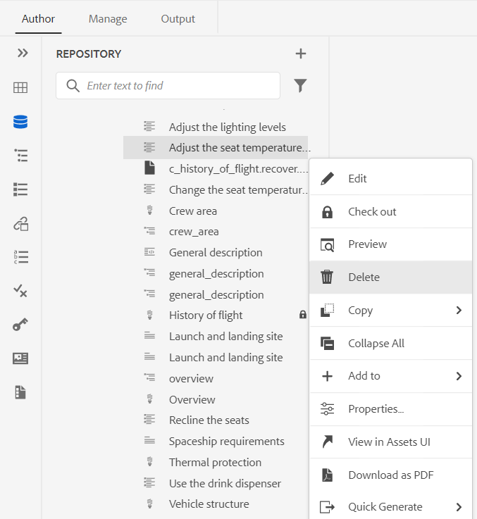

# Versione più recente delle guide di Adobe Experience Manager as a Cloud Service

## Aggiornamento alla versione più recente

Aggiorna le guide correnti di Adobe Experience Manager as a Cloud Service (in seguito denominate *Guide AEM as a Cloud Service*) eseguendo le seguenti operazioni:
1. Controlla il codice Git dei Cloud Services e passa al ramo configurato nella pipeline dei Cloud Services corrispondente all’ambiente da aggiornare.
2. Aggiorna `<dox.version>` proprietà in `/dox/dox.installer/pom.xml` file dei tuoi Cloud Services Codice Git a 2022.11.198.
3. Conferma le modifiche ed esegui la pipeline dei Cloud Services per eseguire l’aggiornamento all’ultima versione di AEM Guide as a Cloud Service.

## Passaggi per indicizzare il contenuto esistente (solo se disponi di una versione precedente al rilascio di settembre delle AEM guide as a Cloud Service)

Esegui i seguenti passaggi per l’indicizzazione del contenuto esistente e utilizza il nuovo testo trova e sostituisci a livello di mappa:

* Esegui una richiesta POST al server (con autenticazione corretta) - `http://<server:port>/bin/guides/map-find/indexin`.
(Facoltativo: Puoi trasmettere percorsi specifici delle mappe per indicizzarle, per impostazione predefinita tutte le mappe saranno indicizzate || Esempio : `https://<Server:port>/bin/guides/map-find/indexing?paths=<map_path_in_repository>`)

* L’API restituirà un jobId. Per controllare lo stato del processo, puoi inviare una richiesta di GET con ID processo allo stesso punto finale - `http://<server:port>/bin/guides/map-find/indexing?jobId={jobId}`
(Ad esempio: http://&lt;
_localhost:8080_>/bin/guides/map-find/indexing?jobId=2022/9/15/7/27/7dfa1271-981e-4617-b5a4-c18379f11c42_678)

* Una volta completato il processo, la richiesta di GET di cui sopra risponderà con successo e menzionerà se eventuali mappe non sono riuscite. Le mappe indicizzate correttamente possono essere confermate dai log del server.

## Matrice di compatibilità

Questa sezione elenca la matrice di compatibilità per le applicazioni software supportate da AEM Guide as a Cloud Service nella versione di novembre 2022.

### FrameMaker e FrameMaker Publishing Server

| FMPS | FrameMaker |
| --- | --- |
| Non compatibile | Aggiornamento 4 e superiore del 2020 |
|  |  |

*La linea di base e le condizioni create in AEM sono supportate nelle versioni FMPS a partire dal 2020.2.

### Connettore dell&#39;ossigeno

| AEM guide as a Cloud Release | Finestre del connettore dell&#39;ossigeno | Mac connettore ossigeno | Modifica in Windows Ossigeno | Modifica in Oxygen Mac |
| --- | --- | --- | --- | --- |
| 2022.11.0 | 2.7.13 | 2.7.13 | 2.3 | 2.3. |
|  |  |  |  |

## Nuove funzioni e miglioramenti

AEM guide as a Cloud Service fornisce miglioramenti e nuove funzioni nell’ultima versione:

### Elimina i file dal pannello archivio

Ora è possibile eliminare facilmente i file (file singolo alla volta) dal **Opzioni** del file selezionato dal pannello archivio.

Viene visualizzato un prompt di conferma prima di eliminare il file. Se non viene fatto riferimento al file da nessun altro file, questo viene eliminato e viene visualizzato un messaggio di successo.

Se il file selezionato è estratto, non è possibile eliminarlo e viene visualizzato un messaggio di errore. Se il file selezionato viene aggiunto a una raccolta preferiti o se viene fatto riferimento a un altro file, AEM guide controlla la conferma e ti dà la possibilità di eliminarla forzatamente. Se elimini un argomento di riferimento e hai aperto il file contenente riferimenti per la modifica, verrà visualizzato il collegamento interrotto per il file di riferimento.

**Nota**: È inoltre possibile eliminare il file selezionato utilizzando il tasto Canc della tastiera.

### Rimozione delle versioni selezionate dei file

Durante la creazione e la gestione del contenuto, è possibile creare molte versioni per i file DITA nel repository. AEM Guide consente di eliminare dall’archivio le versioni precedenti dei file DITA e liberare spazio su disco.

AEM Guide non elimina la prima versione del file o una versione inclusa in una linea di base o a cui è applicata un’etichetta. L’operazione di eliminazione non elimina nemmeno i file inclusi in una traduzione o in un flusso di lavoro di revisione. È possibile scegliere il numero di versioni da conservare e anche decidere di eliminare i file che sono più vecchi del numero definito di giorni.

Prima di avviare l’operazione di eliminazione, puoi visualizzare in anteprima il rapporto per vedere le versioni che verranno eliminate. È quindi possibile decidere di avviare o annullare l&#39;operazione di eliminazione.

Una volta completata l&#39;operazione di eliminazione, puoi controllare il report di eliminazione per vedere i file eliminati.

### Gestire i predefiniti di output del profilo globale e della cartella

Le Guide AEM consentono di creare e gestire i predefiniti di output per i profili globali e cartelle. Puoi quindi utilizzare facilmente questi predefiniti di output per generare l’output per tutte le mappe relative a quel profilo globale o cartelle.

**Nota** Solo gli utenti amministratori a livello di cartella possono creare predefiniti per profili globali e cartelle.

Questi predefiniti globali vengono visualizzati sotto il **Uscita** scheda di tutte le mappe correlate. Puoi utilizzarli per generare l’output per tutte le mappe correlate. Per generare l’output di PDF, seleziona il predefinito come predefinito di PDF predefinito. È inoltre possibile **Modifica**, **Rinomina**, **Duplica** oppure **Elimina** un predefinito di output esistente dal **Opzioni** menu.

### Colonna Etichetta versione aggiunta al dashboard di traduzione

Nel dashboard di traduzione è inoltre possibile visualizzare la colonna Etichetta versione . Viene visualizzata l’etichetta per la versione selezionata del file di origine. Questo può essere utile per selezionare tutti i file con un’etichetta specifica e tradurli in una sola volta.

## Miglioramenti alla pubblicazione nativa di PDF

### PDF con barra delle modifiche che mostra la differenza tra le versioni del documento

Ora è possibile creare un PDF che mostra le differenze di contenuto tra due versioni utilizzando la barra delle modifiche. È possibile scegliere di confrontare la versione corrente con una baseline della versione precedente o tra le due versioni della baseline selezionate.

In PDF viene visualizzata una barra di modifica per indicare il contenuto modificato, inserito o eliminato. Sono inoltre disponibili le seguenti opzioni:
* Mostra il contenuto inserito in verde e sottolineato
* Mostra il contenuto eliminato in rosso e contrassegnato con barrato

### Supporto delle variabili per Percorso di output e Nome file PDF

Ora è anche possibile utilizzare le seguenti variabili predefinite per definire il percorso di output e il file PDF. Puoi utilizzare una singola o una combinazione di variabili per definire le seguenti opzioni:
* `${map_filename}`
* `${map_title}`
* `${preset_name}`
* `${language_code}`
* `${map_parentpath}` (Solo per percorso di output)
* `${path_after_langfolder}` (Solo per percorso di output)

### Genera sommario per mappe DITA e riordina layout di pagina

Ora è anche possibile generare il sommario nelle mappe DITA utilizzando un’impostazione PDF avanzata del modello. È possibile attivare o disattivare la visualizzazione dei vari layout di pagina e riordinarne la posizione.

## Problemi risolti

I bug corretti in varie aree sono elencati di seguito:

* PDF nativo | `conkeyref` non viene risolto nell’output di PDF generato. (10564)
* PDF nativo | Si verificano problemi nell’accesso ai metadati di una mappa nell’output di PDF. (10556)
* PDF nativo | Lo stile in linea viene utilizzato per generare i tag anziché il nome della classe.  (10498)
* L’editor web carica la pagina vuota a intermittenza. (10678)
* La pubblicazione di PDF non riesce se creiamo un predefinito duplicando un predefinito esistente. (10584)
* **Visualizza registro** non funziona quando la generazione di PDF non riesce per un predefinito. (10576)
* Nota all’interno di un tag para che è un conref non viene visualizzato nell’anteprima. (10559)
* Se si preme il backspace alla fine di una voce di elenco, l’intero elenco viene rimosso. (10540)
* Quando si utilizza un’esportazione nativa di PDF, i valori nidificati `<indexterm>` non sono nidificati nell&#39;indice. (10521)
* **Rientro automatico** nella vista Sorgente manca il pulsante presente nella barra degli strumenti. (10448)
* Il primo carattere di una voce dell’elenco viene perso mentre l’elenco viene creato nell’editor. (10447)
* Se una versione di una risorsa DITA viene modificata e salvata nella finestra di modifica della linea di base, vengono visualizzati più pop-up. (10399)
* Errore dell&#39;applicazione durante il clic **Modifica** dopo aver selezionato tutti i predefiniti di output dal pannello Generazione rapida. (10388)
* I metadati personalizzati per l’argomento DITA non vengono mantenuti quando un’azione di copia/incolla viene eseguita dall’interfaccia utente Assets. (10367)
* La post-elaborazione è bloccata per l’intera cartella di lingue le cui risorse sono presenti in un progetto di traduzione attivo. (10332)
* La scheda Modello in XML Editor non è visibile agli amministratori dei profili di cartella. (10266)
* Problemi di navigazione si verificano nell&#39;editor Web dopo l&#39;aggiornamento 4.0. (10159)
* I file SVG non vengono visualizzati in modalità Anteprima. (10010)
* Se la scheda Output dell’editor contiene più predefiniti, non è possibile scorrere la sezione dei predefiniti e non tutti i predefiniti. (9787)
* **Modifica** e **Annota** le opzioni per un’immagine non funzionano correttamente nella vista a colonne. (8758)
* Il collegamento peer non viene risolto e viene visualizzato come testo normale nell’output generato. (7774)
