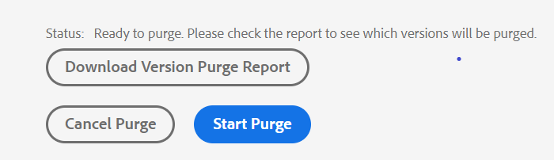
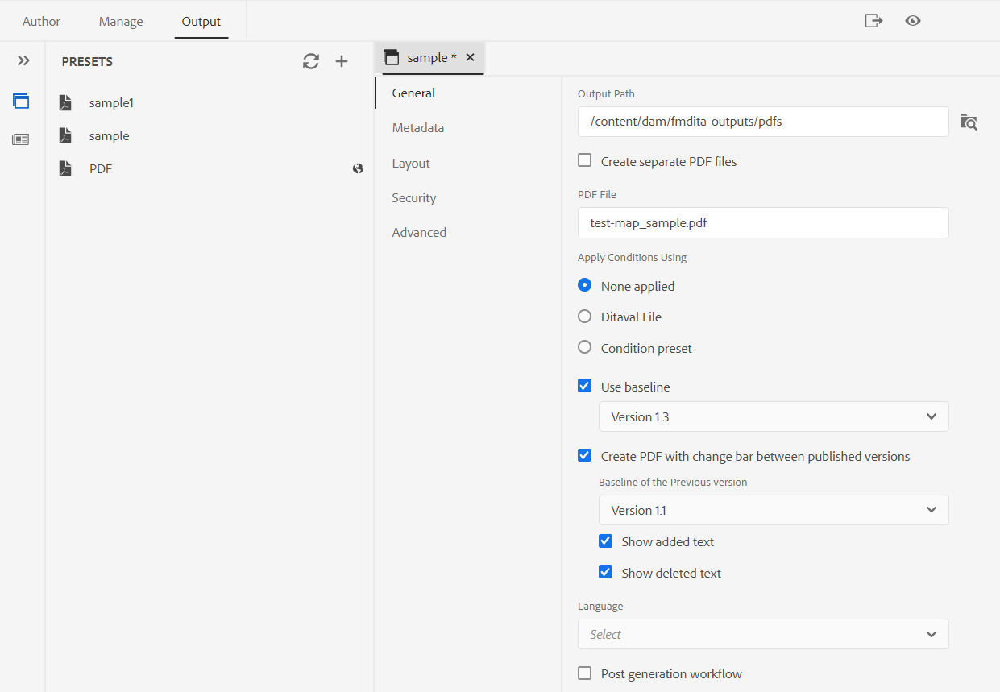

# Rilascio 4.2 delle guide di Adobe Experience Manager (febbraio 2023)

Questa nota sulla versione tratta le istruzioni di aggiornamento, le nuove funzioni e i miglioramenti della versione 4.2 delle Guide di Adobe Experience Manager (in seguito denominati *Guide AEM*).

## Aggiornamento alla versione più recente

È possibile aggiornare facilmente la versione corrente di AEM Guide alla versione 4.2. Prima di procedere con l’aggiornamento alla versione 4.2 di AEM Guide, è necessario tenere in considerazione i seguenti punti:
* Se utilizzi le versioni 4.0, 4.1 o 4.1.x, puoi effettuare direttamente l’aggiornamento alla versione 4.2.
* Se utilizzi la versione 3.8.5, devi eseguire l’aggiornamento alla versione 4.0 prima di eseguire l’aggiornamento alla versione 4.2.
* Se utilizzi una versione precedente alla 3.8.5, consulta la *Guide AEM aggiornamento* nella guida all’installazione specifica del prodotto.

>[!NOTE]
>
>È necessario installare AEM service pack prima di aggiornare AEM versione Guide.

Per maggiori dettagli, vedi [Istruzioni di aggiornamento](assets/Adobe-Experience-Manager-Guides-Upgrade-Instructions-EN.pdf).

## 4.2. | Note sulla versione

## Matrice di compatibilità

Questa sezione elenca la matrice di compatibilità per le applicazioni software supportate da AEM versione 4.2.

### Adobe Experience Manager

**Non UID**
Versione 6.5 Service Pack 15, 14, 13 o 12

**UUID**
Versione 6.5 Service Pack 15, 14, 13 o 12

Per ulteriori dettagli, consulta la sezione *Requisiti tecnici* nella guida all’installazione e alla configurazione di guide Adobe Experience Manager .

### FrameMaker e FrameMaker Publishing Server

| Versione | FMPS 2022 | FMPS 2020 | Fm 2022 | Fm 2020 |
| --- | --- | --- | --- | --- |
| 4.2 (non UUID) | 2022 o superiore | 2020.2 o superiore* | 2022 o superiore | 2020.3 o superiore |
| 4.2 (UUID) | 2022 o superiore | 2020.2 o superiore* | 2022 o superiore | 2020.4 o superiore |
|  |  |  |  |

*La linea di base e le condizioni create in AEM sono supportate nelle versioni FMPS a partire dal 2020.2.

### Connettore dell&#39;ossigeno

| Versione | Finestre del connettore dell&#39;ossigeno | Mac connettore ossigeno | Modifica in Windows Ossigeno | Modifica in Oxygen Mac |
| --- | --- | --- |--- |--- |
| 4.2 (non UUID) | 2.1-regolare-4 | 2.1-regolare-4 | 1.6 | 1.6 |
| 4.2 (UUID) | 2.8-uuid-8 | 2.8-uuid-8 | 2.3 | 2.3 |
|  |  |  |

## Nuove funzioni e miglioramenti

AEM Guide offre molti miglioramenti e nuove funzioni nella versione 4.2:

### Generare report dall&#39;editor Web

AEM Guide include una funzione nell’editor Web che consente di controllare la completezza complessiva dei documenti tecnici e di generare report per essi.
Puoi visualizzare l’elenco degli argomenti e gestire i metadati di tutti i riferimenti per la mappa corrente dalla
**Rapporti** nell&#39;editor Web.

**Genera la vista Elenco argomenti**

È possibile generare l&#39;elenco argomenti che fornisce informazioni dettagliate sugli argomenti, ad esempio il tipo di riferimento, lo stato del documento e l&#39;autore. È inoltre possibile generare il CSV per scaricare lo snapshot corrente degli argomenti nella mappa DITA.

**Gestione dei metadati e modifica dello stato del documento**

È possibile applicare tag su un singolo argomento o utilizzare la funzione di assegnazione tag in blocco per applicare più tag su più argomenti, una mappa DITA o una mappa secondaria. È inoltre possibile modificare lo stato del documento di tutti gli argomenti selezionati al successivo stato comune del documento.

### UX rivista per la funzionalità di revisione

Ora AEM guide fornisce un UX migliorato che ti aiuta a rivedere gli argomenti condivisi per la revisione. Nell’esperienza più recente, la funzionalità di revisione presenta i seguenti miglioramenti:

* Interfaccia utente aggiornata
* Pannello Condizioni che consente di evidenziare il contenuto in base alle condizioni disponibili nell’argomento.
* Ogni commento nel pannello dei commenti è collegato al testo corrispondente nell&#39;argomento corrente. Consente di identificare il testo con commenti.
* I commenti vengono visualizzati nell&#39;ordine del testo del commento nel documento.
* Il nome dell’attività di revisione viene visualizzato nel flusso di lavoro di revisione.
* Selezionare la rootmap per l&#39;attività di revisione utilizzata per risolvere tutti i riferimenti chiave e i termini del glossario utilizzati nel contenuto della revisione.
* Barra degli strumenti contestuale che consente di evidenziare o barrare rapidamente il testo.
* Menu delle opzioni per modificare o eliminare i commenti personalizzati.
* Per i commenti obsoleti, è possibile accedere a una visualizzazione affiancata che consente di confrontare la versione precedente dell’argomento con la versione di revisione corrente
* Quando si utilizzano i filtri, i commenti nel pannello di destra vengono filtrati in base alla selezione e il numero di commenti nel pannello di sinistra viene aggiornato di conseguenza.

Per ulteriori informazioni, consulta la sezione *Esamina argomenti o mappe* nella guida Utilizzo delle guide di Adobe Experience Manager .

### Miglioramenti alla traduzione

Ora è possibile migliorare la traduzione dei documenti dall’Editor Web in modo più semplice e intuitivo nel dashboard Traduzione.

**Colonna Etichetta versione aggiunta al dashboard di traduzione**

Nel dashboard di traduzione è inoltre possibile visualizzare la colonna Etichetta versione . Viene visualizzata l’etichetta per la versione selezionata del file di origine. Questo può essere utile per selezionare tutti i file con un’etichetta specifica e tradurli in una sola volta.

**Visualizza la differenza di versione per i file Out of Sync dal dashboard di traduzione**

Ora è possibile controllare le differenze tra la versione selezionata e l’ultima versione tradotta dell’origine degli argomenti. Puoi anche scegliere di tradurre il **Non sincronizzato** in base alle modifiche apportate tra le due versioni di un argomento.

**Passa l’etichetta della versione alla versione di destinazione**

AEM Guide consente di passare l’etichetta del file di origine al file di destinazione. Questo consente di identificare facilmente la versione di origine del file tradotto.

Ad esempio, se hai alcuni file di origine a cui è stata applicata l’etichetta di versione Release 1.0, puoi anche passare l’etichetta di origine (Release 1.0) al file tradotto.

**Forza la sincronizzazione per le risorse fuori sincronia**

Se apporti modifiche ad alcune risorse, AEM guide le contrassegna come non sincronizzate. È possibile tradurre nuovamente le risorse modificate o scegliere di ignorare lo stato Out of Sync. Ad esempio, se hai apportato alcune modifiche minori che non hanno bisogno di una traduzione, puoi contrassegnarne lo stato come In Sync.

**Visualizza progetti di traduzione in corso per un argomento o una mappa**

È possibile che alcuni riferimenti nel dashboard di traduzione siano in corso. Ora AEM Guide offre una funzione che consente di visualizzare l’elenco di tutti i progetti di traduzione in corso (insieme alla lingua di destinazione) contenenti il riferimento selezionato.

Per ulteriori informazioni, consulta la sezione *Tradurre documenti dall&#39;editor Web* nella guida Utilizzo delle guide di Adobe Experience Manager .

### Genera output in vari formati dall&#39;editor web

Ora è possibile generare facilmente l&#39;output per gli argomenti o la mappa DITA dall&#39;Editor Web. Puoi configurare vari predefiniti di output come AEM sito, PDF, HTML5, JSON (un formato di output headless) e output personalizzato. Utilizzali per generare le rispettive uscite. È possibile definire gli attributi negli argomenti DITA e quindi utilizzare il predefinito per le condizioni per applicare una condizione durante la pubblicazione dell&#39;output. È inoltre possibile utilizzare la funzione di pubblicazione Linea di base per pubblicare in modo selettivo una versione specifica della mappa o dell&#39;argomento DITA.

**Gestire i predefiniti di output del profilo globale e della cartella**

Le Guide AEM consentono di creare e gestire i predefiniti di output per i profili globali e cartelle. Puoi quindi utilizzare facilmente questi predefiniti di output per generare l’output per tutte le mappe relative a quel profilo globale o cartelle.

Questi predefiniti globali vengono visualizzati sotto il **Uscita** scheda di tutte le mappe correlate. Puoi utilizzarli per generare l’output per tutte le mappe correlate. Per generare l’output di PDF, seleziona il predefinito come predefinito di PDF predefinito. È inoltre possibile **Modifica**, **Rinomina**, **Duplica** oppure **Elimina** un predefinito di output esistente dal **Opzioni** menu.

>[!NOTE]
>
>Solo gli utenti amministratori a livello di cartella possono creare predefiniti per profili globali e cartelle.

### Trova e sostituisci il testo a livello di mappa

È ora possibile cercare i file all’interno di una mappa che contengono testo specifico. Il testo cercato viene evidenziato nei file. È inoltre possibile sostituire la parola o la frase cercata con un&#39;altra parola o frase all&#39;interno dei file. Seleziona la **Sostituisci una singola occorrenza** per sostituire l&#39;occorrenza corrente e la **Sostituisci tutto nel file** per sostituire tutte le occorrenze nel file selezionato. È possibile selezionare **Sostituisci tutto** per sostituire tutte le occorrenze del termine ricercato in tutti i file.

Per impostazione predefinita, le opzioni **File di estrazione prima della sostituzione** e **Crea nuova versione dopo la sostituzione** sono selezionati, in modo che un file venga estratto prima di sostituire il testo e venga creata una nuova versione dopo la sostituzione del testo. È inoltre possibile cercare la stringa nei riferimenti indiretti all&#39;interno della mappa DITA. Per impostazione predefinita, questa opzione è disabilitata e la ricerca viene eseguita solo sui riferimenti diretti.

### Visualizzazione Layout nell’Editor mappa

Ora è possibile visualizzare il layout completo di una mappa DITA nell&#39;Editor mappa. Quando aprite una mappa per la modifica, viene aperta la vista Layout dell’Editor mappa. In questa visualizzazione è possibile visualizzare la gerarchia delle mappe in una visualizzazione ad albero. Puoi anche modificare e organizzare o strutturare gli argomenti in una mappa.

La visualizzazione Layout contiene una barra degli strumenti separata che consente di eseguire numerose attività sugli argomenti presenti in una mappa.
È possibile inserire riferimenti ad argomenti, gruppi di argomenti, definizioni di chiavi in una mappa. È possibile riorganizzare gli argomenti presenti in una mappa spostandoli verso l’alto, verso il basso, verso sinistra o verso destra. Puoi anche trascinare gli argomenti per spostarli in una mappa. L’Editor mappa fornisce inoltre le icone per bloccare o sbloccare i file, controllare la cronologia delle versioni e eseguire una gestione delle etichette delle versioni.

La vista Layout fornisce anche la **Opzioni di visualizzazione** per visualizzare o nascondere il numero di riga, mostrare o nascondere la casella di controllo o mostrare il nome o il titolo del file per gli argomenti in una mappa.
Puoi anche visualizzare gli argomenti in base ai filtri condizionali applicati.

Oltre a organizzare gli argomenti nel file di mappa, è anche possibile aggiungere, spostare, copiare, incollare o eliminare riferimenti utilizzando il **Opzioni** menu disponibile per un elemento nella vista Layout.

Il pannello a destra visualizza le proprietà del contenuto e le proprietà della mappa nella vista Layout dell’Editor mappa. Ora è anche possibile impostare le informazioni sui metadati per gli argomenti o la mappa. Puoi definire il Titolo della barra di navigazione, Testo collegamento, Descrizione breve e Parole chiave per l’argomento o la mappa selezionati.

Per ulteriori dettagli, consulta *Visualizzazione Layout* nella guida Utilizzo delle guide di Adobe Experience Manager .

### Pannello Quick Generate

AEM Guide fornisce il pannello Quick Generate (Generazione rapida) che consente di generare e visualizzare rapidamente l’output dei predefiniti creati per la mappa DITA.

In **Generazione rapida** è possibile visualizzare l&#39;elenco di tutti i predefiniti di output creati per la mappa DITA. Puoi anche visualizzare rapidamente l’output generato per i predefiniti. Al termine della generazione dell&#39;output viene visualizzato un messaggio di errore o di successo. È inoltre possibile visualizzare il registro degli errori che contiene i dettagli dell&#39;errore che si è verificato nel processo di generazione.

### Creare una linea di base dinamica basata sulle etichette

AEM Guide offre la funzione di creare linee di base dinamiche basate su etichette. Se si genera una baseline, si scarica una baseline o si crea un progetto di traduzione utilizzando una baseline, i file vengono selezionati in modo dinamico in base alle etichette aggiornate. Questa funzione è utile in quanto non è necessario modificare la linea di base quando si aggiornano le etichette.

### Eliminare e duplicare i file dal pannello del repository

Ora è possibile eliminare facilmente i file (file singolo alla volta) dal **Opzioni** del file selezionato dal pannello archivio. Viene visualizzato un prompt di conferma prima di eliminare il file. Se non viene fatto riferimento al file da nessun altro file, questo viene eliminato e viene visualizzato un messaggio di successo.

È inoltre possibile creare un duplicato o una copia del file selezionato. Per impostazione predefinita, il file viene creato con un suffisso (come filename_1.extension).

### Altri miglioramenti dell’editor web

* In Guide AEM, è possibile eseguire alcune operazioni comuni per immagini e file multimediali utilizzando il menu di scelta rapida. Ora è anche possibile individuare l’immagine o il supporto selezionati nella directory archivio o visualizzare l’anteprima del file nell’interfaccia utente di Assets.

* Il nome del profilo cartella corrente viene visualizzato come etichetta per l’icona Preferenze utente nella barra degli strumenti principale. Questo consente di identificare il profilo della cartella su cui stai lavorando.

* Quando si apre una mappa nella vista mappa, il titolo della mappa corrente viene visualizzato al centro della barra degli strumenti principale. È utile per informare gli utenti della mappa attualmente aperta.

### Rimozione delle versioni selezionate dei file

Durante la creazione e la gestione del contenuto, è possibile creare molte versioni per i file DITA nel repository. AEM Guide consente di eliminare dall’archivio le versioni precedenti dei file DITA e liberare spazio su disco.

AEM Guide non elimina la prima versione del file o una versione inclusa in una linea di base o a cui è applicata un’etichetta. L’operazione di eliminazione non elimina nemmeno i file inclusi in una traduzione o in un flusso di lavoro di revisione. È possibile scegliere il numero di versioni da conservare e anche decidere di eliminare i file che sono più vecchi del numero definito di giorni.

Prima di avviare l’operazione di eliminazione, puoi visualizzare in anteprima il rapporto per vedere le versioni che verranno eliminate. È quindi possibile decidere di avviare o annullare l&#39;operazione di eliminazione.

Una volta completata l&#39;operazione di eliminazione, puoi controllare il report di eliminazione per vedere i file eliminati.

### Visualizza il titolo al posto di UUID nell&#39;Editor di ossigeno

Ora AEM Guide ti consente di scegliere **Usa titolo in Editor e Maps Manager** in Impostazioni. Se si seleziona questa opzione, il titolo del file viene visualizzato nella scheda del file quando viene aperto nell&#39;Editor o nel Gestore mappe DITA. Se non selezioni questa opzione, l’UUID del file viene visualizzato nella scheda del file.

### Interfaccia utente metadati disponibile per i predefiniti di PDF

È possibile impostare i metadati dal predefinito di output di una mappa DITA. È possibile impostare i metadati Titolo, Autore, Oggetto e Parole chiave. Questi metadati vengono mappati sui metadati nelle Proprietà file del PDF di output. Questi metadati sostituiscono i metadati definiti a livello di libro. È possibile definire i metadati in modo specifico in ogni predefinito di output e trasmetterli al PDF di output.

### PDF nativo | PDF con barra delle modifiche che mostra la differenza tra le versioni del documento

Ora è possibile creare un PDF che mostra le differenze di contenuto tra due versioni utilizzando la barra delle modifiche. È possibile scegliere di confrontare la versione corrente con una baseline della versione precedente o tra le due versioni della baseline selezionate.

In PDF viene visualizzata una barra di modifica per indicare il contenuto modificato, inserito o eliminato. Sono inoltre disponibili le seguenti opzioni:
* Mostra il contenuto inserito in verde e sottolineato
* Mostra il contenuto eliminato in rosso e contrassegnato con barrato

### PDF nativo | Supporto delle variabili per Percorso di output e Nome file PDF

Ora è anche possibile utilizzare le seguenti variabili predefinite per definire il percorso di output e il file PDF. Puoi utilizzare una singola o una combinazione di variabili per definire le seguenti opzioni:
* `${map_filename}`
* `${map_title}`
* `${preset_name}`
* `${language_code}`
* `${map_parentpath}` (Solo per percorso di output)
* `${path_after_langfolder}` (Solo per percorso di output)

### PDF nativo | Genera sommario per mappe DITA e riordina layout di pagina

Ora è anche possibile generare il sommario nelle mappe DITA utilizzando un’impostazione PDF avanzata del modello. È possibile attivare o disattivare la visualizzazione dei vari layout di pagina e riordinarne la posizione.

### PDF nativo | Aggiungi un segnalibro personalizzato nell’output di PDF

Ora è possibile aggiungere un segnalibro personalizzato su un particolare contenuto nell’output finale di PDF per facilitarne la navigazione. Questo viene aggiunto al sommario creato dai titoli degli argomenti o delle sezioni nella mappa DITA.

### PDF nativo | Applicare uno stile personalizzato alle voci del sommario e al contenuto dell’argomento

AEM Guide fornisce la funzione per applicare lo stile personalizzato alle voci del sommario o a un particolare argomento nell’output di PDF. Ad esempio, puoi modificare il colore del testo nel sommario e il titolo dell’argomento. È inoltre possibile applicare stili all’intero contenuto dell’argomento.

## Problemi risolti

I bug corretti in varie aree sono elencati di seguito:

### Authoring  

* Il pannello a sinistra si interrompe quando si aggiunge una scheda. (11126)
* Le modifiche nel codice HTML dell’editor web causano problemi con `<dl>` e `<dlentry>`. (11024)
* Alcuni attributi non vengono trattati come condizionali e causano problemi. (10895)
* Tre livelli o più nidificati `<indexterm>` non sono nidificati nell’esportazione nativa di PDF. (10799)
* Il contenuto scompare nel corpo di un’attività quando si passa dalla visualizzazione Autore alla visualizzazione Origine. (10735)
* I commenti di revisione non sono inseriti in un&#39;attività di revisione. (10625)
* `<conref>` la nota all’interno di un tag para non viene visualizzata in modalità anteprima. (10559)
* Se si preme il backspace alla fine di una voce di elenco, l’intero elenco viene rimosso. (10540)
* Lo schermo viene visualizzato come vuoto in Chrome v106 durante il trascinamento di un elemento dall’interfaccia utente (ad esempio, dal pannello Condizioni). (10524)
* Pulsante Rientro automatico mancante nella barra degli strumenti **Origine** visualizza. (10448)
* Il primo carattere di una voce di elenco viene perso a volte quando l’elenco viene creato nell’editor.( 10447)
* **Annulla** o **Ripeti** non funziona correttamente su alcuni file. (10373)
* I metadati personalizzati non vengono mantenuti quando si esegue un&#39;azione Copia e Incolla. (10367)
* Si verifica un errore durante l’esecuzione di una copia (Ctrl+c) e incolla (Ctrl+v) del contenuto. (10304)
* Il pannello Struttura non visualizza il contenuto quando si passa dalla modalità Creazione alla modalità Origine. (10296)
* La sottomappa non viene creata quando fa riferimento a una mappa principale nei modelli DITA. (10231)
* Problemi di navigazione si verificano nell&#39;editor Web dopo l&#39;aggiornamento 4.0. (10159)
* L’opzione Annulla in XML Editor porta l’utente nella parte superiore della pagina. (10091)
* Le proprietà del nodo vengono rimosse dopo l’operazione di copia e incolla di una risorsa. (10053)
* I file SVG aggiunti agli argomenti DITA non vengono visualizzati in modalità anteprima dell’editor. (10010)
* I risultati della ricerca per trovare e sostituire nell’Editor web non sono leggibili in modalità scura. (9978)
* Nessun caricatore esistente durante la creazione di una mappa dal modello di mappa. (9891)
* Il riferimento nel modello di argomento non funziona e l’ID hash copiato non viene aggiornato nella copia del contenuto. (9890)
* Non viene visualizzata alcuna opzione per sfogliare gli argomenti o mappare il modello all&#39;interno delle sottocartelle dell&#39;argomento o della cartella mappa. (9889)
* Nessuna opzione per creare un nuovo modello nelle sottocartelle di argomenti o mappe. (9888)
* XML Editor non aggiorna le immagini sugli argomenti. (9500)
* mimeType è codificato per la creazione e l&#39;aggiornamento delle risorse DITA. (8979)
* Viene inserito un trattino normale quando si seleziona Trattino non interruzione nel **Inserisci carattere speciale** finestra di dialogo. (8919)
* Il nome del creatore della versione in Cronologia versioni è &quot;fmdita-serviceuser&quot; per i file caricati tramite l’interfaccia utente di Assets. (8910)
* L’opzione Modifica non funziona per le immagini quando si lavora nella vista a colonne dell’interfaccia utente Assets. (8758)
* L&#39;argomento DITA non viene aggiornato automaticamente con le modifiche apportate in **Proprietà** pagina. (8745)
* Durante lo spostamento di elementi all&#39;interno dell&#39;argomento in Editor web, gli ID assegnati sugli elementi vengono sovrascritti dagli ID assegnati automaticamente. (7895)

### Gestione

* Copiare una risorsa mappa DITA (dall’interfaccia utente di Assets ) causa la presenza di linee di base errate nella risorsa copiata. (11218)
* Il messaggio di avviso non viene visualizzato al caricamento di un file che supera il limite consentito in AEM (2 GB per impostazione predefinita). (10817)
* Editor web di base | Il comportamento della colonna Più recente è diverso nel nuovo dashboard della linea di base all’interno dell’editor Web. (10808)
* Traduzione | Il lavoro di traduzione non viene avviato a causa di /libs/fmdita/i18n/ja.json non valido. (10543)
* Traduzione | Si verifica un errore in un progetto di traduzione dell’ambito creato dal dashboard di traduzione (traduzione umana). (10526)
* Traduzione | L’elaborazione post è bloccata per l’intera cartella linguistica le cui risorse sono presenti in un progetto di traduzione attivo. (10332)
* Traduzione| I metadati e i tag non vengono propagati alle copie tradotte. (4696)
* Se la versione viene modificata e salvata nell’editor Linea di base, vengono visualizzati più pop-up per qualsiasi risorsa. (10399)
* La perdita di sessione si verifica in com.day.cq.search.impl.builder.QueryBuilderImpl.createResourceResolver(QueryBuilderImpl.java:210). (10279)
* Il file video è mancante dalla linea di base se la cartella principale contiene spazio nel nome. (10031)

### Pubblicazione

* La rigenerazione dell&#39;argomento non funziona in alcuni scenari. (10635)
* La pubblicazione in PDF non riesce a generare l’output per un predefinito duplicato (di un predefinito esistente). (10584)
* Il pulsante Visualizza registro non funziona nel caso in cui la generazione di PDF non riesca per un predefinito. (10576)
* Il listener Publishlistener non visualizza i dati richiesti nei log di informazioni e contiene anche alcuni log junk.( 10567)
* PDF nativo | La generazione di PDF non riesce con un&#39;eccezione Null Pointer. (10950)
* PDF nativo | conkeyref non viene risolto nell&#39;output generato. (10564)
* PDF nativo | Si verificano problemi con i metadati di una mappa a cui è necessario fare riferimento nell’output di PDF.( 10556)
* PDF nativo | Si verificano problemi durante la rotazione dell’intestazione della tabella. (10555)
* PDF nativo | Si verificano problemi nella rimozione di argomenti con ruolo di elaborazione=&#39;solo risorsa&#39;. (10554)
* PDF nativo | Nell’output di PDF vengono visualizzati i Keyrefs vuoti. (10553)
* PDF nativo | Nidificato `<indexterm>` non sono nidificati nell’esportazione nativa di PDF. (10521)
* PDF nativo | Per i tag generati, Native PDF utilizza lo stile in linea anziché il nome della classe. (10498)
* PDF nativo | Il topicref nidificato nelle appendici viene trasformato in h1 nella HTML temporanea.( 10454)
* PDF nativo | Impossibile nascondere gli argomenti relativi alla questione anteriore dal Sommario. (10355)
* PDF nativo | Attributo del frame di tabella non propagato al HTML temporaneo (come classe). (10353)
* PDF nativo | I file temporanei di HTML aggiungono le classi colsep e rowsep a <td> e <th> anche se il loro valore è 0 nel DITA di origine. (10352)
* PDF nativo | Il riavvio dei numeri di pagina nel layout dei capitoli avvia casualmente la numerazione dalla fine del capitolo precedente. (10154)
* PDF nativo | I riferimenti chiave per i keydefs con immagine o collegamenti esterni non vengono risolti. (10063)
* PDF nativo | L&#39;appendice viene visualizzata come un capitolo in PDF generato. (9829)
* La scheda Modello nell’editor xml non viene visualizzata negli amministratori del profilo cartella. (10266)
* La pubblicazione della linea di base non riesce per PDF generato con FrameMaker Publishing Server 2020. (10551)
* L’errore dell’applicazione si verifica quando si fa clic sul pulsante Modifica dopo aver selezionato tutti i predefiniti tramite la casella di controllo Predefiniti di output nella finestra a comparsa Generazione rapida. (10388)
* Se la scheda Output in Web Editor dispone di più predefiniti, la sezione dei predefiniti non è scorrevole verticalmente e non visualizza tutti i predefiniti disponibili. (9787)
* Impossibile eliminare i predefiniti dal flusso di lavoro Output durante la pubblicazione tramite Editor. (9100)
* Il rendering del collegamento peer viene eseguito come testo normale anziché come collegamento nella pagina generata. (7774)

### Problema noto

Adobe ha identificato il seguente problema noto per AEM versione 4.2 di Guide:

* Gli utenti possono eseguire operazioni di revisione anche dopo il completamento dell’attività di revisione.
