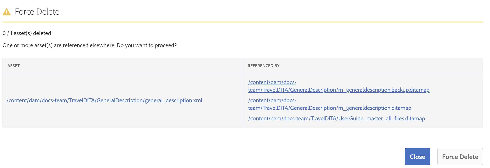

# Gestione di file e cartelle {#id2116G0L08XA}

In questa sezione viene illustrato come AEM Guide gestisce le operazioni di base relative ai file, ad esempio copia, incolla, trascinamento ed eliminazione. Sono possibili i seguenti scenari:

## Copiare e incollare i file

**Se il file ha un nome di file leggibile dall&#39;utente**

- *Se il file con lo stesso nome non esiste nella cartella di destinazione*: Viene creata una nuova copia del file e ad esso viene assegnato anche un UUID. In questo caso, il nome del file è lo stesso del nome del file originale.
- *Se il file con lo stesso nome esiste già nella cartella di destinazione*: Viene creata una nuova copia del file con suffisso \(come nomefile0.extension\). Al file appena creato viene inoltre assegnato un UUID.

**Se il nome del file è basato su un pattern UID**

- *Se il file con lo stesso nome non esiste nella cartella di destinazione*: Viene creata una nuova copia del file e gli viene assegnato un nuovo UUID nella nuova posizione. In questo caso, il nome del file è lo stesso dell’UUID.
- *Se il file con lo stesso nome esiste già nella cartella di destinazione*: Viene creata una nuova copia del file e ad esso viene assegnato anche un nuovo UUID. Il nome del file è lo stesso dell’UUID.

## Copiare e incollare le cartelle

**Copia e incolla la cartella nella stessa posizione**

- *La cartella contiene file con nomi di file leggibili dall&#39;utente*: Viene creata una nuova copia della cartella con un suffisso \(come nome cartella0\). Ai file contenuti nella cartella viene inoltre assegnato un nuovo UUID. Tuttavia, i nomi dei file non vengono modificati.

- *La cartella contiene file con nomi file basati su un pattern UUID*: Viene creata una nuova copia della cartella con un suffisso \(come nome cartella0\). Viene inoltre assegnato un nuovo UUID a tutti i file all’interno della nuova cartella. Vengono modificati anche i nomi dei file; i nomi dei file sono gli stessi del nuovo UUID.

**Copia e incolla la cartella in un percorso diverso**

- *La cartella contiene file con nomi di file leggibili dall&#39;utente*: Viene creata una nuova copia della cartella e viene assegnato un nuovo UUID a tutti i file all’interno della cartella nel nuovo percorso. In questo caso, non vi è alcuna modifica nei nomi delle cartelle o dei file.

- *La cartella contiene file con nomi file basati su un pattern UUID*: Viene creata una nuova copia della cartella con lo stesso nome della cartella originale. Viene inoltre assegnato un nuovo UUID a tutti i file all’interno della nuova cartella. Vengono modificati anche i nomi dei file; i nomi dei file sono gli stessi del nuovo UUID.

## Trascinamento di file

**Trascinare con nomi di file leggibili dall&#39;utente**

- *Trascinare nella stessa posizione*: Le opzioni disponibili sono **Sovrascrivi file esistenti**, **Mantieni entrambi i file\(s\)** e un&#39;opzione per creare una versione della copia di lavoro esistente.

   {width="650" align="center"}

   Se scegli la **Sovrascrivi file esistenti** quindi il file caricato sostituisce la versione corrente di lavoro del file esistente nella posizione originale. L&#39;UUID non viene creato o modificato.

   Se scegli la **Mantieni entrambi i file\(s\)** viene creata una nuova copia del file con suffisso \(come nomefile0.extension\). Un nuovo UUID viene assegnato anche al file appena copiato.

   Con l&#39;opzione Sovrascrivi file esistenti, se si sceglie l&#39;opzione per creare una versione dalla copia di lavoro esistente, viene creata anche una nuova versione dalla copia di lavoro del documento.

   >[!NOTE]
   >
   > **Crea nuova versione per il file caricato** deve essere abilitata dall’amministratore. Se questa funzione è abilitata, viene creata una nuova versione per il file caricato. Se l’opzione è deselezionata, non viene creata una versione del file caricato. Per ulteriori dettagli, consulta *Crea nuova versione per il file caricato* in Installazione e configurazione delle guide Adobe Experience Manager as a Cloud Service.

   Se un file è già stato estratto per le modifiche da un altro utente e tenti di caricare e sovrascrivere il file esistente, allora non riesce e viene visualizzato un errore.

   >[!NOTE]
   >
   >La **Sovrascrivi file estratto al caricamento** deve essere disabilitata dall’amministratore. Se questa funzione è abilitata, puoi sovrascrivere i file estratti. Se la funzione non è abilitata, non è possibile sovrascrivere un file estratto. Per ulteriori dettagli, consulta *Sovrascrivi file estratto al caricamento* in Installazione e configurazione delle guide Adobe Experience Manager as a Cloud Service.

- *Trascinamento di file in un percorso diverso*: Viene creata una nuova copia del file e gli viene assegnato un nuovo UUID nella nuova posizione. In questo caso, il nome del file è lo stesso del nome del file originale.

**Trascinamento della selezione con i nomi dei file in base a un pattern UID**

*Trascina il file nella stessa posizione*: Le opzioni disponibili sono **Sovrascrivi file esistenti** insieme all&#39;opzione per creare una versione della copia di lavoro esistente.

{width="650" align="center"}

Quando il file viene sovrascritto, non vi è alcuna modifica nel nome del file o nel relativo UID.

Se selezioni la **Crea versione per la copia di lavoro esistente** viene quindi creata una nuova versione dalla copia di lavoro del documento; il nuovo file viene caricato, viene creata anche una nuova versione del file e viene creato come copia di lavoro del documento.

**Crea nuova versione per il file caricato** deve essere abilitata dall’amministratore. Se questa funzione è abilitata, viene creata una nuova versione per il file caricato. Se l’opzione è deselezionata, non viene creata una versione del file caricato. Per ulteriori dettagli, consulta *Crea nuova versione per il file caricato* in Installazione e configurazione delle guide Adobe Experience Manager as a Cloud Service.

*Trascinamento di file in un percorso diverso*: Le opzioni disponibili sono **Sovrascrivi file esistenti**, **Sposta file\(s\) in nuova posizione** e un&#39;opzione per creare una versione della copia di lavoro esistente.

{width="650" align="center"}

Se scegli la **Sovrascrivi file esistenti** quindi il file caricato sostituisce il file esistente nella posizione originale. L&#39;UUID non viene creato o modificato.

Se scegli la **Sposta file\(s\) in nuova posizione** quindi il file esistente viene spostato nella posizione corrente e quindi viene sovrascritto con il file caricato. Lo spostamento di un file nella nuova posizione non interrompe i riferimenti esistenti da o verso il file.

Con sostituire o spostare i file, se si sceglie l&#39;opzione per creare una versione dalla copia esistente, viene creata una nuova versione dalla copia di lavoro del documento; il nuovo file viene sostituito nella posizione esistente o spostato nella nuova posizione.

## Sposta i file in blocco

AEM Guide viene fornito con lo strumento Sposta in blocco che consente all’amministratore di spostare una cartella con un numero elevato di file da una posizione all’altra. Questo strumento può facilmente spostare i file all&#39;interno di una o più cartelle in una cartella diversa nel tuo archivio AEM. Una delle caratteristiche principali di questo strumento è che non solo sposta un gran numero di file, ma mantiene anche i riferimenti a e da file che si stanno spostando. È possibile modificare il numero di file che è possibile spostare in batch senza ostacolare le attività di authoring e pubblicazione.

>[!NOTE]
>
> Lo strumento Sposta in blocco funziona solo a livello di cartella. Se desideri spostare singoli file di argomento o di mappa, utilizza lo strumento di spostamento regolare AEM’interfaccia utente di Assets.

Di seguito sono elencate alcune funzioni fornite dallo strumento Sposta in blocco:

- È possibile modificare il numero di file da elaborare in ogni batch. Potrebbe essere necessario eseguire alcuni test prima di ottenere un numero ottimale che il sistema può gestire facilmente.
- I servizi di authoring e pubblicazione vengono eseguiti senza interruzioni dall’operazione di spostamento.
- Avere un controllo completo sull&#39;intervallo di tempo tra i successivi processi batch \(in esecuzione di\). Questo intervallo di tempo assicura che l&#39;operazione di post-elaborazione sia completata prima di avviare il successivo batch di file.

- Gestione automatica delle cartelle con lo stesso nome. Questa funzione assicura che anche in presenza di cartelle con lo stesso nome spostate, queste non vengano sovrascritte.

- Gestione automatica dei riferimenti ai file da e verso i file da spostare.

Prima di eseguire il processo batch, è necessario tenere in considerazione i seguenti punti:

- Se si prevede di spostare gli argomenti attualmente in esame, è necessario chiudere il processo di revisione su tutti questi argomenti prima di spostarli. Se non si chiude l&#39;attività di revisione, il processo di revisione verrà interrotto.
- È necessario eseguire una sola operazione di spostamento in blocco sul sistema in qualsiasi momento. In questo modo è possibile gestire in modo corretto i riferimenti agli argomenti da e verso gli argomenti in corso di spostamento.

Per spostare i file in blocco, esegui le seguenti operazioni:

1. Fai clic sul collegamento Adobe Experience Manager in alto e scegli **Strumenti**.
1. Seleziona **Guide** dall&#39;elenco degli strumenti.
1. Fai clic sul pulsante **Strumento Sposta in blocco** piastrelle.

   Viene visualizzata la pagina Strumento Sposta in blocco .

   {width="550" align="center"}

1. Fornisci i seguenti dettagli nella pagina Strumento Sposta in blocco :

   - **Aggiungi suffisso a file duplicati**: Se stai spostando cartelle con lo stesso nome, devi selezionare questa opzione. Ad esempio, nella schermata precedente, il **Percorso origine** contiene il nome delle cartelle da spostare. La cartella denominata topic si trova in due posizioni diverse: test-A e test-B. Quando selezioni questa opzione, le cartelle verranno spostate correttamente. La prima cartella spostata sarà denominata topic, mentre la seconda verrà denominata topic0. L&#39;operazione di spostamento aggiunge un suffisso nella serie sequenziale \(0, 1, 2 e così via\) alle cartelle con lo stesso nome.

      Se si spostano cartelle con lo stesso nome senza selezionare questa opzione, l&#39;operazione verrà interrotta con un messaggio.

   - **Percorso origine\(s\)**: Specificare il percorso delle cartelle da spostare. In genere, è necessario copiare e incollare la posizione di origine dalla barra degli indirizzi del browser. Per specificare più posizioni di cartelle, fai clic sul pulsante **Aggiungi** pulsante .

   - **Percorso di Destinazione**: Specificare il percorso in cui si desidera spostare le cartelle di origine.

1. Fai clic su **Spostamento in blocco**.

   Il sistema avvia lo spostamento dei file dalla posizione di origine a quella di destinazione. Al termine del processo, nella parte inferiore della pagina viene visualizzato un riepilogo del processo di spostamento.

   {width="650" align="center"}

## Cerca contenuto DITA

Per impostazione predefinita, AEM non riconosce il contenuto DITA, pertanto non fornisce alcun meccanismo per la ricerca del contenuto DITA all’interno del proprio archivio. AEM Guide aggiunge un livello sopra AEM, che consente agli AEM di comprendere ed elaborare il contenuto DITA. La funzione Cerca contenuto DITA in Guide AEM consente di cercare contenuto DITA all&#39;interno AEM repository.

>[!NOTE]
>
>L&#39;amministratore di sistema può configurare le **Elemento DITA** cerca il componente e puoi usare la funzione dall’interfaccia utente di AEM Assets. Per maggiori dettagli vedi *Aggiunta di un componente di ricerca Elemento DITA nell’interfaccia utente Assets* in Installazione e configurazione delle guide Adobe Experience Manager as a Cloud Service.

Utilizzando la funzione di ricerca, puoi:

- Cerca il contenuto DITA in base a un valore di elemento; ad esempio, `author`= xml
- Cerca il contenuto DITA in base a un valore di attributo; ad esempio, `@platform`= windows
- Utilizzare una combinazione di elemento DITA e valore attributo; ad esempio, `author`= xml `AND` `@platform`= windows

Esegui i seguenti passaggi per cercare il contenuto DITA all’interno AEM repository:

1. Apri l’interfaccia utente Assets.

1. Nella barra a sinistra, seleziona **Filtri**.

   {width="450" align="center"}

   Le opzioni di filtro del contenuto sono visualizzate nella barra a sinistra. È inoltre possibile trovare l’opzione di filtro, Elemento DITA, utilizzata per filtrare il contenuto DITA.

   {width="450" align="center"}

1. *\(Facoltativo\)* In **Seleziona directory di ricerca** , cercare la posizione in cui si desidera eseguire la ricerca.

1. In **Elemento DITA** , fornisce **Nome elemento**, **Attributo** e un valore da cercare. Ad esempio, per cercare documenti che hanno `author` elemento di `@type` creatore è necessario fornire le informazioni come mostrato nella seguente schermata:

   {width="650" align="center"}

   I criteri di ricerca immessi nel **Elemento DITA** Il filtro viene visualizzato nella parte superiore della barra di ricerca. I file che corrispondono ai criteri di ricerca vengono visualizzati nella **Risultati ricerca** area.

   Quando specifichi i criteri di ricerca, considera quanto segue:

   - Per cercare una frase esatta, inserisci la frase nel campo Valore tra virgolette `"`ricerca di frasi`"`.
   - È possibile aggiungere fino a 3 criteri di ricerca di elementi DITA.
   - Se specifichi più criteri di ricerca, verranno combinati tutti utilizzando la logica AND.
   - Non è possibile utilizzare caratteri jolly nei criteri di ricerca. Ad esempio, per cercare la piattaforma \(attribute\) con il valore di Windows, non è possibile specificare \*form o Windo?s.

**Filtro di stato del checkout nella ricerca**

Oltre al filtro Elemento DITA, le Guide AEM consentono anche di cercare contenuti in base al loro stato di estrazione. Questa funzione è utile quando si desidera filtrare rapidamente i file attualmente estratti dall’utente e archiviarli nuovamente.

Esegui i seguenti passaggi per cercare i file in base al loro stato di estrazione:

1. Apri l’interfaccia utente Assets.

1. Fai clic su **Filtro** nella barra a sinistra.
1. Immetti la parola chiave di ricerca nella barra di ricerca.
1. Applica i filtri richiesti dalla barra a sinistra.

   Ad esempio, puoi applicare **Stato pagamento** per mostrare gli argomenti estratti o archiviati. È possibile perfezionare ulteriormente questo elenco scegliendo l&#39;utente o il gruppo dall&#39;elenco Estratto per.

   Viene visualizzato il risultato della ricerca.

## Elimina file

L&#39;eliminazione dei file dall&#39;archivio AEM è una funzione soggetta a restrizioni, controllata dall&#39;amministratore di sistema. In base alle configurazioni, l’eliminazione dei file potrebbe essere limitata se:

- Estratto
- Avere riferimenti in entrata o in uscita

È inoltre possibile eliminare i file solo se si appartiene a un gruppo utente specifico che dispone dei privilegi per eliminare i file.

>[!NOTE]
>
> Per maggiori dettagli sulle configurazioni di gestione dei file, vedi *Impedisci l’eliminazione dei file estratti* e *Impedisci l’eliminazione dei file di riferimento* sezioni in Installazione e configurazione delle guide Adobe Experience Manager as a Cloud Service.

Se l&#39;amministratore ha concesso l&#39;autorizzazione di eliminazione del file a tutti gli utenti, quando si eliminano i file contenenti riferimenti viene visualizzato il seguente messaggio:

{width="650" align="center"}

In questo scenario, è possibile eliminare forzatamente i file senza rimuovere i riferimenti in entrata o in uscita dai file.

Se le autorizzazioni di eliminazione vengono assegnate a uno specifico gruppo di utenti, verrà visualizzato anche il messaggio precedente per gli utenti appartenenti a quel gruppo. Tuttavia, per altri utenti viene visualizzato il seguente messaggio:

{width="650" align="center"}

In questo scenario, gli utenti non potranno eliminare i file finché non saranno stati rimossi tutti i riferimenti in entrata e in uscita.

## Operazioni con i file multimediali

I file multimediali come immagini e video sono parte integrante del contenuto. Quando carichi e gestisci il contenuto, puoi anche lavorare con file multimediali.

Se il file multimediale è stato modificato, è possibile trovare e visualizzare in anteprima i file nel **Cronologia versioni**.Per scoprire le modifiche nelle diverse versioni di un file multimediale:

1. Accedi al file in **Interfaccia utente Assets**.
1. Selezionare il file di cui si desidera visualizzare la cronologia delle versioni.
1. Nella barra a sinistra, fai clic su **Cronologia versioni** e seleziona una versione.
1. Puoi anche vedere le miniature delle diverse versioni in Cronologia versioni.

   {width="800" align="center"}

1. Dalle versioni elencate, seleziona quella che desideri utilizzare come versione di base e fai clic su **Anteprima versione**. L&#39;anteprima della versione selezionata viene visualizzata nella finestra Anteprima versione.

   {width="650" align="center"}

**Argomento principale:**[ Gestire il contenuto](authoring.md)

