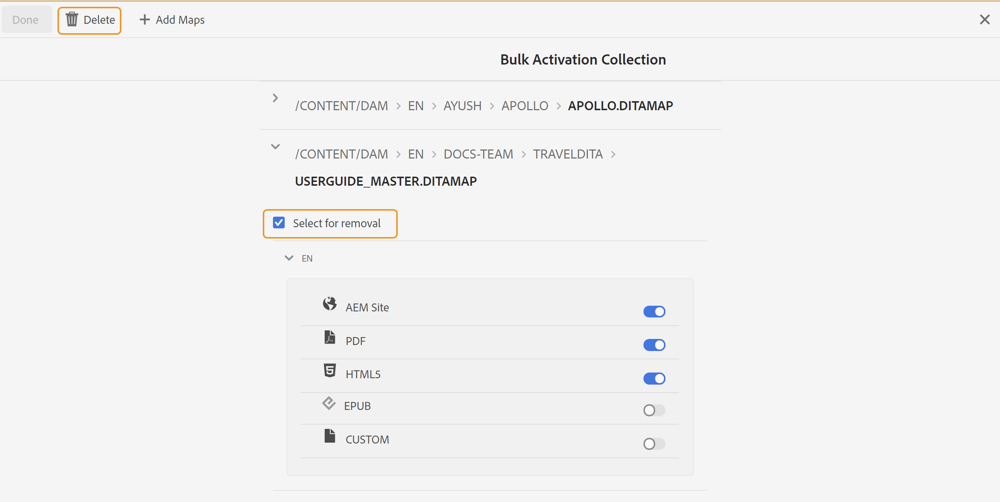

# Modificare una raccolta di mappe di attivazione collettiva {#id214GI40B0XA}

Puoi modificare una raccolta di mappe di attivazione in blocco aggiungendo o rimuovendo file di mappa o predefiniti da una raccolta. Per modificare una raccolta di mappe di attivazione in blocco, esegui i seguenti passaggi:

1. Seleziona **Guide** dall&#39;elenco degli strumenti.

1. Fai clic sul collegamento Adobe Experience Manager in alto e scegli **Strumenti**.

1. Fai clic sul pulsante **Dashboard di pubblicazione in blocco** piastrelle.

   Viene visualizzato un elenco delle raccolte di mappe di attivazione in blocco.

1. Seleziona la raccolta da modificare e fai clic su **Apri**.

1. Fai clic su **Modifica**.

   Viene visualizzata la pagina della raccolta di mappe di attivazione in blocco in cui vengono visualizzate le mappe insieme ai relativi predefiniti preconfigurati per ogni impostazione internazionale disponibile.

1. Usare il cursore per disattivare il predefinito di output desiderato da attivare o disattivare.

1. Se desideri rimuovere una mappa dalla raccolta, espandi la mappa e scegli la **Seleziona per rimozione** opzione .

1. Fai clic su **Elimina**.

   

   La mappa selezionata viene rimossa dalla raccolta di mappe di attivazione collettiva.

1. Fai clic su **Fine**.

**Argomento principale:**[ Attivazione in blocco di contenuti pubblicati](conf-bulk-activation.md)

