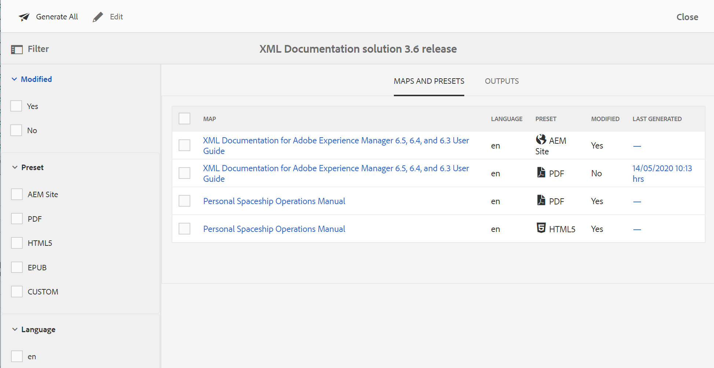

# Utilizzare la raccolta mappa per la generazione dell&#39;output {#id1723F20G0HS}

In qualsiasi organizzazione, un prodotto può avere più tipi di documentazione. In qualità di esperto di pubblicazione, desideri controllare l’output da generare per quale documento. Inoltre, dovrebbe essere possibile pubblicare in batch più documenti con un solo clic.

AEM Guide ti consente di organizzare i contenuti per la pubblicazione utilizzando un dashboard chiamato Raccolta mappe . Una raccolta di mappe consente di assemblare tutti i diversi tipi di documenti in una singola unità. È possibile scegliere il tipo di output da generare per ogni documento della raccolta Mappa. Inoltre, puoi anche generare l’output e visualizzare l’avanzamento della generazione dell’output dal dashboard di pubblicazione.

Map Collection consente di visualizzare eventuali modifiche apportate a una mappa dall’ultimo output pubblicato. Puoi visualizzare i dettagli nella scheda Mappe e predefiniti della raccolta Mappa e quindi ripubblicare l’output, se necessario. Per ulteriori informazioni, consulta Aggiunta di una mappa a una raccolta di mappe.

## Creare una raccolta di mappe e aggiungere mappe DITA

Per creare una raccolta mappa e aggiungere mappe DITA alla raccolta, esegui i seguenti passaggi:

1. Nell’interfaccia utente Assets, fai clic su **Mappa raccolte**.

   Se il collegamento Mappa raccolte non è disponibile, seleziona la **Navigazione** nella barra a sinistra, quindi fai clic su **Mappa raccolte**.

   

1. Inserisci un Titolo per la raccolta mappa.
1. Fai clic su **Crea**.

   Al momento della creazione della raccolta mappa viene visualizzato un messaggio di operazione riuscita.

1. Fai clic su **Chiudi** nel messaggio di successo.

   Il file mappa appena creato viene visualizzato nella pagina Mappa raccolte .

1. Fai clic sulla casella grigia nella porzione della raccolta da modificare.
1. Fai clic su **Modifica** quindi fai clic su **Aggiungi mappe**.
1. Individuare e aggiungere le mappe DITA che si desidera aggiungere alla raccolta Mappa.

   Per impostazione predefinita, tutti i predefiniti e le impostazioni internazionali associati alla mappa vengono aggiunti automaticamente.

1. Selezionare l&#39;uscita desiderata attivando o disattivando il pulsante scorrevole.
1. Fai clic su **Fine**.

   I file mappa DITA vengono aggiunti alla raccolta mappa.

Le seguenti opzioni di filtro e i dettagli della mappa vengono visualizzati nella pagina della raccolta:

- **Filtro:** La barra a sinistra mostra i seguenti filtri:
   - **Modificato**: È possibile selezionare Sì o No. Se si seleziona sì, nella tabella Mappe e predefiniti verranno visualizzate solo le mappe DITA modificate.
   - **Predefinito**: Seleziona un predefinito per il quale vuoi filtrare i file della mappa. Ad esempio, se scegli *Sito AEM* preseleziona, vengono mostrate solo le mappe che hanno *Sito AEM* predefinito di output configurato su di essi.
   - **Lingua**: È possibile selezionare uno dei codici di lingua disponibili e visualizzare solo la lingua selezionata nella tabella Mappe e predefiniti.
- **Mappe e predefiniti** tabella: La tabella Mappe e predefiniti presenta le informazioni nelle colonne seguenti:
   - **Mappa**: Mostra il titolo del file di mappa DITA.
   - **Lingua**: Mostra la lingua della mappa DITA.
   - **Predefinito**: Mostra il tipo di predefinito di output configurato nel file mappa.
   - **Modificato**: Indica se la mappa DITA viene aggiornata dopo l&#39;ultima pubblicazione. In base a queste informazioni, è possibile decidere se si desidera ripubblicare l&#39;output per questa mappa DITA o meno.
   - **Ultima generazione**: Mostra la data e l’ora dell’ultimo output generato.

## Configurare e generare l’output utilizzando una raccolta mappa

Per configurare e generare l’output utilizzando una raccolta mappa, esegui i seguenti passaggi:

1. Apri la raccolta mappa.
1. \(Facoltativo\) Effettua una delle seguenti operazioni in base alle tue esigenze:
   - Applica filtri dalla barra a sinistra per filtrare le mappe modificate, il predefinito di output o la lingua.
   - Se necessario, fai clic su **Modifica** e modificare l&#39;uscita desiderata attivando o disattivando il pulsante scorrevole.
1. Effettua una delle operazioni seguenti:

   - Per generare l&#39;output delle mappe selezionate, seleziona i file di mappa e fai clic su **Genera selezionati**.
   - Per generare l’output di tutte le mappe DITA con i relativi predefiniti configurati, fare clic su **Genera tutto**.

   >[!IMPORTANT]
   >
   > Se un processo di generazione dell&#39;output per una mappa preselezionata o DITA è in coda o in corso, non è possibile avviare un&#39;altra attività di generazione dell&#39;output per la stessa preimpostazione o mappa.

## Eliminare una raccolta Mappa o una mappa DITA dalla raccolta Mappa

- Per eliminare una raccolta mappa, selezionala nella pagina Mappa raccolta e fai clic su **Elimina**.
- Per eliminare una mappa DITA da una raccolta di mappe, aprire Raccolta mappe in modalità Modifica, selezionare il file di mappa DITA e fare clic su **Rimuovi dalla raccolta**.

   In questo modo verranno rimossi dalla raccolta Mappa anche eventuali predefiniti o impostazioni internazionali associati alla mappa DITA.

## Annullare un&#39;attività di generazione di output da una raccolta Mappa

Simile al modo di annullare un&#39;attività di generazione dell&#39;output dal [Console mappa DITA](generate-output-for-a-dita-map.md#id2061H100T5Z) o [Pubblica dashboard](generate-output-publish-dashboard.md#), è possibile annullare un&#39;attività di generazione dell&#39;output da una raccolta mappa. Accedi alla scheda Output di una raccolta mappa, vai all&#39;attività di pubblicazione che desideri annullare e fai clic sul pulsante **Annulla questo processo** per annullare l’attività di pubblicazione.

**Argomento principale:**[ Generazione di output](generate-output.md)

