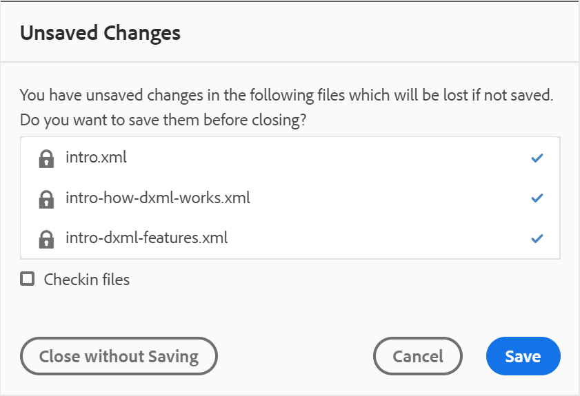

# Utilizzare l’Editor mappa avanzato {#id1942D0S0IHS}

L’Editor mappa avanzato è dotato di un’interfaccia utente intuitiva ed è simile all’Editor web. Quando si apre un file di mappa nell&#39;Editor Web, si ottiene un&#39;opzione per modificare il file di mappa utilizzando l&#39;interfaccia dell&#39;Editor mappa avanzato. L’Editor mappa avanzato consente di aggiungere riferimenti ad argomenti, riferimenti chiave, struttura il contenuto e altro ancora.

Oltre a modificare i file di mappa direttamente dall&#39;editor Web, è anche possibile aprire i file degli argomenti in una mappa per modificare l&#39;editor Web. Questo argomento illustra le funzioni dell&#39;Editor mappa avanzato e le modalità di apertura e modifica dei file in una mappa DITA nell&#39;Editor Web.

## Aggiungere argomenti a un file mappa

Esegui i seguenti passaggi per creare il file mappa utilizzando l’Editor mappa avanzato:

1. Nell’interfaccia utente Assets, individua il file mappa da modificare.

   >[!NOTE]
   >
   > Assicurati di non aver attivato la modalità Seleziona risorsa.

1. Per ottenere un blocco esclusivo sul file mappa, seleziona il file mappa e fai clic su **Estrai**.

   >[!NOTE]
   >
   > Una volta che hai un blocco esclusivo su un file mappa, altri utenti non sarebbero in grado di modificare la mappa. Tuttavia, potrebbero lavorare sugli argomenti all&#39;interno del file mappa. Se l&#39;amministratore ha configurato l&#39;editor Web per estrarre i file prima della modifica, non sarà possibile modificare un file finché non lo si estrae. Analogamente, se configurato, vi verrà chiesto di archiviare qualsiasi file estratto prima di chiuderlo

1. Con il file di mappa selezionato, fai clic su **Modifica argomenti**.

   {width="800" align="left"}

   Oppure, puoi anche selezionare la **Modifica argomenti** dal menu azioni del file mappa:

   {width="800" align="left"}

   Il file mappa viene aperto per la modifica in nell&#39;editor Web.

1. Fai clic sul pulsante **Modifica** icona.

   {width="550" align="left"}

   La mappa viene aperta nell’interfaccia dell’Editor mappa avanzato. Se hai aperto un nuovo file mappa, nell’editor viene visualizzato solo il titolo della mappa.

   {width="800" align="left"}

   - **A** - \(*Barra degli strumenti principale*\): Simile alla barra degli strumenti principale dell’Editor Web. Vedi [Barra degli strumenti principale](web-editor-features.md#id2051EA0G05Z) nell’editor Web per ulteriori dettagli.

   - **B** - \(*Barra degli strumenti secondaria*\) Questa è la barra degli strumenti secondaria che consente di lavorare con i file di mappa. Per ulteriori informazioni sulle funzionalità disponibili nella barra degli strumenti secondaria, consulta [Funzioni disponibili nella barra degli strumenti dell’Editor mappa avanzato](#id205DEC0005Z).

   - **C** - \(*Visualizzazioni mappa*\): Consente di passare dall’Editor mappa a Layout, Autore, Origine e Anteprima. La **Layout** visualizza consente di organizzare gli argomenti in una mappa DITA. In questo modo la struttura ad albero o la vista gerarchica della mappa. La **Autore** consente di modificare gli argomenti nell’Editor mappa. Questo dà anche la vista WYSIWYG del file mappa. La **Origine** visualizza consente di utilizzare il codice XML sottostante del file di mappa. L’anteprima offre una vista consolidata di tutti gli argomenti e le mappe secondarie all’interno del file della mappa. La **Chiudi** il link chiude il file mappa.

   - **D** - \(*Pannello a sinistra*\): Consente di accedere al pannello a sinistra, che consente di accedere a Preferiti, Archivio, Mappa, Struttura e altre funzioni. Per espanderlo o comprimerlo, fai clic sull’icona Espandi barra laterale \(\). Per maggiori dettagli sulle funzioni disponibili nel pannello a sinistra, vedi [Pannello a sinistra](web-editor-features.md#id2051EA0M0HS) nell&#39;editor Web.

   - **E** - \(*Area centrale*\): Mappa l’area di modifica del contenuto.

   - **F** - \(*Pannello a destra*\): Consente di accedere al pannello Proprietà. Puoi visualizzare le proprietà del contenuto e le proprietà della mappa dell’argomento o della mappa selezionati. Per ulteriori dettagli sulle funzionalità disponibili in questo pannello, vedi [Pannello a destra](web-editor-features.md#id2051EB003YK) nell&#39;editor Web.

1. Nel pannello a sinistra, passa alla **Visualizzazione archivio**.

1. Nell’archivio AEM, passa alla cartella contenente gli argomenti o le mappe secondarie che desideri aggiungere.

1. Seleziona l’argomento o mappa il file nel **Visualizzazione archivio** e trascinarlo nell&#39;area di modifica del contenuto della mappa \(middle\).

   L’argomento viene aggiunto nella mappa.

   {width="800" align="left"}

1. Per aggiungere gli argomenti successivi o una mappa secondaria, trascina e rilascia l’argomento o la mappatura secondaria nella posizione desiderata nella mappa.

   Considera i seguenti punti durante la creazione del file mappa:

   - Il file viene aggiunto in una posizione in cui la barra orizzontale viene visualizzata nell’area di modifica della mappa. Nella schermata seguente, il *Panoramica* verrà aggiunto tra *Descrizione generale* e *Launch e Landing Site* argomenti.

      {width="350" align="left"}

   - Per sostituire un argomento, posizionare l’argomento in alto, a sinistra o a destra dell’argomento che si desidera sostituire. Una barra Verticale a sinistra o a destra di un argomento indica che verrà sostituita con l’argomento rilasciato.

      {width="550" align="left"}

      Tuttavia, prima di sostituire un argomento, viene visualizzato un prompt di conferma. L’argomento viene sostituito solo dopo aver dato la conferma.

      {width="300" align="left"}

   - Se si aggiunge una sub-mappa alla mappa DITA, la sub-mappa viene visualizzata come collegamento nella mappa DITA. Per visualizzare tutti gli argomenti della mappa secondaria, Ctrl+clic sul collegamento della mappa secondaria. Il contenuto della mappa secondaria viene visualizzato in una nuova scheda. Allo stesso modo, per aprire un argomento dalla mappa DITA, fare clic sul collegamento dell&#39;argomento e aprirlo nella nuova scheda.

   - È possibile utilizzare i tasti di scelta rapida CTRL+Z e CTRL+Y oppure le rispettive icone nella barra degli strumenti per annullare o ripristinare eventuali modifiche nella mappa.

   - Per modificare la posizione di un argomento, seleziona l’argomento \(facendo clic sull’icona dell’argomento\), quindi trascinalo nella posizione desiderata nel file di mappa. Assicurati che la barra orizzontale sia visibile nel punto in cui desideri inserire l’argomento. Nella schermata seguente, l&#39;argomento *Launch e Landing Site* viene spostato dopo *Panoramica* argomento.

      {width="350" align="left"}

   - Per controllare le proprietà del file mappa, fai clic con il pulsante destro del mouse in un punto qualsiasi dell&#39;area di modifica della mappa e scegli **Proprietà** dal menu di scelta rapida. In base alla versione AEM, è possibile visualizzare proprietà come metadati, pianificazione dell&#39;attivazione \(de\)attivazione, riferimenti, stato del documento e altro ancora.

1. Fai clic su **Salva**.

## Funzioni disponibili nella barra degli strumenti dell’Editor mappa avanzato {#id205DEC0005Z}

La barra degli strumenti nell’Editor mappa avanzato è simile all’argomento Editor web. In entrambi gli editor le operazioni di base come attivare/disattivare il pannello a sinistra, salvare la mappa, creare una nuova versione della mappa, annullare/ripetere l’ultima operazione ed eliminare gli elementi selezionati sono comuni. Per informazioni dettagliate sul funzionamento di queste operazioni, consulta [Conoscere le funzionalità dell’editor web](web-editor-features.md#) sezione .

Nella barra degli strumenti delle viste Layout e Autore sono disponibili le seguenti operazioni specifiche per la mappa:

## Visualizzazione Layout {#id205DEC0005Z_layout_view}

Quando si apre una mappa per la modifica, viene aperta la vista Layout dell’Editor mappa. La vista Layout visualizza la gerarchia delle mappe in una vista ad albero e consente di organizzare gli argomenti in una mappa.

>[!NOTE]
>
> Nella vista Layout sono visualizzati solo i riferimenti presenti in una mappa. Se i riferimenti sono interrotti, a sinistra del riferimento viene visualizzato un piccolo simbolo a croce

Nella visualizzazione Layout è possibile effettuare le seguenti operazioni:

**Inserisci riferimento argomento** - 

Visualizza la finestra di dialogo di ricerca dell’argomento. Passa al file dell’argomento o della mappa che desideri inserire e fai clic su Seleziona per aggiungerlo alla mappa.
{width="800" align="left"}

**Inserisci gruppo di argomenti** - 

Inserisci `topicgroup` elemento. Per ulteriori informazioni sui raggruppamenti di argomenti, consulta la sezione [topicgroup](https://docs.oasis-open.org/dita/v1.0/langspec/topicgroup.html) documentazione in OASIS DITA Language Specification.

**Inserisci definizione chiave** - 

Visualizza la finestra di dialogo Inserisci chiave. Usa questa finestra di dialogo per definire la definizione della chiave da utilizzare nella mappa.

{width="300" align="left"}

**Inserisci prima/Inserisci dopo** -  / 

Visualizza la finestra di dialogo Inserisci elemento. Seleziona l’elemento da inserire nella mappa. A seconda dell’operazione, il nuovo elemento viene inserito prima o dopo l’elemento corrente nella mappa.

**Inserisci materia anteriore** - 

Questa icona viene visualizzata quando si apre una libreria per la modifica. È possibile inserire componenti all’inizio del libro come un sommario, un indice e un Elenco di tabelle.

**Inserisci materia posteriore** - 

Questa icona viene visualizzata quando si apre una libreria per la modifica. È possibile inserire componenti per una fine del libro come un Indice, un Glossario e una Lista di Figure.

**Sposta l’elemento selezionato a sinistra/a destra** -  / 

Fai clic sulla freccia sinistra per spostare l’argomento verso sinistra nella gerarchia. Questo essenzialmente promuove il rispettivo argomento un livello più alto nella gerarchia. Ad esempio, se fai clic sulla freccia sinistra mentre è selezionato un argomento secondario, diventa di pari livello l’argomento al di sopra di esso. Allo stesso modo, se fai clic sulla freccia destra, l’argomento viene spinto verso destra rendendolo figlio dell’argomento sopra di esso.

**Sposta l&#39;elemento selezionato in alto/in basso** - / 

Fai clic sulle icone a forma di freccia su o giù per spostare l’argomento verso l’alto o verso il basso nella gerarchia.

>[!NOTE]
>
> Puoi anche trascinare e rilasciare i riferimenti per spostarli in una mappa.

**Blocca/Sblocca** -  / 

Ottiene un blocco sul file mappa e rilascia il blocco. Se nel file della mappa sono presenti modifiche non salvate, al momento del rilascio del blocco viene richiesto di salvare il file della mappa. Le modifiche vengono salvate nella versione corrente del file mappa.

**Unisci** - 

Per ulteriori dettagli sull’unione di contenuti di una versione diversa dello stesso file o di un file diverso, consulta [Unisci](web-editor-features.md#id205DF04E0HS) nell&#39;editor Web.

**Cronologia delle versioni** - 

Controlla le versioni e le etichette disponibili sull&#39;argomento attivo e ripristina qualsiasi versione dall&#39;editor stesso.

**Etichetta versione** - 

Visualizza la finestra di dialogo di gestione dell’etichetta della versione. Seleziona una versione dall’elenco a discesa. Scegli l’etichetta da applicare alla versione selezionata e fai clic su **Aggiungi etichetta** per aggiungerlo.

**Opzioni di visualizzazione** - 

Visualizza un elenco a discesa che consente di visualizzare i numeri di riga, le caselle di controllo Mostra e Mostra nome file.

- **Mostra numeri di riga**

Mostra o nasconde il numero di riga per ogni argomento. I numeri di riga vengono visualizzati a seconda del livello nella gerarchia.

- **Mostra casella di controllo**

Mostra o nasconde una casella di controllo per ogni argomento. È possibile utilizzare la casella di controllo per selezionare l&#39;argomento\(s\) ed eseguire varie attività utilizzando il menu Opzioni. Per ulteriori dettagli, consulta la sezione [Opzioni](#id228ID8006H8) menu.

- **Mostra nome file**

Mostra il nome del file dei titoli degli argomenti.

>[!NOTE]
>
> Quando passi il puntatore sul titolo di un argomento, viene visualizzato il percorso del file.

**Visualizzare gli argomenti in base ai filtri condizionali** Se hai applicato condizioni a un argomento, a destra dell’argomento viene visualizzata un’icona di filtro. Quando passi il puntatore sull’icona di un filtro, viene visualizzata la condizione applicata e il relativo valore di attributo.

**Menu Opzioni nella vista Layout**

Oltre a organizzare gli argomenti nel file di mappa, è anche possibile eseguire le azioni seguenti utilizzando il menu Opzioni disponibile per un elemento nella visualizzazione Layout:

{width="650" align="left"}

- **Aggiungi**: Puoi scegliere di aggiungere un nuovo argomento o un riferimento vuoto dall’Editor mappa:
   - **Riferimento vuoto**: Questa opzione consente di aggiungere un riferimento vuoto nella mappa DITA. In seguito, è possibile fare doppio clic sul riferimento vuoto inserito e aggiungere i dettagli dell&#39;argomento. Per ulteriori dettagli, consulta la sezione [Creazione di un argomento](web-editor-features.md#id228ICI0105U) nell&#39;editor Web.
   - **Nuovo argomento**: Quando scegliete di creare un nuovo argomento dal menu, viene visualizzata la finestra di dialogo Crea nuovo argomento. Nella finestra di dialogo Crea nuovo argomento specificare i dettagli richiesti e fare clic su Crea. Per ulteriori dettagli, consulta la sezione [Creazione di un argomento](web-editor-features.md#id228ICI0105U) nell&#39;editor Web.
- **Sposta**: Puoi scegliere di spostare un argomento in alto/in basso/a destra/a sinistra nella gerarchia.Puoi anche trascinare un argomento o una mappa dal pannello archivio alla mappa aperta nell’Editor mappa.
- **Annulla**: Annulla l’ultima operazione nella vista Layout.
- **Ripeti**: Ripristina l’ultima operazione nella vista Layout.
- **Copia**: Copia il riferimento selezionato dal file di mappa.

   >[!NOTE]
   >
   > È possibile visualizzare e quindi selezionare le caselle di controllo per copiare più riferimenti.

- **Incolla**: Incolla i riferimenti copiati nella posizione corrente nella gerarchia.
- **Elimina**: Elimina i riferimenti selezionati dal file di mappa.

   >[!NOTE]
   >
   > È possibile visualizzare e quindi selezionare le caselle di controllo per eliminare più riferimenti.

## Pannello a destra nell’Editor mappa

Il pannello a destra visualizza le proprietà del contenuto e le proprietà della mappa nella vista Layout dell’Editor mappa.

**Proprietà contenuto**

Il pannello Proprietà contenuto contiene informazioni sul tipo di argomento attualmente selezionato nella mappa, sul relativo URL di collegamento e sui relativi attributi. Per ulteriori dettagli, consulta [Proprietà contenuto](web-editor-features.md#id228IDB00HMM) nell&#39;editor Web.

- **Altri attributi** Se l’amministratore ha creato un profilo per gli attributi, riceverai tali attributi insieme ai relativi valori configurati. Utilizzando il pannello delle proprietà del contenuto, puoi scegliere tali attributi e assegnarli al contenuto pertinente nell’argomento. Puoi anche assegnare gli attributi configurati dall’amministratore sotto la sezione **Attributi di visualizzazione** nelle impostazioni dell’editor. Gli attributi definiti per un elemento vengono visualizzati nella vista Layout e Struttura. Questo consente di esaminare rapidamente tutti gli argomenti di una mappa per i quali è definito un attributo specifico. Ad esempio, tutti gli argomenti con l’attributo platform definito come &quot;Android&quot;.

   {width="650" align="left"}

   Per ulteriori dettagli, consulta la sezione *Attributi di visualizzazione* all&#39;interno del *Impostazioni editor* descrizione della funzione nel [Pannello a sinistra](web-editor-features.md#id2051EA0M0HS) sezione .

- **Metadati** Utilizzando i metadati , puoi impostare le informazioni sui metadati. Puoi definire il Titolo della barra di navigazione, Testo collegamento, Descrizione breve e Parole chiave.

Per ulteriori informazioni sugli attributi e i metadati standard dell&#39;argomento, consulta la sezione [topicref](https://docs.oasis-open.org/dita/v1.2/os/spec/langref/topicref.html) documentazione in OASIS DITA Language Specification.

**Proprietà mappa**

Visualizza la finestra di dialogo Proprietà mappa in cui puoi impostare gli attributi e le informazioni sui metadati per la mappa.

## Visualizzazione Autore {#id205DEC0005Z_author_view}

La **Autore** visualizza consente di modificare la mappa DITA nell&#39;editor Web. Mostra la visualizzazione WYSIWYG dell’Editor mappa e alcune delle icone visualizzate nella visualizzazione Autore sono uguali alla visualizzazione Layout. Per ulteriori dettagli, consulta [Visualizzazione Layout](#id205DEC0005Z_layout_view). Inoltre, puoi vedere le icone seguenti ed eseguire le attività correlate dalla vista Autore:

**Inserisci prima/Inserisci dopo** -  / 

Visualizza la finestra di dialogo Inserisci elemento. Seleziona l’elemento da inserire nella mappa. A seconda dell’operazione, il nuovo elemento viene inserito prima o dopo l’elemento corrente nella mappa.

**Inserisci elemento** - 

Visualizza la finestra di dialogo Inserisci elemento. Seleziona l’elemento da inserire. È possibile utilizzare la tastiera per scorrere l’elenco degli elementi e premere Invio per inserire l’elemento richiesto. In alternativa, puoi fare clic direttamente sull’elemento per inserirlo nella mappa.

**Inserisci tabella di relazione** - 

Inserisce una tabella di relazione nella mappa. Poiché il concetto di utilizzo della tabella di relazione è lo stesso illustrato nella sezione Editor mappa di base, vedi [Utilizzare le tabelle di relazione nell&#39;Editor mappa di base](map-editor-basic-map-editor.md#id1944B0I0COB) per ulteriori dettagli.

**Inserisci contenuto riutilizzabile** - 

Visualizza la finestra di dialogo Riutilizza contenuto . Usa questa finestra di dialogo per inserire il contenuto da riutilizzare nella mappa.

**Aggiorna attributo titolo di navigazione** - 

Sincronizza la `title` elemento di un file di riferimento in una mappa con il valore specificato nel relativo `@navtitle` attributo. È possibile aggiungere diversi tipi di file di riferimento in una mappa, ad esempio mappe di argomento, riferimenti, attività, \(sub\) e così via. La maggior parte di questi file supporta il `@navtitle` attributo. Se un file contiene `@navtitle` attributo , quindi `@navtitle` l&#39;attributo per lo stesso file nella mappa viene aggiornato. Nel caso in cui `@navtitle` l&#39;attributo non è presente, quindi il `@navtitle` viene aggiunto a tale file di riferimento e al relativo `title` viene inoltre aggiornato per visualizzare il `@navtitle`.

>[!NOTE]
>
> L’amministratore può configurare l’aggiunta automatica `@navtitle` a ogni file di riferimento aggiunto a una mappa. Per ulteriori dettagli sulla configurazione dell’aggiunta automatica `@navtitle` attributo, vedi *Includi l&#39;attributo @navtitle per impostazione predefinita* in Installare e configurare le guide di Adobe Experience Manager as a Cloud Service.

Fai clic sull’icona Aggiorna attributo titolo di navigazione per sincronizzare il `title` e `@navtitle` i valori dell&#39;attributo.

**Attiva/Disattiva visualizzazione tag** - 

Mostra o nasconde i tag XML. I tag fungono da indizi visivi che indicano il limite di un elemento. In questa modalità, se desideri inserire un riferimento a un argomento o a una mappa, trascina e rilascia il file desiderato prima o dopo il tag . La barra orizzontale non viene visualizzata in modalità Visualizzazione tag.

**Attiva/Disattiva le modifiche** - 

È possibile tenere traccia di tutti gli aggiornamenti apportati al file mappa abilitando la modalità Track Changes (Rileva modifiche). Dopo aver abilitato le modifiche alla traccia, tutti gli inserimenti e le eliminazioni vengono acquisiti nel documento. Per ulteriori dettagli, consulta [Attiva/Disattiva le modifiche](web-editor-features.md#id205DF0203Y4) nell&#39;editor Web.

**Crea attività di revisione** - 

È possibile creare un&#39;attività di revisione dell&#39;argomento corrente o del file di mapping direttamente dall&#39;editor Web. Aprire il file per il quale si desidera creare l&#39;attività di revisione e fare clic su Crea attività di revisione per avviare il processo di creazione della revisione. Seguire le istruzioni fornite nella [Esamina argomenti o mappe](review.md#) per ulteriori dettagli.

## Modifica argomenti tramite mappa DITA {#id17ACJ0F0FHS}

La modifica di un singolo argomento non fornisce all’autore il contesto completo. Un autore non avrebbe informazioni su dove un argomento viene inserito in una mappa DITA. Senza queste informazioni contestuali, la creazione di contenuti diventa un po&#39; difficile per gli autori.

AEM Guide consente agli autori di aprire una mappa DITA nell’Editor web e visualizzare il posizionamento degli argomenti all’interno della mappa. Questo consente agli autori di sapere dove si trova esattamente l’argomento all’interno della mappa e di creare contenuti più rilevanti. Inoltre, se sono presenti più autori che lavorano a un progetto, possono sapere quali argomenti sono disponibili nella mappa e riutilizzare il contenuto, laddove necessario.

Per modificare gli argomenti tramite una mappa DITA, esegui i seguenti passaggi:

1. Nell’interfaccia utente Assets, passa alla mappa DITA contenente gli argomenti che desideri modificare.
1. Fare clic sulla mappa DITA per aprirla nella console Mappa DITA.
1. Seleziona la **Argomenti** scheda per visualizzare un elenco degli argomenti disponibili nella mappa DITA.

   >[!TIP]
   >
   > La scheda Argomenti consente di scaricare il file mappa con i relativi dipendenti. Per ulteriori dettagli, consulta [Esportare un file di mappa DITA](authoring-download-assets.md#id218UBA00IXA).

1. Nella barra degli strumenti principale, fai clic su **Modifica argomenti**.

   La mappa DITA viene visualizzata nell&#39;editor Web.

   >[!NOTE]
   >
   > È inoltre possibile selezionare il file di mappa DITA nell’interfaccia utente Assets e fare clic su **Modifica argomenti** nella barra degli strumenti principale per avviare l&#39;editor Web.

   {width="350" align="left"}

1. \(*Facoltativo*\) È inoltre possibile selezionare un argomento dalla mappa e estrarre il file prima di modificarlo. Per estrarre i file, selezionare uno o più file dal riquadro a sinistra e fare clic su **Pagamento**. È inoltre possibile rilasciare il blocco su qualsiasi file selezionando il file estratto e facendo clic sul **Annulla pagamento e sblocca** nella vista Mappa.

   >[!IMPORTANT]
   >
   > Se l&#39;amministratore ha configurato il **Disattiva modifica senza pagamento** quindi devi estrarre il file prima di modificarlo. Se non si estrae il file, il documento verrà aperto nell&#39;editor in modalità di sola lettura.

   La schermata seguente evidenzia le icone per Checkout e Lock \(A\), Cancel Checkout and Unlock \(B\), Save As New Version and Unlock \(C\), Edit \(D\), Preview \(E\), icone diverse che mostrano diversi tipi di file DITA \(F\) e file estratti \(G\).

   {width="550" align="left"}

1. Fare clic su un collegamento a un argomento per aprirlo nell&#39;Editor Web per la modifica.

   Puoi aprire più argomenti nell’editor e ogni argomento viene aperto in una nuova scheda nell’editor. Anche se la mappa DITA contiene mappe secondarie, gli argomenti delle mappe secondarie vengono aperti in una nuova scheda per la modifica. Per visualizzare gli argomenti sotto una mappa secondaria, puoi fare clic su ed espandere la mappa secondaria.

   {width="800" align="left"}

   Se fai clic su un file di mappa, la mappa viene aperta in una nuova scheda del browser Web.

1. Dopo aver completato la modifica degli argomenti, puoi effettuare le seguenti operazioni:

   - Puoi salvarli singolarmente. Se fai clic su **Chiudi senza salvataggio** in questi argomenti viene visualizzata una finestra di dialogo che richiede di salvare gli argomenti non salvati:

      {width="550" align="left"}

      È possibile scegliere di salvare tutti gli argomenti selezionati o deselezionare quelli che non si desidera salvare.

   - Puoi archiviare l’argomento utilizzando **Salva come nuova versione e sblocca** pulsante . Quando salvi una revisione dell&#39;argomento, viene creata una nuova revisione e viene rilasciato anche il blocco.
   - Se l’amministratore ha abilitato l’opzione di archiviazione dei file alla chiusura, verrà visualizzata una richiesta di salvataggio dei file alla chiusura dei file estratti. Con questa opzione abilitata, quando chiudi l’editor con file modificati, viene visualizzato l’elenco dei file estratti da salvare. I file estratti vengono visualizzati con un’icona a forma di lucchetto:

      {width="550" align="left"}

      - Clic su **Chiudi senza salvataggio** consente di chiudere i file senza salvare alcuna modifica.

      - Fai clic su **Salva** il pulsante salva le modifiche, ma non archivia i file.

      - Selezione della **Controllo dei file** e quindi facendo clic su **Salva** controlla i file \(crea un&#39;altra versione\) e salva anche i file.

## Anteprima di una mappa

Oltre a poter vedere la posizione di ogni file di argomento all’interno di una mappa, è auspicabile che il contenuto della mappa sia visibile in un flusso consecutivo. La funzione Anteprima mappa consente di visualizzare con un solo clic l’intero contenuto del file mappa. Non è necessario generare un output del file di mappa per vedere come apparirà l’intera mappa una volta pubblicata. Puoi semplicemente accedere all&#39;anteprima della mappa e tutti gli argomenti e le mappe secondarie sono resi sotto forma di un libro.

Puoi accedere all’anteprima di una mappa da:

- **Interfaccia utente Assets**: Nell’interfaccia utente Assets, individua la posizione della mappa, seleziona il file della mappa e scegli **Anteprima mappa** nella barra degli strumenti. L’anteprima della mappa viene visualizzata in una nuova scheda. Puoi visualizzare il contenuto di tutti gli argomenti in modalità anteprima. In questa visualizzazione non è possibile modificare alcun argomento.

   >[!NOTE]
   >
   > Se la *Anteprima mappa* l’opzione non è visibile nella barra degli strumenti principale, ma potrebbe essere stata spostata sotto **Altro** menu della barra degli strumenti.

- **Editor mappa avanzato**: Nell’Editor mappa avanzato, fai clic sull’icona Anteprima per visualizzare l’anteprima della mappa corrente.

   {width="350" align="left"}

   Nella modalità di anteprima puoi eseguire le seguenti attività aggiuntive:

   - Fare clic con il pulsante destro del mouse su un argomento e selezionare **Modifica** per aprire l’argomento da modificare in una nuova scheda.

      >[!NOTE]
      >
      > Se non disponi dei diritti di modifica, l’argomento verrà aperto in modalità di sola lettura.

   - Passa all’argomento desiderato facendo clic sul titolo dell’argomento nella struttura della mappa \(nel pannello a sinistra\).

   - L’argomento corrente nell’anteprima mappa viene evidenziato anche nella struttura della mappa.

**Argomento principale:**[ Utilizzare l’Editor mappa](map-editor.md)
