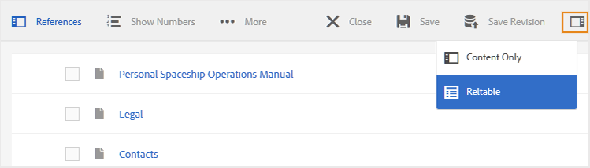

# Utilizzare l&#39;Editor mappa di base {#id1942CM005Y4}

L&#39;Editor mappa di base fornisce una facile funzione di trascinamento della selezione per aggiungere argomenti dall&#39;archivio AEM per creare la mappa DITA o la libreria. È possibile aggiungere argomenti nidificati, tabelle di relazione \(reltable\), attributi e informazioni sui metadati, nonché convalidare la mappa per verificarne la correttezza.

>[!NOTE]
>
> Se l&#39;amministratore ha abilitato l&#39;opzione Editor mappa avanzato, non sarà possibile accedere all&#39;Editor mappa di base. Per impostazione predefinita, tutti i file mappa vengono aperti nell’Editor mappa avanzato.

Le sezioni seguenti descrivono le varie funzioni disponibili nell&#39;Editor mappa di base.

## Aggiungere argomenti a un file mappa {#id193CBL0505Z}

Una volta creato un file di mappa, è necessario aggiungere argomenti al file di mappa. Utilizzando l&#39;Editor mappa di base, è possibile aggiungere argomenti, tabelle di relazioni o altri file di mappa.

Esegui i seguenti passaggi per creare il file mappa:

1. Nell’interfaccia utente Assets, individua il file mappa da modificare.

1. Per ottenere un blocco esclusivo sul file mappa, seleziona il file mappa e fai clic su **Estrai**.

   >[!NOTE]
   >
   > Una volta che hai un blocco esclusivo su un file mappa, altri utenti non sarebbero in grado di modificare la mappa. Tuttavia, potrebbero lavorare sugli argomenti all&#39;interno del file mappa.

1. Con il file di mappa selezionato, fai clic su **Modifica**.

   Il file mappa viene aperto per la modifica nell’Editor mappa. Utilizzando l’Editor mappa, puoi creare una mappa utilizzando gli argomenti attualmente disponibili nella barra Riferimenti.

   

1. Utilizzo della **Riferimenti** barra , passa alla cartella contenente gli argomenti o le mappe secondarie che desideri aggiungere.

   >[!NOTE]
   >
   > Puoi aggiungere argomenti o mappe secondarie da qualsiasi cartella nella barra Riferimenti.

1. Per aggiungere il primo argomento alla mappa, trascinarlo nell&#39;Editor mappa di base.

   >[!NOTE]
   >
   > Dopo aver aggiunto il primo collegamento, il collegamento Aggiungi nuovo riferimento è disponibile quando passi il cursore del mouse su un argomento esistente nella mappa.

1. Per aggiungere gli argomenti successivi o una mappa secondaria, trascina e rilascia l’argomento o la mappatura secondaria nella posizione desiderata nella mappa.

   Se si aggiunge una sub-mappa alla mappa DITA, la sub-mappa viene visualizzata come collegamento nella mappa DITA. Per visualizzare tutti gli argomenti della mappa secondaria, fai clic sul collegamento della mappa secondaria. Il contenuto della mappa secondaria viene visualizzato in una nuova scheda.

   >[!NOTE]
   >
   > Se rilasci un nuovo argomento in un argomento esistente nella mappa, riceverai un messaggio relativo alla sostituzione dell’argomento. Fare clic su Sì se si desidera sostituire l&#39;argomento, fare clic su No se non si desidera sostituire l&#39;argomento. È possibile utilizzare CTRL+Z e CTRL+Y per annullare o ripristinare eventuali modifiche nella mappa.

1. Fai clic su **Salva**.

## Funzioni disponibili nella barra degli strumenti dell’Editor mappa di base

La barra degli strumenti principale nell&#39;Editor mappa di base consente di eseguire le seguenti operazioni:

**R: Ricerca**

Puoi cercare e includere gli argomenti richiesti da DAM. Facendo clic su questa icona viene visualizzata la finestra di dialogo Ricerca:

Immetti le parole chiave che desideri cercare, queste parole chiave sono abbinate al nome del file dell&#39;argomento, al contenuto e anche ai valori dell&#39;attributo. Una volta disponibili i risultati della ricerca, seleziona gli argomenti desiderati e fai clic sul pulsante Verifica per aggiungere i file selezionati alla fine della struttura della mappa. Puoi filtrare i risultati della ricerca specificando i parametri Modifica data .

**B: Gruppo**

Fai clic sulla casella di controllo a sinistra degli argomenti e fai clic su Raggruppa nella barra degli strumenti per raggruppare gli argomenti selezionati. Per ulteriori informazioni sui raggruppamenti di argomenti, consulta la sezione [topicgroup](https://docs.oasis-open.org/dita/v1.0/langspec/topicgroup.html) documentazione in OASIS DITA Language Specification.

**C: Elimina**

Fai clic sulla casella di controllo a sinistra di un argomento e fai clic su Elimina nella barra degli strumenti per rimuovere gli argomenti selezionati dalla mappa.

**D: Mostra numeri/Nascondi numeri**

Visualizza la numerazione \(o hide\) per gli argomenti della mappa.

**E: Convalida**

Controlla se la mappa è valida o presenta errori.

**F: Modalità predefinita/Modalità XML**

In **Modalità predefinita**, facendo clic su un collegamento di argomento viene visualizzata l’anteprima dell’argomento in una nuova scheda. Fai clic sul pulsante **Modalità predefinita** icona cambia la sua modalità in **Modalità XML**. In **Modalità XML**, facendo clic in un punto qualsiasi di una riga dell’argomento viene visualizzato il codice XML sottostante dei riferimenti all’interno dell’argomento. Nella visualizzazione XML di origine è presente un **Rientro automatico** opzione che riorganizza il codice XML in formato presentabile e facilmente leggibile. Se si modifica manualmente una mappa, vengono eseguiti anche controlli di convalida. Nel caso in cui il codice XML contenga errori, lo stesso viene evidenziato nel **Modalità XML** e non è consentito salvare il file di mappa DITA. Per visualizzare il codice XML per l&#39;intera mappa, fare clic in un punto qualsiasi al di fuori del limite dell&#39;argomento.

**Nota:** In Modalità predefinita è possibile utilizzare le scelte rapide da tastiera per annullare \(`Ctrl+z`\) o Ripristina \(`Ctrl+y`\) l&#39;ultima azione.

**G: Proprietà mappa**

Visualizza la finestra di dialogo Proprietà mappa in cui puoi impostare gli attributi e le informazioni sui metadati per la mappa. Per aggiungere un attributo, fai clic sul pulsante **Aggiungi** nell’angolo in basso a sinistra della finestra di dialogo per ottenere il **Attributo** elenco a discesa. Dall’elenco, seleziona l’attributo da aggiungere. Se l’attributo selezionato dispone di valori predefiniti specificati nella DTD, tali valori verranno presentati in un nuovo elenco a discesa. Puoi selezionare il valore desiderato dall’elenco a discesa. Se non è presente alcun valore predefinito, verrà visualizzata una casella di testo per immettere un valore per l&#39;attributo selezionato.

## Funzioni disponibili a livello di argomento nell&#39;Editor mappa di base

Quando si posiziona il puntatore del mouse su un argomento o su un file di mappatura secondaria nell&#39;Editor mappa di base, è possibile eseguire le seguenti operazioni:

**R: Sposta a sinistra o Sposta a destra**

Fai clic sulla freccia sinistra o destra delle icone per spostare l’argomento a sinistra o a destra. Lo spostamento di un argomento in questo modo lo rende un elemento secondario \(nest\) o di pari livello \(remove nesting\) rispetto all&#39;argomento sopra di esso.

**B: Proprietà**

Fare clic sull&#39;icona Proprietà per aprire la finestra di dialogo Proprietà riferimento argomento. Utilizzando questa finestra di dialogo, puoi impostare gli attributi dell’argomento e le informazioni sui metadati. Per ulteriori informazioni sugli attributi e i metadati standard dell&#39;argomento, consulta la sezione [topicref](https://docs.oasis-open.org/dita/v1.2/os/spec/langref/topicref.html) documentazione in OASIS DITA Language Specification.

**C: Aggiungi nuovo riferimento**

Fai clic sull’icona Aggiungi nuovo riferimento per aggiungere un nuovo riferimento come elemento di pari livello dell’argomento corrente.

**D: Aggiungi nuova definizione chiave**

Fai clic sull’icona Chiave per aggiungere una nuova definizione di chiave. Le chiavi sostituite o quelle già definite nella mappa vengono visualizzate in rosso. Se fai clic sull&#39;icona Proprietà in una definizione chiave, viene visualizzata la finestra di dialogo Proprietà chiave.

## Utilizzare le tabelle di relazione nell&#39;Editor mappa di base {#id1944B0I0COB}

Gli editor di mappe di AEM Guide sono dotati di una potente funzione che consente di creare e modificare tabelle di relazioni nella mappa DITA.

Per utilizzare le tabelle di relazione nell&#39;Editor mappa di base, effettua le seguenti operazioni:

1. Nell’interfaccia utente Assets, passare alla mappa DITA in cui si desidera creare la tabella di relazione.

1. Fare clic sulla mappa DITA per aprirla nella console Mappa DITA.

1. Seleziona la **Argomenti** scheda per visualizzare un elenco degli argomenti disponibili nella mappa DITA.

   >[!TIP]
   >
   > La scheda Argomenti consente di scaricare il file mappa con i relativi dipendenti. Per ulteriori dettagli, consulta [Esportare un file di mappa DITA](authoring-download-assets.md#id218UBA00IXA).

1. Nella barra degli strumenti principale, fai clic su **Modifica**.

   Il file mappa viene aperto nell&#39;Editor mappa di base.

1. Seleziona **Relabile** dalla barra degli strumenti.

   

1. Trascina gli argomenti dall’elenco degli argomenti all’editor reltable.

   >[!NOTE]
   >
   > Puoi aggiungere argomenti da qualsiasi cartella nella barra Riferimenti.

   

1. Per aggiungere un’intestazione alla tabella di relazione, fai clic su **Aggiungi reheader**.

1. Per aggiungere una colonna alla tabella di relazione, fare clic su **Aggiungi una colonna**.

   

1. Fai clic su **Salva**.

Puoi anche eseguire le seguenti azioni dall’editor tabella relazioni:

**Elimina righe o colonne**

Se desideri eliminare una colonna dalla tabella, seleziona la casella di controllo nell’intestazione della colonna e fai clic su Elimina. Per rimuovere una riga dalla tabella, selezionare la casella di controllo nella prima colonna della riga corrispondente e fare clic su Elimina.

**Eliminare un argomento**

Per eliminare un argomento dalla tabella, fai clic sull’icona a forma di croce accanto all’argomento.

**Elimina la tabella delle relazioni**

Se si desidera eliminare la tabella di relazione, fare clic in un punto qualsiasi al di fuori della tabella di relazione e fare clic su Elimina.

**Argomento principale:**[ Utilizzare l’Editor mappa](map-editor.md)

