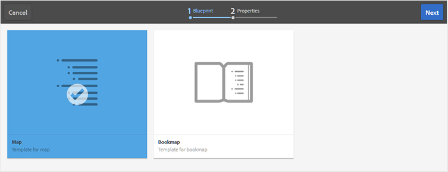

# Creare una mappa {#id176FEN0D05Z}

AEM Guide fornisce due modelli di mappa pronti all’uso: mappa DITA e mappa Bookmap. Puoi anche creare modelli di mappa personalizzati e condividerli con gli autori per creare file di mappa.

Esegui i seguenti passaggi per creare un file di mappa:

1. Nell’interfaccia utente di Assets, individua il percorso in cui desideri creare il file di mappa.

1. Fai clic su **Crea** \> **Mappa DITA**.

1. Nella pagina Blueprint, seleziona il tipo di modelli di mappa che desideri utilizzare e fai clic su **Successivo**.

   >[!NOTE]
   >
   > Il modo in cui gli argomenti vengono indicati in un file di mappa dipende dal modello di mappa. Ad esempio, se selezioni il modello Mappa, l&#39;argomento fa riferimento a \(`topicref`\) vengono utilizzati per fare riferimento agli argomenti. Nel caso di una mappa di registro, i riferimenti agli argomenti vengono creati utilizzando `chapter` elemento in DITA.

   {width="650" align="left"}

1. Nella pagina Proprietà , specifica la mappa **Titolo**.

1. \(Facoltativo\) Specificare il file **Nome**.

   Se l’amministratore ha configurato il nome file automatico in base all’impostazione UID, non verrà visualizzata l’opzione per specificare il nome file. Al file viene assegnato automaticamente un nome di file basato su UUID.

   Se l’opzione di denominazione dei file è disponibile, viene suggerito automaticamente anche il nome in base al Titolo della mappa. Se desideri specificare manualmente il nome del file di mappa, assicurati che il nome del file non contenga spazi, apostrofi o parentesi graffe e termini con `.ditamap`.

1. Fai clic su **Crea**.

   Viene visualizzato il messaggio Mappa creata .

   Ogni nuovo file mappa creato dall’interfaccia utente Assets **Crea** \> **Mappa DITA** oppure all’Editor web viene assegnato un ID mappa univoco. Inoltre, la nuova mappa viene salvata come ultima copia di lavoro in DAM. Fino a quando non si salva una revisione di una mappa appena creata, nella cronologia delle versioni non verrà visualizzato alcun numero di versione. Se apri la mappa per la modifica, le informazioni sulla versione vengono visualizzate nell’angolo superiore destro della scheda del file mappa:

   {width="650" align="left"}

   Le informazioni sulla versione di una mappa appena creata vengono visualizzate come *nessuno*. Quando si salva una nuova versione, viene assegnato un numero di versione pari a 1.0. Per ulteriori informazioni sul salvataggio di una nuova versione, vedere [Salva come nuova versione](web-editor-features.md#save-as-new-version-id209ME400GXA).

   Puoi scegliere di aprire la mappa per la modifica nell’editor mappa configurato o salvare il file mappa nell’archivio AEM.

   >[!NOTE]
   >
   > Per utilizzare l&#39;Editor mappa avanzato, accedere al file mappa nell&#39;Editor Web. Se l’amministratore ha configurato l’Editor mappa avanzato come editor predefinito nei file di mappa, il file di mappa viene aperto direttamente nell’Editor mappa avanzato per la modifica. Vedi *Imposta l’Editor mappa avanzato come predefinito* in Installazione e configurazione delle guide Adobe Experience Manager as a Cloud Service.

**Argomento principale:**[ Utilizzare l’Editor mappa](map-editor.md)
