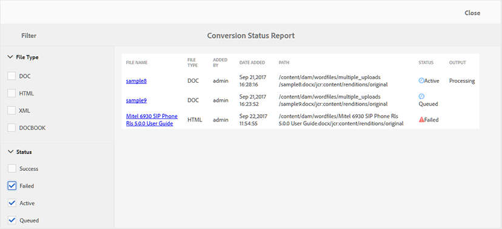

# Rapporto sullo stato di conversione {#id205BBA00WZZ}

AEM Guide fornisce una solida funzione di conversione per convertire documenti di vari formati in DITA. Il rapporto sullo stato di conversione fornisce una visualizzazione consolidata di tutte le attività di conversione eseguite da Guide AEM.

Esegui i seguenti passaggi per visualizzare il rapporto sullo stato di conversione:

1. Fai clic sul collegamento Adobe Experience Manager in alto e scegli **Strumenti**.

1. Seleziona **Guide** dall&#39;elenco degli strumenti.

1. Fai clic sul pulsante **Rapporto sullo stato di conversione** piastrelle.

   Viene visualizzato il Rapporto sullo stato di conversione per tutte le attività di conversione eseguite sul sistema.

   

1. La pagina del rapporto è divisa in due parti:

   - **Filtro:**

      Puoi filtrare i dati del rapporto in base al tipo di file e allo stato di conversione. In Tipo file è possibile scegliere di visualizzare i dati del report per i documenti di Word, i tipi di documenti strutturati di HTML, XML e DocBook. In Stato è possibile scegliere di visualizzare i dati del rapporto per le attività eseguite correttamente, Non riuscite, Attive o In coda.

      Nella schermata seguente vengono visualizzati i dati del rapporto per le attività di conversione con stato Non riuscito, Attivo e In coda.

      

   - **Dati dei rapporti:**

      I dati del rapporto contengono le colonne seguenti:

      - **Nome file**: Nome del file di origine in cui è stato eseguito il processo di conversione. Facendo clic sul collegamento Nome file si accede alla posizione del documento di origine.

      - **Tipo di file**: Tipo del documento di origine, che può essere Word, HTML strutturato, XML e DocBook.

      - **Aggiunto da**: Nome dell’utente che ha eseguito l’attività di conversione.

      - **Data di aggiunta**: Data di esecuzione dell&#39;attività. Facendo clic sul collegamento Data di aggiunta, si scarica il file di registro.

      - **Percorso**: Percorso completo del documento di origine.

      - **Stato**: Stato delle attività di conversione: operazione riuscita, non riuscita, attiva o in coda.

      - **Uscita**: Percorso del documento convertito. Facendo clic sul collegamento Output si accede alla posizione in cui viene salvato l’output.

**Argomento principale:**[ Rapporti](reports-intro.md)

