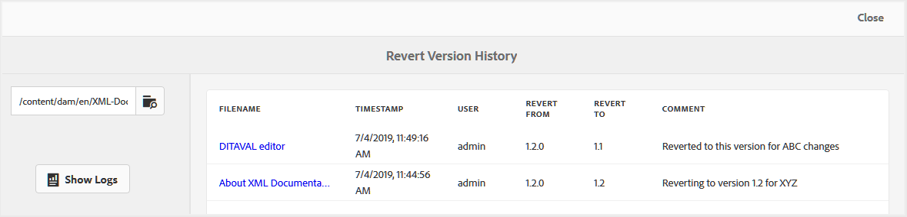

# Rapporto sulla cronologia delle versioni dei file ripristinati {#id205BBC00PRK}

Quando lavori su più versioni simultanee insieme a più autori, il contenuto è associato a più versioni. Possono essere presenti alcune informazioni comuni su più versioni, che autori diversi possono utilizzare nel loro progetto. Per gestire tali assegnazioni di lavoro, gli autori potrebbero finire con più versioni di file. Tali versioni potrebbero semplicemente essere una versione più recente di un file o un ripristino di una versione precedente. È complesso identificare quando e perché è stato ripristinato un file.

AEM Guide consente di generare un rapporto sulla cronologia delle versioni per un singolo file o per tutti i file presenti in una cartella. Questa cronologia delle versioni offre una vista consolidata di tutte le versioni di un file ripristinate e di chi le ha create e del motivo per cui sono state create.

Puoi accedere a questo rapporto dalle seguenti posizioni:

- **Interfaccia utente Assets**: selezionando un file e aprendo la **Cronologia versioni** dalla barra a sinistra. La **Cronologia versioni** la visualizzazione contiene **Ripristino dei registri delle versioni** nella parte inferiore del pannello. Quando fai clic su questo collegamento, viene visualizzata la cronologia delle versioni ripristinate del file selezionato.

   

- **Anteprima argomento**: quando visualizzi l’anteprima di un argomento, puoi anche visualizzare la **Cronologia versioni** dalla barra a sinistra. Verrà visualizzato un pannello simile all’interfaccia utente Assets da cui è possibile fare clic sul pulsante **Ripristino dei registri delle versioni** collegamento per accedere alla cronologia delle versioni ripristinate del documento attivo.

- **Sezione Strumenti di AEM**: è inoltre possibile accedere a questo rapporto dalla sezione Strumenti AEM. La procedura seguente spiega come accedere alla cronologia delle versioni ripristinate dalla sezione Strumenti AEM .

Esegui i seguenti passaggi per accedere al rapporto Cronologia precedente:

1. Fai clic sul collegamento Adobe Experience Manager in alto e scegli **Strumenti**.

1. Seleziona **Guide** dall&#39;elenco degli strumenti.

1. Fai clic sul pulsante **Cronologia ripristino versione** piastrelle.

   Viene visualizzata una pagina Cronologia versioni precedenti vuota in cui è necessario individuare e selezionare un file o una cartella per generare il rapporto.

1. Fai clic su **Mostra registri** per generare il rapporto per il file o la cartella selezionati.

   

   Il rapporto contiene i seguenti dettagli:

   - **Nome file**: Titolo dell&#39;argomento. Facendo clic sul collegamento del titolo dell’argomento si apre l’anteprima dell’argomento.

   - **Timestamp**: Data e ora in cui l’argomento è stato ripristinato a una versione precedente.

   - **Utente**: Nome dell’utente che ha ripristinato una versione precedente.

   - **Ripristina da**: Numero di versione originale del file da cui è stato ripristinato.

   - **Ripristina**: Versione in cui è stato ripristinato il file.

   - **Commento**: Qualsiasi commento fornito dall’utente che ha ripristinato il file.

**Argomento principale:**[ Rapporti](reports-intro.md)

