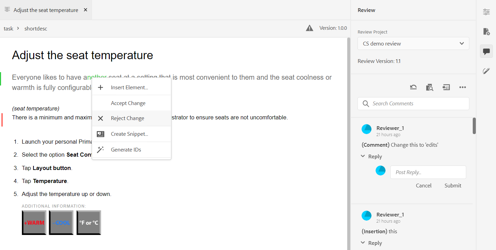

# Commenti sulla revisione degli indirizzi {#id2056B0X0KBI}

In qualità di autore, è possibile inviare commenti in un argomento utilizzando l&#39;editor Web. Le sezioni seguenti descrivono i modi per modificare i commenti nell&#39;editor Web.

Un autore può inviare commenti in un documento dall&#39;Editor Web. Vengono forniti indicatori visivi che indicano se i commenti inseriti \(text\), eliminati o evidenziati. Anche il tipo di commento è menzionato nella parte superiore di ogni voce di commento.

>[!NOTE]
>
> Durante la gestione dei commenti di revisione \(per un documento di revisione attivo\), assicurarsi di non aprire l&#39;argomento in revisione in più schede con la visualizzazione a tag completi abilitata, non passare tra le modalità di visualizzazione Autore e Origine.

In modalità Editor web, il pannello di destra contiene le icone Revisione e Modifiche tratte . Il pannello Revisione mostra tutti i commenti inseriti nel documento dai revisori. Il pannello Modifiche rilevate mostra lo stato di tutti i commenti inseriti ed eliminati nel documento.

- **A**: Selezionare un progetto di revisione per visualizzare i commenti di revisione. Se l’argomento è stato condiviso per la revisione in più attività di revisione, verranno visualizzate le attività elencate in questo elenco a discesa.

   Quando si seleziona un&#39;attività di revisione dall&#39;elenco, vengono visualizzati i commenti dei revisori in tale attività. È possibile gestire i commenti di revisione in modo indipendente nelle attività, il che significa che qualsiasi aggiornamento di un commento è visibile solo ai revisori di quella rispettiva attività.

- **B:** Ogni **Progetto di revisione** viene creato in una versione specifica del documento. La **Versione revisione** visualizza la versione associata al progetto di revisione selezionato. Questo consente di tenere traccia della versione condivisa per la revisione.

- **C**: Se hai aggiornato l&#39;argomento dopo aver avviato la revisione, facendo clic sull&#39;icona Ripristina argomento per rivedere la versione la copia di lavoro torna alla versione condivisa per la revisione. In questo modo è più facile incorporare il feedback di revisione direttamente nella versione condivisa per la revisione. Dopo aver incorporato il feedback, puoi salvare le modifiche nella versione ripristinata o creare una nuova revisione dell’argomento. Se scegli di creare una nuova revisione dell’argomento, viene creato un nuovo ramo dalla versione dell’argomento condivisa per la revisione. Ad esempio, se hai condiviso la versione `1.2` di un argomento da rivedere mentre la versione di authoring corrente è `1.3`, quindi puoi usare questa icona per tornare alla versione `1.2` per incorporare le osservazioni relative al riesame. Se si sceglie di creare una nuova revisione dopo aver incorporato le modifiche alla versione `1.2`, quindi un nuovo ramo con versione `1.2.0` viene creato per l’argomento.

   In genere, dopo aver incorporato il feedback di revisione, si desidera unire le modifiche dall&#39;ultima versione dell&#39;argomento. A tale scopo, utilizza le [Unisci](web-editor-features.md#id205DF04E0HS) per ottenere tutti gli aggiornamenti effettuati dopo che l’argomento è stato condiviso per la revisione.

- **D**: Apri la visualizzazione affiancata per visualizzare la versione con commenti dell’argomento. Come mostrato nella schermata precedente, la sezione più a sinistra è l’ultima versione dell’argomento in cui puoi apportare modifiche. La sezione successiva è la versione commentata dell&#39;argomento. Quando si naviga tra i commenti nell&#39;argomento, la visualizzazione laterale cambia e visualizza la versione dell&#39;argomento su cui è stato fatto il commento. Ogni commento nel pannello dei commenti è collegato al testo corrispondente in questa sezione. Consente di identificare il testo con commenti. I commenti vengono visualizzati nell&#39;ordine del testo del commento nel documento.

   Il numero di versione è riportato nella parte superiore della vista laterale. Facendo nuovamente clic su questa icona viene nascosta la versione con commenti dell’argomento.

- E: Importa direttamente i commenti \(o Barrato\) inseriti ed eliminati nell&#39;argomento. Dopo aver fatto clic sull&#39;icona Importa, nella copia di lavoro dell&#39;argomento vengono visualizzati tutti gli inserimenti e le eliminazioni di testo. Ora, ci sono due modi per accettare o rifiutare i commenti.

   Se si desidera incorporare la modifica suggerita \(inserimento o eliminazione\) una alla volta, è sufficiente fare clic con il pulsante destro del mouse sul commento nel contenuto e selezionare Accetta modifica o Rifiuta modifica. A seconda della selezione, il commento viene accettato o rifiutato. In caso di osservazioni accettate, il contenuto è aggiunto nel contenuto; e in caso di rifiuto, viene rimosso dal contenuto. Inoltre, lo stato del commento viene modificato nel pannello Revisione.

   

   Potete inoltre utilizzare la funzione di revisione nel pannello di destra per accettare o rifiutare i commenti. Facendo clic su un commento viene evidenziato il commento nel documento.

   

   >[!IMPORTANT]
   >
   > La funzione di importazione dei commenti funziona solo sui documenti che non sono stati modificati dopo che sono stati condivisi per la revisione. Se hai apportato modifiche dopo aver inviato il documento per la revisione, riceverai un avviso a **Forza importazione** commenti nel documento. Tuttavia, in questo modo si perderanno tutti gli aggiornamenti apportati al documento. La **Forza importazione** viene inoltre visualizzato un avviso se il documento viene creato all&#39;esterno e quindi condiviso per la revisione. Potete importare i commenti.

   Quando si accetta o si rifiuta un commento, questo viene rimosso dall&#39;elenco Modifiche rilevate. Questo serve anche da indicatore del numero di commenti da inserire nel documento.

- **F**: Dal menu Altre opzioni, Scaricare tutti gli allegati disponibili nell&#39;argomento di revisione.
- **G**: Cercare un testo all&#39;interno di commenti.
- **H**: Accetta o rifiuta un commento.

- **I**: Applicare un filtro ai commenti. È possibile filtrare per visualizzare i commenti in base a Tipo revisione \(tutti, evidenziato, eliminato, inserito o nota adesiva\), Stato revisione \(tutti, accettati, rifiutati o nessuno\), Revisori \(tutti o specifici revisori\(s\)\) o Versioni dell&#39;argomento.

**Argomento principale:**[ Esamina argomenti o mappe](review.md)

