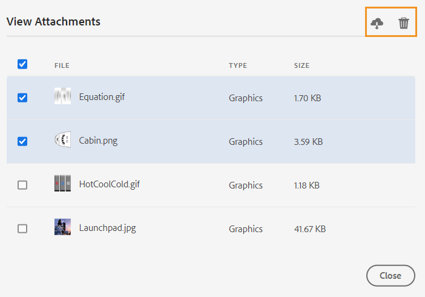

# Argomenti della revisione {#id2056B0W0FBI}

Se sei un revisore, riceverai un’e-mail di richiesta di revisione con il collegamento agli argomenti della revisione. Facendo clic sul collegamento si passa alla pagina di revisione in cui è possibile aggiungere il proprio feedback sugli argomenti condivisi.

Esegui i seguenti passaggi per rivedere un argomento:

1. Fai clic sul collegamento diretto fornito nell’e-mail di richiesta di revisione.

   L’argomento o il collegamento alla mappa viene aperto in un browser.

   >[!NOTE]
   >
   > È inoltre possibile accedere al collegamento di revisione dell’argomento dall’area delle notifiche della casella in entrata nell’interfaccia utente AEM.

1. A seconda del modo in cui viene avviata la revisione dell’argomento, è possibile visualizzare una delle due schermate seguenti:

   >[!NOTE]
   >
   > L’interfaccia utente può essere diversa se hai creato la revisione in:
   >
   > - AEM Guide as a Cloud Service o versioni precedenti di novembre 2022
   > - Guide AEM versione 4.1 o precedente

   La schermata seguente viene visualizzata quando una mappa DITA viene utilizzata per avviare il flusso di lavoro di revisione:

   

   In questa schermata sono disponibili le seguenti opzioni:

   - **A**: Nome dell&#39;attività di revisione.
   - **B**: Fai clic sull&#39;icona Vista argomenti per visualizzare o nascondere il pannello argomenti.

   - **C**: I numeri evidenziati da ***F*** può essere filtrato scegliendo l’opzione di filtro desiderata da qui. È possibile filtrare i commenti in base al tipo, allo stato, al revisore o alla versione. Ad esempio, se desideri visualizzare il numero di commenti di tipo Strikethrough in ciascuno degli argomenti in corso di revisione, fai clic sull’icona del filtro e scegli quindi **Tipo di revisione** \> **Eliminazione**.

      >[!NOTE]
      >
      > Quando si applicano i filtri, nel pannello dei commenti vengono visualizzati solo i commenti corrispondenti ai filtri selezionati. Il numero di commenti filtrati viene visualizzato a sinistra nel pannello argomenti.

   - **D**: Un argomento assegnato per la revisione al revisore corrente è visualizzato in nero ed è selezionabile. Quando il revisore fa clic su un collegamento a un argomento, tale argomento viene portato in alto nella schermata.
   - **E**: Un argomento non disponibile per la revisione è disabilitato. L&#39;argomento viene visualizzato in modalità di sola lettura e non è consentito aggiungere commenti di revisione su tali argomenti.

   - **F**: Numero di commenti ricevuti su un argomento. Questo numero cambia in base al filtro applicato.

   Tutti gli argomenti della mappa sono visualizzati come un singolo documento composito. Gli argomenti che il revisore può esaminare vengono visualizzati normalmente. Gli argomenti che la revisione non può esaminare non vengono visualizzati.

   

   Nella schermata precedente, l&#39;argomento della descrizione generale viene condiviso per la revisione del revisore corrente, che viene mostrato normalmente. Tuttavia, l&#39;argomento successivo, History of flight content non viene condiviso per la revisione e viene visualizzato in modalità di sola lettura. L’argomento attualmente in discussione è evidenziato anche nel sommario.

   La seguente schermata viene visualizzata quando uno o più argomenti vengono selezionati e condivisi per la revisione:

   

   >[!NOTE]
   >
   > Nel caso di più argomenti, questi vengono visualizzati come un unico documento composito nella visualizzazione del documento. La schermata precedente evidenzia due diversi argomenti presentati uno dopo l&#39;altro in un&#39;unica vista.

1. Apri il pannello Commenti facendo clic sul pulsante **Commenti** nell’angolo in alto a destra della barra degli strumenti.

   Fornisci commenti di revisione selezionando un tipo di commento appropriato dalla barra degli strumenti e premi Invio per inviare il commento.

   >[!NOTE]
   >
   > Il pannello Commenti mostra i commenti relativi solo agli argomenti correnti. Quando si sposta lo stato attivo su un altro argomento, vengono visualizzati i commenti sull&#39;altro argomento.

1. Fai clic su **Chiudi** una volta completato il controllo dell&#39;argomento. Facendo clic sul pulsante **Chiudi** , verrai reindirizzato alla pagina da cui hai effettuato l’accesso all’argomento di revisione.

## Funzionalità aggiuntive disponibili nella schermata di revisione

**Visualizzazione documento e visualizzazione argomento** - Per impostazione predefinita, se per la revisione sono condivisi più argomenti, ai revisori viene visualizzata una visualizzazione composita del documento degli argomenti. In caso di revisione di una mappa DITA, tutti gli argomenti della mappa vengono presentati sotto forma di un singolo documento, simile a una visualizzazione libro. Se lo desideri, puoi anche fare clic su un particolare argomento e solo tale argomento viene visualizzato nella schermata di revisione.

Quando si visualizza un singolo argomento, si ottiene un&#39;opzione aggiuntiva per tornare alla visualizzazione del documento. Nella schermata seguente, viene aperto per la revisione un particolare argomento da un file mappa. Opzione evidenziata — **Mostra visualizzazione documento** consente all&#39;utente di tornare alla visualizzazione del documento del file mappa.

**Utilizzo di diversi tipi di strumenti per la creazione di commenti** - È possibile aggiungere commenti in linea evidenziando il testo, barrando il testo, inserendo testo o aggiungendo una nota commento. Di seguito sono descritti i diversi tipi di strumenti di commento forniti nella barra degli strumenti Commenti :

- **Evidenziazione** \(\): Per aggiungere un commento con evidenziazione, seleziona il testo e fai clic sull’icona Evidenzia . In alternativa, fai clic sull’icona Evidenzia e seleziona il testo desiderato:

   

   Nel pannello Commenti viene visualizzato un pop-up in cui è possibile aggiungere commenti per il contenuto evidenziato.

- **Barrato** \(\): Per consigliare la rimozione di contenuti, seleziona il contenuto e fai clic sull’icona Barrato . In alternativa, seleziona il testo desiderato e fai clic sul tasto Canc:

   Nel pannello Commenti viene visualizzato un pop-up in cui è possibile aggiungere commenti per il contenuto eliminato.

- **Inserisci testo** \(\): Se si desidera inserire il testo, fare clic sull&#39;icona Inserisci testo e posizionare il cursore nel punto in cui si desidera inserire il testo e digitare le informazioni. In alternativa, posizionare il cursore nel punto in cui si desidera inserire il testo e iniziare a digitare. Le informazioni aggiunte vengono visualizzate in un font di colore verde:

- **Aggiungi commento**\(\): Per aggiungere un tipo di commento per una nota adesiva, fai clic sull’icona Aggiungi commento e immetti il commento nella finestra a comparsa.

**Barra degli strumenti contestuale**

È inoltre possibile evidenziare o barrare rapidamente il testo con la barra degli strumenti contestuale. Esegui i seguenti passaggi per commentare utilizzando la barra degli strumenti contestuale:

1. Seleziona il testo da evidenziare o barrare. Viene visualizzata la barra degli strumenti contestuale.

   

1. Fai clic sul pulsante **Evidenziazione** o **Barrato** icona.
1. Puoi aggiungere commenti nel pannello dei commenti per l’azione di evidenziazione o barratura.

**Revisione tramite il pannello Commenti** - Nel pannello Commenti viene visualizzato un elenco di commenti relativi all’argomento corrente. Questo pannello elenca anche i commenti di altri revisori, se l’argomento viene inviato a più revisori. Ogni commento nel pannello dei commenti è collegato al testo corrispondente nell&#39;argomento corrente. Consente di identificare il testo con commenti. Ogni commento visualizza il nome del revisore che ha aggiunto il commento insieme alla marca temporale.

I commenti vengono visualizzati nell&#39;ordine del testo del commento nel documento. Ad esempio, esiste un commento con evidenziazione sulla prima frase e un commento di testo inserito sulla seconda frase nel primo paragrafo, quindi il commento di testo con evidenziazione viene visualizzato prima del commento di testo inserito.

Le attività che è possibile eseguire utilizzando il pannello Commenti sono descritte di seguito:

- Facendo clic su un commento viene evidenziata e visualizzata la posizione del commento corrispondente nel documento.
- È possibile aggiungere risposte ai commenti.
- Per modificare un commento personale, fai clic sul testo del commento nel pannello Commenti e seleziona **Modifica** dal menu Opzioni.
- Per eliminare i commenti, fai clic sul commento nel pannello Commenti e seleziona la **Elimina** dal menu Opzioni.

   

   >[!NOTE]
   >
   > Il menu Opzioni viene visualizzato solo quando si passa il mouse sui commenti. Non viene visualizzato per i commenti di altri revisori.

- Tutti gli utenti partecipanti possono rispondere ai commenti inviati da altri utenti. Su un commento, fai clic su **Rispondi** e premere Invio per inviare una risposta.

**Modalità anteprima**

- L’apertura di un argomento in modalità Anteprima mostra come verrà visualizzato un argomento quando viene visualizzato da un autore dopo aver applicato tutte le modifiche. Ad esempio, tutto il testo inserito viene visualizzato come testo normale e tutto il testo contrassegnato con lo stile \(eliminato\) viene rimosso dal contenuto.

- La schermata seguente mostra il contenuto in *Revisione* modalità:

La schermata seguente mostra il contenuto in *Anteprima* modalità:

**Aggiungere allegati ai commenti** - Se si desidera integrare il commento fornendo informazioni aggiuntive disponibili in un altro file, è possibile farlo allegandolo al commento. In qualità di revisore, è possibile aggiungere facilmente uno o più file dal sistema locale al commento. È possibile aggiungere un file a tutte le forme di commenti supportate: Evidenzia, Barrato, Inserisci testo o Commento.

Quando si inserisce un commento, viene visualizzata la finestra a comparsa dei commenti. Dopo aver fornito ulteriori commenti o informazioni nella finestra a comparsa, inviarli premendo Invio. Una volta aggiunto il commento, è possibile aggiungere un allegato a tale commento.

Nella schermata precedente, il documento contiene la finestra a comparsa del commento evidenziato e il commento viene aggiunto anche nel pannello Commenti . Icona dell’allegato del file è disponibile insieme al commento in entrambe le posizioni.

Per aggiungere un allegato al commento, effettua le seguenti operazioni:

1. Fai clic sul pulsante *Aggiungi allegato* icona  sul commento con cui si desidera aggiungere un allegato.

   Viene visualizzata la finestra di dialogo Apri file.

1. Selezionare uno o più file da allegare.

   I file selezionati vengono visualizzati insieme al commento nel pannello Commenti .

   Nel pannello Commenti puoi vedere il nome del file e le relative dimensioni. È inoltre disponibile un’opzione per rimuovere un file facendo clic sull’icona Elimina  associato al nome del file.

1. Fai clic su **Invia**.

   Gli allegati vengono caricati e aggiunti al commento.

**Note aggiuntive sull&#39;utilizzo degli allegati:**

- Per impostazione predefinita, vengono visualizzati solo due file allegati a un commento. Se ci sono più file, allora **Visualizza allegato** il pulsante a destra mostra il numero di tutti gli allegati \(che sono più di due\) associati al commento. È possibile fare clic sul numero per visualizzare tutti gli allegati. Ad esempio, se hai quattro allegati con un commento, vedrai +2 sul pulsante.

- Passando il puntatore del mouse su un allegato è possibile scaricare o rimuovere l&#39;allegato. La rimozione dell&#39;allegato è disponibile solo se il revisore corrente ha aggiunto quel commento, come mostrato nella schermata seguente:

Gli altri revisori o autori ricevono solo l&#39;opzione di download dell&#39;allegato.

- È possibile scaricare tutti gli allegati associati a un commento da **Visualizza allegati** finestra di dialogo. Seleziona gli allegati e fai clic sul pulsante **Scarica** a livello di commento.

- È inoltre possibile eliminare gli allegati associati a un commento dal **Visualizza allegati** finestra di dialogo. Seleziona gli allegati e fai clic sul pulsante **Elimina** icona.

**Pannello delle condizioni** - Se l’argomento include contenuto condizionale, verrà visualizzata la **Condizioni** \(\) a destra. Clic su **Condizioni** apre il pannello Condizioni , che consente di evidenziare il contenuto in base alle condizioni disponibili nell’argomento.

: Per impostazione predefinita **Evidenzia tutte le condizioni** l’opzione è abilitata, vengono selezionate tutte le condizioni, viene visualizzato l’intero contenuto e il contenuto condizionale viene visualizzato come evidenziato sia in modalità di revisione che di anteprima.

: È possibile disabilitare **Evidenzia tutte le condizioni** e visualizza tutto il contenuto presente nell’argomento come testo normale senza evidenziazioni.

Puoi scegliere di nascondere o mostrare una condizione specifica.

- Se nascondi una condizione, il contenuto con tale condizione non viene evidenziato in modalità di revisione.
- Se viene visualizzata una condizione, il contenuto condizionale viene evidenziato in modalità di revisione. Ad esempio, nella schermata seguente, solo il contenuto utilizza due condizioni: `win` e `mac` viene evidenziato.

In modalità anteprima, il contenuto non condizionale e il contenuto condizionale che utilizzano le due condizioni visualizzate: `win` e `mac` viene visualizzato. Il contenuto condizionale rimanente per il quale le condizioni sono nascoste non viene visualizzato.

**Revisione in tempo reale** - Il pannello Commenti viene aggiornato in tempo reale con i commenti e il feedback o le azioni dell&#39;autore sui commenti.

- Più revisori potranno lasciare commenti o rispondere contemporaneamente ai commenti sullo stesso documento. Per scoprire chi sta revisionando il documento, posiziona il mouse sull&#39;icona utente nell&#39;angolo in alto a destra dello schermo.

- Se un argomento fa parte di più attività di revisione, i commenti effettuati in un&#39;attività non vengono visualizzati nell&#39;altra.

- Fare clic sull&#39;icona Commento obsoleto \(\) visualizza le differenze tra la versione più recente e la versione con commenti del documento. I numeri di versione \(delle versioni che vengono confrontate\) vengono visualizzati nella parte superiore dei documenti.

   

   >[!NOTE]
   >
   > Quando passi il cursore sull’icona Commento obsoleto , viene visualizzato il numero di versione dell’argomento sul quale è stato aggiunto il commento. Ad esempio, se è stato aggiunto un commento alla versione 1.0, viene visualizzato lo stesso.

- Facendo clic su un commento obsoleto, la versione del commento viene aperta nel pannello a sinistra. La versione precedente viene visualizzata nel pannello a sinistra e la versione corrente nel pannello a destra. Tutti i commenti sulla versione obsoleta vengono importati sul lato sinistro. È possibile confrontare la versione precedente con la versione corrente.

**Filtrare i commenti** - È possibile filtrare i commenti in un documento per visualizzarli in base alle esigenze. Per filtrare i commenti, fai clic sul pulsante **Filtro** icona \(\) visualizzata nel menu a destra della casella di testo Cerca commenti nel pannello Commenti.

Seleziona una o più delle seguenti opzioni di filtro dal **Tipo filtro** finestra di dialogo e fai clic su **Applica**.

- **Tipo di revisione** - Filtrare in base al tipo di commento: Evidenziazione, Cancellazione, Inserimento o Commento.
- **Stato della revisione** - Filtrare in base allo stato del commento come Accettato, Rifiutato o Nessuno.
- **Revisori** - Filtrare in base al nome del revisore.

- **Versioni** - Filtrare in base ai commenti ricevuti su una particolare versione dell&#39;argomento.

   Quando si utilizzano i filtri, i commenti nel pannello di destra vengono filtrati in base alla selezione e il numero di commenti nel pannello di sinistra viene aggiornato di conseguenza.

Per rimuovere il filtro e visualizzare tutti i commenti, deseleziona tutti i filtri dal **Tipo filtro** finestra di dialogo e fai clic su **Applica**.

**Argomento principale:**[ Esamina argomenti o mappe](review.md)

