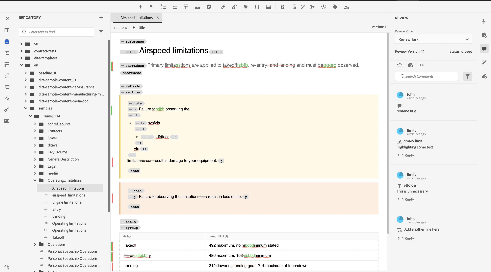

# Visualizza attività di revisione completata

Puoi completare le attività di revisione per i progetti per i quali sei l’autore (o l’iniziatore). Una volta completata l&#39;attività di revisione, tu e tutti i revisori potete accedervi in modalità di sola lettura.

## Come revisore

In qualità di revisore, nel pannello dei commenti viene visualizzato un indicatore che indica che la revisione è terminata. La barra degli strumenti Commenti non viene visualizzata, pertanto non è possibile evidenziare, barrare, inserire testo o aggiungere commenti. È possibile leggere un commento ma non modificarlo o eliminarlo. Non è inoltre possibile aggiungere una risposta ai commenti. Non è possibile visualizzare la barra degli strumenti contestuale (utilizzata per evidenziare o barrare un testo). L’icona dei commenti non aggiornati non viene visualizzata in un’attività di revisione completata.

Tuttavia, è possibile cercare o filtrare i commenti. Puoi anche scegliere di mostrare o nascondere le condizioni e visualizzare di conseguenza il contenuto condizionale. È possibile scaricare qualsiasi allegato ma non caricare o eliminare allegati per i commenti.

## Autore

In qualità di autore, puoi visualizzare lo stato come chiuso nel pannello Revisione. È possibile leggere un commento ma non può accettare o rifiutare un commento. Non è possibile modificare o eliminare commenti. Non è inoltre possibile aggiungere la risposta per il commento. L’icona Commenti obsoleti e l’icona Importa commenti nella visualizzazione autore non vengono visualizzate in un’attività di revisione completata.

Tuttavia, è possibile cercare o filtrare i commenti. È possibile scaricare qualsiasi allegato ma non caricare o eliminare allegati per i commenti.

Pertanto, sia come revisore che come autore è possibile visualizzare il contenuto rivisto insieme ai commenti, ma non è possibile apportare modifiche in un&#39;attività di revisione completata.

