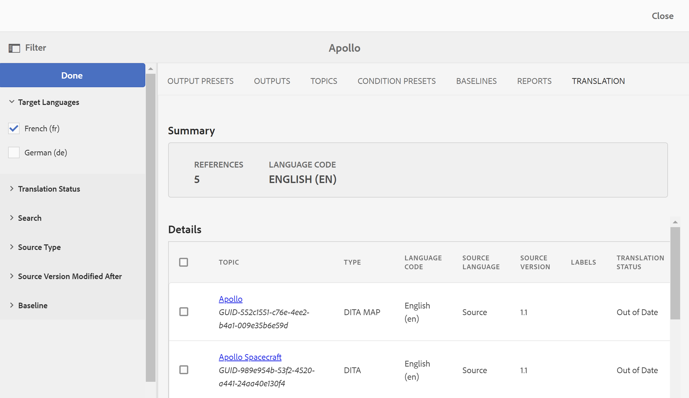

# Visualizza stato traduzione {#id169SEK00KOW}

È possibile visualizzare lo stato della traduzione e le copie per lingua tradotta di ciascun argomento in una mappa DITA.

Per visualizzare lo stato di traduzione di una mappa DITA, effettuare le seguenti operazioni:

1. Passare al file di mapping DITA della copia per lingua di origine.
1. Fai clic su **Traduzione** scheda.
1. In **Filtro** a sinistra, seleziona la **Traduci lingue** di cui desideri verificare lo stato e fai clic su **Fine**.

   >[!NOTE]
   >
   > È possibile filtrare ulteriormente il contenuto in base al relativo stato di traduzione \(come Copia mancante non sincronizzata, In corso o In sincronia\), tipo di origine \(come Tutto, DITA, mappa DITA o Risorsa\), data di modifica. È inoltre possibile immettere parole chiave per cercare argomenti specifici.

   {width="800" align="left"}

La scheda Traduzione include le sezioni seguenti:

- **Riepilogo**: mostra il numero di argomenti a cui si fa riferimento, la lingua di origine e il relativo codice.
- **Dettagli**: mostra il titolo dell’argomento, il tipo di argomento, il codice della lingua dell’argomento, la lingua di origine, la versione dell’argomento di origine, l’etichetta aggiunta all’argomento e lo stato della traduzione.

**Argomento padre:**[ Traduci contenuto](translation.md)
