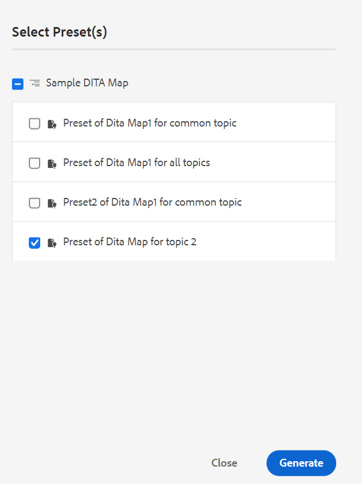

# Genera l’output dal pannello Repository o dal pannello Map View (Visualizzazione mappa) {#id218CL6010AE}

È inoltre possibile utilizzare i predefiniti di output creati per la mappa DITA per generare l’output dal pannello Archivio o dal pannello Visualizza mappa.

- Utilizza la **Generazione rapida** nel pannello Repository o nel pannello Visualizza mappa per generare l&#39;output per il singolo argomento selezionato o per l&#39;intera mappa DITA.

   >[!NOTE]
   >
   > Puoi anche accedere al **Generazione rapida** dal pannello Preferiti o dal pannello Ricerca.

- Utilizza la **Genera output** nel pannello Visualizza mappa per generare l’output per i diversi argomenti selezionati.

## Pubblicare un argomento utilizzato in una o più mappe DITA

Esegui i seguenti passaggi per generare l&#39;output per uno o più argomenti nella mappa DITA:

1. In **Autore** selezionare l&#39;argomento nella mappa DITA che si desidera pubblicare.

1. Seleziona **Generazione rapida** dal menu Opzioni dell&#39;argomento selezionato.
   {width="650" align="left"}

1. Per pubblicare un argomento utilizzato in una singola mappa DITA, selezionare i predefiniti di output della mappa che si desidera utilizzare per la pubblicazione e fare clic su **Genera**.
   {width="350" align="left"}

1. Verrà visualizzato lo stato del processo di generazione dell&#39;output. Per visualizzare l&#39;output, posizionare il puntatore del mouse sull&#39;argomento e fare clic su Visualizza output.

1. Se si dispone di un argomento comune utilizzato in più argomenti, selezionare le varie mappe DITA e anche i predefiniti di output che si desidera utilizzare per pubblicare e fare clic su **Genera.**

   {width="350" align="left"}

1. Verrà visualizzato lo stato del processo di generazione dell&#39;output.

   - **Argomenti**: Elenca gli argomenti selezionati per i quali viene generato l’output.
   - **Predefinito**: Visualizza i predefiniti di output contenenti gli argomenti selezionati.
   - **Mappa**: Elenca le mappe DITA che contengono l&#39;argomento selezionato.
   - **Stato**: Visualizza lo stato di pubblicazione di ciascun argomento.
Per visualizzare l&#39;output, posizionare il puntatore del mouse sull&#39;argomento e fare clic su Visualizza output.
      {width="800" align="left"}

## Genera output per una mappa DITA dall&#39;editor Web

Esegui i seguenti passaggi per generare l&#39;output per l&#39;intera mappa DITA:

1. In **Autore** selezionare la mappa DITA che si desidera pubblicare.

1. Seleziona **Generazione rapida** dal menu Opzioni della mappa DITA.

   {width="650" align="left"}

1. Selezionare i predefiniti di output della mappa DITA che si desidera utilizzare per la pubblicazione e fare clic su **Genera.**

1. Verrà visualizzato lo stato del processo di generazione dell&#39;output. Per visualizzare l&#39;output, posizionare il puntatore del mouse sull&#39;argomento e fare clic su Visualizza output.

## Genera output per più argomenti

Esegui i seguenti passaggi per generare l’output per più argomenti nella mappa DITA dal pannello Visualizza mappa:

1. In **Autore** seleziona gli argomenti da pubblicare.

1. Seleziona **Genera output** dal menu Opzioni in basso.

1. Selezionare il predefinito di output della mappa DITA che si desidera utilizzare per la pubblicazione.

   >[!NOTE]
   >
   > Verranno visualizzati solo i predefiniti di output della mappa DITA corrente che contengono tutti gli argomenti selezionati.

   {width="650" align="left"}

1. Verrà visualizzato lo stato del processo di generazione dell&#39;output.Per visualizzare l&#39;output, posizionare il puntatore del mouse sull&#39;argomento e fare clic su Visualizza output.

**Argomento principale:**[ Pubblicazione basata su articoli dall’editor web](web-editor-article-publishing.md)
