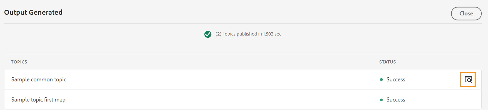

# Creare predefiniti di output dall’editor Web {#id218CL400JW3}

Esegui i seguenti passaggi per creare predefiniti di output per la mappa DITA:

1. Nell’interfaccia utente Assets, individua il file mappa da modificare.

1. Per ottenere un blocco esclusivo sul file mappa, seleziona il file mappa e fai clic su **Estrai**.

1. Seleziona la **Modifica argomenti** dal menu azioni del file mappa.

   Il file mappa viene aperto per la modifica nell&#39;editor Web.

   >[!NOTE]
   >
   > Puoi aggiungere o eliminare qualsiasi argomento dalla mappa utilizzando l’Editor mappa avanzato. Per ulteriori dettagli, consulta [Utilizzare l’Editor mappa avanzato](map-editor-advanced-map-editor.md#).

1. In **Uscita** selezionare l&#39;icona + per creare un predefinito di output per la mappa DITA.

   {width="350" align="left"}

1. Immetti il nome del predefinito nella finestra di dialogo Aggiungi predefinito , quindi fai clic su **Aggiungi**.

1. Immetti i seguenti dettagli di configurazione.

   1. Seleziona le opzioni richieste nella **Generale** scheda . Puoi scegliere di creare un predefinito di output con o senza condizioni. Puoi anche utilizzare un file DITVAL. AEM Guide consente inoltre di selezionare una linea di base per la pubblicazione di una versione specifica della mappa DITA.
   1. Immetti i dettagli del sito AEM nel **AEM** scheda . **Sito** visualizza l’elenco delle AEM Sites disponibili nell’archivio AEM. **Categoria**, **Modello di sezione** e **Modello di articolo** sono i componenti strutturali utilizzati per organizzare l’aspetto dell’output. Questi sono predefiniti nel modello Sito AEM.

      >[!NOTE]
      >
      > Aggiorna ogni menu a discesa per ottenere l&#39;ulteriore classificazione nel menu a discesa successivo.

   1. Da **Articoli** selezionare gli argomenti per i quali si desidera generare l&#39;output.
1. Seleziona la **Genera predefinito** nella parte superiore per generare l’output.

   {width="800" align="left"}

1. Verrà visualizzato lo stato del processo di generazione dell&#39;output. La **Argomenti** elenca gli argomenti per i quali viene generato l’output mentre **Stato** visualizza lo stato di pubblicazione di ciascun argomento.

   Per visualizzare l&#39;output, posizionare il puntatore del mouse sull&#39;argomento e fare clic su Visualizza output.

   {width="800" align="left"}

>[!NOTE]
>
> È inoltre possibile modificare, rinominare, duplicare o eliminare un predefinito di output esistente dal menu Opzioni.

{width="550" align="left"}

**Argomento principale:**[ Pubblicazione basata su articoli dall’editor web](web-editor-article-publishing.md)
