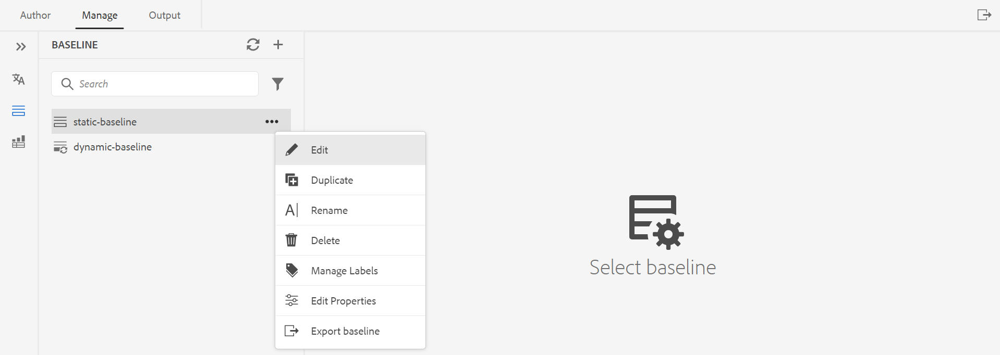

# Creare e gestire le linee di base dall’editor web {#id223MB0ZF043}

>[!TIP]
>
> Si consiglia di utilizzare questa funzionalità della linea di base dell&#39;Editor web se è stato effettuato l&#39;aggiornamento a AEM versione di marzo as a Cloud Service o successiva delle Guide .

AEM Guide fornisce la funzione Linea di base integrata all’interno dell’Editor web che consente agli utenti di creare linee di base e utilizzarle per pubblicare o tradurre argomenti relativi a versioni diverse.

## Creare una baseline

È possibile creare una linea di base dall&#39;Editor Web eseguendo le operazioni seguenti:

1. Nel pannello Archivio, apri il file mappa DITA in Vista mappa.
1. Fai clic sul pulsante **Gestisci** scheda . La **Linea** visualizza le linee di base della mappa DITA.

   

1. Sulla **Linea** fai clic sull’icona + in alto a destra. Puoi creare una baseline con una versione specifica degli argomenti e il contenuto a cui si fa riferimento disponibile in una data e in un&#39;ora specifiche oppure con un&#39;etichetta definita per una versione degli argomenti.
1. Immettere un nome per la baseline in **Nome linea di base**.
1. In **Opzione di base**, potete scegliere **Usa versione file** opzione o **Usa etichette** opzione:

   **Usa versione file**: È possibile creare una linea di base statica con una versione specifica degli argomenti e contenuti di riferimento disponibili in una data e in un&#39;ora specifiche oppure con un&#39;etichetta definita per una versione degli argomenti:

   - In **Imposta la versione più recente in base a,** selezionare una delle opzioni seguenti:

      1. **Data** &lt;time stamp=&quot;&quot;>: Seleziona la versione degli argomenti in base alla data e all&#39;ora specificate.
      1. **Etichetta**: Seleziona questa opzione per scegliere gli argomenti in base all’etichetta applicata. Se per gli argomenti sono specificate delle etichette, queste vengono elencate nel menu a discesa. È possibile scegliere un’etichetta dall’elenco. È inoltre possibile aggiungere un’etichetta nella casella di testo.\
         Quando selezioni **Etichetta,** potete scegliere i riferimenti diretti e indiretti.
      - Per i riferimenti diretti all&#39;interno della mappa DITA, è disponibile un&#39;opzione per utilizzare la versione più recente degli argomenti a cui non è stata applicata l&#39;etichetta specificata.

      >[!NOTE]
      >
      > Se immetti un’etichetta che non esiste e seleziona l’opzione **Non creare una baseline** quindi la creazione della linea di base non riesce e viene visualizzato un messaggio di errore vicino al nome della linea di base nel pannello Linea di base.

      - Per i riferimenti indiretti all&#39;interno della mappa DITA, è disponibile un&#39;opzione aggiuntiva per utilizzare la versione più recente degli argomenti a cui non è applicata l&#39;etichetta specificata. Puoi anche scegliere di **Seleziona automaticamente** per il contenuto a cui si fa riferimento e il sistema seleziona automaticamente la versione del contenuto a cui si fa riferimento corrispondente alla versione del contenuto a cui si fa riferimento.

   Dopo aver selezionato un&#39;etichetta o una versione come data, tutti gli argomenti e i file multimediali a cui si fa riferimento all&#39;interno della mappa vengono selezionati di conseguenza. Questa selezione di argomenti non viene visualizzata nell’interfaccia utente, ma viene salvata nel backend.

   **Usa etichette**: Seleziona questa opzione per la creazione della linea di base per scegliere gli argomenti in base all’etichetta applicata.

   Le linee di base basate sulle etichette vengono aggiornate dinamicamente. Se si genera una baseline, si scarica una baseline o si crea un progetto di traduzione utilizzando una baseline, i file vengono selezionati in modo dinamico in base alle etichette aggiornate. Ad esempio, se hai utilizzato la versione 1.2 di un argomento con Label Release 1.0 per la baseline e versioni successive aggiornate 1.5 con Label Release 1.0, la baseline verrà aggiornata dinamicamente e verrà utilizzata la versione 1.5.

   

   - **Seleziona etichette**: Se per gli argomenti sono state specificate delle etichette, queste vengono elencate nella sezione **Seleziona etichette** a discesa. Potete scegliere l&#39;etichetta\(s\) dall&#39;elenco. Alle etichette selezionate per prime viene data priorità più alta rispetto a quelle successive.
1. **Riferimenti indiretti**: Per i riferimenti indiretti all&#39;interno della mappa DITA, sono disponibili le seguenti opzioni:

   - **Seleziona automaticamente**: Puoi scegliere di **Seleziona automaticamente** per il contenuto a cui si fa riferimento e il sistema seleziona automaticamente la versione del contenuto a cui si fa riferimento corrispondente alla versione del contenuto a cui si fa riferimento.

   - **Usa etichetta selezionata**: Puoi creare una baseline con l’etichetta selezionata definita per una versione di argomenti.
   - **Utilizzare la versione più recente o la copia di lavoro**: Utilizza la versione più recente degli argomenti a cui non è stata applicata l&#39;etichetta specificata oppure, se non è stata creata alcuna versione, utilizza la copia di lavoro degli argomenti per creare la baseline.
1. Fai clic su **Applica**.

Viene creata la baseline. La creazione della linea di base avviene in modo asincrono, quindi puoi continuare a lavorare su altri file nell’Editor web. Una volta creata la linea di base, viene visualizzato un messaggio a comparsa di conferma della creazione della linea di base e si riceve anche una notifica Inbox per la stessa impostazione.

## Gestire le linee di base

Puoi gestire le linee di base esistenti utilizzando le varie funzioni presenti nel dashboard Linea di base.

- È possibile cercare una linea di base esistente utilizzando la casella di testo nel pannello Linea di base. Utilizza la **Applica filtro** per mostrare tutte le linee di base o elencare le linee di base con lo stato di creazione come Completato, In corso o Non riuscito.
- Utilizza la **Aggiorna** icona nel pannello Linea di base per controllare nuovamente tutte le linee di base e visualizzare un nuovo elenco di linee di base per la mappa DITA aperta nella vista Mappa.
- Per visualizzare o modificare il contenuto di una baseline esistente, fai doppio clic sulla baseline dall’elenco nel pannello Linea di base. Nella finestra di modifica della linea di base al centro vengono visualizzati il file di mappa DITA, il contenuto o gli argomenti della mappa e il contenuto a cui si fa riferimento.

È inoltre possibile eseguire le seguenti operazioni sulla linea di base dal menu Opzioni:

- **Modifica**, **Duplica,** o **Elimina** una linea di base esistente.
- Aggiungi, rimuovi o apporta modifiche alle etichette esistenti dal **Gestire le etichette** opzione . Se l’amministratore ha configurato le etichette predefinite, queste vengono visualizzate nell’elenco a discesa Aggiungi etichetta . Per ulteriori informazioni sull’aggiunta di etichette, consulta [Usa etichette](web-editor-use-label.md#).

   >[!NOTE]
   >
   > Il processo di aggiunta o rimozione delle etichette viene eseguito in modo asincrono, in modo da poter continuare a lavorare su altri file nell’editor Web. Una volta aggiunta o rimossa l’etichetta, viene visualizzato un messaggio a comparsa di conferma dell’aggiunta o della rimozione dell’etichetta e viene inviata anche una notifica Posta in arrivo per la stessa etichetta.

- **Modifica proprietà** di una linea di base esistente impostata durante la creazione della linea di base.
- Esporta lo snapshot di una baseline in un file CSV con la **Esporta linea di base** opzione .

**Filtri della linea di base**

Utilizzo dell’icona Filtri nella sezione **Filtri della linea di base** potete applicare filtri sulla linea di base aperta nella finestra di modifica della linea di base:

- Filtrare i file in base al nome o alla posizione del file.
- Filtrare i file in base ai valori per colonne diverse come Tipo di file, Tipo di riferimento e così via.
- Scegliere le colonne da visualizzare nella finestra di modifica della linea di base.

>[!NOTE]
>
> È possibile fare clic su un&#39;intestazione di colonna e ordinare i file in base alle colonne nella finestra di modifica della linea di base.

**Salvare o ripristinare una linea di base**

Dopo aver modificato la baseline, puoi fare clic sul pulsante **Salva** per salvare le modifiche alla linea di base. Puoi fare clic su **Reimposta** se non desideri salvare la modifica e reimpostare la linea di base. Quando fai clic sul pulsante **Reimposta** viene visualizzato un messaggio di avviso relativo alla perdita delle modifiche non salvate.

**Argomento principale:**[ Utilizzare l’editor Web](web-editor.md)

