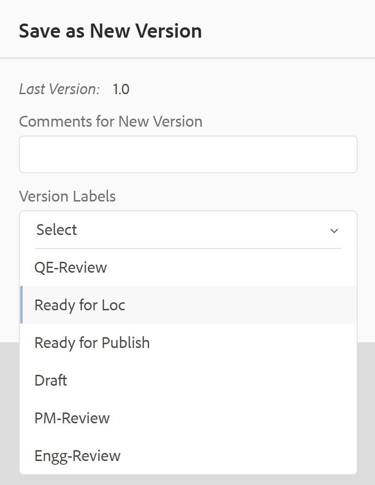
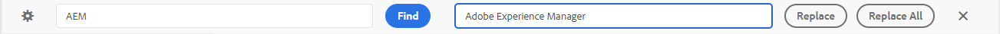
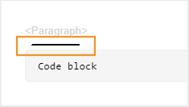
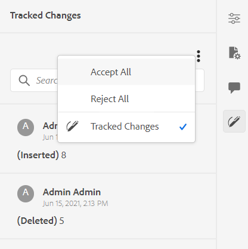
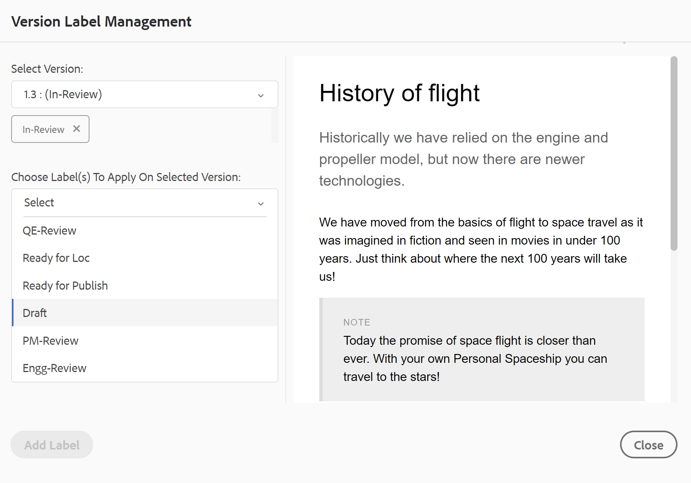
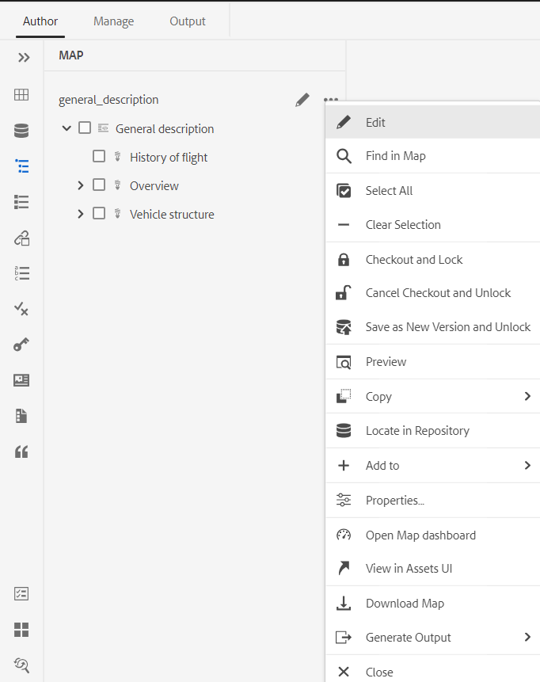
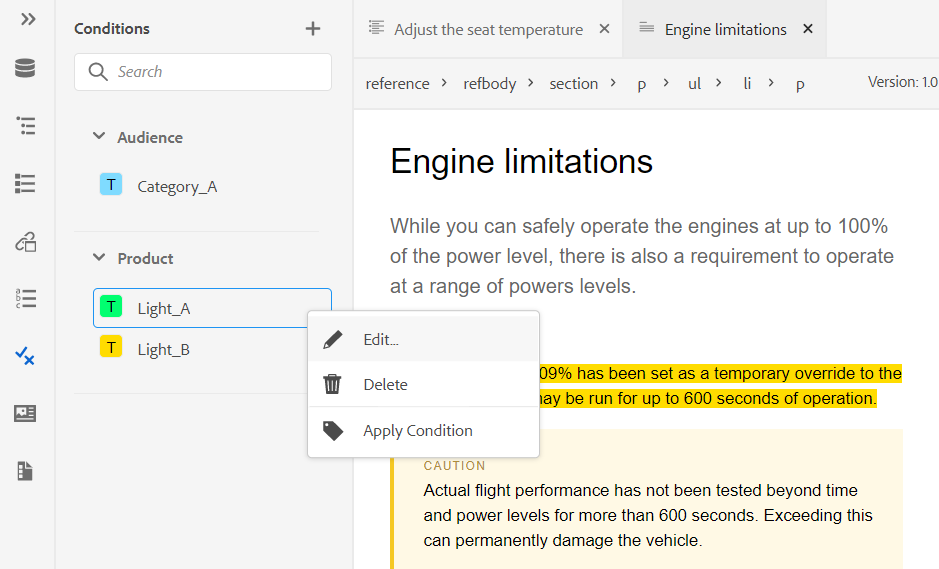
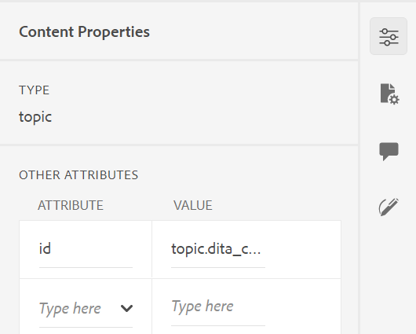

# Conoscere le funzionalità dell’editor web {#id176NC500V5Z}

Questa sezione descrive le varie funzioni disponibili nell’editor Web. È possibile suddividere l&#39;Editor Web nelle sezioni o aree seguenti:

- [Barra degli strumenti principale](#id2051EA0G05Z)
- [Barra degli strumenti secondaria](#id2051EA0J0Y4)
- [Pannello a sinistra](#id2051EA0M0HS)
- [Area di modifica del contenuto](#id2051EB000UI)
- [Pannello a destra](#id2051EB003YK)

Nella sottosezione seguente vengono descritte in dettaglio le varie sezioni dell’editor Web.

## Barra degli strumenti principale {#id2051EA0G05Z}

La barra degli strumenti principale si trova nella parte superiore dell&#39;interfaccia dell&#39;editor Web e fornisce funzioni a livello di file e varie modalità di authoring disponibili nell&#39;editor Web. Le funzioni disponibili nella barra degli strumenti superiore sono illustrate di seguito:

**Salva tutto** - 

Salva le modifiche apportate in tutti gli argomenti aperti. Se nell&#39;Editor Web sono aperti più argomenti, fare clic su **Salva tutto** o utilizzando **Crtl**+**S** i tasti di scelta rapida consentono di salvare tutti i documenti con un solo clic. Non è necessario salvare singolarmente ogni documento.

>[!NOTE]
>
> L&#39;operazione Salva non crea una nuova versione dei tuoi argomenti. Per creare una nuova versione, scegli Salva come nuova versione.

**Salva come nuova versione** - 

Salva le modifiche apportate all’argomento e crea anche una nuova versione dell’argomento. Se lavori su un argomento appena creato, le informazioni sulla versione vengono visualizzate come **nessuno**.

{width="800" align="left"}

Il numero di versione cambia con ogni nuova versione creata per l’argomento o il file di mappa.

Quando scegli di salvare un argomento o di mappare utilizzando **Salva come nuova versione**, viene visualizzata la seguente finestra di dialogo:

{width="300" align="left"}

Immetti commenti ed etichette di versione per identificare le modifiche e fai clic su **Salva** per creare una nuova versione del file.

Quando scegli la *Salva come nuova versione*, la prima versione dell’argomento viene creata in DAM, che diventa anche la versione attualmente attiva dell’argomento. Successivamente, se ripristini una versione precedente dell’argomento, questa diventerà la versione attiva corrente dell’argomento.

Se l’amministratore dispone di etichette di versione preconfigurate, queste verranno visualizzate in un elenco a discesa. È possibile scegliere un’etichetta dall’elenco delle etichette disponibili e salvare il documento.

{width="300" align="left"}

Al momento del salvataggio di un argomento, puoi aggiungere un commento specificando le modifiche apportate nell’argomento. Questo commento viene mostrato nella cronologia delle versioni dell&#39;argomento.

Se l’argomento è in fase di revisione, i revisori riceveranno una notifica in cui si informa che è disponibile una versione più recente dell’argomento. Possono accedere facilmente all’ultima revisione del documento e continuare a rivedere l’ultima versione dell’argomento.

Quando passi il puntatore sul titolo di un argomento, vengono visualizzati il percorso del file e il numero di versione.

{width="800" align="left"}

>[!NOTE]
>
> Una volta disponibile una versione dell’argomento, puoi anche aggiungere etichette all’argomento. Queste etichette possono quindi essere utilizzate per creare una linea di base per la pubblicazione di una versione specifica del documento. Per ulteriori informazioni sull&#39;utilizzo delle etichette negli argomenti, consulta [Usa etichette](web-editor-use-label.md#).

**Annulla e Ripristina** -  / 

Annulla o Ripristina l’ultima azione.

**Elimina elemento** - 

Elimina l’elemento attualmente selezionato o l’elemento in cui è posizionato il cursore.

**Trova e sostituisci** - 

La funzione Trova e sostituisci è disponibile nelle modalità Autore e Sorgente . La barra di testo Trova e sostituisci viene visualizzata nella parte inferiore dell’area di modifica dell’argomento. È possibile utilizzare i tasti di scelta rapida **CTRL**+**F** per richiamare la barra Trova e sostituisci.

{width="800" align="left"}

Utilizzo dell&#39;icona delle impostazioni \(\), è possibile attivare/disattivare la **Ignora maiuscole** e **Solo parola intera** opzioni di ricerca. Per eseguire una ricerca senza distinzione tra maiuscole e minuscole, attivare \(o selezionare\) il **Ignora maiuscole** opzione . In caso contrario, per eseguire una ricerca con distinzione tra maiuscole e minuscole, disattiva \(o deseleziona\) il **Ignora maiuscole** opzione . È inoltre possibile scegliere di cercare una parola intera.

La ricerca è istantanea, il che significa che quando si digita la frase o la parola di ricerca nel **Trova** , il termine viene immediatamente ricercato e selezionato nell&#39;argomento. Allo stesso modo, per sostituire un testo nell’argomento, immetti il termine di ricerca e la sua sostituzione nei rispettivi campi e fai clic sul **Sostituisci** o **Sostituisci tutto** pulsante .

Nella vista Sorgente, Trova e sostituisci è estremamente utile per la ricerca di un elemento o un attributo specifico. Ad esempio, se desideri sostituire il valore del `@product` può essere facilmente eseguito dalla vista Origine. La visualizzazione Autore non consente di effettuare ricerche sulla base di un attributo o di un elemento. Tuttavia, è necessario prestare attenzione quando si utilizza il **Sostituisci tutto** in quanto potrebbe sovrascrivere il codice XML.

**Impostazioni editor** - 

Le impostazioni dell’editor sono disponibili solo per gli utenti amministratori. Utilizzando le preferenze, un amministratore può configurare le seguenti impostazioni:

>[!NOTE]
>
> Se si aggiornano le impostazioni predefinite, è necessario riaprire i documenti per rendere effettive le modifiche.

- **Generale**: Le impostazioni Generali consentono di configurare il dizionario da utilizzare con l&#39;editor Web. Questa scheda contiene tre sezioni: **Controllo ortografia**, **Condizione** e **Authoring**.

   {width="650" align="left"}

   - **Controllo ortografia**: Sono disponibili due opzioni: **Controllo ortografia AEM** e **Controllo ortografia del browser**. Per impostazione predefinita, l’editor utilizza la funzione Controllo ortografia del browser, in cui il controllo ortografico viene eseguito utilizzando il dizionario integrato del browser. È possibile passare a Controllo ortografia AEM per utilizzare AEM dizionario, che può anche essere personalizzato per aggiungere l&#39;elenco di parole personalizzato. Per ulteriori informazioni sulla personalizzazione AEM dizionario, vedi *Personalizzare AEM dizionario predefinito* in Installazione e configurazione delle guide Adobe Experience Manager as a Cloud Service.


   - **Condizione**

      - **Evidenziare il testo condizionale nella vista Autore**: Seleziona questa opzione per evidenziare il testo condizionale nella visualizzazione autore. Il contenuto condizionale viene evidenziato utilizzando il colore definito per la condizione.

      - **Convalida con attributi condizione**: Selezionare questa opzione per consentire la convalida dei valori definiti per gli attributi. Questo impedisce l’aggiunta di valori non corretti.

      - **Mostrare la chiave con il titolo nel pannello Schema oggetto**: Selezionare questa opzione per visualizzare le chiavi insieme ai titoli nello schema oggetto. Se non selezioni questa opzione vengono visualizzati solo i titoli. Ad esempio, in questo caso vengono mostrate anche le chiavi &quot;os&quot;, &quot;audience&quot; e &quot;other&quot; insieme ai titoli.

         {width="550" align="left"}

      - **Mostra schema soggetto nel pannello Condizioni**: Seleziona questa opzione per visualizzare uno schema di oggetto nel pannello condizioni. Se deselezioni questa opzione, le condizioni definite vengono visualizzate nel pannello condizioni .
   - **Authoring**

      - **Abilita Sostituisci tutto**: Selezionare questa opzione per visualizzare l’icona Sostituisci tutto nel pannello Trova e sostituisci.


**Pannelli**: Questa impostazione controlla i pannelli visualizzati nel pannello a sinistra dell’editor. È possibile attivare o disattivare l&#39;opzione per visualizzare o nascondere il pannello desiderato.

{width="650" align="left"}

>[!NOTE]
>
> Se è stato configurato un pannello personalizzato, questo viene visualizzato anche nell’elenco dei pannelli. Puoi attivare o disattivare l’opzione per visualizzare o nascondere il pannello personalizzato. Per ulteriori dettagli sulla configurazione, consulta la sezione *Configurare un pannello personalizzato nel pannello a sinistra* in Installazione e configurazione delle guide Adobe Experience Manager as a Cloud Service.

- **Elenco elementi**: In qualità di amministratore, puoi controllare l’elenco di elementi che un autore può inserire utilizzando la funzione [Inserisci elemento](#id204SG30105Z) a comparsa, nonché definire il nome visualizzato dell’elemento. L’impostazione Elenco elementi consente di specificare il nome dell’elemento in base alle specifiche DITA e un’etichetta che si desidera utilizzare al posto del nome dell’elemento definito DITA:

   {width="650" align="left"}

Nella schermata precedente, il `b` è stata assegnata un&#39;etichetta di Grassetto, `codeblock` viene assegnata un’etichetta di Code Block insieme ad altri elementi. Se selezioni la **Usa solo sopra gli elementi** quindi nella finestra a comparsa Inserisci elemento verranno visualizzati solo gli elementi validi \(nel punto di inserimento corrente\) di questo elenco.

Nella schermata seguente, solo 3 dei 4 elementi configurati della schermata precedente sono mostrati nel contesto corrente:

{width="300" align="left"}

- **Elenco attributi**: Analogamente all’elenco degli elementi, è possibile controllare l’elenco degli attributi e i relativi nomi visualizzati da visualizzare nell’elenco degli attributi di un elemento. Nella schermata seguente, sono stati configurati solo 3 attributi per essere mostrati nell’elenco degli attributi di un elemento:

{width="650" align="left"}

Con questa impostazione, quando tenti di aggiungere un attributo a un elemento, visualizzi solo l’elenco degli attributi configurati nell’elenco.

{width="300" align="left"}

- **Attributi di visualizzazione**: Come l’elenco Attributi, puoi controllare l’elenco degli attributi da visualizzare nell’elenco degli attributi di un elemento. Per impostazione predefinita, quattro **Attributi di visualizzazione** : audience, piattaforma, prodotto e proprietà sono stati configurati per essere visualizzati nell’elenco degli attributi di un elemento. È inoltre possibile aggiungere un attributo di visualizzazione utilizzando **Aggiungi** in alto. È inoltre possibile eliminare qualsiasi attributo di visualizzazione utilizzando **Elimina** icona.

Gli attributi definiti per un elemento vengono visualizzati nella vista Layout e Struttura.

{width="550" align="left"}

- **Traduzione**: Questa scheda contiene l’opzione per propagare le etichette di origine alla versione di destinazione.

   - **Propagare le etichette della versione sorgente alla versione di destinazione**: Selezionare questa opzione per passare l&#39;etichetta della versione del file di origine al file convertito. Per impostazione predefinita, questa opzione è disabilitata.

   {width="550" align="left"}


**Preferenze utente** - 

Le Preferenze utente sono disponibili per tutti gli autori. Utilizzando le preferenze, un autore può configurare le seguenti impostazioni:

{width="550" align="left"}

- **Tema**: È possibile scegliere tra i temi Chiaro, Più chiaro, Più scuro o Più scuro per l&#39;editor. Nel caso di tema più leggero, le barre degli strumenti e i pannelli utilizzano uno sfondo di colore grigio più chiaro. In caso di tema Luce, le barre degli strumenti e i pannelli utilizzano sfondo grigio chiaro. In caso di tema più scuro, le barre degli strumenti e i pannelli utilizzano uno sfondo di colore nero più scuro. In caso di tema scuro, le barre degli strumenti e i pannelli utilizzano lo sfondo a colori nero. In tutti i temi, l’area di modifica dei contenuti è visualizzata in bianco e nero.

- **Profili cartella**: Il profilo cartella controlla varie configurazioni relative agli attributi condizionali, ai modelli di authoring, ai predefiniti di output e alle configurazioni dell’editor web. Il profilo globale è visualizzato per impostazione predefinita. Inoltre, se l’amministratore ha configurato i profili di cartella nel sistema, questi vengono visualizzati anche nell’elenco Profili cartelle .

   Le configurazioni dell’editor web che un amministratore può definire nel profilo della cartella includono: personalizzazione dell&#39;interfaccia utente, incluse le icone della barra degli strumenti, il layout dell&#39;editor Web, gli snippet e la mappa principale. Per ulteriori dettagli, consulta *Configurare profili globali o a livello di cartella* in Installazione e configurazione delle guide Adobe Experience Manager as a Cloud Service.

   >[!NOTE]
   >
   > Il nome del profilo cartella corrente viene visualizzato come etichetta per l’icona Preferenze utente nella barra degli strumenti principale.

- **Percorso di base**: Per impostazione predefinita, quando si accede all&#39;archivio AEM dall&#39;editor Web, vengono visualizzate le risorse dal percorso /content/dam. È molto probabile che la cartella di lavoro contenga alcune cartelle all’interno della cartella /content/dam/ . Ci vorrebbero alcuni clic per raggiungere la cartella di lavoro ogni volta. È possibile impostare il percorso di base sulla cartella di lavoro e la visualizzazione archivio mostra quindi il contenuto di tale posizione in primo piano. Questo riduce il tempo necessario per accedere alla cartella di lavoro. Inoltre, quando si inserisce un file di riferimento o multimediale nell&#39;argomento, il percorso di ricerca del file inizia con la cartella impostata nel percorso di base.

- **Seleziona mappa principale**: Selezionare un file di mappa DITA per risolvere i riferimenti chiave o le voci del glossario. La mappa radice selezionata ha la precedenza più alta per risolvere i riferimenti chiave. Per ulteriori dettagli, consulta [Risolvere i riferimenti chiave](map-editor-other-features.md#id176GD01H05Z).


>[!NOTE]
>
> Se non desideri utilizzare alcuna mappa radice, assicurati che la **Seleziona mappa principale** campo vuoto.

**Modalità di authoring, sorgente e anteprima**

Per informazioni dettagliate sulle varie modalità di creazione e visualizzazione dei documenti, consulta [Visualizzazioni editor web](web-editor-views.md#).

## Barra degli strumenti secondaria {#id2051EA0J0Y4}

La barra degli strumenti secondaria viene visualizzata quando si apre un argomento per la modifica nell&#39;editor Web. Le funzioni disponibili nella barra degli strumenti secondaria sono illustrate di seguito:

**Inserisci elemento** - 

Inserisce un elemento valido nella posizione valida corrente o successiva. Se lavori all’interno di un elemento di blocco come un `note`, quindi utilizza l’icona Inserisci elemento per inserire un nuovo elemento dopo la `note` elemento. Nella schermata seguente è stato inserito un elemento nota all’interno dell’elemento p \(paragrafo\):

{width="800" align="left"}

Se si preme Invio nell&#39;elemento nota, all&#39;interno dell&#39;elemento nota viene creato un nuovo paragrafo. Per inserire un nuovo elemento all’esterno della nota, fai clic sull’elemento p \(evidenziato in screenshot\) nel breadcrumb degli elementi e fai clic sull’icona Inserisci elemento o premi ***Alt***+***Invio*** per aprire la finestra a comparsa Inserisci elemento . Quindi, seleziona l’elemento desiderato e premi Invio per inserire l’elemento selezionato dopo l’elemento nota.

È inoltre possibile aggiungere un elemento tra due elementi quando viene visualizzato un cursore di blocco lampeggiante.

{width="300" align="left"}

Ad esempio, se si lavora su un argomento DITA e il cursore a blocchi lampeggia tra la descrizione breve e il corpo, è possibile aggiungere `prolog` e quindi aggiungi copyright, autore e altri dettagli.

Un altro modo per inserire un nuovo elemento è utilizzare il menu di scelta rapida. Fare clic con il pulsante destro del mouse in un punto qualsiasi del documento per richiamare il menu di scelta rapida. Da questo menu, scegliete Inserisci elemento per visualizzare la finestra di dialogo Inserisci elemento e scegliete l’elemento da inserire.

{width="300" align="left"}

**Inserisci paragrafo** - 

Inserisci un elemento paragrafo nella posizione valida corrente o successiva.

**Inserisci/Rimuovi elenco numerato** - 

Crea un elenco numerato nella posizione valida corrente o successiva. Se ti trovi in un elenco numerato e fai clic su questa icona, l’elemento viene convertito in un paragrafo normale.

**Inserisci/Rimuovi elenco puntato** - 

Crea un elenco puntato nella posizione valida corrente o successiva. Se ti trovi in un elenco puntato e fai clic su questa icona, l’elemento viene convertito in un paragrafo normale.

**Inserisci tabella** - 

Inserisce una tabella nella posizione valida corrente o successiva. Fare clic sull’icona Inserisci tabella per aprire la finestra di dialogo Inserisci tabella:

{width="550" align="left"}

È possibile specificare il numero di righe e colonne richiesto nella tabella. Se si desidera mantenere la prima riga come intestazione di tabella, selezionare l’opzione Imposta prima riga come intestazione. Per aggiungere un titolo alla tabella, inseriscilo nel campo Titolo .

Una volta inserita una tabella, è possibile modificarla utilizzando il menu di scelta rapida.

{width="550" align="left"}

Utilizzando il menu di scelta rapida della tabella, puoi effettuare le seguenti operazioni:

- Inserisci celle, righe o colonne

- Unisci celle in direzioni destra e giù

- Dividi le celle orizzontalmente o verticalmente

- Eliminare celle, righe o colonne

- Creare uno snippet dalla tabella

- Genera ID


È inoltre possibile definire attributi su più celle, righe o colonne intere di una tabella. Ad esempio, per allineare la cella di una tabella, trascinare e selezionare la cella desiderata. Nel pannello Proprietà contenuto \(a destra\), la proprietà **Tipo** modifiche a **Immissione multipla**. Nella sezione Altri attributi , seleziona la `@valign` dall&#39;elenco a discesa degli attributi. Dall’elenco a discesa Valore, selezionare l’allineamento del testo desiderato da applicare alle celle della tabella selezionate.

{width="800" align="left"}

**Inserisci immagine** - 

Inserisce un’immagine nella posizione valida corrente o successiva. Fare clic sull&#39;icona Inserisci immagine per aprire la finestra di dialogo Inserisci immagine, quindi cercare e selezionare l&#39;immagine da inserire.

>[!NOTE]
>
> Puoi anche aggiungere un’immagine trascinandola dal sistema locale all’articolo. In questo caso, il file di immagine viene aggiunto utilizzando il **Caricare risorse** workflow.  Per ulteriori dettagli, consulta la sezione **Caricare risorse** nel [Pannello a sinistra](web-editor-features.md#id2051EA0M0HS) sezione .


{width="650" align="left"}

Nella finestra di dialogo Inserisci immagine è possibile aggiungere il titolo immagine/figura e il testo alternativo per l’immagine.

È possibile cercare il file di immagine richiesto immettendo il nome del file nella barra Tipo per la ricerca nella parte superiore e filtrando i risultati della ricerca per Percorso \(per la ricerca in\), Raccolte, Tipo di file e Tag. Una volta trovato il file di immagine richiesto, selezionarlo e fare clic su Seleziona per inserire l&#39;immagine nel documento. È possibile inserire vari formati di file immagine, ad esempio `.png`, `.svg`, `.gif`, `.jpg`, `.eps`, `.ai`, `.psd`e altro ancora.

Dopo aver inserito un’immagine, puoi modificare l’altezza, la larghezza, il posizionamento e gli attributi dal pannello Proprietà contenuto. Fai clic su un file di immagine e apporta modifiche nel pannello Proprietà contenuto nella barra a destra.

{width="800" align="left"}

Nel campo Origine viene visualizzato l’UUID del file immagine inserito. Per trovare il percorso completo del file di immagine inserito, posizionare il puntatore del mouse sul campo Sorgente. Il percorso viene visualizzato nella descrizione comando.

È possibile ridimensionare un’immagine specificando il valore Altezza o Larghezza per il file immagine. Le proporzioni dell&#39;immagine vengono mantenute automaticamente. Se lo desideri, puoi anche scegliere di non mantenere le proporzioni del file immagine facendo clic sull&#39;icona a forma di lucchetto \(di Mantieni proporzioni\) e specificando i valori di altezza e larghezza.

È inoltre possibile specificare l’impostazione Posizionamento per l’immagine come In linea o Interruzione. Se scegliete di utilizzare l&#39;opzione di posizionamento Interruzione, potete quindi scegliere dove allineare l&#39;immagine \(A sinistra, Centro o A destra\).

È inoltre possibile aggiungere altre proprietà per un file di immagine selezionando le proprietà richieste nel **Attributi** campo .

>[!NOTE]
>
>È inoltre possibile definire le aree selezionabili \(mappa immagine\) nell’immagine. Per ulteriori dettagli, consulta la sezione **Inserisci/Modifica mappa immagine** descrizione della funzione nel [Pannello a sinistra](web-editor-features.md#id2051EA0M0HS) sezione .

**Menu di scelta rapida per file di immagini o file multimediali**

È inoltre possibile eseguire alcune operazioni comuni per immagini e file multimediali utilizzando il menu di scelta rapida. Fai clic con il pulsante destro del mouse in un punto qualsiasi dell’immagine per richiamare il menu di scelta rapida.

Il menu di scelta rapida fornisce le opzioni per tagliare, copiare o incollare l’immagine o il supporto. Puoi inserire un elemento prima o dopo l’elemento selezionato. È inoltre possibile rinominare o annullare il ritorno a capo automatico di un elemento. Puoi individuare l’immagine o il supporto selezionati nell’archivio o visualizzare l’anteprima del file nell’interfaccia utente di Assets.

Le altre opzioni nel menu di scelta rapida consentono di copiare il percorso, modificare una mappa immagine, creare uno snippet o generare ID per l’elemento selezionato.

**Inserisci file multimediali** - 

Inserisce diversi tipi di file multimediali. Fare clic sull&#39;icona Inserisci file multimediali e scegliere il tipo di file che si desidera inserire. I formati multimediali supportati sono:

- File audio
- File video
- YouTube
- Vimeo

Selezionando l&#39;opzione File audio o video, viene visualizzata la vista archivio per sfogliare e selezionare il file desiderato. Se scegli YouTube o Vimeo, ottieni la finestra di dialogo Inserisci Multimedia. Incolla il collegamento del file video nel campo Collegamento web e fai clic su Inserisci per aggiungere il video nel percorso valido corrente o successivo nel documento.

>[!NOTE]
>
> Quando aggiungi un collegamento video YouTube, devi sostituire la stringa `watch?v=` con `embed` nell’URL. Ad esempio, per aggiungere un collegamento video YouTube: `https://www.youtube.com/**watch?v**=WlIKQOrmZcs`, devi aggiungerlo come: `https://www.youtube.com/**embed/**WlIKQOrmZcs`. Questa modifica assicura che il video venga incorporato nell’output AEM sito e PDF.

È inoltre possibile aggiungere il file audio o video dalla finestra di dialogo Inserisci file multimediali. Selezionare l&#39;opzione File audio/video e fare clic sull&#39;icona Sfoglia per avviare la visualizzazione archivio. Seleziona il file audio o video dal repository e fai clic su Seleziona per aggiungere il collegamento del file nel campo File audio/video . Se scegliete un file video, nell’area Anteprima viene visualizzata anche un’anteprima del file. Puoi riprodurre il file video per visualizzarne l’anteprima.

{width="650" align="left"}

**Inserisci riferimento incrociato** - 

Inserisci riferimenti di tipo: Riferimento contenuto, Riferimento chiave di contenuto, Riferimento chiave, Riferimento file, Collegamento web o Collegamento e-mail.

Fai clic sul pulsante **Seleziona file** icona \(per Riferimento contenuto e Riferimento file\) o **Seleziona mappa** Icona \(per Riferimento chiave di contenuto e Riferimento chiave\) e seleziona il file o il contenuto a cui collegarsi.

{width="650" align="left"}

Nel documento viene aggiunto un collegamento del riferimento selezionato. Il menu di scelta rapida sul collegamento consente di:

- **Inserisci elemento**: Mostra un elenco di elementi validi che è possibile inserire nel contesto specificato.
- **Copia UUID**: Copia l&#39;UUID del riferimento inserito.
- **Copia percorso**: Copia il percorso completo del riferimento inserito.
- **Crea frammento**: Crea uno snippet riutilizzabile dal riferimento inserito.
- **Genera ID**: Genera un ID univoco per il riferimento inserito.

Puoi anche eseguire la ricerca utilizzando l’UUID del file a cui desideri fare riferimento. Per i collegamenti a contenuto e riferimenti chiave, immetti l’UUID del file a cui desideri effettuare il collegamento e il file viene automaticamente ricercato e visualizzato nella sezione Anteprima . Quando si specifica l&#39;UUID del file, non è necessario menzionare esplicitamente l&#39;estensione del file per i file .xml. L&#39;estensione .xml viene aggiunta automaticamente all&#39;UUID.

{width="650" align="left"}

Se l’amministratore ha abilitato l’opzione UUID in *XMLEditorConfig*, verrà quindi visualizzato l’UUID del contenuto a cui si fa riferimento nel **Collegamento** proprietà.

{width="800" align="left"}

>[!NOTE]
>
> Se la **Abilitare gli UUID** l&#39;opzione non è abilitata, quindi viene visualizzato il percorso relativo del contenuto a cui si fa riferimento.

>[!IMPORTANT]
>
> Anche se il percorso relativo del contenuto a cui si fa riferimento viene visualizzato nel **Collegamento** , internamente il collegamento viene creato utilizzando l&#39;UUID del contenuto a cui si fa riferimento.

>[!TIP]
>
> Per le best practice sui riferimenti ai contenuti, consulta la sezione Riferimenti nella guida Best practice .

**Ricerca filtro**

È possibile cercare del testo nei file presenti nel percorso selezionato dell&#39;archivio AEM. Ad esempio, &quot;general&quot; viene ricercato nella schermata seguente. Puoi anche limitare la ricerca utilizzando filtri avanzati. È possibile cercare tutti i file DITA come Argomenti DITA e Mappe DITA presenti nel percorso selezionato.

È possibile cercare file non DITA come file immagine, file multimediali e documenti nel percorso selezionato. È inoltre possibile cercare valori specifici negli attributi degli elementi DITA. È inoltre possibile cercare i file estratti dall&#39;utente specificato.

{width="650" align="left"}

>[!NOTE]
>
> L’amministratore di sistema può inoltre configurare i filtri di testo e mostrare o nascondere altri filtri. Per ulteriori dettagli, consulta la sezione Configurazione di filtri di testo in Installazione e configurazione delle guide di Adobe Experience Manager as a Cloud Service.

Viene visualizzato l’elenco dei file filtrati contenenti il testo ricercato. Ad esempio, nella schermata precedente sono elencati i file contenenti il testo &quot;generale&quot;. È inoltre possibile visualizzare in anteprima il contenuto del file.

**Inserisci contenuto riutilizzabile** - 

Riutilizzare il contenuto esistente all’interno di qualsiasi altro documento del progetto. È possibile inserire il contenuto direttamente collegandolo al contenuto in un file o utilizzando un riferimento chiave, vedi [Risolvere i riferimenti chiave](map-editor-other-features.md#id176GD01H05Z). Quando fai clic sull’icona Inserisci contenuto riutilizzabile , viene visualizzata la finestra di dialogo Riutilizza contenuto :

{width="650" align="left"}

Nella finestra di dialogo Riutilizza contenuto selezionare File DITA per i riferimenti di file o il file di mappa DITA che contiene i riferimenti di chiave. Una volta selezionato, l’argomento o i riferimenti chiave vengono visualizzati nella finestra di dialogo. Puoi selezionare l’ID/chiave dell’argomento da inserire e fare clic su Fine per inserire il contenuto all’interno dell’argomento.

Per l’inserimento di Riferimento contenuto, è inoltre possibile immettere l’UUID del file e il contenuto riutilizzabile di tale file è elencato nella sezione Anteprima .

In base alle impostazioni per l’inserimento dei collegamenti, è possibile visualizzare l’UUID del contenuto inserito o il percorso relativo nel pannello Proprietà o nella vista Codice sorgente. Il collegamento viene sempre creato utilizzando l’UUID del contenuto a cui si fa riferimento. Consulta Configurare i collegamenti basati su UUID in Installazione e configurazione delle guide di Adobe Experience Manager as a Cloud Service.

>[!NOTE]
>
> Per aggiungere contenuto prima o dopo il contenuto a cui si fa riferimento, utilizza *Alt*+*Sinistra* Freccia o Alt+*Destra* Tasti freccia per spostare il cursore nella posizione desiderata.

Puoi anche incorporare il contenuto a cui si fa riferimento all’interno dell’argomento facendo clic con il pulsante destro del mouse sul contenuto a cui si fa riferimento e scegliendo **Sostituire il riferimento con il contenuto** dal menu di scelta rapida.

**Inserisci caratteri speciali** -  

Inserisce caratteri speciali nell’argomento. Fare clic sull&#39;icona Inserisci carattere speciale per aprire la finestra di dialogo Inserisci carattere speciale.

>[!NOTE]
>
> AEM guide fornisce finestre di dialogo mobili e ridimensionabili. È possibile ridimensionare le finestre di dialogo con due linee trasversali nell’angolo in basso a destra. Le linee trasversali nella finestra di dialogo Carattere speciale sono mostrate di seguito.

{width="550" align="left"}

Nella finestra di dialogo Inserisci carattere speciale è possibile cercare un carattere speciale utilizzando il suo nome. Tutti i caratteri speciali sono memorizzati in varie categorie. Utilizzare l’elenco a discesa Seleziona categoria e selezionare una categoria. Vengono visualizzati i caratteri speciali disponibili all’interno della categoria selezionata. È possibile navigare nell’elenco dei caratteri speciali utilizzando i tasti freccia oppure fare clic sul carattere desiderato da inserire. Sotto l’elenco sono visualizzati il Nome e il Codice esadecimale del carattere speciale selezionato. Fare clic su Inserisci per inserire il carattere selezionato nel documento.

**Inserisci parola chiave** - 

Inserisci parola chiave definita nella mappa DITA. Fai clic sull’icona Inserisci parola chiave per aprire la finestra di dialogo Riferimento chiave .

{width="550" align="left"}

Le parole chiave sono elencate in ordine alfabetico e puoi anche cercare parole chiave\(s\) digitando una stringa di ricerca nella casella Ricerca. Il risultato della ricerca restituirà le parole chiave contenenti la stringa in ID o Valore. Le parole chiave definite nella mappa DITA sono elencate in questa finestra di dialogo. Scegli la parola chiave da inserire e fai clic su **Inserisci**.

Puoi anche modificare gli attributi della parola chiave inserita facendo clic con il pulsante destro del mouse sulla parola chiave e selezionando l&#39;opzione Attributi. Viene visualizzata la finestra di dialogo Attributi per parola chiave:

{width="550" align="left"}

Puoi modificare gli attributi della parola chiave o aggiungere un nuovo attributo alla parola chiave.

**Inserisci frammento** - 

Inserire uno snippet nella posizione valida corrente o successiva. Affinché questa funzione funzioni, è necessario che nel sistema siano definiti frammenti. Per ulteriori informazioni sull’aggiunta di uno snippet, consulta la sezione **Frammento** descrizione della funzione nel [Pannello a sinistra](web-editor-features.md#id2051EA0M0HS) sezione .

Quando si fa clic sull&#39;icona Inserisci frammento, viene visualizzato il catalogo Inserisci frammento. Il catalogo è sensibile al contesto e indica che gli snippet verranno visualizzati solo se sono consentiti nella posizione corrente.

L&#39;esempio seguente mostra due snippet preconfigurati: Avvertenza ed Errore che possono essere inseriti nella posizione corrente nel documento.

{width="300" align="left"}

Quando si sceglie uno snippet dall&#39;elenco, questo viene inserito nella posizione valida corrente o successiva nel documento. La schermata seguente mostra lo snippet di errore inserito nel documento:

{width="400" align="left"}

**Inserisci/Modifica mappa immagine** - 

Inserisce una mappa immagine sull’immagine selezionata. Un&#39;immagine con aree selezionabili che si collegano ad argomenti o pagine web è denominata mappa immagine.

Seleziona un’immagine nell’argomento corrente e fai clic sull’icona Inserisci/Modifica mappa immagine per aprire la finestra di dialogo Inserisci mappa immagine .

{width="650" align="left"}

Scegliere la forma preferita Rettangolo , Cerchio o poligono  per definire un’area su un’immagine da utilizzare come collegamento. Dopo aver definito un’area, viene visualizzata la finestra di dialogo Riferimento in cui è necessario specificare il collegamento al contenuto interno o esterno:

{width="650" align="left"}

Se le aree si sovrappongono, è possibile portare la forma in avanti o inviarla indietro facendo clic sulla relativa icona nella barra degli strumenti. Per rimuovere un’area, selezionala e fai clic sull’icona Elimina . Facendo doppio clic su un&#39;area si apre la finestra di dialogo Riferimento in cui è possibile modificare il collegamento di destinazione. Dopo aver contrassegnato le aree desiderate nell’immagine, salva le modifiche facendo clic su Fine.

**Blocca/Sblocca** - / 

Blocca o sblocca il file corrente. Il blocco \(o check\) di un file consente all&#39;utente di accedere in scrittura in modo esclusivo sul file. Quando il file viene sbloccato \(o archiviato\), le modifiche vengono salvate nella versione corrente del file.

Se ti trovi nella Vista mappa ed espandi la mappa principale, puoi bloccare tutti i file nella mappa con un solo clic. È sufficiente espandere il file di mappa principale e selezionare il file principale, in modo da selezionare tutti i file all&#39;interno della mappa. Quindi puoi fare clic sull&#39;icona Blocca per ottenere il blocco su tutti i file all&#39;interno della mappa.

**Attiva/Disattiva visualizzazione tag** - 

I tag sono segnali visivi che indicano i limiti di un elemento. Un bordo dell’elemento indica l’inizio e la fine di un elemento. È quindi possibile utilizzare questi bordi come spunta visiva per posizionare il punto di inserimento o selezionare il testo all&#39;interno di un bordo. Se si desidera inserire un altro elemento prima o dopo un elemento nel documento, è possibile posizionare il punto di inserimento prima o dopo il limite di apertura o chiusura dell&#39;elemento.

La schermata seguente mostra un documento con Vista tag su:

{width="650" align="left"}

In un documento con visualizzazione tag è possibile eseguire le operazioni seguenti:

- **Selezionare un elemento**: Fai clic sul tag di apertura o chiusura di un elemento per selezionarne il contenuto.

- **Espandi o comprimi tag**: Fai clic sul segno + o - in un tag per espanderlo o comprimerlo.

- **Utilizzare il menu di scelta rapida**: Il menu di scelta rapida fornisce le opzioni per tagliare, copiare o incollare l’elemento selezionato. Puoi anche inserire un elemento prima o dopo l’elemento selezionato. Le altre opzioni consentono di generare un ID o di aprire il pannello Proprietà per l’elemento selezionato.

- **Elementi da trascinare**: Seleziona il tag di un elemento e trascinalo facilmente sul documento. Se la posizione di rilascio è una posizione valida in cui l’elemento è consentito, l’elemento viene posizionato nella posizione di rilascio.


>[!NOTE]
>
> Se un utente abilita la visualizzazione dei tag dall’editor Web, questa rimane abilitata anche nelle sessioni. Ciò significa che non è necessario abilitare nuovamente la visualizzazione dei tag per accedervi in un secondo momento.Il valore predefinito per la visualizzazione dei tag per una nuova sessione utente è determinato dalla proprietà tagsView nel file ui\_config.json. Per ulteriori dettagli, consulta la sezione *Configurare il valore predefinito per la visualizzazione Tag* in Installazione e configurazione delle guide Adobe Experience Manager as a Cloud Service.

**Attiva/Disattiva le modifiche** 

È possibile tenere traccia di tutti gli aggiornamenti apportati a un documento abilitando la modalità di rilevamento delle modifiche. Dopo aver abilitato le modifiche alla traccia, tutti gli inserimenti e le eliminazioni vengono acquisiti nel documento. Tutti i contenuti eliminati vengono evidenziati utilizzando lo stile barrato e tutti gli inserimenti sono evidenziati in verde. Inoltre, le barre di modifica si trovano anche sul bordo della pagina dell&#39;argomento. Anche in questo caso, viene visualizzata una barra rossa per il contenuto eliminato e una barra verde per il contenuto aggiunto. Se sulla stessa riga sono presenti aggiunte ed eliminazioni, vengono visualizzate barre verdi e rosse.

La schermata seguente evidenzia il contenuto eliminato e inserito insieme alle barre di modifica:

{width="650" align="left"}

Un caso d’uso tipico per il tracciamento delle modifiche in un documento può essere quello di eseguire una revisione tra pari. È possibile abilitare il tracciamento delle modifiche e condividere il documento per la revisione, il revisore apporta le modifiche con il monitoraggio delle modifiche ON. Quando si riceve il documento, è necessario disporre di un meccanismo per visualizzare gli aggiornamenti suggeriti insieme a un modo comodo per accettare o rifiutare le modifiche.

AEM Guide fornisce la funzione Modifiche rilevate che contiene informazioni sugli aggiornamenti apportati al documento. La funzione Modifiche rilevate fornisce informazioni sugli aggiornamenti apportati, su chi e a che ora. Utilizzando la funzione Modifiche rilevate, è inoltre possibile accettare o rifiutare facilmente gli aggiornamenti suggeriti nel documento.

Per accedere alla funzione, fai clic sull’icona Modifiche tracciate nel pannello di destra.

{width="300" align="left"}

Facendo clic su una modifica viene selezionato il contenuto modificato del documento. È possibile accettare una modifica selezionando l&#39;icona Accetta modifica o rifiutarla selezionando Rifiuta modifica.

Se desideri accettare o rifiutare tutte le modifiche con un solo clic, seleziona **Accetta tutto** o **Rifiuta tutto**.

>[!NOTE]
>
> La modalità Anteprima consente di visualizzare il documento con o senza le marcature del contenuto modificato. Per ulteriori dettagli, consulta la sezione [Anteprima](web-editor-views.md#preview-mode-id19AAGL00163) modalità.

**Unisci** - 

Quando lavori in un ambiente con più autori, diventa difficile tenere traccia delle modifiche apportate dagli altri autori in un argomento o in una mappa. La funzione Unisci offre un maggiore controllo non solo sulla visualizzazione delle modifiche, ma anche sulle modifiche conservate nell’ultima versione del documento.

**Unisci file argomento**

Per unire le modifiche in un argomento, esegui le seguenti operazioni:

1. Aprire un argomento nell&#39;editor Web.

1. Fai clic su **Unisci**.

   Viene visualizzata la finestra di dialogo Unisci.

   {width="550" align="left"}

1. *\(Facoltativo\)* Puoi anche sfogliare e selezionare un nuovo file da un’altra posizione nell’archivio.

1. Selezionare una versione del file con cui si desidera confrontare la versione corrente del file.

1. In Opzioni, scegli:

   - **Traccia Le Modifiche Dalla Versione Selezionata**: Questa opzione mostra tutti gli aggiornamenti di contenuto sotto forma di modifiche di tracciamento. È quindi possibile scegliere di accettare o rifiutare le modifiche al documento una alla volta o tutte contemporaneamente.

   - **Ripristina versione selezionata**: Questa opzione ripristina la versione corrente del documento nella versione selezionata. Questa opzione non offre alcun controllo sul contenuto accettato o rifiutato.

1. Fai clic su **Fine**.

1. Se hai selezionato la **Tracciamento modificato dalla versione selezionata** quindi tutte le modifiche dalla versione selezionata vengono visualizzate nella funzione Modifiche rilevate del pannello di destra.

   Puoi scegliere di accettare o rifiutare tutti i commenti dal pannello Modifiche rilevate oppure di accettare o rifiutare singoli commenti.


**Unisci file mappa**

Per unire le modifiche in un file di mappa, effettua le seguenti operazioni:

1. Aprire una mappa nell&#39;editor Web.

1. Fai clic su **Unisci**.

   Viene visualizzata la finestra di dialogo Unisci.

   {width="550" align="left"}

1. *\(Facoltativo\)* Puoi anche sfogliare e selezionare un nuovo file da un’altra posizione nell’archivio.

1. Selezionare una versione del file con cui si desidera confrontare la versione corrente del file.

1. In Opzioni, scegli:

   - **Traccia Le Modifiche Dalla Versione Selezionata**: Questa opzione mostra tutti gli aggiornamenti di contenuto sotto forma di modifiche di tracciamento. È quindi possibile scegliere di accettare o rifiutare le modifiche al documento una alla volta o tutte contemporaneamente.

   - **Ripristina versione selezionata**: Questa opzione ripristina la versione corrente del documento nella versione selezionata. Questa opzione non offre alcun controllo sul contenuto accettato o rifiutato.

1. Fai clic su **Fine**.

   1. Se hai selezionato la **Tracciamento modificato dalla versione selezionata** quindi tutte le modifiche dalla versione selezionata vengono visualizzate nel pannello Modifiche rilevate \(a destra\).

      Puoi scegliere di accettare o rifiutare tutte le modifiche dal pannello Modifiche rilevate oppure di accettare o rifiutare singole modifiche nel file di mappa.


**Cronologia versioni** - 

AEM Guide offre diversi modi per visualizzare le versioni create per i file dell’argomento e anche modi per ripristinare una versione specifica. Tuttavia, la maggior parte di queste funzioni è disponibile all&#39;esterno dell&#39;editor Web.

La funzione Cronologia versioni nell&#39;editor Web consente non solo di controllare le versioni e le etichette disponibili sull&#39;argomento attivo, ma anche di ripristinare qualsiasi versione dall&#39;editor stesso.

Per accedere alla cronologia delle versioni e ripristinare una versione specifica dell’argomento, effettua le seguenti operazioni:

1. Aprire un argomento nell&#39;editor Web.

1. Fai clic su **Cronologia versioni**.

   Viene visualizzata la finestra di dialogo Cronologia versioni.

   {width="550" align="left"}

1. Scegli una versione dell’argomento a cui desideri tornare nella **Seleziona versione** elenco a discesa.

   >[!NOTE]
   >
   > Se a una versione sono state applicate delle etichette, queste verranno visualizzate anche \(tra parentesi\) insieme al numero di versione.

   Dopo aver scelto una versione dall’elenco a discesa, viene resa disponibile l’opzione Ripristina versione selezionata . Nella finestra di anteprima vengono visualizzate le differenze tra la versione corrente e quella selezionata dell’argomento.

   {width="550" align="left"}

1. Fai clic su **Ripristina versione selezionata** per ripristinare la copia di lavoro con la versione selezionata dell’argomento.

   Viene visualizzata la finestra di dialogo Ripristina versione .

   {width="550" align="left"}

1. \(*Facoltativo*\) Fornisci un motivo per ripristinare una versione precedente. È inoltre possibile creare una nuova versione della copia di lavoro attualmente attiva dell’argomento.

1. Fai clic su **Conferma.**

   La copia di lavoro del file viene ripristinata alla versione selezionata. Se si sceglie di creare una nuova versione della copia di lavoro attualmente attiva, viene creata anche una nuova versione del file con tutte le modifiche di funzionamento.


Quando ripristini una versione precedente, viene visualizzato un segnale che indica che la versione su cui stai lavorando non è la versione più recente.

{width="800" align="left"}

**Gestione etichette versione** -  

Le etichette consentono di identificare lo stadio in cui un particolare argomento si trova nel DLC \(Document Development Life Cycle\). Ad esempio, quando lavori su un argomento, puoi impostare l’etichetta come &quot;Approvato&quot;. Una volta pubblicato e reso disponibile ai clienti un argomento, puoi assegnare l’etichetta &quot;Rilasciato&quot; a tale argomento.

AEM guide consente di specificare le etichette in un formato testo a forma libera o di utilizzare un set di etichette predefinite. L’etichetta personalizzata consentirebbe a qualsiasi autore del sistema di specificare un’etichetta in base alla propria scelta. Ciò offre flessibilità; tuttavia, introduce etichette incoerenti nel sistema. Per risolvere questo problema, gli amministratori possono configurare un set di etichette predefinite. Per ulteriori informazioni sulla configurazione delle etichette predefinite, consulta *Configurare e personalizzare l&#39;Editor Web XML* in Installazione e configurazione delle guide Adobe Experience Manager as a Cloud Service.

Queste etichette vengono visualizzate sotto forma di elenco a discesa agli autori ovunque debbano specificare un’etichetta. In questo modo, nel sistema vengono utilizzate solo etichette predefinite e coerenti.

Ci sono diversi metodi attraverso i quali puoi applicare etichette ai tuoi argomenti - [Cronologia versioni](web-editor-use-label.md#) pannello nell’interfaccia utente Assets, [Linee di base](/help/tutorials/user-guide/generate-output-use-baseline-for-publishing.md#id184KD0T305Z) Interfaccia utente e editor web. La funzione Etichetta versione nell’editor web consente agli autori di assegnare etichette in modo semplice e rapido ai loro argomenti.

Per aggiungere etichette all&#39;argomento dall&#39;Editor Web, eseguire le operazioni seguenti:

1. Aprire un argomento nell&#39;editor Web.

1. Fai clic su **Etichetta versione**.

   Viene visualizzata la finestra di dialogo Gestione etichette versione .

   {width="650" align="left"}

   La finestra di dialogo Gestione etichette versione è divisa in due parti: il pannello a sinistra presenta un elenco di versioni disponibili per l’argomento, insieme all’elenco a discesa dell’etichetta \(o una casella di testo per immettere un’etichetta\) e il pannello a destra con un’anteprima dell’argomento.

1. Selezionare una versione a cui applicare le etichette.

   Quando scegli una versione diversa dell’argomento dall’elenco delle versioni, nel pannello di anteprima vengono visualizzate le modifiche tra la versione corrente e quella selezionata dell’argomento

   >[!NOTE]
   >
   > Se un’etichetta è già applicata a una versione, viene visualizzata accanto al numero di versione nell’elenco a discesa e sotto l’elenco Seleziona versione . È possibile rimuovere un&#39;etichetta esistente facendo clic su \(**x**\) accanto all&#39;etichetta.

1. Se l’amministratore ha definito un elenco di etichette, viene visualizzato un elenco a discesa di etichette da cui è possibile scegliere le etichette da applicare. È possibile selezionare più etichette dall’elenco a discesa.

   In caso contrario, viene visualizzata una casella di testo in cui è possibile immettere le etichette da aggiungere all&#39;argomento.

   >[!NOTE]
   >
   > Non è possibile applicare la stessa etichetta a più versioni di un argomento. Se tenti di associare un’etichetta esistente, puoi rimuoverla dalla versione esistente e applicarla alla versione selezionata dell’argomento.

1. Fai clic su **Aggiungi etichetta**.

1. Nel messaggio di conferma Applica etichetta, seleziona la **Sposta etichetta** per spostare le etichette da una versione esistente alla versione selezionata. Se non selezioni questa opzione e sono presenti etichette assegnate a una versione diversa dell’argomento, queste non vengono spostate nella versione dell’argomento selezionata. Tali etichette vengono ignorate nel processo di applicazione dell&#39;etichetta.


**Crea attività di revisione** -  

È possibile creare un&#39;attività di revisione dell&#39;argomento corrente o del file di mapping direttamente dall&#39;editor Web. Aprire il file per il quale si desidera creare l&#39;attività di revisione e fare clic su Crea attività di revisione per avviare il processo di creazione della revisione.

>[!NOTE]
>
> Puoi anche creare un&#39;attività di revisione dal pannello Revisione \(a destra\).

Seguire le istruzioni fornite nella [Esamina argomenti o mappe](review.md#) per ulteriori dettagli.

## Pannello a sinistra {#id2051EA0M0HS}

Il pannello a sinistra è un pannello persistente. Per espanderlo o comprimerlo, fai clic sull’icona Espandi barra laterale \(\). Nella visualizzazione espansa vengono visualizzati i nomi delle icone che vengono visualizzati come descrizioni comandi nella visualizzazione ridotta.

>[!NOTE]
>
> Il pannello a sinistra può essere ridimensionato. Per ridimensionare il pannello, portate il cursore sul bordo del pannello, il cursore assume la forma di una freccia a doppia punta, fate clic e trascinate per ridimensionare la larghezza del pannello.

Il pannello a sinistra consente di accedere alle seguenti funzioni:

**Preferiti** -  

Se lavori su un set di file o cartelle, puoi aggiungerli al tuo elenco preferito per accedervi rapidamente. L&#39;elenco Preferiti mostra l&#39;elenco dei documenti aggiunti e altri elenchi accessibili al pubblico dei documenti preferiti degli altri utenti.

Per creare un elenco o una raccolta preferiti, fai clic sull’icona + accanto al pannello Preferiti per visualizzare il registro dei file di registro della nuova raccolta:

{width="300" align="left"}

Immetti un titolo e una descrizione per la raccolta preferita da creare. Se si seleziona **Pubblico**, questo preferito viene mostrato anche ad altri utenti.

Per aggiungere un file alla raccolta preferita, utilizza uno dei seguenti metodi:

- Passa al file o alla cartella richiesti nella vista Archivio, fai clic sul pulsante *Opzioni* per aprire il menu di scelta rapida e scegliere **Aggiungi ai preferiti**. Nella finestra di dialogo Aggiungi ai preferiti è possibile scegliere di aggiungere il file o la cartella a un preferito esistente o crearne uno nuovo.

   {width="300" align="left"}

- Fai clic con il pulsante destro del mouse sulla scheda di un file nell’editor per aprire il menu di scelta rapida. Scegli **Aggiungi a \> Preferiti** per aggiungere il file all&#39;elenco dei preferiti.

   {width="400" align="left"}


>[!NOTE]
>
> Per rimuovere un elemento dall&#39;elenco dei preferiti, fare clic sull&#39;icona Opzioni accanto al file o alla cartella nell&#39;elenco Preferiti e scegliere **Rimuovi dai preferiti**.

**Visualizzazione archivio** - 

Quando fai clic sull’icona Vista archivio , ottieni un elenco di file e cartelle disponibili in DAM.

Vengono caricati 75 file alla volta. Ogni volta che fai clic su **Carica altro**...75 file vengono caricati e il pulsante smette di essere visualizzato quando tutti i file sono stati elencati. Questo caricamento batch è efficiente e puoi accedere più rapidamente ai file rispetto al caricamento di tutti i file esistenti in una cartella.

È possibile navigare facilmente nel file richiesto all’interno di DAM e aprirlo nell’editor web. Se disponi dell’accesso necessario per modificare il file, puoi farlo.

È inoltre possibile fare clic e riprodurre un file audio o video nell’Editor Web. È possibile modificare il volume o la visualizzazione del video. Nel menu di scelta rapida sono disponibili anche le opzioni per scaricare, modificare la velocità di riproduzione o visualizzare l&#39;immagine nell&#39;immagine.


Facendo doppio clic su un file di mappa, questo viene aperto nel **Vista mappa**. Per ulteriori dettagli, consulta la sezione **Vista mappa** descrizione della funzione nel [Pannello a sinistra](web-editor-features.md#id2051EA0M0HS) sezione . Fai doppio clic su un file di argomento per aprirlo nel [Area di modifica del contenuto](#id2051EB000UI). La possibilità di navigare e aprire un file direttamente dall’editor web consente di risparmiare tempo e aumentare la produttività.

**Ricerca filtro**

L’editor Web fornisce filtri avanzati per la ricerca del testo. Fai clic su Ricerca filtro \(\)icona per aprire il pannello filtri. È possibile cercare un testo nei file presenti nel percorso selezionato dell&#39;archivio AEM. Ad esempio, la ricerca di &quot;scopo generale&quot; è disponibile nella schermata seguente.

{width="400" align="left"}

Per filtrare i file e limitare la ricerca nell’archivio AEM sono inoltre disponibili le seguenti opzioni:

- **File DITA**: Puoi cercare tutto **Argomenti DITA** e **Mappe DITA** presente sul percorso selezionato.
- **File non DITA**: È possibile cercare **File immagine**, **Multimedia** e **Documenti** nel percorso selezionato.
- **Elementi DITA**: È inoltre possibile cercare valori specifici negli attributi degli elementi DITA specificati.
- **Estratto da**: È possibile cercare i file estratti dall&#39;utente specificato.
- **Ultima modifica**: È possibile cercare i file che sono stati modificati per l’ultima volta dopo una data selezionata ma prima di una data selezionata. Puoi anche cercare i file modificati per l’ultima volta nelle ultime 2 ore, la settimana scorsa, il mese scorso o l’anno scorso.
- **Tag**: Puoi cercare i file a cui sono stati applicati tag specifici. Puoi digitare il tag o selezionarlo dall’elenco a discesa.

**Nota:** L’amministratore di sistema può inoltre configurare i filtri di testo e mostrare o nascondere altri filtri. Per ulteriori dettagli vedi *Configurare i filtri di testo* in Installazione e configurazione delle guide Adobe Experience Manager as a Cloud Service.

Viene visualizzato l’elenco dei file filtrati contenenti il testo ricercato. Ad esempio, nella schermata precedente sono elencati i file contenenti il testo &quot;scopo generale&quot;. Puoi selezionare più file dall’elenco filtrati per trascinarli e rilasciarli in una mappa aperta per la modifica.

**Menu Opzioni**

Oltre ad aprire i file dal pannello a sinistra, puoi anche eseguire molte azioni utilizzando il

Menu Opzioni disponibile nella vista archivio. Verranno visualizzate diverse opzioni, a seconda che si scelga una cartella, un file argomento o un file multimediale.

**Opzioni per una cartella**

È possibile eseguire le azioni seguenti utilizzando il menu Opzioni disponibile per un *cartella* nella vista archivio:

{width="550" align="left"}


- **Crea**: Creare un nuovo argomento DITA, una mappa DITA o una cartella. Per ulteriori dettagli, consulta la sezione  **Creazione di argomenti dalla vista archivio** nella procedura [Pannello a sinistra](web-editor-features.md#id2051EA0M0HS) sezione .


- **Caricare risorse**: Carica un file dal sistema locale nella cartella selezionata AEM archivio. È inoltre possibile trascinare file dal sistema locale sull&#39;argomento di lavoro corrente. Questa funzione è molto utile se desideri inserire nell’argomento le immagini provenienti dal sistema locale.

   {width="550" align="left"}

   Puoi selezionare una cartella in cui caricare il file e viene visualizzata un’anteprima dell’immagine. Se si desidera rinominare il file, è possibile farlo nella casella di testo Nome file. Fai clic su carica per completare il processo di caricamento dei file. Se hai trascinato e rilasciato un file immagine su un argomento, il file immagine viene aggiunto nell’articolo e viene caricato anche.

   Se l’amministratore ha abilitato l’opzione UUID in *XMLEditorConfig*, vedrai l&#39;UUID dell&#39;immagine caricata nel **Origine** proprietà.

   {width="800" align="left"}

- **Trova file nella cartella**: Sposta lo stato attivo alla ricerca nel repository in cui è possibile immettere il termine di ricerca. La ricerca viene eseguita sotto la cartella selezionata nel repository. È inoltre possibile applicare un filtro per restituire File DITA, File immagine o entrambi.

   {width="400" align="left"}

   Puoi anche eseguire ricerche utilizzando l’UUID di un file. In tal caso, i risultati della ricerca visualizzano il titolo del file DITA/XML e, nel caso in cui il file sia un file di immagine, viene visualizzato l&#39;UUID del file. Nell’esempio di ricerca seguente, viene eseguita la ricerca dell’UUID di un file di immagine e i risultati della ricerca mostrano l’UUID del file di immagine originale e il titolo dell’argomento del file in cui si fa riferimento all’immagine.

   {width="300" align="left"}

- **Comprimi tutto**: Comprimi tutte le cartelle aperte nel repository e mostra solo le cartelle a livello di root.

   >[!NOTE]
   >
   > Utilizza la **\>** accanto a una cartella per espanderla.

- **Aggiungi ai preferiti**: Aggiunge la cartella selezionata ai preferiti. Puoi scegliere di aggiungerlo a una raccolta di preferiti esistente o nuova.

- **Aggiorna**: Ottieni un nuovo elenco di file e cartelle dal repository.
- **Visualizzazione nell’interfaccia utente Assets**: Mostra il contenuto della cartella nell’interfaccia utente Assets.

**Opzioni per un file**

Nel menu Opzioni sono disponibili opzioni diverse a seconda che sia stato selezionato un file multimediale o un file DITA. Alcune opzioni comuni disponibili per i file multimediali e DITA sono:

- Duplica
- Pagamento/Check-In
- Anteprima
- Eliminare
- Copiare
- Comprimi tutto
- Aggiungi ai preferiti
- Proprietà
- Visualizzazione nell’interfaccia utente Assets

{width="550" align="left"}

Le varie opzioni del menu Opzioni sono illustrate di seguito:

- **Modifica**: Apri il file per la modifica. Nel caso di un file .ditamap/.bookmap, questo viene aperto nel [Editor mappa avanzato](map-editor-advanced-map-editor.md#) per la modifica.

- **Duplica**: Utilizzare questa opzione per creare un duplicato o una copia del file selezionato. È inoltre possibile rinominare il file duplicato nel prompt Duplica risorsa. Per impostazione predefinita, il file viene creato con un suffisso \(come nomefile\_1.extension\). Il titolo del file rimane lo stesso del file di origine e il nuovo file inizia con la versione 1.0. Tutti i riferimenti, i tag e i metadati vengono copiati mentre le linee di base non vengono copiate nel file duplicato.
- **Estrai**: Blocca il file selezionato per la modifica. Per un file bloccato, questa opzione viene modificata in **Archivia**.

   >[!NOTE]
   >
   > Se un file è bloccato o estratto da un utente, quando si passa il puntatore del mouse sull&#39;icona di blocco viene visualizzato l&#39;utente \(name\) che ha bloccato il file.

- **Anteprima**: Ottenere un&#39;anteprima rapida del file \(.dita/.xml\) senza aprirlo.

   {width="800" align="left"}

- **Elimina**: Utilizzare questa opzione per eliminare il file selezionato. Viene visualizzato un prompt di conferma prima di eliminare il file.

   - Viene visualizzato un prompt di conferma prima di eliminare il file.
   - Se non viene fatto riferimento al file da nessun altro file, questo viene eliminato e viene visualizzato un messaggio di successo.
   - Se il file è estratto, non è possibile eliminarlo e viene visualizzato un messaggio di errore.

      >[!NOTE]
      >
      > Se l’amministratore ha impedito l’eliminazione dei file estratti, viene visualizzato solo il messaggio di errore. Per ulteriori dettagli, consulta *Impedisci l’eliminazione dei file estratti* in Installazione e configurazione delle guide Adobe Experience Manager as a Cloud Service.

   - Se il file viene aggiunto a un insieme di preferiti, il **Forza eliminazione** viene visualizzata la finestra di dialogo ed è possibile eliminarla forzatamente.
   - Se si fa riferimento al file da qualsiasi altro file, allora **Forza eliminazione** viene visualizzata la finestra di dialogo con il messaggio di conferma ed è possibile eliminare forzatamente il file:

      {width="550" align="left"}

      >[!NOTE]
      >
      > Se l’amministratore ha concesso l’autorizzazione di eliminazione del file, allora **Forza eliminazione** è abilitato. Else, **Forza eliminazione** è disabilitato e viene visualizzato un messaggio che informa che non si dispone dell&#39;autorizzazione per eliminare i file di riferimento. Per ulteriori dettagli, consulta *Impedisci l’eliminazione dei file di riferimento* in Installazione e configurazione delle guide Adobe Experience Manager as a Cloud Service.

   - Se elimini un argomento di riferimento e hai aperto il file contenente riferimenti per la modifica, verrà visualizzato il collegamento interrotto per il file di riferimento.
   >[!NOTE]
   >
   > È inoltre possibile eliminare il file selezionato in modo simile utilizzando il tasto Canc della tastiera.

- **Copia**: Puoi scegliere tra le seguenti opzioni:

   - **Copia UUID**: Copia negli Appunti l&#39;UUID del file selezionato.

   - **Copia percorso**: Copia negli Appunti il percorso completo del file selezionato.

- **Comprimi tutto**: Comprimi tutti i file nel repository. Vengono visualizzate solo le cartelle di primo livello nell’archivio.
- **Aggiungi a**: Puoi scegliere tra le seguenti opzioni:
   - **Preferiti**: Aggiunge il file selezionato ai preferiti. Puoi scegliere di aggiungerlo a una raccolta di preferiti esistente o nuova.

   - **Contenuto riutilizzabile**: Aggiunge il file selezionato all&#39;elenco Contenuti riutilizzabili nel pannello a sinistra.

- **Proprietà**: Consente di aprire la pagina delle proprietà del file selezionato. Puoi accedere a questa pagina delle proprietà anche dall’interfaccia utente Assets selezionando un file e facendo clic sull’icona Proprietà nella barra degli strumenti.

- **Apri dashboard mappa**: Se il file selezionato è una mappa DITA, questa opzione apre il dashboard della mappa.

- **Visualizzazione nell’interfaccia utente Assets**: Utilizzare questa opzione per visualizzare un&#39;anteprima di un file .dita/.xml nell&#39;interfaccia utente Assets. Nel caso di un file .ditamap/.bookmap, tutti i file degli argomenti all’interno della mappa vengono visualizzati in una singola visualizzazione pagina per pagina unificata.

- **Generazione rapida**: Genera l’output per il file selezionato. L’output può essere generato solo per i file che fanno parte di un predefinito di output. Per ulteriori dettagli, consulta [Pubblicazione basata su articoli dall’editor web](web-editor-article-publishing.md#id218CK0U019I).


**Creazione di argomenti dalla vista archivio**

Puoi scegliere di creare un nuovo argomento, una mappa o una cartella dall’icona + accanto al pannello Archivio o dal menu di scelta rapida di una cartella nella vista Archivio.

***Creazione di un argomento***

Quando scegli di *creare un nuovo argomento* dal menu viene visualizzata la seguente finestra di dialogo:

{width="300" align="left"}

In **Crea nuovo argomento** fornisci i seguenti dettagli:

- Un modello su cui verrà basato l&#39;argomento. Ad esempio, per una configurazione predefinita, puoi scegliere tra i modelli Blank, Concept, DITAVAL, Reference, Task, Topic e Troubleshooting.

   Se nella cartella è configurato un profilo cartella, verranno visualizzati solo i modelli di argomento configurati nel profilo cartella.

- Percorso in cui salvare il file dell&#39;argomento. Per impostazione predefinita, il percorso della cartella attualmente selezionata nell&#39;archivio è mostrato nel campo Percorso .
- Un Titolo per l’argomento.

- *\(Facoltativo\)* Nome file dell&#39;argomento. Il nome del file viene suggerito automaticamente in base al Titolo dell’argomento.

   Nel caso in cui l’amministratore abbia abilitato nomi di file automatici basati sull’impostazione UID, il campo Nome non verrà visualizzato come mostrato nella schermata seguente:

   {width="300" align="left"}


Quando fai clic su **Crea**, l’argomento viene creato nel percorso specificato. Inoltre, l&#39;argomento viene aperto nell&#39;Editor Web per la modifica.

***Creare una mappa DITA***

Quando scegli di *creare una nuova mappa DITA*, viene visualizzata la seguente finestra di dialogo:

{width="300" align="left"}

In **Crea nuova mappa** fornisci i seguenti dettagli:

- Un modello su cui verrà basata la mappa. Ad esempio, per una configurazione predefinita, è possibile scegliere tra i modelli Bookmap o Mappa DITA.

- Percorso in cui salvare il file mappa. Per impostazione predefinita, il percorso della cartella attualmente selezionata nell&#39;archivio è mostrato nel campo Percorso .
- A **Titolo** per la mappa.

- *\(Facoltativo\)* Nome del file della mappa. Il nome del file viene suggerito automaticamente in base al Titolo della mappa.

   Se l’amministratore ha abilitato nomi di file automatici basati sull’impostazione UUID, il campo Nome non verrà visualizzato.


Quando fai clic su **Crea**, la mappa viene creata e aggiunta all’interno della cartella specificata nel campo Percorso . Inoltre, la mappa viene aperta nella Vista mappa. Puoi aprire il file mappa nell’Editor mappa e aggiungergli un argomento. Per ulteriori informazioni sull&#39;aggiunta di argomenti a un file di mappa, vedi [Creare una mappa](map-editor-create-map.md#).

***Creare una cartella***

Quando scegli di *creare una nuova cartella*, ottieni il **Crea nuova cartella** finestra di dialogo:

{width="300" align="left"}

Inserisci un **Titolo** per la cartella, che viene automaticamente convertita nel nome della cartella. Percorso in cui salvare il file di mappa. Per impostazione predefinita, il percorso della cartella attualmente selezionata nell&#39;archivio è mostrato nel campo Percorso . Quando fai clic su **Crea**, la cartella viene creata e aggiunta all’interno della cartella da cui è stata eseguita l’opzione crea cartella.

**Vista mappa** -  

Quando fai clic sull’icona Visualizza mappa , ottieni un elenco di argomenti all’interno del file mappa. Se non hai aperto alcun file mappa, la vista mappa appare vuota. Facendo doppio clic su un file mappa, il file mappa viene aperto in questa visualizzazione. È possibile fare doppio clic su qualsiasi file all&#39;interno della mappa per aprirlo nell&#39;Editor Web. Quando si apre una mappa nella vista mappa, il titolo della mappa corrente viene visualizzato al centro della barra degli strumenti principale. Se il titolo è troppo lungo, viene visualizzata un’ellissi che permette di passare il cursore sul titolo per visualizzare il titolo completo nella descrizione comando. Se disponi di diritti di modifica sui file mappa, potrai modificare anche i file. Per ulteriori informazioni sull&#39;apertura e la modifica di un argomento tramite mappa DITA, vedere [Modifica argomenti tramite mappa DITA](map-editor-advanced-map-editor.md#id17ACJ0F0FHS).

Puoi eseguire le seguenti operazioni utilizzando il menu Opzioni del file di mappa:

{width="550" align="left"}

- **Modifica**: Apri il file mappa per la modifica nell’Editor mappa avanzato.

- **Seleziona tutto**: Seleziona tutti i file nella mappa.

- **Cancella selezione**: Deseleziona i file selezionati nella mappa.

- **Pagamento e blocco**: Effettua il checkout e blocca i file selezionati nella mappa.

- **Annulla pagamento e sblocca**: Sblocca il file della mappa e lo rende disponibile per la modifica. Non ripristina le modifiche apportate alla versione precedente.

- **Salva come nuova versione e sblocca**: Crea una versione più recente e rilascia il blocco sui file selezionati nella mappa.

- **Anteprima**: Apri un’anteprima del file mappa. In questa visualizzazione, tutti i file di argomento all’interno della mappa vengono visualizzati in una singola visualizzazione pagina per pagina unificata.

- **Copia**: Puoi scegliere tra le seguenti opzioni:
   - **Copia UUID**: Copia l&#39;UUID del file di mappa negli Appunti.
   - **Copia percorso**: Copia negli Appunti il percorso completo del file mappa.

- **Individua nell’archivio**: Mostra la posizione del file mappa nell&#39;archivio \(o DAM\).

- **Aggiungi a**: Puoi scegliere tra le seguenti opzioni:
   - **Preferiti**: Aggiunge il file mappa ai preferiti. Puoi scegliere di aggiungerlo a una raccolta di preferiti esistente o nuova.

   - **Contenuto riutilizzabile**: Aggiunge il file mappa all&#39;elenco Contenuti riutilizzabili nel pannello a sinistra.

- **Proprietà**: Utilizzare questa opzione per aprire la pagina delle proprietà del file di mappa. Puoi accedere a questa pagina delle proprietà anche dall’interfaccia utente Assets selezionando un file e facendo clic sull’icona Proprietà nella barra degli strumenti.

- **Apri dashboard mappa**: Apri il dashboard della mappa.

- **Visualizzazione nell’interfaccia utente Assets**: Utilizza questa opzione per visualizzare un’anteprima del file mappa nell’interfaccia utente di Assets. In questa visualizzazione, tutti i file di argomento all’interno della mappa vengono visualizzati in una singola visualizzazione pagina per pagina unificata.

- **Generazione rapida**: Genera l’output del file di mappa selezionato. L’output può essere generato solo per i file che fanno parte di un predefinito di output. Per ulteriori dettagli, consulta [Pubblicazione basata su articoli dall’editor web](web-editor-article-publishing.md#id218CK0U019I).
- **Chiudi**: Chiude il file della mappa.

La schermata seguente mostra il menu Opzioni per un file nella Vista mappa DITA:

{width="550" align="left"}

È possibile eseguire le azioni seguenti utilizzando il menu Opzioni:

- **Modifica**: Apri il file per la modifica. Nel caso di un file .ditamap/.bookmap, questo viene aperto nel [Editor mappa avanzato](map-editor-advanced-map-editor.md#) per la modifica.

- **Estrai**: Estrai il file selezionato. Per un file estratto, questa opzione viene modificata in **Archivia**.

   >[!NOTE]
   >
   > Se un file è bloccato o estratto da un utente, quando si passa il puntatore del mouse sull&#39;icona di blocco viene visualizzato l&#39;utente \(name\) che ha bloccato il file.

- **Anteprima**: Ottenere un&#39;anteprima rapida del file \(.dita/.xml\) senza aprirlo.
- **Copia**: Puoi scegliere tra le seguenti opzioni:
   - **Copia UUID**: Copia negli Appunti l&#39;UUID del file selezionato.
   - **Copia percorso**: Copia negli Appunti il percorso completo del file selezionato.

- **Individua nell’archivio**: Mostra la posizione del file selezionato nell&#39;archivio \(o DAM\).
- **Espandi tutto**: Espandi tutti gli argomenti nei file mappa.

- **Comprimi tutto**: Comprimi tutti gli argomenti che fanno parte del file di mappa corrente.

- **Aggiungi a**: Puoi scegliere tra le seguenti opzioni:
   - **Preferiti**: Aggiunge il file selezionato ai preferiti. Puoi scegliere di aggiungerlo a una raccolta di preferiti esistente o nuova.

   - **Contenuto riutilizzabile**: Aggiunge il file selezionato all&#39;elenco Contenuti riutilizzabili nel pannello a sinistra.

- **Proprietà**: Consente di aprire la pagina delle proprietà del file selezionato. Puoi accedere a questa pagina delle proprietà anche dall’interfaccia utente Assets selezionando un file e facendo clic sull’icona Proprietà nella barra degli strumenti.

- **Visualizzazione nell’interfaccia utente Assets**: Utilizzare questa opzione per visualizzare un&#39;anteprima di un file .dita/.xml nell&#39;interfaccia utente Assets. Nel caso di un file .ditamap/.bookmap, tutti i file degli argomenti all’interno della mappa vengono visualizzati in una singola visualizzazione pagina per pagina unificata.

- **Generazione rapida**: Genera l’output per il file selezionato. L’output può essere generato solo per i file che fanno parte di un predefinito di output. Per ulteriori dettagli, consulta [Pubblicazione basata su articoli dall’editor web](web-editor-article-publishing.md#id218CK0U019I).

>[!NOTE]
>
> È inoltre possibile aprire e modificare le proprietà degli argomenti selezionati in una mappa DITA dalla **Altre opzioni** nella parte inferiore della vista mappa.

**Vista struttura** -  

Quando si fa clic sull&#39;icona Visualizzazione struttura, viene visualizzata la visualizzazione gerarchica degli elementi utilizzati nel documento.

{width="300" align="left"}

La vista Struttura offre le seguenti caratteristiche:

- Visualizzazione ad albero di tutti gli elementi utilizzati nel documento.

- Se un elemento ha un ID, un attributo e un testo, puoi visualizzarli insieme all’elemento .

- Accedere alla visualizzazione Struttura nelle viste Autore e Origine.

- Utilizza l’elenco a discesa filtro per visualizzare tutti gli elementi o solo i riferimenti interrotti:

- Facendo clic su un elemento nella visualizzazione Struttura si seleziona il contenuto dell&#39;elemento nella visualizzazione Origine autore o origine. La visualizzazione Struttura rimane sincronizzata con la visualizzazione Autore e Origine. Se si apportano modifiche in una vista, è possibile visualizzarle nella vista Struttura. Ad esempio, se si aggiunge un paragrafo o si aggiorna un elemento nella vista Autore, questo verrà visualizzato nella vista Struttura.

   {width="650" align="left"}

- Trascina e rilascia gli elementi. È possibile sostituire facilmente un elemento trascinandone un altro. Se trascini e rilascia un elemento su un altro elemento e visualizzi una casella quadrata intorno all’elemento, significa che l’elemento verrà sostituito. Sostituisce l’elemento in cui viene rilasciato.

   {width="300" align="left"}

   Se trascini e rilascia un elemento, un rettangolo tratteggiato indica che l’elemento può essere posizionato nella posizione corrente. Se il trascinamento e il rilascio non sono validi, viene visualizzato un messaggio di errore per indicare che l’operazione non è consentita.

   {width="300" align="left"}

- La **Opzioni** nel menu *Vista struttura* consente di eseguire operazioni generiche quali Taglia, Copia, Elimina, Genera ID, Inserisci elemento prima o dopo l’elemento corrente, Rinomina o sostituisci un elemento, Annulla il ritorno a capo automatico di un elemento e crea uno snippet dall’elemento selezionato.

>[!NOTE]
>
>Per ulteriori dettagli su Genera ID, Inserisci elemento prima o dopo l’elemento corrente e Annulla il wrapping di un elemento, consulta [Altre funzioni dell’editor web](web-editor-other-features.md#).

**Opzioni di visualizzazione per il pannello Visualizzazione struttura**

Utilizzando il menu a discesa Opzioni di visualizzazione , puoi scegliere di visualizzare quanto segue, se l’elemento ne dispone:

- **Mostra ID**: Mostra l’ID dell’elemento.
- **Mostra attributo**: Mostra l’attributo insieme al relativo valore.
- **Mostra testo**: Mostra il testo. Se il testo è più lungo di 20 caratteri, viene visualizzata un&#39;ellissi.

Se un elemento blocco ha un proprio testo, viene visualizzato insieme a tale elemento blocco. Se non dispone di un proprio testo, il testo del primo elemento figlio viene visualizzato insieme a tale elemento blocco.

{width="550" align="left"}

Se l’amministratore ha creato un profilo per gli attributi, riceverai tali attributi insieme ai relativi valori configurati. Puoi anche assegnare gli attributi di visualizzazione configurati dall’amministratore sotto la sezione **Attributi di visualizzazione** nelle impostazioni dell’editor. Gli attributi definiti per un elemento vengono visualizzati nella vista Layout e Struttura.


Per ulteriori dettagli, consulta la sezione *Attributi di visualizzazione* all&#39;interno del *Impostazioni editor* descrizione della funzione nel [Pannello a sinistra](web-editor-features.md#id2051EA0M0HS) sezione .

**Funzione di ricerca**
Utilizzando la funzione di ricerca, puoi cercare un elemento in base al nome, all’ID, al testo o al valore dell’attributo.

La ricerca non distingue tra maiuscole e minuscole e corrisponde esattamente alla stringa . I risultati della ricerca vengono ordinati in base alla posizione dell’elemento nel documento.

È possibile cercare una stringa nell&#39;elemento se visualizzata nel pannello Visualizzazione struttura. Ad esempio, se la stringa &quot;Adobe&quot; è presente nel testo dell&#39;elemento e viene visualizzata nel pannello Visualizzazione struttura (come selezionato) **Mostra testo** dall’elenco a discesa Opzioni di visualizzazione ), l’elemento contenitore viene filtrato. Ma se il testo non viene visualizzato nel pannello Visualizzazione struttura (in quanto non è stato selezionato) **Mostra testo** dall’elenco a discesa Opzioni di visualizzazione ), l’elemento contenitore non viene filtrato. Allo stesso modo, troverai la stringa nell’ID o negli attributi se li hai selezionati.


**Contenuto riutilizzabile** -  

Una delle caratteristiche principali di DITA è la possibilità di riutilizzare il contenuto. Il pannello Contenuto riutilizzabile può memorizzare i file DITA da dove generalmente si inserisce il contenuto riutilizzabile. Una volta aggiunti, i file DITA rimangono nel pannello Contenuto riutilizzabile tra le sessioni. Ciò significa che non è necessario aggiungere nuovamente i file DITA per accedervi in un secondo momento.

Puoi semplicemente trascinare contenuti riutilizzabili dal pannello all’argomento corrente e inserirlo in modo semplice e rapido. È inoltre possibile visualizzare un&#39;anteprima del contenuto prima di inserirlo nel documento.

Per aggiungere un file DITA al pannello Contenuto riutilizzabile, utilizzare uno dei metodi seguenti:

- Fare clic sull&#39;icona + accanto a Contenuto riutilizzabile per aprire la finestra di dialogo Sfoglia file. Seleziona il file da aggiungere e fai clic su **Aggiungi** per completare il processo.

   {width="650" align="left"}

- Nella Vista archivio, fai clic sull’icona Opzioni del file desiderato e scegli **Aggiungi al contenuto riutilizzabile** dal menu di scelta rapida.

- Fai clic con il pulsante destro del mouse sulla scheda di un file nell’editor per aprire il menu di scelta rapida e scegli **Aggiungi al contenuto riutilizzabile**.


Una volta aggiunto il file, puoi visualizzare tutti gli elementi di contenuto riutilizzabili dal file nel pannello Contenuto riutilizzabile . Il contenuto riutilizzabile viene visualizzato con i relativi ID e nomi di elementi.

Quando si aggiunge un file all&#39;elenco Contenuti riutilizzabili, il titolo del file viene visualizzato al posto dell&#39;UUID del file. Per controllare l’UUID del file, passa il mouse sul titolo del file e l’UUID del file viene visualizzato nella descrizione comando.

{width="300" align="left"}

>[!NOTE]
>
> È possibile aggiungere più file all’elenco dei contenuti riutilizzabili. Quindi è possibile inserire il contenuto desiderato dal pannello Contenuto riutilizzabile nel documento.

**Aggiorna**: Controlla tutti i contenuti riutilizzabili e visualizza un nuovo elenco di contenuti riutilizzabili.

Per inserire contenuto dal pannello Contenuto riutilizzabile, utilizzare uno dei metodi seguenti:

- Posizionare il puntatore del mouse su un elemento che si desidera inserire, fare clic sull&#39;icona Opzioni e scegliere **Inserisci contenuto riutilizzabile**.

   {width="400" align="left"}

   >[!NOTE]
   >
   > Nota: La **Anteprima** è disponibile anche nel menu di scelta rapida, che offre una rapida anteprima dell’elemento prima di inserirlo.

- Trascina l’elemento di contenuto riutilizzabile dal pannello nella posizione desiderata nel documento.


**Glossario** -  

AEM Guide consente di creare e utilizzare facilmente documenti di tipo glossario. È possibile creare file di argomento del glossario e includerli in una comune mappa del glossario. Una volta aggiunta questa mappa come mappa principale, le voci del glossario vengono visualizzate nel pannello Glossario.

{width="650" align="left"}

Per inserire un termine dal glossario, è sufficiente trascinare la voce dal pannello nella posizione desiderata nell’argomento. Il menu Opzioni di un termine del glossario consente di ottenere un rapido **Anteprima** del termine di iscrizione, **Copia percorso** del file dei termini di ingresso, oppure individua il file dei termini di ingresso nel repository.

Esegui i seguenti passaggi per cercare i termini di testo e sostituirli con abbreviazioni del glossario:

1. Aprire l&#39;argomento o la mappa DITA in cui si desidera cercare e convertire il testo o i termini.
1. Seleziona il pannello del glossario per visualizzare i termini del glossario presenti nella mappa principale. Puoi trascinare questi termini per aggiungerli all’argomento aperto.
1. Seleziona la **Punto attivo** strumento \( \) nel pannello Glossario per cercare e convertire termini di testo specifici in abbreviazioni del glossario collegate. Inoltre, viceversa, è possibile utilizzarlo per cercare le abbreviazioni del glossario e convertirle in termini di testo.

{width="300" align="left"}

Puoi configurare le seguenti impostazioni dello strumento Punto attivo:

{width="300" align="left"}

- **Chiavi globali**: Selezionare le chiavi del glossario dalla mappa DITA che si desidera utilizzare per la ricerca nell&#39;argomento selezionato. Di seguito vengono visualizzate le chiavi selezionate. Per rimuovere una chiave selezionata, fai clic sul pulsante **Rimuovi** icona.

- **Argomenti**: Scegli la **Argomento corrente** aperto nell&#39;editor Web, tutto **Argomenti aperti** nella mappa corrente o nella **Mappa corrente** in corso di modifica nell’Editor mappa per cercare i termini.
- **Filtrare gli argomenti per stato**: È possibile scegliere di limitare la ricerca agli argomenti con lo stato del documento selezionato. Gli argomenti possono essere in stato Bozza, Modifica, In-Revisione, Approvato, Rivisto, Fine o in uno qualsiasi degli stati configurati dall&#39;organizzazione.
- **Azione**: È possibile scegliere di cercare le chiavi del glossario **Manualmente per ogni argomento** o **Automaticamente per tutti gli argomenti**. Se scegli **Manualmente per ogni argomento**, richiede di confermare prima di convertire ogni termine in ogni argomento. Se scegli **Automaticamente per tutti gli argomenti**, converte automaticamente tutti i termini in tutti gli argomenti.
- **Converti**: Puoi convertire un oggetto ricercato **Testo del termine del glossario** o **Glossario al testo.**
- **Opzioni**: Puoi scegliere tra le seguenti opzioni:
   - **Corrispondenza con distinzione tra maiuscole e minuscole**: Cerca un termine per trovare la corrispondenza con lo stesso involucro. Ad esempio, &quot;USB&quot; non corrisponde a &quot;usb&quot;.
   - **Converti solo la prima istanza**: Se in un argomento sono presenti più istanze del termine ricercato, viene convertita solo la prima istanza.
   - **Estrai file prima della conversione**: Il file ricercato viene estratto prima della conversione dei termini.
   - **Creare una nuova versione dopo la conversione**: Una nuova versione dell’argomento viene creata dopo il completamento della conversione dei termini.
- **Successivo** se si seleziona **Manualmente per ogni argomento** opzione . Fai clic su **Successivo** convertire i termini per ogni argomento in base alle impostazioni selezionate. Richiede la conversione dei termini in ogni argomento e passa al file successivo. È possibile scegliere di convertire un termine o ignorarlo e passare al termine successivo.

   {width="300" align="left"}

- **Converti** se si seleziona **Automaticamente per tutti gli argomenti** opzione . Seleziona **Converti** convertire tutti i termini presenti nel documento in abbreviazioni del glossario collegate.

Elenco dei **Argomenti aggiornati** con i termini convertiti e **Argomenti con errore** viene visualizzato. Passa il puntatore del mouse su \( \) icona in prossimità di Argomenti con errore per visualizzare i dettagli dell&#39;errore.

{width="300" align="left"}

>[!NOTE]
>
> Aggiornare l’argomento per visualizzare i termini convertiti.

**Condizioni** -  

Nel pannello Condizioni vengono visualizzati gli attributi condizionali definiti dall’amministratore nel profilo globale o a livello di cartella. Per aggiungere condizioni al contenuto, è sufficiente trascinare la condizione desiderata sul contenuto. Il contenuto condizionale viene evidenziato utilizzando il colore definito per la condizione di facile identificazione.

Puoi anche applicare più condizioni su un elemento trascinando e rilasciando più condizioni su un elemento. Quando applichi più condizioni a un elemento, il pannello Proprietà visualizza le condizioni applicate separate da una virgola.

{width="800" align="left"}

Tuttavia, nella vista Codice le condizioni sono separate utilizzando un delimitatore di spazio. Quando aggiungi o modifichi una condizione nella vista Codice, accertati che più condizioni siano separate utilizzando uno spazio.

>[!IMPORTANT]
>
> La schermata seguente è di un utente con privilegi amministrativi. In qualità di utente con privilegi di amministratore, puoi aggiungere, modificare ed eliminare condizioni. In caso contrario, in qualità di autore normale, avrai solo la possibilità di applicare condizioni.

{width="800" align="left"}

Per aggiungere o definire una condizione, fai clic sull’icona + accanto al pannello Condizioni per visualizzare la finestra di dialogo Definisci condizione :

{width="400" align="left"}

Dall’elenco Attributo, seleziona l’attributo condizionale da definire, immetti un valore per la condizione, quindi specifica l’etichetta visualizzata nel pannello Condizioni. Puoi anche definire un colore per la condizione. Questo colore viene impostato come colore di sfondo del contenuto a cui viene applicata la condizione

Per modificare una condizione, scegli **Modifica** dal menu Opzioni. Viene visualizzata la finestra di dialogo Modifica condizione:

{width="400" align="left"}

Specifica i dettagli nello stesso modo in cui sono stati configurati durante la definizione di una nuova condizione.

**Schema soggetto** -  

Le mappe dello schema soggetto sono una forma specializzata di mappe DITA utilizzate per definire soggetti tassonomici e valori controllati. A seconda delle tue esigenze, puoi creare una mappa dello schema dell&#39;oggetto e farvi riferimento all&#39;interno del file della mappa principale. AEM Guide consente di definire la gerarchia a livello nidificato delle definizioni dei soggetti nello schema oggetto.

È possibile creare e quindi utilizzare facilmente lo schema oggetto in una mappa dello schema oggetto. Una volta aggiunta questa mappa come mappa principale, lo schema dell’oggetto viene visualizzato nel pannello Schema oggetto. Il pannello Schema oggetto visualizza lo schema oggetto disponibile in modo nidificato o gerarchico.

AEM Guide supporta anche le mappe dello schema di oggetto a livello nidificato e puoi avere più schemi di oggetto definiti sotto la mappa dello schema di oggetto principale.

L’esempio seguente mostra come utilizzare lo schema dell’oggetto in Guide AEM.

1. Crea un file di schema oggetto in uno strumento a tua scelta. Il codice XML seguente crea uno schema soggetto che vincola i valori per `platform` attributo.

   ```XML
   <?xml version="1.0" encoding="UTF-8"?>
   <!DOCTYPE subjectScheme PUBLIC "-//OASIS//DTD DITA Subject Scheme Map//EN" "subjectScheme.dtd">
   <subjectScheme id="GUID-4f942f63-9a20-4355-999f-eab7c6273270">
       <title>rw</title>
       <!-- Define new OS values that are merged with those in the unixOS scheme -->
       <subjectdef keys="os">
           <subjectdef keys="linux">    </subjectdef>
           <subjectdef keys="mswin">    </subjectdef>
           <subjectdef keys="zos">    </subjectdef>
       </subjectdef>
       <!-- Define application values -->
       <subjectdef keys="app" navtitle="Applications">
           <subjectdef keys="apacheserv">    </subjectdef>
           <subjectdef keys="mysql">    </subjectdef>
       </subjectdef>
       <!-- Define an enumeration of the platform attribute, equal to       each value in the OS subject. This makes the following values       valid for the platform attribute: linux, mswin, zos -->
       <enumerationdef>
           <attributedef name="platform">    </attributedef>
           <subjectdef keyref="os">    </subjectdef>
       </enumerationdef>
       <!-- Define an enumeration of the otherprops attribute, equal to       each value in the application subjects.       This makes the following values valid for the otherprops attribute:       apacheserv, mysql -->
       <enumerationdef>
           <attributedef name="otherprops">    </attributedef>
           <subjectdef keyref="app">    </subjectdef>
       </enumerationdef>
   </subjectScheme>
   ```

   {width="300" align="left"}

1. Salva il file con estensione a.ditamap e caricalo in qualsiasi cartella in DAM.

   >[!NOTE]
   >
   > È possibile aggiungere un riferimento al file dello schema oggetto nella mappa DITA padre.

   {width="550" align="left"}

1. Imposta la mappa padre come mappa principale nel **Preferenze utente**. Una volta aggiunta questa mappa come mappa principale, lo schema dell’oggetto viene visualizzato nel pannello Schema oggetto.

   {width="400" align="left"}

1. Nell&#39;editor Web aprire il file in cui si desidera utilizzare le definizioni degli schemi oggetto.
1. Applica lo schema di oggetto al contenuto semplicemente trascinando e rilasciando lo schema di oggetto desiderato sul contenuto. Il contenuto viene quindi evidenziato nel colore definito.

   {width="650" align="left"}


**Elenco a discesa Attributi**

Puoi anche modificare il valore dello schema di oggetto utilizzando il menu a discesa Attributo del pannello Proprietà contenuto nella vista Autore. Per modificare il valore, seleziona un valore dal menu a discesa Attributo .

{width="300" align="left"}

Puoi anche applicare valori per un attributo selezionando più valori dal menu a discesa.

**Visualizzazione sorgente**

Puoi anche modificare i valori dal menu a discesa dell&#39;attributo nella vista Sorgente. Inoltre, nella Vista sorgente non è possibile aggiungere valori non corretti.

{width="550" align="left"}

**Visualizza e applica lo schema oggetto dal pannello Condizioni**

Puoi anche visualizzare e applicare lo schema dell’oggetto dal pannello Condizioni .

Per visualizzare lo schema oggetto dal pannello Condizioni, l’amministratore di sistema deve selezionare l’opzione **Mostra schema oggetto nel pannello Condizioni** nella scheda Condizione in Impostazioni editor. Per maggiori dettagli vedi [Scheda Conduttore](#id21BMNE0602V).

Nel pannello Condizioni viene visualizzata la struttura verticale piatta delle definizioni dei soggetti all’interno dello schema oggetto.

{width="300" align="left"}

Per aggiungere condizioni al contenuto, trascina e rilascia la condizione desiderata sul contenuto. Il contenuto condizionale viene evidenziato utilizzando il colore definito per la condizione.

**Frammenti** -  

Gli snippet sono piccoli frammenti di contenuto che possono essere riutilizzati in vari argomenti del progetto di documentazione. Il pannello Frammenti mostra una raccolta di snippet di contenuti creati. Per inserire uno snippet, trascinalo dal pannello alla posizione desiderata nell’argomento. Il pannello Frammenti consente di aggiungere, modificare, eliminare, visualizzare in anteprima e inserire uno snippet.

>[!IMPORTANT]
>
> La schermata seguente è di un utente con privilegi amministrativi. In qualità di utente con privilegi di amministratore, puoi aggiungere, modificare ed eliminare snippet. Altrimenti, come autore normale, avrai solo le opzioni per visualizzare in anteprima e inserire uno snippet.

{width="400" align="left"}

Per aggiungere uno snippet, utilizza uno dei metodi seguenti:

- Fai clic sull’icona + accanto a Frammenti per aprire la finestra di dialogo Nuovo frammento .

   {width="550" align="left"}

   Nella finestra di dialogo Nuovo frammento , inserisci un titolo visualizzato nel pannello Frammenti , una descrizione e un codice XML del contenuto del frammento che desideri creare. Fai clic su **Crea** per salvare e creare lo snippet.

- Nell’area di modifica del contenuto, fai clic con il pulsante destro del mouse sulla breadcrumb dell’elemento che desideri utilizzare come frammento e scegli **Crea frammento** dal menu di scelta rapida. Viene visualizzata la finestra di dialogo Nuovo frammento con il codice XML dell’elemento selezionato popolato nel **Contenuto** campo . Inserisci il **Titolo** e **Descrizione** per lo snippet e fai clic su **Crea** per salvare lo snippet.

- Nell’area di modifica del contenuto, fai clic con il pulsante destro del mouse su un punto qualsiasi del contenuto da utilizzare come frammento e scegli **Crea frammento** dal menu di scelta rapida. Viene visualizzata la finestra di dialogo Nuovo frammento con il codice XML dell’elemento selezionato popolato nel **Contenuto** campo . Inserisci il **Titolo** e **Descrizione** per lo snippet e fai clic su **Crea** per salvare lo snippet.

   La schermata seguente evidenzia la breadcrumb e l’area contenuto da cui è possibile richiamare il menu di scelta rapida.

   {width="350" align="left"}


Per inserire uno snippet, utilizzare uno dei metodi seguenti:

- Seleziona un frammento dal pannello Frammenti e trascinalo nella posizione desiderata nel tuo argomento.

- Posizionare il punto di inserimento nel punto in cui si desidera inserire lo snippet. Scegliere Inserisci frammento dal menu Opzioni dello snippet richiesto.


>[!NOTE]
>
> Dal menu di scelta rapida di una voce di frammento, puoi anche scegliere di modificare, eliminare, ottenere un&#39;anteprima o inserire uno snippet.

**Modelli** -  

Il pannello Modelli è disponibile solo per gli amministratori. L’utilizzo di questo pannello e dell’amministratore possono creare e gestire facilmente i modelli che possono quindi essere utilizzati dagli autori. Per impostazione predefinita, i modelli sono organizzati in *Mappa* e *Argomento* modelli di testo.

{width="550" align="left"}

Per creare un modello, fai clic sull’icona + accanto a Modelli e scegli un modello da creare. Se si seleziona **Modello argomento** Viene visualizzata la finestra di dialogo Crea nuovo modello di argomento:

{width="400" align="left"}

Scegli il tipo di modello che desideri creare dal **Modello** elenco a discesa. Fornisci **Titolo**, che viene visualizzato nel pannello Modelli . La **Nome** del modello viene suggerito automaticamente in base al titolo, tuttavia è possibile fornire un nome file diverso.

>[!NOTE]
>
> Se l’amministratore ha abilitato nomi di file automatici basati sull’impostazione UUID, il campo Nome non verrà visualizzato.

Una volta creato il modello, devi aggiungerlo al profilo globale o a livello di cartella. Dopo l’aggiunta del modello, gli autori inizieranno a vedere il nuovo modello nel processo di creazione dell’argomento/mappa.

Utilizzando il menu Opzioni di un modello esistente, puoi scegliere di **Modifica** o **Duplica** . In caso di duplicazione, la struttura e il tipo \(del documento\) del modello vengono mantenuti e possono essere riutilizzati per creare un altro modello da esso.

**Trova e sostituisci** -  

L’icona Trova e sostituisci si trova nella parte inferiore del pannello di sinistra. Il pannello Trova e sostituisci consente di cercare e sostituire il testo tra file in una mappa o in una cartella all’interno dell’archivio. Puoi trovare e sostituire in tutti gli argomenti di una mappa e gli argomenti presenti nelle mappe secondarie all’interno della mappa.

{width="800" align="left"}

Per eseguire la ricerca e la sostituzione globali, effettua le seguenti operazioni:

1. Apri il globale **Trova e sostituisci** pannello.
1. Fai clic sul pulsante **Osserva** seleziona una delle seguenti opzioni per eseguire la ricerca.
   - **Mappa corrente**: Per cercare nella mappa attualmente aperta

      >[!NOTE]
      >
      > Se hai già aperto una mappa per la modifica, questa opzione viene visualizzata.

   - **Percorso**: Per cercare nel percorso selezionato
   - **Seleziona mappa**: Ricerca nella mappa selezionata

1. Puoi fare clic su **Opzioni** e scegli tra le seguenti opzioni:

   - **File di estrazione prima della sostituzione**: Selezionare questa opzione se si desidera estrarre automaticamente un file prima di sostituire il termine di ricerca. Questa impostazione è più pertinente nel caso in cui l’amministratore abbia abilitato la configurazione per estrarre un file prima della modifica. Con l’impostazione di back-end abilitata, seleziona questa opzione. Impedisce che la finestra di dialogo di estrazione file richieda di estrarre ogni file prima di apportare modifiche. Se non si seleziona questa opzione, viene visualizzato un messaggio prima che un file venga aperto per la modifica.
   - **Solo parola intera**: Selezionare questa opzione se si desidera cercare l&#39;intera stringa di ricerca. Ad esempio, se immetti sopra nella stringa di ricerca, il risultato della ricerca restituirà tutti i file contenenti parole come sopra e panoramica. Se desideri limitare la ricerca per restituire il termine esatto inserito, seleziona questa opzione.
   - **Crea nuova versione dopo la sostituzione**: Selezionare questa opzione se si desidera creare una nuova versione dell’argomento in cui si sceglie di sostituire il testo. Puoi anche fornire commenti sulla versione che verranno aggiunti a ogni file aggiornato.

      Se non selezioni questa opzione, le modifiche vengono salvate nella versione corrente dell’argomento e non viene creata alcuna nuova versione.

   - **Includi riferimenti indiretti**: Selezionare questa opzione se si desidera cercare la stringa nei riferimenti indiretti anche all&#39;interno della mappa DITA. Per impostazione predefinita, questa opzione è disabilitata e la ricerca viene eseguita solo sui riferimenti diretti.

1. Immettere il termine o il testo da cercare.
1. Immettere il testo con cui si desidera sostituire il termine di ricerca.
1. Premere Invio o selezionare **Ricerca** icona \( \) per eseguire la ricerca.
1. Selezionare un file dall&#39;elenco dei risultati della ricerca. Il file viene aperto nell’area di modifica del contenuto con il termine ricercato evidenziato nel contenuto.
1. Apri il globale **Trova e sostituisci** pannello.
1. Fai clic sul pulsante **Osserva** seleziona una delle seguenti opzioni per eseguire la ricerca.

   - **Mappa corrente**: Per cercare nella mappa attualmente aperta

      >[!NOTE]
      >
      > Se hai già aperto una mappa per la modifica, questa opzione viene visualizzata.

   - **Percorso**: Per cercare nel percorso selezionato
   - **Seleziona mappa**: Ricerca nella mappa selezionata

1. Puoi fare clic su **Opzioni** e scegli tra le seguenti opzioni:

   - **File di estrazione prima della sostituzione**: Selezionare questa opzione se si desidera estrarre automaticamente un file prima di sostituire il termine di ricerca. Questa impostazione è più pertinente nel caso in cui l’amministratore abbia abilitato la configurazione per estrarre un file prima della modifica. Con l’impostazione di back-end abilitata, seleziona questa opzione. Impedisce che la finestra di dialogo di estrazione file richieda di estrarre ogni file prima di apportare modifiche. Se non si seleziona questa opzione, viene visualizzato un messaggio prima che un file venga aperto per la modifica.

   - **Solo parola intera**: Selezionare questa opzione se si desidera cercare l&#39;intera stringa di ricerca. Ad esempio, se immetti sopra nella stringa di ricerca, il risultato della ricerca restituirà tutti i file contenenti parole come sopra e panoramica. Se desideri limitare la ricerca per restituire il termine esatto inserito, seleziona questa opzione.

   - **Crea nuova versione dopo la sostituzione**: Selezionare questa opzione se si desidera creare una nuova versione dell’argomento in cui si sceglie di sostituire il testo. Puoi anche fornire commenti sulla versione che verranno aggiunti a ogni file aggiornato.

      Se non selezioni questa opzione, le modifiche vengono salvate nella versione corrente dell’argomento e non viene creata alcuna nuova versione.

   - **Includi riferimenti indiretti**: Selezionare questa opzione se si desidera cercare la stringa nei riferimenti indiretti anche all&#39;interno della mappa DITA. Per impostazione predefinita, questa opzione è disabilitata e la ricerca viene eseguita solo sui riferimenti diretti.

1. Immettere il termine o il testo da cercare.

1. Immettere il testo con cui si desidera sostituire il termine di ricerca.

1. Premere Invio o selezionare **Ricerca** icona \( \) per eseguire la ricerca.
1. Selezionare un file dall&#39;elenco dei risultati della ricerca. Il file viene aperto nell’area di modifica del contenuto con il termine ricercato evidenziato nel contenuto.

1. Fai clic su **Sostituisci singola occorrenza** \( \) per sostituire il termine di ricerca attualmente evidenziato nell&#39;argomento o fare clic su Successivo abbinamento  o  Corrispondenza precedente per passare all’occorrenza successiva o precedente del testo.

1. Fai clic su **Sostituisci tutto nel file** \( \)per sostituire tutte le occorrenze del termine ricercato in un singolo file con il termine di sostituzione in un solo clic. Viene visualizzata una notifica dopo aver sostituito tutte le occorrenze nel file selezionato.

   >[!NOTE]
   >
   > Passa il puntatore del mouse su un file dall’elenco dei risultati della ricerca per visualizzare l’icona Sostituisci tutto in file a destra di esso. Viene inoltre visualizzata l’icona Ignora file per rimuovere il file dal risultato della ricerca. I file ignorati vengono rimossi dall’elenco e il termine ricercato non viene sostituito.

1. Fai clic su **Sostituisci tutto** \( \) a destra nella parte superiore dell&#39;elenco per sostituire tutte le occorrenze del termine ricercato in tutti i file con il termine di sostituzione in un solo clic.

   >[!NOTE]
   >
   > Per abilitare **Sostituisci tutto** , l’amministratore di sistema deve selezionare l’opzione **Abilita Sostituisci tutto** in **Generale** scheda in **Impostazioni editor**.


È possibile eseguire una sola sostituzione di tutte le operazioni alla volta nell&#39;intero sistema e fino all&#39;esecuzione dell&#39;operazione nel momento in cui si verifica lo stato &quot;Sostituisci tutto in corso&quot;. È inoltre possibile interrompere l’operazione di sostituzione tra o visualizzare il rapporto di log. Se interrompi l’operazione, riceverai una notifica al riguardo nella Posta in arrivo. Dopo la sostituzione di tutte le occorrenze nel file selezionato, verrà visualizzata una notifica di successo.

{width="400" align="left"}

È inoltre possibile utilizzare **Trova nella mappa** dall&#39;opzione **Opzioni** menu di una mappa per trovare e sostituire il testo in una mappa. Questa opzione viene visualizzata per una mappa aperta nel pannello archivio o nella vista mappa.

{width="550" align="left"}

## Area di modifica del contenuto {#id2051EB000UI}

Nell’area di modifica del contenuto viene visualizzato il contenuto dell’argomento o della mappa. Tutte le modifiche apportate al contenuto vengono apportate in quest’area. Fornisce una visualizzazione WYSIWYG del contenuto che stai modificando. È possibile aprire più argomenti contemporaneamente, che vengono visualizzati nelle rispettive schede. Sotto la scheda del file, si trova la breadcrumb dell’elemento nella posizione corrente del cursore. Nell’angolo in alto a destra dell’area di modifica del contenuto viene visualizzato il numero di versione dell’argomento corrente.

{width="650" align="left"}

## Pannello a destra {#id2051EB003YK}

Il pannello a destra è un pannello permanente contenente informazioni sul documento attualmente selezionato.

>[!NOTE]
>
> Il pannello di destra può essere ridimensionato. Per ridimensionare il pannello, portate il cursore sul bordo del pannello, il cursore assume la forma di una freccia a doppia punta, fate clic e trascinate per ridimensionare la larghezza del pannello.

Il pannello a destra permette di accedere alle seguenti funzioni:

**Proprietà contenuto** -  

Per accedere alla funzione Proprietà contenuto , fai clic sull’icona Proprietà contenuto nel pannello a destra. Il pannello Proprietà contenuto contiene informazioni sul tipo di elemento attualmente selezionato nel documento e sui relativi attributi. Puoi anche aggiungere attributi selezionando l’attributo dall’elenco a discesa e specificando il valore di un attributo.

>[!NOTE]
>
> Anche se l’argomento contiene contenuto a cui si fa riferimento, puoi aggiungere attributi al suo interno utilizzando il pannello delle proprietà.

Se l’amministratore ha creato un profilo per gli attributi, riceverai tali attributi insieme ai relativi valori configurati. Utilizzando il pannello delle proprietà del contenuto, puoi scegliere tali attributi e assegnarli al contenuto pertinente nell’argomento. In questo modo puoi anche creare contenuto condizionale, che può quindi essere utilizzato per creare l’output condizionale. Per ulteriori informazioni sulla generazione dell’output utilizzando i predefiniti condizionali, consulta [Utilizzare i predefiniti condizione](generate-output-use-condition-presets.md#).

{width="300" align="left"}

**Proprietà file** -  

Per visualizzare le proprietà del file selezionato, fai clic sull’icona Proprietà file nel pannello a destra. Le proprietà del file dispongono delle due sezioni seguenti:

**Generale**

La sezione Generale consente di accedere alle seguenti funzioni:

{width="300" align="left"}

- **Nome**: Visualizza il nome del file dell&#39;argomento selezionato. Il nome del file è collegato in modo ipertestuale alla pagina delle proprietà del file selezionato.
- **ID**: Visualizza l&#39;ID dell&#39;argomento selezionato.
- **Tag metadati**: Si tratta dei tag metadati dell’argomento. Sono impostati dal campo tag nella pagina delle proprietà.
- **Lingua**: Mostra la lingua dell’argomento. Viene impostato dal campo della lingua nella pagina delle proprietà.
- **Creato il**: Visualizza la data e l’ora in cui è stato creato l’argomento.
- **Estratto da**: Mostra l’utente che ha estratto l’argomento.
- **Stato del documento**: È possibile selezionare e aggiornare lo stato del documento dell&#39;argomento attualmente aperto. Per ulteriori dettagli, consulta [Stato del documento ](web-editor-document-states.md#)*.*

**Nota:** È possibile copiare negli Appunti i valori degli attributi dei vari campi nelle proprietà File .

**Riferimenti**

La sezione Riferimenti permette di accedere alle seguenti funzioni:

{width="300" align="left"}

- **Utilizzato in**: I riferimenti utilizzati in elencano i documenti in cui viene fatto riferimento o utilizzato il file corrente.
- **Collegamenti in uscita:** In Collegamenti in uscita sono elencati i documenti a cui si fa riferimento nel documento corrente.

Passa il puntatore del mouse sul riferimento del file e ottieni il percorso del file e l’UUID del file nella descrizione comando.

**Nota:** Tutti i riferimenti utilizzati in e in uscita sono ipercollegati ai documenti. È possibile aprire e modificare facilmente i documenti collegati.

Oltre all’apertura dei file, è anche possibile eseguire molte azioni utilizzando il **Opzioni** nella sezione Riferimenti. Alcune delle azioni che è possibile eseguire includono Modifica, Anteprima, Copia UUID, Copia percorso, Aggiungi a preferiti, Proprietà e Apri dashboard Mappa.

**Revisione** -  

Facendo clic sull&#39;icona Rivedi si apre il pannello di revisione in cui è possibile creare un&#39;attività di revisione per il documento attualmente aperto.

{width="300" align="left"}

Se hai creato più progetti di revisione, puoi selezionarne uno dal menu a discesa e accedere ai commenti di revisione.

Tramite il pannello di revisione, è possibile visualizzare e pubblicare le risposte ai commenti forniti sull&#39;argomento. È possibile accettare o rifiutare i commenti uno per uno.

Per ulteriori informazioni, consulta [Commenti sulla revisione degli indirizzi](review-address-review-comments.md#).

**Modifiche rilevate** -  

Utilizzando la funzione Modifiche rilevate nel pannello di destra, è possibile visualizzare le informazioni di tutti gli aggiornamenti apportati a un documento. È inoltre possibile cercare eventuali aggiornamenti specifici apportati al documento.

>[!NOTE]
>
> La funzione Modifiche rilevate mostra tutti gli aggiornamenti tracciati utilizzando la funzione Abilita/Disabilita revisioni della barra degli strumenti principale. Per ulteriori dettagli, consulta [Attiva/Disattiva le modifiche](#id205DF0203Y4).

**Argomento principale:**[ Utilizzare l’editor Web](web-editor.md)
