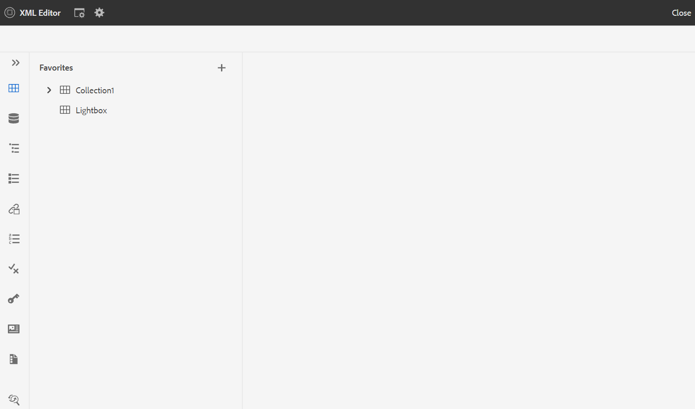

# Avvia l&#39;editor Web {#id2056B0140HS}

È possibile avviare l&#39;Editor Web dalle seguenti posizioni:

- [Pagina di navigazione AEM](#id2056BG00RZJ)
- [Interfaccia utente di AEM Assets](#id2056BG0307U)
- [Console mappa DITA](#id2056BG090BF)

Le sezioni seguenti descrivono i dettagli su come accedere e avviare l’Editor web da varie posizioni.

## Pagina di navigazione AEM {#id2056BG00RZJ}

Quando si accede a AEM, viene visualizzata la pagina Navigazione :

{width="800" align="left"}

Fai clic sul pulsante **Editor XML** Il collegamento ti porta direttamente all&#39;editor web.

{width="800" align="left"}

Dopo aver avviato l&#39;Editor Web senza selezionare alcun file, viene visualizzata una schermata vuota dell&#39;Editor Web. È possibile aprire un file per la modifica da AEM archivio o dalla raccolta Preferiti.

## Interfaccia utente di AEM Assets {#id2056BG0307U}

Un’altra posizione da cui è possibile avviare l’Editor Web proviene dall’interfaccia utente di AEM Assets. È possibile selezionare uno o più argomenti e aprirli direttamente nell&#39;editor Web. Per aprire un argomento nell’Editor Web, attenersi alla procedura seguente:

1. Nell’interfaccia utente Assets, passa all’argomento da modificare.

   >[!NOTE]
   >
   > Puoi anche vedere l’UUID dell’argomento.

   .

   {width="800" align="left"}

   >[!IMPORTANT]
   >
   > Assicurati di disporre delle autorizzazioni di lettura e scrittura sulla cartella che contiene l&#39;argomento da modificare.

1. Per bloccare in modo esclusivo l&#39;argomento, selezionalo e fai clic su **Estrai**.

   >[!IMPORTANT]
   >
   > Se l&#39;amministratore ha configurato il **Disattiva modifica senza pagamento** quindi devi estrarre il file prima di modificarlo. Se non scegli il file, non potrai visualizzare l’opzione di modifica.

1. Chiudi la modalità di selezione delle risorse e fai clic sull’argomento da modificare.

   Viene visualizzata l’anteprima dell’argomento.

   È possibile aprire l’Editor Web dalla vista Elenco, dalla vista Scheda e dalla modalità Anteprima.

   >[!IMPORTANT]
   >
   > Per aprire più argomenti da modificare, seleziona gli argomenti desiderati dall’interfaccia utente di Assets e fai clic su Modifica. Assicurati che il browser non abbia il blocco dei popup abilitato, altrimenti verrà aperto per la modifica solo il primo argomento dell’elenco selezionato.

   {width="800" align="left"}

   Se non si desidera visualizzare l&#39;anteprima di un argomento e si desidera aprirlo direttamente nell&#39;Editor Web, fare clic sull&#39;icona Modifica nel menu di azione rapida nella vista a schede:

   {width="800" align="left"}

1. Fai clic su **Modifica** per aprire l&#39;argomento nell&#39;editor Web.

   {width="800" align="left"}

## Console mappa DITA {#id2056BG090BF}

Per aprire l&#39;Editor Web dalla console Mappa DITA, attenersi alla seguente procedura:

1. Nell’interfaccia utente Assets, individua e fai clic sul file di mappa DITA contenente l’argomento da modificare.

   Viene visualizzata la console mappa DITA.

1. Fai clic su **Argomenti**.

   Viene visualizzato un elenco di argomenti nel file mappa. L&#39;UUID degli argomenti viene visualizzato sotto il titolo dell&#39;argomento.

1. Selezionare il file dell’argomento da modificare.

1. Fai clic su **Modifica argomento**.

   {width="800" align="left"}

1. L&#39;argomento viene aperto nell&#39;editor Web.

   >[!IMPORTANT]
   >
   > Se l&#39;amministratore ha configurato il **Disattiva modifica senza pagamento** quindi devi estrarre il file prima di modificarlo. Se non si estrae il file, il documento verrà aperto nell&#39;editor in modalità di sola lettura.

**Argomento principale:**[ Utilizzare l’editor Web](web-editor.md)

