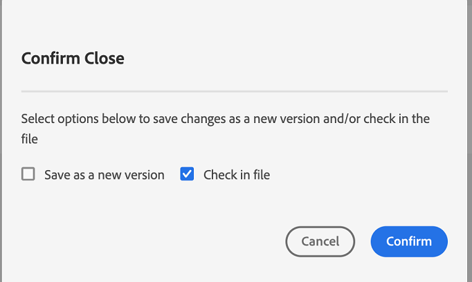

# Altre funzioni dell’editor web {#id2056B0B0YPF}

Nell’Editor Web sono disponibili altre funzioni utili che consentono di utilizzare:

**Funzioni del menu di scelta rapida nella scheda di un file**

Quando si apre un file nell&#39;editor Web, è possibile eseguire varie azioni dal menu di scelta rapida. È possibile che siano disponibili opzioni diverse a seconda che si apra un file multimediale, un singolo file DITA o più file.

**File multimediali**

Nel menu di scelta rapida della scheda di un file multimediale aperto vengono visualizzate le seguenti funzioni:

{width="300" align="left"}

**File DITA singolo**

Nel menu di scelta rapida della scheda di un file aperto vengono visualizzate le seguenti funzioni:

:   {width="300" align="left"}

**File multipli**

Quando si aprono più file, si ottengono più opzioni nel menu di scelta rapida:

{width="550" align="left"}

Le varie opzioni nel menu di scelta rapida sono illustrate di seguito:

***Salva***: Puoi scegliere tra le seguenti opzioni:

- **Salva**: Per salvare un file senza creare una nuova versione, selezionare **Salva**. Ogni volta che crei un nuovo argomento, in DAM viene creata una copia di lavoro senza versione dell’argomento. Il salvataggio del documento aggiorna la copia di lavoro del documento in DAM. Se si esegue un salvataggio semplice su questa versione, non viene creata una nuova versione di un argomento. Se l’argomento è in fase di revisione, il salvataggio di un argomento non consente ai revisori di accedere al contenuto modificato dell’argomento.

- **Salva tutto**: Se nell&#39;Editor Web sono aperti più documenti, è possibile anche selezionare **Salva tutto** documenti aperti.

***Salva come nuova versione***

Per creare una nuova versione del file, selezionare **Salva come nuova versione**. Per ulteriori informazioni **Salva** e **Salva come nuova versione**, vedi [Conoscere le funzionalità dell’editor web](web-editor-features.md#).

***Copia***: Puoi scegliere tra le seguenti opzioni:

- **Copia UUID**: Per copiare negli Appunti l&#39;UUID del file attualmente attivo, selezionare **Copia \> Copia UUID**.
- **Copia percorso**: Per copiare negli Appunti il percorso completo del file attualmente attivo, selezionare **Copia \> Copia percorso**.

***Individua in***: Puoi scegliere tra le seguenti opzioni:

- **Mappa**: Se è stata aperta una mappa DITA di grandi dimensioni e si desidera trovare la posizione esatta di un file nella mappa, selezionare **Trova In \> Mappa**. Quando selezioni l’opzione Individua nella mappa , il file \(da dove viene richiamata l’opzione\) si trova ed evidenziato nella gerarchia della mappa. Per poter utilizzare questa funzione, è necessario aprire il file mappa nell&#39;editor Web. Se la Vista mappa è nascosta, quando si richiama questa funzione viene visualizzata la Vista mappa e il file viene evidenziato nella gerarchia della mappa.

- **Archivio**: Simile a Individua nella mappa, il **Individua In \> Repository** mostra la posizione del file nell&#39;archivio \(o DAM\). La visualizzazione archivio viene aperta e il file selezionato viene evidenziato nella directory archivio. Se il file si trova in una cartella, questa viene espansa per mostrare la posizione del file selezionato nella directory archivio.

***Aggiungi a***: Puoi scegliere tra le seguenti opzioni:

- **Preferiti**: Per aggiungere il file selezionato alla raccolta preferita, selezionare **Aggiungi a \> Preferiti**. Per ulteriori dettagli, consulta la sezione **Preferiti** descrizione della funzione nel [Pannello a sinistra](web-editor-features.md#id2051EA0M0HS) sezione .

- **Contenuto riutilizzabile**: Per copiare il file selezionato nell’elenco dei contenuti riutilizzabili, selezionare **Aggiungi a \> Contenuto riutilizzabile**. Per ulteriori dettagli, consulta la sezione **Contenuto riutilizzabile** descrizione della funzione nel [Pannello a sinistra](web-editor-features.md#id2051EA0M0HS) sezione .

***Proprietà***

Per visualizzare la pagina delle proprietà AEM del file selezionato, selezionare **Proprietà**.

***Divisione***: Puoi scegliere tra le seguenti opzioni:

**Su, Giù, Sinistra o Destra**

Per impostazione predefinita, l’editor Web consente di visualizzare un argomento alla volta. Potrebbero esserci casi in cui si desidera visualizzare due o più argomenti contemporaneamente. La suddivisione della schermata dell’editor consente di visualizzare più argomenti contemporaneamente. Ad esempio, in presenza di due argomenti: A e B aperti nell’editor. Fare clic con il pulsante destro del mouse sull&#39;argomento B e scegliere **Divisione \> Su** divide la finestra dell&#39;editor in due parti. L&#39;argomento B viene visualizzato nella metà superiore e l&#39;argomento A nella metà inferiore. Allo stesso modo, è anche possibile dividere lo schermo in orizzontale selezionando **Dividi \> A sinistra** o **Dividi \> A destra**. Nella schermata seguente dell’Editor web vengono visualizzati gli argomenti suddivisi orizzontalmente e verticalmente. In ogni suddivisione, puoi avere una visualizzazione diversa. Ad esempio, nella schermata seguente, la schermata 1 è in modalità Sorgente, la schermata 2 ha due documenti aperti in modalità Autore e la schermata 3 è in modalità Anteprima. È possibile spostare i documenti da una schermata all&#39;altra trascinando la scheda del file e rilasciandola sulla schermata in cui si desidera posizionarla. Allo stesso modo, puoi anche riordinare le schede dei file trascinandole e spostandole secondo le tue preferenze.

{width="800" align="left"}

***Generazione rapida***

Genera l’output per il file selezionato. L’output può essere generato solo per i file che fanno parte di un predefinito di output. Per ulteriori dettagli, consulta [Pubblicazione basata su articoli dall’editor web](web-editor-article-publishing.md#id218CK0U019I).

***Chiudi***: Puoi scegliere tra le seguenti opzioni:

**Chiudi**, **Chiudi altri** oppure **Chiudi tutto**

Se si desidera chiudere il file dal quale è stato richiamato il menu di scelta rapida, selezionare **Chiudi \> Chiudi**. Utilizzo **Chiudi \> Chiudi altri** per chiudere tutti gli altri file aperti, tranne il file attualmente attivo. Per chiudere tutti i file aperti, seleziona la **Chiudi \> Chiudi tutto** dal menu di scelta rapida oppure è anche possibile scegliere di chiudere l&#39;Editor Web. Se nella sessione sono presenti file non salvati, viene richiesto di salvarli.

**Scenari di chiusura e salvataggio dei file**

Quando si tenta di chiudere un file aperto nell&#39;Editor Web utilizzando **Chiudi** nella scheda del file o **Chiudi** nel menu Opzioni, AEM Guide chiede di salvare le modifiche e sbloccare un file bloccato.

I prompt si basano sulle seguenti configurazioni selezionate dall’amministratore:

- **Chiedi il check-in alla chiusura:** Puoi archiviare il file \(estratto\) al momento della chiusura dell’editor.
- **Chiedi nuova versione alla chiusura**: Quando chiudi l’editor, puoi salvare il file \(che hai modificato\) come nuova versione.

L’esperienza di salvataggio dei file dipenderà dai tre scenari seguenti, in cui si dispone di:

- Non sono state apportate modifiche al contenuto.
- Il contenuto è stato modificato e le modifiche sono state salvate.
- Il contenuto è stato modificato ma le modifiche non sono state salvate.

A seconda che il file sia bloccato o sbloccato e le modifiche salvate o non salvate, è possibile visualizzare le seguenti opzioni:

- **Sblocca e chiudi**: Il blocco sul file viene rilasciato e il file viene chiuso.

   {width="400" align="left"}

- **Salva come nuova versione**: In questo modo verranno salvate le modifiche apportate al contenuto e verrà creata una nuova versione del file. Puoi anche aggiungere etichette e commenti per la versione appena salvata. Per ulteriori informazioni sul salvataggio di una nuova versione, consulta [Salva come nuova versione](web-editor-features.md#save-as-new-version-id209ME400GXA).

- **Sblocca il file**: Se scegli di sbloccare un file, questo sbloccherà il file e le modifiche verranno salvate nella versione corrente del file.

>[!NOTE]
>
> Se si deseleziona l’opzione per sbloccare il file, è anche possibile chiudere il file senza salvare le modifiche.

Ad esempio, uno dei prompt è mostrato nella schermata seguente:

{width="400" align="left"}

**Indicazioni visive per riferimenti interrotti**

- Se l’argomento contiene riferimenti incrociati o contenuti interrotti, questi vengono visualizzati in rosso.

**Copia e incolla intelligenti**

- Puoi copiare e incollare facilmente i contenuti di e tra gli argomenti. La struttura degli elementi di origine viene mantenuta nella destinazione. Inoltre, se il contenuto copiato contiene riferimenti di contenuto, anche questi vengono copiati.

**Ricorda l&#39;ultima posizione esplorata**

- L&#39;editor Web fornisce una finestra di dialogo di ricerca dei file avanzati. L’editor ricorda l’ultima posizione utilizzata durante l’inserimento di un riferimento o di un contenuto. La prima volta che si richiama la finestra di dialogo Sfoglia file \(tramite Inserisci riferimento o Inserisci contenuto riutilizzato\), si viene portati nella posizione in cui viene salvato il documento corrente. Nella stessa sessione, se si tenta di inserire un altro riferimento, la finestra di dialogo Sfoglia file passa automaticamente alla posizione da cui è stato inserito l&#39;ultimo riferimento.

>[!NOTE]
>
> Nel caso di un file immagine, audio o video, la finestra di dialogo di ricerca del file viene impostata automaticamente sulla posizione del file e non sull’ultima posizione utilizzata.

**Supporto per la pubblicazione basata su articoli**

- Dall&#39;editor Web è possibile generare l&#39;output per uno o più argomenti o l&#39;intera mappa DITA. È necessario creare predefiniti di output per la mappa DITA e quindi è possibile generare facilmente l&#39;output per uno o più argomenti. Se hai aggiornato alcuni argomenti nella mappa, puoi anche generare l’output solo per tali argomenti dall’Editor web. Per ulteriori dettagli, consulta [Pubblicazione basata su articoli dall’editor web](web-editor-article-publishing.md#id218CK0U019I).

**Supporto per documenti Markdown**

- L’editor Web consente di utilizzare i documenti Markdown \(.md\) insieme ai documenti DITA. È possibile creare e visualizzare in anteprima facilmente un documento Markdown nell’editor Web e aggiungerlo nel file di mappa tramite l’editor di mappe DITA. Per ulteriori dettagli, consulta [Creare documenti Markdown dall’editor Web](web-editor-markdown-topic.md#).

**Supporto per l&#39;argomento del termine del glossario DITA**

- L&#39;editor Web supporta i termini del glossario DITA che è possibile inserire aggiungendo `term` o `abbreviated-form` elementi.

**Inserisci equazioni MathML**

- AEM Guide offre un supporto preconfigurato per l&#39;inserimento di equazioni MathML tramite integrazione con [Web MathType](https://docs.wiris.com/en/mathtype/mathtype_web/intro) applicazione. Per inserire un&#39;equazione MathML, fai clic sul pulsante **Inserisci elemento** e digitare mathml. Quando si seleziona un elemento mathml dall&#39;elenco, viene visualizzata la finestra di dialogo Inserisci MathML:

{width="550" align="left"}

Utilizzando gli strumenti di equazione MathML, creare l&#39;equazione e fare clic su Inserisci per aggiungerla al documento. L&#39;equazione viene inserita con sfondo grigio chiaro, come illustrato di seguito:

{width="400" align="left"}

In qualsiasi momento è possibile aggiornare un&#39;equazione facendo clic con il pulsante destro del mouse su un&#39;equazione esistente e selezionando **Modifica MathML** dal menu di scelta rapida.

**Inserire note a piè di pagina**

- Inserire una nota a piè di pagina nel contenuto utilizzando `fn` elemento. In modalità authoring, il valore della nota a piè di pagina viene visualizzato in linea con il contenuto. Tuttavia, quando si passa alla modalità Anteprima o si pubblica il documento, la nota a piè di pagina viene visualizzata alla fine dell&#39;argomento.

**Rinominare o sostituire un elemento**

- L’editor web visualizza la breadcrumb dell’elemento nella parte superiore dell’argomento. Se desideri sostituire o sostituire un elemento con un altro, puoi farlo dal menu di scelta rapida della breadcrumb. Ad esempio, puoi scambiare `p` elemento con `note` o qualsiasi altro elemento valido nel contesto.

{width="400" align="left"}

Nella breadcrumb, fai clic con il pulsante destro del mouse sul nome di un elemento che desideri sostituire, quindi seleziona Rinomina elemento dal menu di scelta rapida. Nella finestra di dialogo Rinomina elemento vengono visualizzati tutti gli elementi validi consentiti nella posizione corrente. Nella finestra di dialogo Rinomina elemento , selezionate l’elemento da utilizzare. L’elemento originale viene sostituito con il nuovo elemento.

Oltre al menu di scelta rapida della breadcrumb, è possibile accedere alla finestra di dialogo Rinomina elemento anche da altre posizioni:

- Fai clic sul nome dell’elemento nella breadcrumb per selezionare il contenuto dell’elemento, quindi fai clic con il pulsante destro del mouse sul contenuto selezionato per visualizzare il menu di scelta rapida.

- Attiva la visualizzazione Tag , fai clic sul tag di apertura di qualsiasi elemento, quindi fai clic con il pulsante destro del mouse sul contenuto selezionato per visualizzare il menu di scelta rapida.

- È possibile accedere alla finestra di dialogo Rinomina elemento richiamando il menu Opzioni di un elemento nel pannello Struttura.

**Estrarre un elemento**

- Lo sblocco di un elemento consente di rimuovere il tag elemento dal testo selezionato e di unirlo al relativo elemento padre. Ad esempio, se hai una `p` elemento all’interno di un `note` è possibile annullare il ritorno a capo automatico `p` per unire il testo direttamente all’interno di `note` elemento. L’opzione Annulla racchiudi elemento è disponibile nel menu di scelta rapida della breadcrumb dell’argomento. Per sracciare un elemento, selezionalo dalla breadcrumb dell’argomento, quindi fai clic con il pulsante destro del mouse sull’elemento per aprire il menu di scelta rapida, quindi seleziona Annulla racchiudi elemento per rimuovere l’elemento e unire il testo dell’elemento con il relativo elemento padre.

**Mantenimento delle interruzioni di riga e dei rientri**

- Gli elementi DITA che contengono interruzioni di riga e spazi sono supportati e sottoposti a rendering in base alla loro definizione nelle modalità Autore, Origine o Anteprima e anche nell’output finale pubblicato. La schermata seguente mostra il contenuto all’interno del `msgblock` elemento in cui sono state mantenute le interruzioni di riga e gli spazi \(rientro\):

{width="500" align="left"}

**ID elemento generato automaticamente**

- È possibile generare automaticamente ID per gli elementi nell&#39;argomento DITA. Questi ID sono univoci in un argomento DITA. Ad esempio, se si generano ID per un elemento paragrafo, gli ID saranno p\_1, p2, p\_3 e così via. Puoi selezionare più elementi e generare ID per ciascun elemento selezionato.

Effettua le seguenti operazioni per generare automaticamente l’ID per uno o più elementi:

1. Apri l&#39;argomento nell&#39;editor Web.
1. Seleziona il contenuto a cui assegnare gli ID.
1. Fai clic con il pulsante destro del mouse e seleziona **Genera ID dal menu di scelta rapida.**

   In alternativa, fai clic con il pulsante destro del mouse nella breadcrumb e seleziona **Genera ID**.

**Argomento principale:**[ Utilizzare l’editor Web](web-editor.md)

