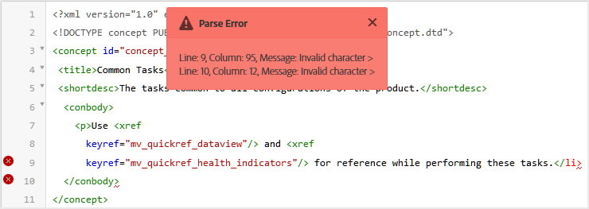
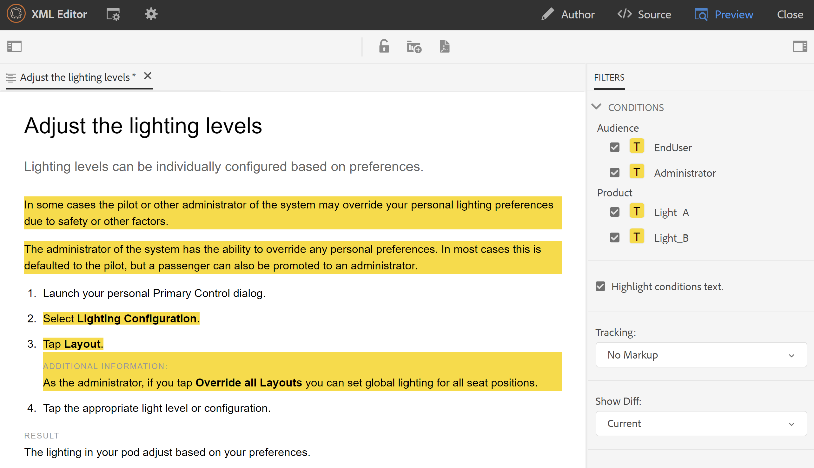

# Visualizzazioni editor web {#id204GK0D0V5Z}

L&#39;editor Web delle guide AEM supporta la visualizzazione dei documenti in tre diverse modalità o visualizzazioni:

## Autore

Questa è una tipica visualizzazione What You Get \(WYSISYG\) dell&#39;Editor Web. Puoi modificare l’argomento come faresti con un normale editor Rich Text. Nella visualizzazione Autore sono disponibili le opzioni per salvare una revisione del documento, trovare e sostituire il contenuto, inserire un elemento, inserire un collegamento ipertestuale, inserire un riferimento al contenuto e altro ancora.

>[!NOTE]
>
> Quando si utilizza il riferimento al contenuto, il contenuto a cui si fa riferimento viene visualizzato anche nella vista Autore a colori blu. Il contenuto a cui si fa riferimento non è modificabile.

## Sorgente

Nella vista Origine viene visualizzato il codice XML sottostante che costituisce l&#39;argomento. Se hai familiarità con l&#39;utilizzo diretto di XML, utilizza la vista Origine. Oltre a apportare modifiche regolari al testo in questa visualizzazione, è anche possibile aggiungere elementi e attributi utilizzando lo Smart Catalog oppure trovare e sostituire testo, elementi o attributi.

- Per richiamare il Catalogo avanzato, posiziona il cursore alla fine di qualsiasi tag elemento in cui desideri inserire il nuovo elemento e immetti &quot;&lt;&quot;. L&#39;editor mostra un elenco di tutti gli elementi XML validi che è possibile inserire in tale posizione. Utilizzare i tasti freccia per selezionare l&#39;elemento che si desidera inserire e premere Invio. Quando immetti la parentesi di chiusura &quot;\>, il tag di chiusura dell’elemento viene aggiunto automaticamente.

   {width="400" align="left"}

- Puoi anche modificare facilmente un elemento dalla vista Sorgente. Ad esempio, se modifichi il tag di apertura di un `p` elemento a `note`, quindi la chiusura `p` viene automaticamente modificato in `/note`. Se sostituisci un elemento con un elemento non corretto, viene immediatamente visualizzato l’errore di convalida.

- Se desideri aggiungere un attributo a un elemento, posiziona il cursore all’interno del tag dell’elemento e premi la barra spaziatrice. Un elenco di attributi validi per tale elemento viene visualizzato nel Catalogo avanzato. Utilizza i tasti freccia per selezionare l’elemento desiderato e premi Invio per inserire l’elemento. Per specificare un valore per l&#39;attributo, immetti il segno uguale \(=\) e l&#39;editor immette automaticamente le virgolette di apertura e chiusura &quot;&quot; in cui puoi specificare il valore dell&#39;attributo.

   {width="350" align="left"}

- Nella vista Sorgente, è disponibile un’opzione Rientro automatico che riorganizza il codice XML in formato presentabile e facilmente leggibile. Inoltre, se selezionate un testo e passate dalla visualizzazione Autore alla sorgente o Origine alla visualizzazione Autore, anche il testo selezionato viene evidenziato nell’altra visualizzazione.
- Un&#39;altra potente funzione nella visualizzazione Origine è la convalida XML nel documento. Se si apre un documento contenente XML non valido, questo viene aperto nella visualizzazione Origine con le informazioni relative a XML non valido. Ad esempio, nella schermata seguente le informazioni esatte sull&#39;XML errato sono fornite nel pop-up Errore di analisi.

   {width="650" align="left"}

   Nella schermata precedente, viene utilizzata un’evidenziazione incrociata per indicare la riga contenente XML errato.

- La funzione Trova e sostituisci consente di cercare qualsiasi testo, elemento o attributo nella vista Sorgente.
Per ulteriori dettagli, consulta la sezione **Trova e sostituisci** descrizione della funzione nel [Barra degli strumenti principale](web-editor-features.md#id#id2051EA0G05Z) sezione .

- La vista Sorgente fornisce numerose scelte rapide per spostarsi rapidamente in un documento e lavorare su di esso. Nella tabella seguente sono elencate le azioni supportate e i relativi tasti di scelta rapida:

   | Per effettuare questo collegamento | Usa questa scelta rapida |
   |----------|-----------------|
   | Aggiungi più cursori | **Ctrl**+Clic a sinistra |
   | Più selezioni di testo non consecutive | **Ctrl**+Clic a sinistra per trascinare e selezionare il testo |
   | Seleziona il testo tra le righe | **Alt**+Clic a sinistra per trascinare e selezionare il testo |
   | Annulla selezione multipla o esci dalla modalità a schermo intero | **Esc** |
   | Mostra completamento automatico | **Ctrl**+**Space** |
   | Passa al tag di apertura o chiusura del tag corrente | **Ctrl**+**J** |
   | Espandi o comprimi il tag corrente e il relativo contenuto | **Ctrl**+**Q** |
   | Seleziona l’elemento corrente e il relativo contenuto | **Ctrl**+**L** |
   | Rilascia l’elemento corrente | **Maiusc**+**Scheda** |
   | Elimina l’elemento corrente e il relativo contenuto | **Maiusc**+**Ctrl**+**K** |
   | Sposta il cursore di una parola a sinistra | **Alt**+**Freccia sinistra** |
   | Sposta il cursore di una parola a destra | **Alt**+**Freccia destra** |
   | Scorrere una riga verso l’alto senza modificare la posizione del cursore | **Ctrl**+**Freccia Su** |
   | Scorrere una riga verso il basso senza modificare la posizione del cursore | **Ctrl**+**Freccia giù** |
   | Attiva/disattiva schermo intero | **F11** |
   | Inserisci una nuova riga dopo l’elemento corrente | **Ctrl**+**Invio** |
   | Inserisci una nuova riga prima dell’elemento corrente | **Maiusc**+**Ctrl**+**Invio** |
   | Trova e seleziona l&#39;occorrenza successiva della parola corrente | **Ctrl**+**D** |
   | Sposta l’elemento corrente e il relativo contenuto di un elemento in alto | **Maiusc**+**Ctrl**+**Freccia Su** |
   | Sposta l’elemento corrente e il relativo contenuto di un elemento in basso | **Maiusc**+**Ctrl**+**Freccia giù** |
   | Racchiudi l’elemento corrente nel tag commento | **Ctrl**+**/** |
   | Duplica l’elemento corrente e il relativo contenuto | **Maiusc**+**Ctrl**+**D** |
   | Elimina il testo che segue il cursore. Se il cursore è prima di un elemento di apertura, l’intero elemento viene eliminato. | **Ctrl**+**K**+**K** |
   | Elimina il testo a sinistra del cursore nella riga corrente. Se il cursore segue il tag di chiusura di un elemento, l’intero elemento viene eliminato. | **Ctrl**+**K**+**Backspace** |
   | Converti il testo corrente in maiuscolo | **Ctrl**+**K**+**U** |
   | Converti il testo corrente in minuscolo | **Ctrl**+**K**+**L** |
   | Scorri l’elemento corrente fino al centro dell’editor | **Ctrl**+**K**+**C** |
   | Aggiungi un cursore sopra la posizione corrente | **Ctrl**+**Alt**+**Freccia Su** |
   | Aggiungi un cursore sotto la posizione corrente | **Ctrl**+**Alt**+**Freccia giù** |
   | Trova ricorsivamente la parola corrente \(in avanti\) | **Ctrl**+**F3** |
   | Trova in modo ricorsivo la parola corrente \(nella direzione indietro\) | **Maiusc**+**Ctrl**+**F3** |

## Anteprima

L’apertura di un argomento in modalità Anteprima mostra come verrà visualizzato un argomento quando viene visualizzato da un utente nel proprio browser. Nel caso di una mappa DITA, viene visualizzata un&#39;anteprima della mappa in cui viene visualizzato un singolo documento composito di tutti gli argomenti all&#39;interno della mappa.

La modalità Anteprima offre le seguenti funzionalità:

- [Visualizzare il contenuto basato su filtri condizionali](#id2114BI00VXA)
- [Visualizza le marcature delle modifiche di tracciamento](#id2114BJ00CE8)
- [Esportare un argomento come PDF](#id2114BL00B5U)

### Visualizzare il contenuto basato su filtri condizionali {#id2114BI00VXA}

Se hai utilizzato condizioni nell’argomento o nella mappa, queste vengono visualizzate nel pannello Filtri . Per impostazione predefinita, vengono selezionate tutte le condizioni e viene visualizzato l’intero contenuto. Se deselezioni una condizione, il contenuto con tale condizione viene rimosso dalla visualizzazione. Puoi anche scegliere di evidenziare i contenuti condizionali.

L&#39;immagine seguente mostra un argomento che utilizza due condizioni — `Audience` e `Product`. Il contenuto condizionale viene evidenziato con sfondo giallo.

{width="800" align="left"}

### Visualizza le marcature delle modifiche di tracciamento {#id2114BJ00CE8}

Se un documento contiene le marcature delle modifiche di tracciamento \(o indicazioni visive\), è possibile visualizzare in anteprima il documento anche con o senza tali marcature. Durante l’anteprima di un documento, il pannello a destra contiene le opzioni Filtri e Tracciamento .

{width="400" align="left"}

Ce ne sono tre **Tracking** opzioni selezionabili:

- **Nessun markup**: In questa visualizzazione vengono accettati tutti gli inserimenti e le eliminazioni e viene presentata una semplice visualizzazione del documento. In questa visualizzazione non vengono visualizzate marcature delle modifiche di tracciamento.
- **Originale**: In questa visualizzazione, tutti gli inserimenti vengono rifiutati e tutte le eliminazioni vengono ripristinate e viene visualizzata un&#39;anteprima. È sufficiente ottenere la forma originale del documento prima di attivare la modalità di tracciamento delle modifiche.
- **Mostra commenti**: In questa visualizzazione vengono visualizzate tutte le marcature per il contenuto inserito ed eliminato.

   L’immagine seguente mostra l’anteprima di un file mappa con le marcature:

   {width="800" align="left"}

### Esportare un argomento come PDF {#id2114BL00B5U}

PDF è uno dei formati di output più comuni utilizzato in ogni fase possibile del ciclo di sviluppo dei documenti. AEM Guide offre la flessibilità di generare il PDF di un singolo argomento o di un intero file mappa. La funzione Esporta come PDF consente all&#39;autore, all&#39;editore o all&#39;amministratore di generare facilmente l&#39;output di PDF per un singolo argomento. Utilizza le configurazioni DITA-OT salvate nel profilo a livello di cartella per generare il PDF.

Questa funzione supporta le seguenti funzionalità:

- Genera il PDF della copia di lavoro attiva di un argomento.
- Accettare il nome di trasformazione DITA-OT e gli argomenti della riga di comando per generare il PDF.
- Salvare l’output generato sul sistema locale.
- Risolvi i riferimenti di chiave e contenuto utilizzati nell’argomento prima di generare l’output.

Per esportare un argomento come PDF, effettua le seguenti operazioni:

1. Apri l’argomento in modalità Anteprima.

1. Fai clic sul pulsante **Esporta come PDF** \(\).

   Viene visualizzata la finestra di dialogo Esporta come PDF.

   {width="350" align="left"}

1. *\(Facoltativo\)* Specificare il nome della trasformazione DITA-OT e tutti gli argomenti della riga di comando che si desidera utilizzare.

1. Fai clic su **Scarica**.

   >[!NOTE]
   >
   > Assicurati di aver abilitato la finestra a comparsa nella configurazione del browser, altrimenti PDF non verrà scaricato.

   PDF viene generato e aperto in una nuova scheda oppure viene visualizzata una finestra di dialogo per salvare PDF nel sistema locale.

**Argomento principale:**[ Utilizzare l’editor Web](web-editor.md)

